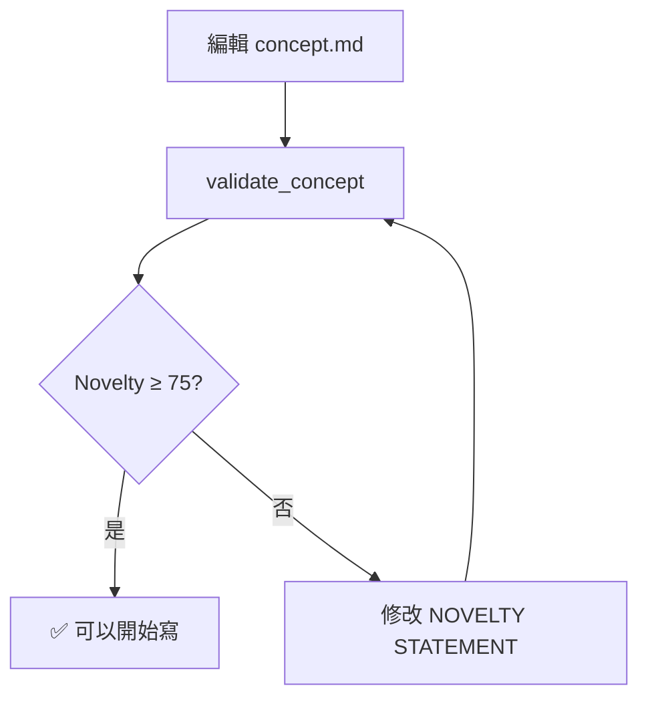

# Skill: Concept Validation

> 概念驗證技能 - 確保研究概念具有新穎性和結構完整性

## 觸發條件

| 用戶說法 | 觸發 |
|----------|------|
| 驗證、validate、check concept | ✅ |
| novelty、新穎性、原創性 | ✅ |
| 可以開始寫了嗎？ready to write? | ✅ |
| wikilink 格式、引用格式 | ✅ |

---

## ⚠️ 核心規則

### 撰寫前必須通過驗證

```
❌ 錯誤：直接呼叫 write_draft() 或 draft_section()
✅ 正確：先 validate_concept() → 通過 → 再寫
```

### Novelty 評分標準

| 分數 | 狀態 | 行動 |
|------|------|------|
| ≥ 75 | ✅ 通過 | 可以開始撰寫 |
| 60-74 | ⚠️ 邊緣 | 建議加強 novelty statement |
| < 60 | ❌ 失敗 | 必須修改 concept |

### 驗證三輪制

驗證會執行 **3 輪**獨立評分，取平均：
- 第 1 輪：結構評估
- 第 2 輪：新穎性評估  
- 第 3 輪：可行性評估

**目的**：避免單次評分的偏差。

---

## 可用 MCP Tools

### 1️⃣ validate_concept ⭐ 主要工具

**用途**：完整驗證 concept.md（含 novelty 評分）

**參數**：
```
filename: str           # 檔案路徑（必填，通常是 "concept.md"）
project: str            # 專案 slug（選填）
run_novelty_check: bool # 是否執行 novelty 評分（預設 True）
target_section: str     # 目標章節（選填，用於章節特定驗證）
```

**呼叫範例**：
```python
# 完整驗證
mcp_mdpaper_validate_concept(filename="concept.md")

# 為特定章節驗證
mcp_mdpaper_validate_concept(
    filename="concept.md",
    target_section="Introduction"
)
```

**回應格式**：
```
📋 **Concept Validation Report**

## Structure Check
✅ Title: Present
✅ NOVELTY STATEMENT: Present
✅ Background: Present
✅ Research Gap: Present
...

## Novelty Scoring (3 rounds)
| Round | Score | Verdict |
|-------|-------|---------|
| 1 | 78 | PASS |
| 2 | 82 | PASS |
| 3 | 75 | PASS |
| **Average** | **78.3** | **✅ PASS** |

## Verdict
✅ **CAN PROCEED TO DRAFTING**
```

---

### 2️⃣ validate_concept_quick

**用途**：快速結構檢查（不呼叫 LLM）

**參數**：
```
filename: str  # 檔案路徑（必填）
project: str   # 專案 slug（選填）
```

**什麼時候用**：
- 編輯 concept 過程中快速檢查結構
- 不需要 novelty 評分時
- 想節省 API 呼叫時

**呼叫範例**：
```python
mcp_mdpaper_validate_concept_quick(filename="concept.md")
```

---

### 3️⃣ validate_for_section ⭐ 推薦

**用途**：檢查是否可以撰寫特定章節

**參數**：
```
section: str   # 目標章節（必填）
project: str   # 專案 slug（選填）
```

**章節特定需求**：

| 章節 | 必須有 | 建議有 |
|------|--------|--------|
| Introduction | NOVELTY + Background + Research Gap | - |
| Methods | - | Study Design |
| Results | Basic structure | - |
| Discussion | KEY SELLING POINTS | Limitations |

**呼叫範例**：
```python
# 寫 Introduction 前
mcp_mdpaper_validate_for_section(section="Introduction")

# 寫 Discussion 前
mcp_mdpaper_validate_for_section(section="Discussion")
```

**回應格式**：
```
✅ **CAN WRITE: Introduction**

Required sections present:
- ✅ NOVELTY STATEMENT
- ✅ Background
- ✅ Research Gap

💡 Recommendations:
- Consider adding: Study Population details
```

---

### 4️⃣ validate_wikilinks

**用途**：驗證並修復 wikilink 格式

**參數**：
```
filename: str   # 檔案路徑（必填）
project: str    # 專案 slug（選填）
auto_fix: bool  # 是否自動修復（預設 True）
```

**正確格式**：`[[author2024_12345678]]`

**常見問題**：
| 錯誤格式 | 修復為 |
|----------|--------|
| `[[12345678]]` | `[[author2024_12345678]]` |
| `Author 2024 [[12345678]]` | `[[author2024_12345678]]` |
| `[[PMID:12345678]]` | `[[author2024_12345678]]` |

**呼叫範例**：
```python
mcp_mdpaper_validate_wikilinks(
    filename="concept.md",
    auto_fix=True
)
```

---

## 標準工作流程

### 流程 A：首次驗證 Concept



**步驟**：
1. 用戶完成 concept.md 編輯
2. 呼叫 `validate_concept(filename="concept.md")`
3. 檢查 novelty 分數
4. 如果 < 75，請用戶修改後重新驗證

### 流程 B：章節特定驗證

```python
# 1. 用戶說：「我想寫 Introduction」
# 2. 先驗證
result = mcp_mdpaper_validate_for_section(section="Introduction")

# 3. 如果 CAN WRITE
if "✅ CAN WRITE" in result:
    # 可以呼叫 draft_section
    mcp_mdpaper_draft_section(topic="Introduction", notes="...")
else:
    # 告知用戶缺少什麼
    print(result)
```

### 流程 C：Wikilink 格式修復

```python
# 1. 驗證並自動修復
mcp_mdpaper_validate_wikilinks(
    filename="concept.md",
    auto_fix=True
)

# 2. 如果有問題無法自動修復，告知用戶
```

---

## 不同 Paper Type 的驗證規則

### original-research（標準研究論文）

| 區塊 | 必須 | 檢查項目 |
|------|------|----------|
| NOVELTY STATEMENT | ✅ | 明確聲明、有數據支持 |
| Background | ✅ | 有引用文獻 |
| Research Gap | ✅ | 明確指出現有研究的不足 |
| Study Design | ✅ | 研究方法描述 |
| KEY SELLING POINTS | ✅ | 主要發現和貢獻 |

### systematic-review / meta-analysis

**額外要求**：
- PRISMA checklist 項目
- 搜尋策略描述
- 納入/排除標準

### case-report

**額外要求**：
- Case timeline
- 病人同意聲明

### letter

**最低要求**：
- 主要論點
- 簡短 novelty 聲明

---

## 犀利回饋模式（給用戶的反饋）

### ⚠️ 核心原則

**像頂尖 Reviewer 一樣犀利，但給選項！**

| 情況 | 回饋方式 |
|------|----------|
| 聲稱「首次」但沒證據 | 「您聲稱『首次』，但沒有 PubMed 搜尋證據。Reviewer 會問：『搜尋策略是什麼？』」|
| 模糊量化 | 「使用『更好』但沒數字。Reviewer 會問：『好多少？臨床意義？』」|
| 引用但沒說限制 | 「引用了文獻但沒說它的限制。Reviewer 會問：『你的貢獻在哪？』」|

### 犀利但不是討好

```
❌ 錯誤：「您的 concept 很好喔～只是有一點點小問題...」
✅ 正確：「Novelty score 68/100。問題：NOVELTY STATEMENT 缺乏具體數據。
   Reviewer 會問：『相比現有方法，你的優勢是什麼？具體提升多少？』
   建議：加入 "compared to [existing method], our approach improves X by Y%"」
```

### 給選項不是自作主張

```
❌ 錯誤：自動修改用戶的 NOVELTY STATEMENT
✅ 正確：「發現問題後問用戶：
   1. 直接寫？（接受目前 novelty）
   2. 修正問題？（我給具體建議）
   3. 用 CGU 工具發想？（deep_think / spark_collision）」
```

---

## 與其他 Skills 的關係

| 相關 Skill | 關係 |
|------------|------|
| concept-development | 先發展 concept → 再驗證 |
| draft-writing | 驗證通過後才能寫草稿 |
| literature-review | 驗證需要文獻支持 |

---

## 常見問題

### Q: Novelty score 一直過不了怎麼辦？

A: 
1. 檢查 NOVELTY STATEMENT 是否有具體數據
2. 確認有引用文獻支持「現有方法的限制」
3. 用 CGU 工具（`deep_think`, `spark_collision`）發想更強的論點
4. 或降低期望（某些研究確實 novelty 較低，但仍有價值）

### Q: 為什麼要三輪驗證？

A: 單次 LLM 評分可能有偏差。三輪取平均可以：
- 減少隨機波動
- 獲得更穩定的分數
- 如果三輪差異大，表示 concept 本身有模糊之處

### Q: validate_for_section vs validate_concept？

A: 
- `validate_for_section`：只檢查特定章節需要的部分，較快
- `validate_concept`：完整檢查所有項目，較慢但全面

建議：先用 `validate_concept` 確認整體，之後用 `validate_for_section` 做增量檢查。

### Q: Wikilink 格式為什麼重要？

A: 正確的 wikilink 格式 `[[author2024_12345678]]` 可以：
- 在 VS Code Foam 中自動連結
- 匯出 Word 時正確轉換為引用
- sync_references 時正確生成 References 清單
