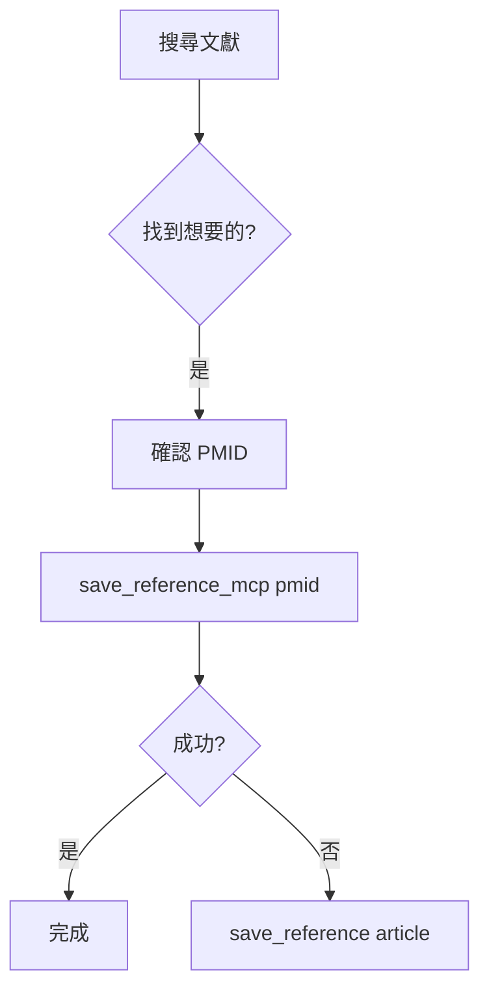

# Skill: Reference Management

> 參考文獻管理技能 - 從搜尋、儲存到格式化的完整文獻管理

## 觸發條件

| 用戶說法 | 觸發 |
|----------|------|
| 存這篇、save、儲存文獻 | ✅ |
| 我的文獻、列出 references | ✅ |
| 這篇的詳細資料、citation | ✅ |
| 格式化、reference list | ✅ |
| PDF、全文 | ✅ |
| foam、wikilink | ✅ |

---

## ⚠️ 核心規則：MCP-to-MCP 優先

### 🔒 儲存文獻的正確方式

| 方法 | 資料來源 | 優先級 |
|------|----------|--------|
| `save_reference_mcp(pmid)` | pubmed-search API 直取 | **🥇 永遠優先** |
| `save_reference(article)` | Agent 傳遞 metadata | 🥈 Fallback |

**為什麼？**
- `save_reference_mcp`: mdpaper 直接從 pubmed-search HTTP API 取得驗證資料
- `save_reference`: Agent 可能修改/幻覺書目資料（標題、作者、期刊名）

**分層信任格式**：
```
🔒 VERIFIED: PubMed 原始資料（不可修改）
🤖 AGENT: AI 筆記（agent_notes 參數）
✏️ USER: 人類筆記（AI 絕不碰觸）
```

---

## 可用 MCP Tools

### 1️⃣ save_reference_mcp ⭐ PRIMARY

**用途**：用 PMID 儲存文獻（推薦）

**參數**：
```
pmid: str          # PubMed ID（必填）
agent_notes: str   # Agent 的筆記（選填）
project: str       # 專案 slug（選填，預設當前專案）
```

**呼叫範例**：
```python
mcp_mdpaper_save_reference_mcp(
    pmid="31645286",
    agent_notes="Key paper on AI in anesthesiology, discusses remimazolam safety"
)
```

**成功回應**：
```
✅ Reference saved via MCP-to-MCP
📚 PMID: 31645286
📖 Title: [從 API 取得的標題]
...
```

**失敗回應** → 改用 `save_reference()`：
```
⚠️ pubmed-search API not available. Using save_reference() as fallback.
```

---

### 2️⃣ save_reference (Fallback)

**用途**：當 API 不可用時的備援方案

**參數**：
```
article: dict      # 完整的文獻 metadata（從搜尋結果）
agent_notes: str   # Agent 的筆記（選填）
project: str       # 專案 slug（選填）
```

**⚠️ 注意**：只有在 `save_reference_mcp` 失敗時才使用！

---

### 3️⃣ list_saved_references

**用途**：列出專案中所有已儲存的文獻

**參數**：
```
project: str       # 專案 slug（選填）
```

**呼叫範例**：
```python
mcp_mdpaper_list_saved_references()
```

**回應格式**：
```
📚 **Saved References (15 total)**

- **31645286** 📄: Impact of liberal preoperative... (2019)
- **28924371**: Machine learning in anesthesia... (2018)
...

*📄 = PDF fulltext available*
```

---

### 4️⃣ search_local_references

**用途**：在已儲存的文獻中搜尋關鍵字

**參數**：
```
query: str         # 搜尋關鍵字（必填）
```

**呼叫範例**：
```python
mcp_mdpaper_search_local_references(query="remimazolam")
```

---

### 5️⃣ get_reference_details

**用途**：取得單篇文獻的完整資訊（含格式化引用）

**參數**：
```
pmid: str          # PubMed ID（必填）
```

**回應包含**：
- 標題、作者、期刊、年份、DOI
- 是否有 Abstract、PDF
- 預格式化引用（Vancouver、APA、Nature、In-text）

---

### 6️⃣ check_reference_exists

**用途**：檢查文獻是否已儲存

**參數**：
```
pmid: str          # PubMed ID（必填）
```

**用途場景**：
- 搜尋後想知道哪些已經存過
- 避免重複儲存

---

### 7️⃣ read_reference_fulltext

**用途**：讀取已下載的 PDF 全文

**參數**：
```
pmid: str          # PubMed ID（必填）
max_chars: int     # 最大字元數（預設 10000）
```

**限制**：只有從 PubMed Central 下載的 Open Access PDF 才有

---

### 8️⃣ format_references

**用途**：格式化引用清單

**參數**：
```
pmids: str         # 逗號分隔的 PMID 列表（必填）
style: str         # 引用格式（預設 vancouver）
journal: str       # 期刊名稱（選填，用於特定期刊格式）
```

**支援格式**：vancouver, apa, harvard, nature, ama, mdpi, nlm

**呼叫範例**：
```python
mcp_mdpaper_format_references(
    pmids="31645286,28924371,33160604",
    style="vancouver"
)
```

---

### 9️⃣ set_citation_style

**用途**：設定專案的預設引用格式

**參數**：
```
style: str         # 引用格式（必填）
```

**支援格式**：vancouver, apa, harvard, nature, ama

---

### 🔟 rebuild_foam_aliases

**用途**：重建 Foam 相容的 wikilink 檔案

**參數**：
```
project: str       # 專案 slug（選填）
```

**什麼時候用**：
- 升級專案結構後
- wikilink 連結壞掉時
- 需要在 VS Code Foam 中瀏覽文獻網絡時

---

## 標準工作流程

### 流程 A：搜尋並儲存文獻



**步驟**：
1. 使用 `pubmed-search` 搜尋文獻
2. 用戶選擇要儲存的文獻
3. 呼叫 `save_reference_mcp(pmid="...")`
4. 如果失敗，改用 `save_reference(article={...})`

### 流程 B：瀏覽已儲存文獻

```python
# 1. 列出所有文獻
mcp_mdpaper_list_saved_references()

# 2. 查看特定文獻詳情
mcp_mdpaper_get_reference_details(pmid="31645286")

# 3. 讀取全文（如有）
mcp_mdpaper_read_reference_fulltext(pmid="31645286")
```

### 流程 C：格式化引用清單

```python
# 1. 設定引用格式（可選）
mcp_mdpaper_set_citation_style(style="vancouver")

# 2. 格式化多篇文獻
mcp_mdpaper_format_references(
    pmids="31645286,28924371",
    style="vancouver"
)
```

---

## Agent Notes 使用指南

`agent_notes` 參數用於記錄 AI 對文獻的分析：

**好的 agent_notes 範例**：
```
"Key systematic review on remimazolam safety. Covers: cardiovascular stability, 
respiratory effects, reversal with flumazenil. Limitation: only ICU patients."
```

**不好的 agent_notes**：
```
"重要文獻" ← 太模糊
```

**建議內容**：
- 為什麼選這篇（與研究主題的關聯）
- 關鍵發現摘要
- 方法學優缺點
- 可引用的具體數據

---

## 與其他 Skills 的關係

| 相關 Skill | 關係 |
|------------|------|
| literature-review | 搜尋後呼叫本技能儲存 |
| draft-writing | 寫草稿時需要引用已儲存文獻 |
| concept-development | 驗證 novelty 時需要文獻支持 |

---

## 常見問題

### Q: 為什麼一定要用 save_reference_mcp？

A: 確保書目資料正確。Agent 可能誤改標題、作者名（幻覺），MCP-to-MCP 直取資料可避免此問題。

### Q: save_reference_mcp 失敗怎麼辦？

A: 
1. 檢查 pubmed-search MCP 是否運行
2. 檢查網路連線
3. 改用 `save_reference()` 作為 fallback

### Q: PDF 下載失敗？

A: 只有 PubMed Central 的 Open Access 文獻才能下載 PDF。其他文獻需手動上傳。
