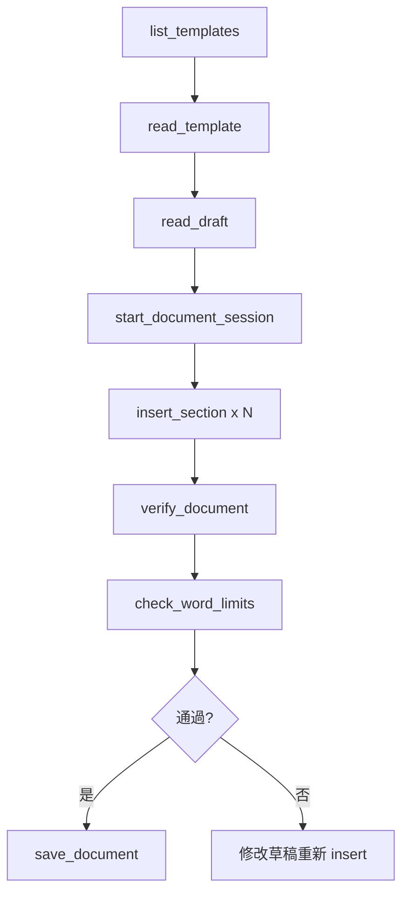

# Skill: Word Export

> Word 匯出技能 - 將草稿匯出為符合期刊格式的 Word 文件

## 觸發條件

| 用戶說法 | 觸發 |
|----------|------|
| 匯出 Word、export、輸出 | ✅ |
| template、模板 | ✅ |
| word count、字數 | ✅ |
| 轉成 docx | ✅ |

---

## ⚠️ 核心規則

### 匯出前必須完成

1. ✅ Concept 驗證通過（novelty score ≥ 75）
2. ✅ 草稿已完成所有必要章節
3. ✅ 引用文獻格式正確

### 工作流程（必須按順序）



---

## 可用 MCP Tools

### 1️⃣ list_templates

**用途**：列出所有可用的 Word 模板

**參數**：無

**呼叫範例**：
```python
mcp_mdpaper_list_templates()
```

**回應格式**：
```
📄 **Available Templates**

- Type of the Paper.docx
- Review Article.docx
- Case Report.docx
```

---

### 2️⃣ read_template ⭐ 重要

**用途**：讀取模板結構，了解有哪些章節和字數限制

**參數**：
```
template_name: str  # 模板檔名（必填）
```

**呼叫範例**：
```python
mcp_mdpaper_read_template(template_name="Type of the Paper.docx")
```

**回應包含**：
- 章節列表和順序
- 每個章節的字數限制
- 樣式名稱
- 必填/選填標記

**⚠️ 一定要先呼叫這個！** 了解模板結構後才能正確 insert 內容。

---

### 3️⃣ start_document_session

**用途**：開啟文件編輯 session

**參數**：
```
template_name: str  # 模板檔名（必填）
session_id: str     # Session 識別碼（預設 "default"）
```

**呼叫範例**：
```python
mcp_mdpaper_start_document_session(
    template_name="Type of the Paper.docx",
    session_id="my_paper_v1"
)
```

**回應**：
```
✅ Document session 'my_paper_v1' started with template: Type of the Paper.docx

[模板結構摘要]
```

---

### 4️⃣ insert_section ⭐ 核心

**用途**：將內容插入文件的特定章節

**參數**：
```
session_id: str     # Session 識別碼（必填）
section_name: str   # 章節名稱（必填，如 "Introduction"）
content: str        # 要插入的內容（必填）
mode: str           # "replace" 或 "append"（預設 "replace"）
```

**呼叫範例**：
```python
mcp_mdpaper_insert_section(
    session_id="my_paper_v1",
    section_name="Introduction",
    content="This study investigates...",
    mode="replace"
)
```

**回應**：
```
✅ Inserted 5 paragraphs into 'Introduction' (450 words)
🔧 自動修復 2 個 wikilink 格式錯誤
```

**⚠️ 自動修復功能**：
- 自動修復 wikilink 格式問題
- 如果有無法修復的問題會警告

---

### 5️⃣ verify_document

**用途**：驗證文件目前狀態

**參數**：
```
session_id: str  # Session 識別碼（必填）
```

**呼叫範例**：
```python
mcp_mdpaper_verify_document(session_id="my_paper_v1")
```

**回應格式**：
```
📊 **Document Verification: Type of the Paper.docx**

| Section | Word Count |
|---------|------------|
| Abstract | 245 |
| Introduction | 750 |
| Methods | 1200 |
...
| **TOTAL** | **4500** |

**Modifications made:** 6
- Abstract: 3 paragraphs (replace)
- Introduction: 8 paragraphs (replace)
...
```

---

### 6️⃣ check_word_limits

**用途**：檢查各章節是否符合字數限制

**參數**：
```
session_id: str     # Session 識別碼（必填）
limits_json: str    # 自訂字數限制（選填，JSON 格式）
```

**呼叫範例**：
```python
mcp_mdpaper_check_word_limits(session_id="my_paper_v1")
```

**自訂限制範例**：
```python
mcp_mdpaper_check_word_limits(
    session_id="my_paper_v1",
    limits_json='{"Introduction": 1000, "Methods": 2000}'
)
```

**回應格式**：
```
📏 **Word Limit Check**

| Section | Words | Limit | Status |
|---------|-------|-------|--------|
| Abstract | 245 | 250 | ✅ |
| Introduction | 850 | 800 | ⚠️ Over by 50 |
...

⚠️ **Some sections exceed word limits.**
```

**預設字數限制**：
| 章節 | 預設上限 |
|------|----------|
| Abstract | 250 |
| Introduction | 800 |
| Methods | 1500 |
| Results | 1500 |
| Discussion | 1500 |
| Conclusions | 300 |

---

### 7️⃣ save_document

**用途**：儲存文件並關閉 session

**參數**：
```
session_id: str       # Session 識別碼（必填）
output_filename: str  # 輸出檔案路徑（必填）
```

**呼叫範例**：
```python
mcp_mdpaper_save_document(
    session_id="my_paper_v1",
    output_filename="output/my_paper_2025-01-15.docx"
)
```

**回應**：
```
✅ Document saved successfully to: /path/to/output/my_paper_2025-01-15.docx

Session 'my_paper_v1' closed.
```

---

### 8️⃣ export_word (Legacy)

**用途**：簡易匯出（舊版，不建議使用）

**參數**：
```
draft_filename: str    # 草稿檔案路徑
template_name: str     # 模板名稱
output_filename: str   # 輸出檔案路徑
```

**⚠️ 建議使用新的 session 工作流程**，可以更精細控制每個章節。

---

## 標準工作流程

### 完整匯出流程

```python
# 1. 列出可用模板
mcp_mdpaper_list_templates()

# 2. 讀取模板結構（必須！）
mcp_mdpaper_read_template(template_name="Type of the Paper.docx")

# 3. 讀取草稿內容
mcp_mdpaper_read_draft(filename="introduction.md")

# 4. 開啟 session
mcp_mdpaper_start_document_session(
    template_name="Type of the Paper.docx",
    session_id="export_v1"
)

# 5. 依序插入各章節
for section in ["Abstract", "Introduction", "Methods", "Results", "Discussion", "Conclusions"]:
    content = get_content_for_section(section)  # Agent 從草稿取得
    mcp_mdpaper_insert_section(
        session_id="export_v1",
        section_name=section,
        content=content
    )

# 6. 驗證文件
mcp_mdpaper_verify_document(session_id="export_v1")

# 7. 檢查字數限制
mcp_mdpaper_check_word_limits(session_id="export_v1")

# 8. 儲存文件
mcp_mdpaper_save_document(
    session_id="export_v1",
    output_filename="output/final_paper.docx"
)
```

---

## 常見問題處理

### Q: 字數超過限制怎麼辦？

A: 
1. 呼叫 `check_word_limits` 找出超標章節
2. 修改草稿內容
3. 用 `insert_section` 重新插入（mode="replace"）
4. 再次 `check_word_limits` 確認

### Q: 模板裡沒有我要的章節？

A:
1. 使用 `read_template` 確認可用章節
2. 選擇最接近的章節名稱
3. 或使用 `export_word` 直接匯出整份草稿

### Q: Session 中斷怎麼辦？

A: Session 存在記憶體中，如果 MCP server 重啟會遺失。建議：
1. 分批處理，每次處理幾個章節後就 `save_document`
2. 如果失敗，重新 `start_document_session`

### Q: Wikilink 格式錯誤？

A: `insert_section` 會自動修復常見的 wikilink 格式問題（如 `[[PMID:123]]` → `[[123]]`）。如果有無法修復的問題會提示。

---

## 與其他 Skills 的關係

| 相關 Skill | 關係 |
|------------|------|
| draft-writing | 先寫好草稿再匯出 |
| concept-validation | 匯出前確保 concept 通過驗證 |
| reference-management | 確保引用文獻都已儲存 |

---

## 注意事項

1. **備份草稿**：匯出前建議備份原始草稿
2. **Session 命名**：使用有意義的 session_id（如 `paper_v1`, `revision_2025-01-15`）
3. **字數控制**：一邊寫一邊用 `count_words` 控制字數，避免匯出時才發現超標
4. **模板選擇**：不同期刊有不同模板，確認選對模板再開始
