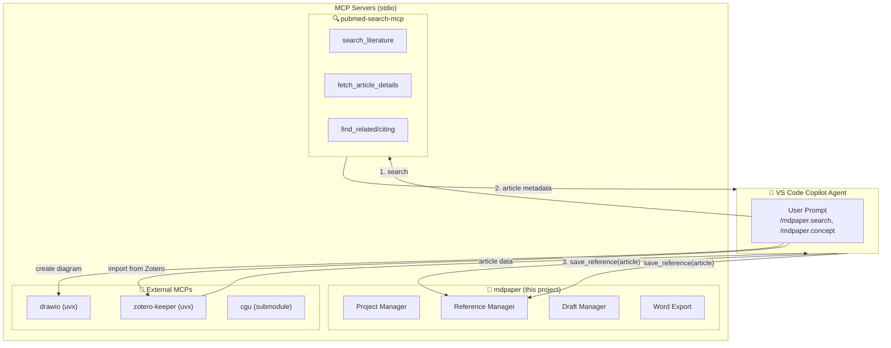
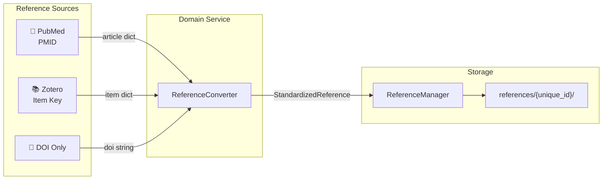

# MedPaper Assistant - Architecture Documentation

## Overview

MedPaper Assistant is an MCP (Model Context Protocol) server that helps researchers write medical papers. It provides tools for project management, reference storage, draft creation, and Word document export.

## 🏗️ MCP Orchestration Architecture



### Key Design Principle

**MCP-to-MCP via Agent Only!**

```
❌ Wrong: mdpaper imports pubmed_search
✅ Right: Agent coordinates data flow

Workflow Example:
1. Agent calls pubmed-search.fetch_article_details(pmid)
2. pubmed-search returns article metadata dict
3. Agent calls mdpaper.save_reference(article=metadata)
4. mdpaper stores reference locally
```

### Multi-Source Reference Support



**ReferenceId Priority**: PMID > Zotero Key > DOI

## Project Structure

```
med-paper-assistant/
├── src/
│   └── med_paper_assistant/
│       ├── core/                    # Core business logic
│       │   ├── entrez/              # 🆕 Modular Entrez package
│       │   │   ├── __init__.py      # Package exports
│       │   │   ├── base.py          # EntrezBase class
│       │   │   ├── search.py        # SearchMixin (esearch, efetch)
│       │   │   ├── pdf.py           # PDFMixin (PMC fulltext)
│       │   │   ├── citation.py      # CitationMixin (elink)
│       │   │   ├── batch.py         # BatchMixin (history server)
│       │   │   └── utils.py         # UtilsMixin (esummary, espell, etc.)
│       │   ├── analyzer.py          # Data analysis and statistics
│       │   ├── drafter.py           # Draft creation and citation formatting
│       │   ├── exporter.py          # Legacy Word export
│       │   ├── formatter.py         # Document formatting
│       │   ├── logger.py            # Logging configuration
│       │   ├── prompts.py           # Section writing guidelines
│       │   ├── reference_manager.py # Reference storage and retrieval
│       │   ├── search.py            # Backward-compatible facade → entrez/
│       │   ├── strategy_manager.py  # Search strategy persistence
│       │   ├── template_reader.py   # Word template analysis
│       │   └── word_writer.py       # Precise Word document manipulation
│       │
│       ├── mcp_server/              # MCP Server layer
│       │   ├── server.py            # Main entry point
│       │   ├── config.py            # Server configuration
│       │   ├── tools/               # MCP tool definitions
│       │   │   ├── __init__.py
│       │   │   ├── search_tools.py      # Literature search tools
│       │   │   ├── reference_tools.py   # Reference management tools
│       │   │   ├── draft_tools.py       # Draft creation tools
│       │   │   ├── analysis_tools.py    # Data analysis tools
│       │   │   └── export_tools.py      # Word export tools
│       │   │
│       │   ├── prompts/             # MCP prompt definitions
│       │   │   ├── __init__.py
│       │   │   └── prompts.py       # Guided workflow prompts
│       │   │
│       │   └── templates/           # Internal templates (concept)
│       │       ├── concept_template.md
│       │       └── README.md
│       │
│       └── templates/               # Document templates
│           └── general_medical_journal.md
│
├── tests/                           # Test files
├── drafts/                          # Generated drafts (gitignored)
├── data/                            # Analysis data files
├── templates/                       # Word templates (.docx)
├── references/                      # Saved references (gitignored)
└── results/                         # Exported documents (gitignored)
```

## Architecture Layers

### 1. Core Layer (`core/`)

The core layer contains all business logic, independent of the MCP protocol:

| Module | Responsibility |
|--------|----------------|
| `entrez/` | 🆕 Modular Entrez package with all 9 Entrez utilities |
| `search.py` | Backward-compatible facade → entrez/ package |
| `reference_manager.py` | Local reference storage, metadata management |
| `drafter.py` | Draft file creation, citation formatting |
| `analyzer.py` | CSV data analysis, statistics, Table 1 generation |
| `template_reader.py` | Word template structure analysis |
| `word_writer.py` | Precise Word document manipulation |
| `formatter.py` | Document formatting utilities |
| `strategy_manager.py` | Search strategy persistence |

### Entrez Submodules (`core/entrez/`)

The Entrez package encapsulates all PubMed API operations:

| Module | Mixin Class | Entrez Utils | Methods |
|--------|-------------|--------------|---------|
| `base.py` | `EntrezBase` | - | Configuration (email, api_key) |
| `search.py` | `SearchMixin` | esearch, efetch | search, fetch_details, filter_results |
| `pdf.py` | `PDFMixin` | - | get_pmc_fulltext_url, download_pmc_pdf |
| `citation.py` | `CitationMixin` | elink | get_related_articles, get_citing_articles, get_article_references |
| `batch.py` | `BatchMixin` | history | search_with_history, fetch_batch_from_history |
| `utils.py` | `UtilsMixin` | esummary, espell, egquery, einfo, ecitmatch | quick_fetch_summary, spell_check_query, validate_mesh_terms, find_by_citation, export_citations, get_database_info, get_database_counts |

The `LiteratureSearcher` class uses multiple inheritance to combine all mixins:

```python
class LiteratureSearcher(SearchMixin, PDFMixin, CitationMixin, BatchMixin, UtilsMixin, EntrezBase):
    """Unified interface for all Entrez operations."""
    pass
```

### 2. MCP Server Layer (`mcp_server/`)

The MCP server layer exposes core functionality through the MCP protocol:

```
┌─────────────────────────────────────────────────────────────┐
│                        server.py                             │
│  - Creates FastMCP instance                                  │
│  - Initializes core modules                                  │
│  - Registers tools and prompts                               │
└─────────────────────────────────────────────────────────────┘
                              │
          ┌───────────────────┼───────────────────┐
          │                   │                   │
          ▼                   ▼                   ▼
┌─────────────────┐  ┌─────────────────┐  ┌─────────────────┐
│    tools/       │  │   prompts/      │  │    config.py    │
│                 │  │                 │  │                 │
│ search_tools    │  │ concept         │  │ SERVER_         │
│ reference_tools │  │ strategy        │  │ INSTRUCTIONS    │
│ draft_tools     │  │ draft           │  │                 │
│ analysis_tools  │  │ analysis        │  │ DEFAULT_        │
│ export_tools    │  │ clarify         │  │ WORD_LIMITS     │
│                 │  │ format          │  │                 │
└─────────────────┘  └─────────────────┘  └─────────────────┘
```

## Tool Categories

### Search Tools (`search_tools.py`)
- `configure_search_strategy` - Save structured search criteria
- `get_search_strategy` - Retrieve saved strategy
- `search_literature` - Search PubMed with various strategies

### Reference Tools (`reference_tools.py`)
- `save_reference` - Save a reference to local library
- `list_saved_references` - List all saved references
- `search_local_references` - Search within saved references
- `set_citation_style` - Set citation format (Vancouver, APA, etc.)
- `format_references` - Format references for bibliography

### Draft Tools (`draft_tools.py`)
- `draft_section` - Draft a paper section from notes
- `get_section_template` - Get writing guidelines
- `write_draft` - Create draft with citations
- `insert_citation` - Add citation to existing draft
- `list_drafts` - List available drafts
- `read_draft` - Read draft structure and content
- `count_words` - Count words per section

### Analysis Tools (`analysis_tools.py`)
- `analyze_dataset` - Get descriptive statistics
- `generate_table_one` - Create baseline characteristics table
- `run_statistical_test` - Run t-test, correlation, etc.
- `create_plot` - Generate visualizations

### Export Tools (`export_tools.py`)
- `export_word` - Legacy simple export
- `list_templates` - List available Word templates
- `read_template` - Analyze template structure
- `start_document_session` - Begin editing session
- `insert_section` - Insert content into section
- `verify_document` - Check document state
- `check_word_limits` - Verify word limits
- `save_document` - Save final document

## Key Workflows

### Word Export Workflow (8 Steps)

```
1. read_template     → Get template structure
2. read_draft        → Get draft content
3. Agent Decision    → Map draft sections to template sections
4. insert_section    → Insert content (repeat for each section)
5. verify_document   → Check content placement
6. Agent Review      → Verify logic and flow
7. check_word_limits → Verify word limits
8. save_document     → Save final output
```

### Citation Styles Supported

| Style | Format Example |
|-------|----------------|
| Vancouver | `[1] Kim SH, Lee JW. Title. Journal 2024; 1: 1-10.` |
| APA | `Kim, S.H., Lee, J.W. (2024). Title. *Journal*, 1, 1-10.` |
| Harvard | `Kim, S.H. (2024) 'Title', *Journal*, vol. 1, pp. 1-10.` |
| Nature | `1. Kim SH, Lee JW. Title. Journal 1, 1-10 (2024).` |
| AMA | `1. Kim SH, Lee JW. Title. Journal 1, 1-10 (2024).` |
| MDPI | `1. Kim, S.H.; Lee, J.W. Title. *Journal* **2024**, *1*, 1-10.` |

## Design Principles

### 1. Separation of Concerns
- Core logic is independent of MCP protocol
- Each tool module handles one category of functionality
- Prompts are separate from tool implementations

### 2. Agent-Centric Design
- The MCP server provides tools, not automation
- The AI Agent decides how to use tools
- Complex workflows rely on Agent decision-making

### 3. Extensibility
- New tools can be added by creating new tool modules
- New citation styles can be added to `reference_tools.py`
- New prompts can be added to `prompts.py`

### 4. State Management
- Document sessions use in-memory state (`_active_documents`)
- References are stored locally in `references/` directory
- Drafts are stored in `drafts/` directory

## Adding New Features

### Adding a New Tool

1. Choose the appropriate tool module (or create a new one)
2. Add the tool function with `@mcp.tool()` decorator
3. Update `__init__.py` if creating a new module
4. Register in `server.py` if new module

Example:
```python
# In tools/new_tools.py
def register_new_tools(mcp: FastMCP, dependency: SomeClass):
    @mcp.tool()
    def my_new_tool(param: str) -> str:
        """Tool description."""
        return dependency.do_something(param)
```

### Adding a New Prompt

1. Add to `prompts/prompts.py`
2. Use `@mcp.prompt()` decorator

Example:
```python
@mcp.prompt(name="my_prompt", description="Description")
def my_prompt(param: str) -> str:
    return f"Help me with: {param}"
```

### Adding a New Citation Style

1. Add style configuration to `STYLE_CONFIGS` in `reference_tools.py`
2. Add format logic in `build_reference_string()` function

## Dependencies

- `mcp` - Model Context Protocol SDK
- `python-docx` - Word document manipulation
- `pandas` - Data analysis
- `scipy` - Statistical tests
- `matplotlib` - Plotting
- `Bio.Entrez` - PubMed API access

## Configuration

### Environment Variables
- None required (uses defaults)

### Configuration Files
- `search_strategy.json` - Saved search strategy
- `templates/*.docx` - Word templates
- `references/*/metadata.json` - Reference metadata

## Testing

Run tests with:
```bash
pytest tests/
```

Key test files:
- `test_mcp_integration.py` - MCP server integration tests
- `test_workflow.py` - End-to-end workflow tests
- `test_export.py` - Word export tests
