# MedPaper Assistant - Architecture Documentation

## Overview

MedPaper Assistant is an MCP (Model Context Protocol) server that helps researchers write medical papers. It provides tools for project management, reference storage, draft creation, and Word document export.

## 🏗️ MCP Orchestration Architecture

```mermaid
flowchart TB
    subgraph User["👤 User Layer"]
        VSCode["VS Code"]
        Foam["Foam Extension<br/>[[wikilinks]], hover, backlinks"]
    end
    
    subgraph Agent["🤖 VS Code Copilot Agent"]
        Prompt["User Prompt<br/>/mdpaper.search<br/>/mdpaper.concept<br/>/mdpaper.draft"]
        Orchestrator["Orchestrator<br/>Coordinates MCP calls"]
    end
    
    subgraph MCPs["MCP Servers (stdio)"]
        subgraph mdpaper["📝 mdpaper (this project)"]
            direction TB
            PM["🗂️ Project Manager<br/>create, switch, list"]
            RM["📚 Reference Manager<br/>save, search, format"]
            DM["✍️ Draft Manager<br/>write, cite, validate"]
            AN["📊 Analyzer<br/>stats, Table 1, plots"]
            WE["📄 Word Export<br/>template, insert, save"]
        end
        
        subgraph pubmed["🔍 pubmed-search-mcp<br/>(submodule)"]
            Search["search_literature"]
            Fetch["fetch_article_details"]
            PICO["parse_pico"]
            Related["find_related/citing"]
            Session["session management"]
        end
        
        subgraph cgu["💡 cgu<br/>(submodule)"]
            Ideas["generate_ideas"]
            Think["deep_think"]
            Methods["apply_method"]
        end
        
        subgraph external["🔌 External MCPs (uvx)"]
            Drawio["🎨 drawio<br/>CONSORT/PRISMA diagrams"]
            Zotero["📖 zotero-keeper<br/>import from Zotero"]
        end
    end
    
    subgraph Storage["💾 Local Storage"]
        Projects["projects/{slug}/<br/>concept.md<br/>drafts/<br/>references/<br/>data/<br/>results/"]
    end
    
    VSCode --> Foam
    Foam --> |"[[citation_key]]"| Projects
    VSCode --> Agent
    
    Prompt --> Orchestrator
    Orchestrator --> |"search"| pubmed
    Orchestrator --> |"save/cite"| mdpaper
    Orchestrator --> |"brainstorm"| cgu
    Orchestrator --> |"diagram"| Drawio
    Orchestrator --> |"import"| Zotero
    
    pubmed --> |"article metadata"| Orchestrator
    Zotero --> |"item data"| Orchestrator
    Orchestrator --> |"save_reference()"| RM
    
    mdpaper --> Projects
```



### Complete Integration Stack

| Component | Type | Purpose | Tools/Features |
|-----------|------|---------|----------------|
| **mdpaper** | Core MCP | Paper writing orchestration | 46 tools: projects, references, drafts, analysis, export |
| **pubmed-search** | Submodule | Literature search | 20+ tools: search, PICO, citations, session |
| **cgu** | Submodule | Creative thinking | Ideas generation, deep think, methods |
| **drawio** | External (uvx) | Diagram generation | CONSORT, PRISMA flowcharts |
| **zotero-keeper** | External (uvx) | Reference import | Import from Zotero library |
| **Foam** | VS Code Extension | Reference linking | Wikilinks, hover preview, backlinks, graph |

### Key Design Principle

**MCP-to-MCP Communication: Layered Trust Architecture**

```
┌────────────────────────────────────────────────────────────────────────┐
│                           Agent Layer                                   │
│  "save reference PMID:24891204, 這篇討論 airway 併發症很重要"           │
└────────────────────────────┬───────────────────────────────────────────┘
                             │ Only passes: pmid + agent_notes
                             ▼
┌────────────────────────────────────────────────────────────────────────┐
│                         mdpaper MCP                                     │
│  save_reference(pmid="24891204", agent_notes="...", relevance="high")  │
│                             │                                           │
│                             ▼                                           │
│  ┌──────────────────────────────────────────────────────────────────┐  │
│  │        Direct HTTP API Call (MCP-to-MCP)                         │  │
│  │        GET /api/cached_article/24891204                          │  │
│  │        → Retrieves verified data directly from cache             │  │
│  └──────────────────────────────────────────────────────────────────┘  │
└────────────────────────────┬───────────────────────────────────────────┘
                             │ Returns verified PubMed data
                             ▼
┌────────────────────────────────────────────────────────────────────────┐
│                      pubmed-search MCP                                  │
│  Session Cache: {24891204: {title, authors, journal, year, ...}}       │
│  Returns: {source: "pubmed", verified: true, data: {...}}              │
└────────────────────────────────────────────────────────────────────────┘
```

**Why This Design?**

| Approach | Data Integrity | Efficiency | Risk |
|----------|----------------|------------|------|
| Agent passes full JSON | ⚠️ Agent can modify | ❌ Large payload | Agent hallucination |
| **Direct MCP-to-MCP API** | ✅ Verified data | ✅ Only PMID passed | ✅ Zero risk |
| Fallback: re-fetch | ✅ Verified | ❌ Extra API call | Rate limiting |

**Layered Trust in Reference Files:**

```yaml
# === VERIFIED (from pubmed-search, immutable) ===
title: "Complications of airway management"
author: [{family: Pacheco-Lopez, given: Paulette C}, ...]
year: 2014
_source: {mcp: pubmed-search, verified: true}

# === AGENT (AI-generated, clearly marked) ===
_agent:
  notes: "這篇 review 討論呼吸道管理併發症..."
  relevance: high
  added_by: copilot

# === USER (human notes, editable) ===
_user:
  notes: ""
  highlights: []
```

### Multi-Source Reference Support

```mermaid
flowchart LR
    subgraph Sources["Reference Sources"]
        PubMed["🔬 PubMed<br/>PMID"]
        Zotero["📚 Zotero<br/>Item Key"]
        DOI["🔗 DOI Only"]
    end
    
    subgraph Converter["Domain Service"]
        RC["ReferenceConverter"]
    end
    
    subgraph Storage["Storage"]
        RM2["ReferenceManager"]
        Files["references/{unique_id}/"]
    end
    
    PubMed --> |"article dict"| RC
    Zotero --> |"item dict"| RC
    DOI --> |"doi string"| RC
    
    RC --> |"StandardizedReference"| RM2
    RM2 --> Files
```



**ReferenceId Priority**: PMID > Zotero Key > DOI

## Project Structure

```
med-paper-assistant/
├── src/
│   └── med_paper_assistant/
│       ├── core/                    # Core business logic
│       │   ├── entrez/              # 🆕 Modular Entrez package
│       │   │   ├── __init__.py      # Package exports
│       │   │   ├── base.py          # EntrezBase class
│       │   │   ├── search.py        # SearchMixin (esearch, efetch)
│       │   │   ├── pdf.py           # PDFMixin (PMC fulltext)
│       │   │   ├── citation.py      # CitationMixin (elink)
│       │   │   ├── batch.py         # BatchMixin (history server)
│       │   │   └── utils.py         # UtilsMixin (esummary, espell, etc.)
│       │   ├── analyzer.py          # Data analysis and statistics
│       │   ├── drafter.py           # Draft creation and citation formatting
│       │   ├── exporter.py          # Legacy Word export
│       │   ├── formatter.py         # Document formatting
│       │   ├── logger.py            # Logging configuration
│       │   ├── prompts.py           # Section writing guidelines
│       │   ├── reference_manager.py # Reference storage and retrieval
│       │   ├── search.py            # Backward-compatible facade → entrez/
│       │   ├── strategy_manager.py  # Search strategy persistence
│       │   ├── template_reader.py   # Word template analysis
│       │   └── word_writer.py       # Precise Word document manipulation
│       │
│       ├── mcp_server/              # MCP Server layer
│       │   ├── server.py            # Main entry point
│       │   ├── config.py            # Server configuration
│       │   ├── tools/               # MCP tool definitions
│       │   │   ├── __init__.py
│       │   │   ├── search_tools.py      # Literature search tools
│       │   │   ├── reference_tools.py   # Reference management tools
│       │   │   ├── draft_tools.py       # Draft creation tools
│       │   │   ├── analysis_tools.py    # Data analysis tools
│       │   │   └── export_tools.py      # Word export tools
│       │   │
│       │   ├── prompts/             # MCP prompt definitions
│       │   │   ├── __init__.py
│       │   │   └── prompts.py       # Guided workflow prompts
│       │   │
│       │   └── templates/           # Internal templates (concept)
│       │       ├── concept_template.md
│       │       └── README.md
│       │
│       └── templates/               # Document templates
│           └── general_medical_journal.md
│
├── tests/                           # Test files
├── drafts/                          # Generated drafts (gitignored)
├── data/                            # Analysis data files
├── templates/                       # Word templates (.docx)
├── references/                      # Saved references (gitignored)
└── results/                         # Exported documents (gitignored)
```

## Architecture Layers

### 1. Core Layer (`core/`)

The core layer contains all business logic, independent of the MCP protocol:

| Module | Responsibility |
|--------|----------------|
| `entrez/` | 🆕 Modular Entrez package with all 9 Entrez utilities |
| `search.py` | Backward-compatible facade → entrez/ package |
| `reference_manager.py` | Local reference storage, metadata management |
| `drafter.py` | Draft file creation, citation formatting |
| `analyzer.py` | CSV data analysis, statistics, Table 1 generation |
| `template_reader.py` | Word template structure analysis |
| `word_writer.py` | Precise Word document manipulation |
| `formatter.py` | Document formatting utilities |
| `strategy_manager.py` | Search strategy persistence |

### Entrez Submodules (`core/entrez/`)

The Entrez package encapsulates all PubMed API operations:

| Module | Mixin Class | Entrez Utils | Methods |
|--------|-------------|--------------|---------|
| `base.py` | `EntrezBase` | - | Configuration (email, api_key) |
| `search.py` | `SearchMixin` | esearch, efetch | search, fetch_details, filter_results |
| `pdf.py` | `PDFMixin` | - | get_pmc_fulltext_url, download_pmc_pdf |
| `citation.py` | `CitationMixin` | elink | get_related_articles, get_citing_articles, get_article_references |
| `batch.py` | `BatchMixin` | history | search_with_history, fetch_batch_from_history |
| `utils.py` | `UtilsMixin` | esummary, espell, egquery, einfo, ecitmatch | quick_fetch_summary, spell_check_query, validate_mesh_terms, find_by_citation, export_citations, get_database_info, get_database_counts |

The `LiteratureSearcher` class uses multiple inheritance to combine all mixins:

```python
class LiteratureSearcher(SearchMixin, PDFMixin, CitationMixin, BatchMixin, UtilsMixin, EntrezBase):
    """Unified interface for all Entrez operations."""
    pass
```

### 2. MCP Server Layer (`mcp_server/`)

The MCP server layer exposes core functionality through the MCP protocol:

```
┌─────────────────────────────────────────────────────────────┐
│                        server.py                             │
│  - Creates FastMCP instance                                  │
│  - Initializes core modules                                  │
│  - Registers tools and prompts                               │
└─────────────────────────────────────────────────────────────┘
                              │
          ┌───────────────────┼───────────────────┐
          │                   │                   │
          ▼                   ▼                   ▼
┌─────────────────┐  ┌─────────────────┐  ┌─────────────────┐
│    tools/       │  │   prompts/      │  │    config.py    │
│                 │  │                 │  │                 │
│ search_tools    │  │ concept         │  │ SERVER_         │
│ reference_tools │  │ strategy        │  │ INSTRUCTIONS    │
│ draft_tools     │  │ draft           │  │                 │
│ analysis_tools  │  │ analysis        │  │ DEFAULT_        │
│ export_tools    │  │ clarify         │  │ WORD_LIMITS     │
│                 │  │ format          │  │                 │
└─────────────────┘  └─────────────────┘  └─────────────────┘
```

## Tool Categories

### Search Tools (`search_tools.py`)
- `configure_search_strategy` - Save structured search criteria
- `get_search_strategy` - Retrieve saved strategy
- `search_literature` - Search PubMed with various strategies

### Reference Tools (`reference_tools.py`)
- `save_reference` - Save a reference to local library
- `list_saved_references` - List all saved references
- `search_local_references` - Search within saved references
- `set_citation_style` - Set citation format (Vancouver, APA, etc.)
- `format_references` - Format references for bibliography

### Draft Tools (`draft_tools.py`)
- `draft_section` - Draft a paper section from notes
- `get_section_template` - Get writing guidelines
- `write_draft` - Create draft with citations
- `insert_citation` - Add citation to existing draft
- `list_drafts` - List available drafts
- `read_draft` - Read draft structure and content
- `count_words` - Count words per section

### Analysis Tools (`analysis_tools.py`)
- `analyze_dataset` - Get descriptive statistics
- `generate_table_one` - Create baseline characteristics table
- `run_statistical_test` - Run t-test, correlation, etc.
- `create_plot` - Generate visualizations

### Export Tools (`export_tools.py`)
- `export_word` - Legacy simple export
- `list_templates` - List available Word templates
- `read_template` - Analyze template structure
- `start_document_session` - Begin editing session
- `insert_section` - Insert content into section
- `verify_document` - Check document state
- `check_word_limits` - Verify word limits
- `save_document` - Save final document

## Key Workflows

### Word Export Workflow (8 Steps)

```
1. read_template     → Get template structure
2. read_draft        → Get draft content
3. Agent Decision    → Map draft sections to template sections
4. insert_section    → Insert content (repeat for each section)
5. verify_document   → Check content placement
6. Agent Review      → Verify logic and flow
7. check_word_limits → Verify word limits
8. save_document     → Save final output
```

### Citation Styles Supported

| Style | Format Example |
|-------|----------------|
| Vancouver | `[1] Kim SH, Lee JW. Title. Journal 2024; 1: 1-10.` |
| APA | `Kim, S.H., Lee, J.W. (2024). Title. *Journal*, 1, 1-10.` |
| Harvard | `Kim, S.H. (2024) 'Title', *Journal*, vol. 1, pp. 1-10.` |
| Nature | `1. Kim SH, Lee JW. Title. Journal 1, 1-10 (2024).` |
| AMA | `1. Kim SH, Lee JW. Title. Journal 1, 1-10 (2024).` |
| MDPI | `1. Kim, S.H.; Lee, J.W. Title. *Journal* **2024**, *1*, 1-10.` |

## Design Principles

### 1. Separation of Concerns
- Core logic is independent of MCP protocol
- Each tool module handles one category of functionality
- Prompts are separate from tool implementations

### 2. Agent-Centric Design
- The MCP server provides tools, not automation
- The AI Agent decides how to use tools
- Complex workflows rely on Agent decision-making

### 3. Extensibility
- New tools can be added by creating new tool modules
- New citation styles can be added to `reference_tools.py`
- New prompts can be added to `prompts.py`

### 4. State Management
- Document sessions use in-memory state (`_active_documents`)
- References are stored locally in `references/` directory
- Drafts are stored in `drafts/` directory

## Adding New Features

### Adding a New Tool

1. Choose the appropriate tool module (or create a new one)
2. Add the tool function with `@mcp.tool()` decorator
3. Update `__init__.py` if creating a new module
4. Register in `server.py` if new module

Example:
```python
# In tools/new_tools.py
def register_new_tools(mcp: FastMCP, dependency: SomeClass):
    @mcp.tool()
    def my_new_tool(param: str) -> str:
        """Tool description."""
        return dependency.do_something(param)
```

### Adding a New Prompt

1. Add to `prompts/prompts.py`
2. Use `@mcp.prompt()` decorator

Example:
```python
@mcp.prompt(name="my_prompt", description="Description")
def my_prompt(param: str) -> str:
    return f"Help me with: {param}"
```

### Adding a New Citation Style

1. Add style configuration to `STYLE_CONFIGS` in `reference_tools.py`
2. Add format logic in `build_reference_string()` function

## Dependencies

- `mcp` - Model Context Protocol SDK
- `python-docx` - Word document manipulation
- `pandas` - Data analysis
- `scipy` - Statistical tests
- `matplotlib` - Plotting
- `Bio.Entrez` - PubMed API access

## Configuration

### Environment Variables
- None required (uses defaults)

### Configuration Files
- `search_strategy.json` - Saved search strategy
- `templates/*.docx` - Word templates
- `references/*/metadata.json` - Reference metadata

## Testing

Run tests with:
```bash
pytest tests/
```

Key test files:
- `test_mcp_integration.py` - MCP server integration tests
- `test_workflow.py` - End-to-end workflow tests
- `test_export.py` - Word export tests
