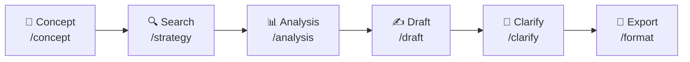
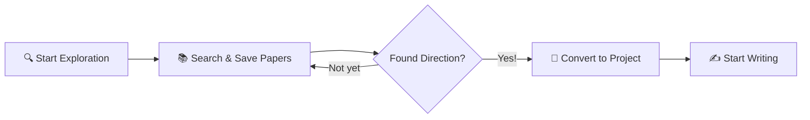
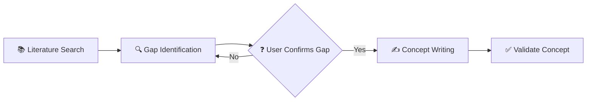
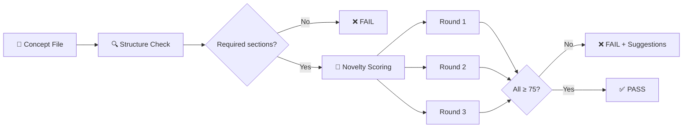
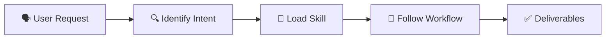
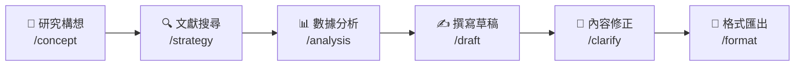
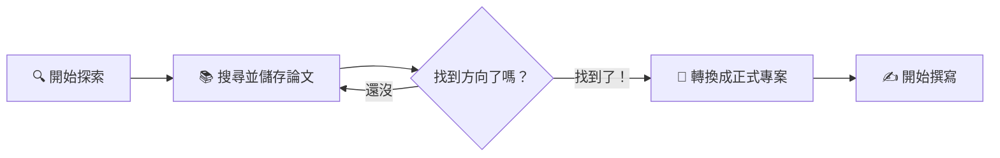
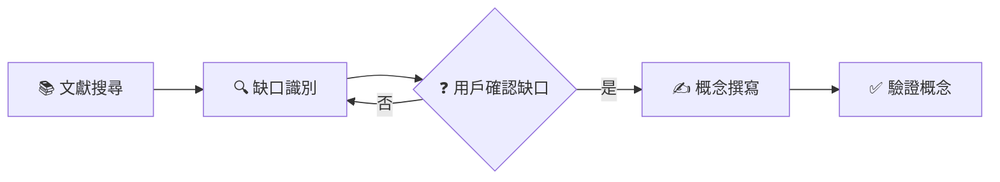

# Medical Paper Assistant 醫學論文寫作助手

<p align="center">
  <a href="https://www.python.org/downloads/"></a>
  <a href="https://modelcontextprotocol.io/"></a>
  <a href="https://github.com/features/copilot"></a>
  <a href="https://github.com/u9401066/med-paper-assistant"></a>
  <a href="https://pubmed.ncbi.nlm.nih.gov/"></a>
  <a href="https://github.com/u9401066/med-paper-assistant/pulls"></a>
</p>

<p align="center">
  <b>🔬 A Guided & Exploratory Medical Paper Writing Tool</b><br>
  <i>Powered by MCP + GitHub Copilot</i>
</p>

<p align="center">
  <b>🔬 引導式、探索式醫學論文寫作工具</b><br>
  <i>由 MCP + GitHub Copilot 驅動</i>
</p>

[English](#english) | [繁體中文](#繁體中文)

---

<a name="english"></a>
## 🇬🇧 English

### 🎯 Why This Tool?

**Traditional paper writing tools** require you to know exactly what you want before you start. But research is rarely that linear.

**Medical Paper Assistant** is different:
- 🔍 **Explore First, Decide Later** - Browse literature freely, save interesting papers, then decide your research direction
- 💬 **Conversational Workflow** - Chat naturally with AI to refine your ideas, not fight with forms
- 🧭 **Guided Process** - Step-by-step prompts guide you from concept to publication-ready manuscript
- 🔗 **Native MCP + Copilot Integration** - Works directly inside VS Code, no context switching

### 💡 What Makes Us Unique

| Traditional Tools | Medical Paper Assistant |
|-------------------|------------------------|
| Fixed templates, rigid workflow | Flexible, exploratory approach |
| Separate apps for search/write/cite | All-in-one integrated experience |
| Manual reference management | Auto-save with PDF & citation formats |
| Export then format | Direct Word export with journal styles |
| Learn complex UI | Natural language conversation |

### Overview

Medical Paper Assistant is an AI-powered writing tool designed specifically for medical researchers. Built on the **Model Context Protocol (MCP)**, it integrates seamlessly with VS Code through GitHub Copilot, providing a comprehensive workflow from literature search and data analysis to manuscript drafting and formatted export.

### ✨ Key Features

| Feature | Description |
|---------|-------------|
| **Literature Search & Management** | Connect to PubMed API, search articles, download PDFs from PMC Open Access, and build a local reference library |
| **Data Analysis** | Automatically read CSV data, perform statistical tests (t-test, correlation, etc.), and generate publication-ready figures |
| **Smart Draft Generation** | Generate manuscript drafts based on your research concept and analysis results |
| **Automatic Citations** | Insert citation markers \`[1]\` and generate formatted reference lists (Vancouver, APA, Nature styles) |
| **Interactive Refinement** | Fine-tune specific sections through conversational dialogue |
| **Word Export** | Export Markdown drafts to \`.docx\` files conforming to journal templates |

### 🚀 Installation

#### Prerequisites

Before you begin, ensure you have the following installed:

| Requirement | Version | How to Check | Installation Guide |
|-------------|---------|--------------|-------------------|
| **Python** | 3.10 or higher | \`python3 --version\` | [python.org](https://www.python.org/downloads/) |
| **Git** | Any recent version | \`git --version\` | [git-scm.com](https://git-scm.com/) |
| **VS Code** | Latest | Open VS Code → Help → About | [code.visualstudio.com](https://code.visualstudio.com/) |
| **GitHub Copilot** | Extension | VS Code Extensions panel | Search "GitHub Copilot" in Extensions |

#### Quick Installation (Recommended)

**Step 1: Clone the Repository**

Open a terminal and run:

\`\`\`bash
# Navigate to where you want to store the project
cd ~/projects  # or any directory of your choice

# Clone the repository
git clone https://github.com/u9401066/med-paper-assistant.git

# Enter the project directory
cd med-paper-assistant
\`\`\`

**Step 2: Run the Setup Script**

**Linux/macOS:**
\`\`\`bash
# Make the script executable
chmod +x scripts/setup.sh

# Run the setup script
./scripts/setup.sh
\`\`\`

**Windows (PowerShell - Recommended):**
\`\`\`powershell
# Run the PowerShell setup script
.\scripts\setup.ps1
\`\`\`

**Windows (Command Prompt):**
\`\`\`cmd
# Run the batch setup script
scripts\setup.bat
\`\`\`

This script will:
1. ✅ Create a Python virtual environment (\`.venv/\`)
2. ✅ Install all required dependencies
3. ✅ Create the \`.vscode/mcp.json\` configuration file (with correct paths for your OS)
4. ✅ Verify the installation

**Step 3: Reload VS Code**

After setup completes:
1. Open VS Code
2. Press \`Ctrl+Shift+P\` (Windows/Linux) or \`Cmd+Shift+P\` (Mac)
3. Type \`Developer: Reload Window\` and press Enter

**Step 4: Verify Installation**

In VS Code's Copilot Chat panel:
1. Type `/mcp` and press Enter
2. You should see `mdpaper (50 tools)` in the list (or with `drawio (15 tools)` if you enabled Draw.io integration)
3. If you see this, the installation was successful! 🎉

#### Optional: Setup Draw.io Integration

For diagram generation (CONSORT/PRISMA flowcharts), run:

```bash
# Initialize submodules and setup Draw.io
./scripts/setup-integrations.sh
```

This adds the `drawio` MCP server with tools for creating diagrams.

To use Draw.io:
1. Start the web app: `./scripts/start-drawio.sh`
2. Reload VS Code
3. Use drawio tools in Copilot Chat

#### Manual Installation (If Setup Script Fails)

<details>
<summary>Click to expand manual installation steps</summary>

**Step 1: Clone the Repository**

\`\`\`bash
git clone https://github.com/u9401066/med-paper-assistant.git
cd med-paper-assistant
\`\`\`

**Step 2: Create Virtual Environment**

\`\`\`bash
# Create a virtual environment named .venv
python3 -m venv .venv

# Activate the virtual environment
# On Linux/Mac:
source .venv/bin/activate

# On Windows (Command Prompt):
.venv\Scripts\activate.bat

# On Windows (PowerShell):
.venv\Scripts\Activate.ps1
\`\`\`

> 💡 **What is a virtual environment?**
> A virtual environment is an isolated Python environment that keeps this project's dependencies separate from your system Python. This prevents conflicts with other projects.

**Step 3: Install Dependencies**

\`\`\`bash
# Upgrade pip first (recommended)
pip install --upgrade pip

# Install the project in editable mode
pip install -e .
\`\`\`

**Step 4: Configure VS Code MCP**

Create the file \`.vscode/mcp.json\` in the project root:

\`\`\`bash
# Create .vscode directory if it doesn't exist
mkdir -p .vscode

# Create the mcp.json file
cat > .vscode/mcp.json << 'EOF'
{
  "inputs": [],
  "servers": {
    "mdpaper": {
      "type": "stdio",
      "command": "${workspaceFolder}/.venv/bin/python",
      "args": ["-m", "med_paper_assistant.interfaces.mcp"],
      "env": {
        "PYTHONPATH": "${workspaceFolder}/src"
      }
    }
  }
}
EOF
\`\`\`

> ⚠️ **Windows Users**: Replace \`.venv/bin/python\` with \`.venv\\Scripts\\python.exe\`

**Step 5: Reload VS Code**

Press \`Ctrl+Shift+P\` → Type \`Developer: Reload Window\` → Press Enter

</details>

#### Troubleshooting

<details>
<summary>❌ "Command not found: python3"</summary>

**Problem**: Python is not installed or not in your PATH.

**Solution**:
1. Install Python from [python.org](https://www.python.org/downloads/)
2. During installation, check "Add Python to PATH"
3. Restart your terminal and try again

</details>

<details>
<summary>❌ MCP server not showing in Copilot</summary>

**Problem**: The MCP server is not being detected by VS Code.

**Solutions**:
1. Ensure \`.vscode/mcp.json\` exists and has correct paths
2. Check that the virtual environment was created: \`ls .venv/\`
3. Try reloading VS Code: \`Ctrl+Shift+P\` → \`Developer: Reload Window\`
4. Check VS Code Output panel: \`View\` → \`Output\` → Select "MCP" from dropdown

</details>

<details>
<summary>❌ "ModuleNotFoundError: med_paper_assistant"</summary>

**Problem**: The package is not installed or PYTHONPATH is incorrect.

**Solution**:
\`\`\`bash
# Activate virtual environment first
source .venv/bin/activate  # Linux/Mac
# .venv\Scripts\activate   # Windows

# Reinstall the package
pip install -e .
\`\`\`

</details>

---

### 📖 Usage Guide

This assistant integrates with GitHub Copilot through MCP. Use \`/mcp.mdpaper.*\` commands in Copilot Chat.

#### Workflow Overview



#### 🆕 Literature Exploration Mode (Recommended for Beginners!)

**Don't know what to research?** Start by exploring literature first!

**Command**: `/mcp.mdpaper.search`



**How it works:**

1. **Start exploring** - Automatically creates a temporary workspace
   ```
   start_exploration()
   ```

2. **Search and save interesting papers** - No project commitment required
   ```
   search_literature(query="your interest topic")
   save_reference(pmid="12345678")  # Save interesting ones
   ```

3. **When you find a direction** - Convert to formal project with all references
   ```
   convert_exploration_to_project(
       name="Your Research Title",
       paper_type="original-research"
   )
   ```

> 💡 **Benefit**: All references saved during exploration are automatically transferred to your new project!

---

#### Step 1: Prepare Your Data

Before starting, organize your files:

| Directory | Purpose |
|-----------|--------|
| `data/` | Place your CSV research data here |
| `templates/` | (Optional) Journal Word templates |

#### Step 2: Develop Your Research Concept

**Command**: \`/mcp.mdpaper.concept\`

This guided workflow helps you develop a well-structured research concept with **novelty protection**:



**Step-by-step process:**

1. **📚 Literature Search** (Mandatory)
   - Agent searches PubMed for 5-10 relevant studies
   - Key papers are saved to your reference library

2. **🔍 Gap Identification** (Mandatory)
   - Agent presents literature summary
   - Identifies research gaps and limitations
   - **🛑 Asks you to confirm** which gap your research addresses

3. **✍️ Concept Writing** (After your confirmation)
   - Creates structured concept with protected sections:
     - 🔒 **NOVELTY STATEMENT** - What's new (protected)
     - 🔒 **KEY SELLING POINTS** - Your 3-5 key differentiators (protected)
     - 📝 Background, Methods, Expected Outcomes (editable)

4. **✅ Validation**
   - Use `validate_concept` tool to verify completeness

The output is saved to \`drafts/concept_*.md\`.

> 💡 **Why Protected Sections?** The 🔒 markers ensure your key innovations are preserved when writing the full paper. The Agent must ask before modifying these sections.

#### Step 3: Configure Search Strategy

**Command**: \`/mcp.mdpaper.strategy\`

Set up your literature search parameters:
- Keywords and MeSH terms
- Exclusion criteria
- Article types (Review, Clinical Trial, Meta-Analysis)
- Date range
- Minimum sample size

#### Step 4: Analyze Your Data

**Command**: \`/mcp.mdpaper.analysis\`

The assistant will:
1. List available CSV files in \`data/\`
2. Ask you to specify grouping and outcome variables
3. Perform appropriate statistical tests
4. Generate figures (saved to \`results/figures/\`)
5. Create Table 1 (baseline characteristics)

#### Step 5: Write Your Draft

**Command**: \`/mcp.mdpaper.draft\`

The assistant will:
1. Read your \`concept.md\` and analysis results
2. Ask which template to use
3. Generate a Markdown draft with:
   - Embedded figures
   - Automatic citations
   - Formatted tables

> ⚠️ **Important**: This command requires a concept file. Create one using \`/mcp.mdpaper.concept\` first.

#### Step 6: Refine Your Content

**Command**: \`/mcp.mdpaper.clarify\`

Interactively improve specific sections:
- "Make the Introduction more conservative"
- "Expand the limitations section"
- "Simplify the statistical methods description"

#### Step 7: Export to Word

**Command**: `/mcp.mdpaper.format`

This follows a 7-step workflow:
1. Read template structure
2. Read draft content
3. Map sections
4. Insert content
5. Verify document
6. Check word limits
7. Save final document

Output: `results/your_paper.docx`

---

### 📂 Project Structure

| Directory | Purpose |
|-----------|--------|
| `projects/` | Research projects (isolated workspaces) |
| `projects/{slug}/concept.md` | Research concept with protected sections |
| `projects/{slug}/drafts/` | Markdown drafts |
| `projects/{slug}/references/{PMID}/` | Local reference library |
| `projects/{slug}/data/` | Raw data files (CSV) |
| `projects/{slug}/results/` | Generated outputs (figures, tables, docx) |
| └ `metadata.json` | Citation info, formatted references |
| └ `content.md` | Abstract and notes |
| └ `fulltext.pdf` | PDF (if available from PMC) |
| `templates/` | Journal Word templates (`.docx` for export) |
| `src/med_paper_assistant/core/` | Core logic modules |
| `src/med_paper_assistant/mcp_server/` | MCP server implementation |
| └ `templates/` | Internal templates for Agent guidance (`.md`) |
| `tests/` | Test suite |
| `.memory/` | Project context files |
| └ `.agent_constitution.md` | **Agent behavior rules (dynamically loaded)** |

---

### ⚖️ Agent Constitution

The MCP server dynamically loads the Agent Constitution from `.memory/.agent_constitution.md`. This file defines the core behavior rules that Copilot must follow.

**Constitution Structure:**

| Part | Content |
|------|--------|
| **Part 1: System Development** | Language rules, Memory Bank maintenance, Code quality, Privacy |
| **Part 2: Research Operations** | Concept workflow, Protected content rules, Draft writing rules |

**Key Rules for Protected Content (🔒):**

```markdown
## 2.2 🔒 Protected Content Rules

| Section | Description | Rule |
|---------|-------------|------|
| 🔒 NOVELTY STATEMENT | Innovation declaration | Must ask before modifying |
| 🔒 KEY SELLING POINTS | Core differentiators (3-5) | Must ask before modifying |
| 🔒 Author Notes | Private notes | Do not modify |

Modification Rules:
✅ Can refine wording
✅ Can improve academic expression
⛔ MUST ask user before substantial changes
⛔ NEVER delete protected content
⛔ NEVER weaken selling points
```

**To customize:** Edit `.memory/.agent_constitution.md` and reload VS Code. The new rules will be automatically applied.

---

### 🎯 Novelty Validation System

The system includes an intelligent **Novelty Validation** feature that ensures research concepts truly describe novel contributions before proceeding to draft writing.

#### How It Works



#### Scoring Mechanism

| Setting | Value | Description |
|---------|-------|-------------|
| **Rounds** | 3 | Number of independent evaluations |
| **Threshold** | 75/100 | Minimum score per round |
| **Pass Criteria** | All 3 rounds ≥ 75 | Must pass all rounds |

#### Evaluation Dimensions

| Dimension | Weight | What It Checks |
|-----------|--------|----------------|
| **Uniqueness** | 25% | Is the approach/method unique? |
| **Significance** | 25% | Is the contribution meaningful? |
| **Gap Alignment** | 20% | Does novelty address the research gap? |
| **Specificity** | 15% | Is the claim specific and concrete? |
| **Verifiability** | 15% | Can the claim be verified/tested? |

#### Example Validation Report

```
📋 Concept Validation Report
📄 File: concept.md

## 🔒 Protected Sections (Required)
| Section | Found | Has Content | Status |
|---------|-------|-------------|--------|
| 🔒 NOVELTY STATEMENT | ✅ | ✅ | ✅ PASS |
| 🔒 KEY SELLING POINTS (4 points) | ✅ | ✅ | ✅ PASS |

## 🎯 Novelty Evaluation
**Status:** ✅ PASSED
**Average Score:** 82.3/100
**Threshold:** 75

| Round | Score | Status |
|-------|-------|--------|
| 1 | 84 | ✅ |
| 2 | 79 | ✅ |
| 3 | 84 | ✅ |

## ✅ VALIDATION PASSED
```

#### Key Design Decisions

1. **Mandatory Before Draft Writing**: The system enforces validation before any concept file can be used for draft generation.

2. **Multi-Round Evaluation**: Using 3 rounds increases reliability and reduces false positives.

3. **High Threshold**: Requiring 75+ ensures only well-articulated novelty claims pass.

4. **Actionable Feedback**: Failed validations provide specific suggestions for improvement.

---

### 🧠 Skills System

Skills are **complete workflow definitions** that guide the AI through complex multi-step tasks. Unlike individual tools that perform single actions, Skills define the entire process from start to finish.

> 📁 **See full documentation**: [.skills/README.md](.skills/README.md)

#### When to Use Skills

| User Request | Skill to Load |
|--------------|---------------|
| "Help me do a literature review" | `literature_review` |
| "Develop my research concept" | `concept_development` |
| "Search for papers on [topic]" | `parallel_search` |
| "Write the Introduction section" | `draft_introduction` |
| "Write the Discussion" | `draft_discussion` |

#### How It Works



**Example**: When you say "help me do a literature review", the AI:
1. Loads `.skills/research/literature_review.md`
2. Follows the defined phases (search → screen → synthesize)
3. Asks at decision points
4. Produces the expected deliverables

#### Skill Tools

| Tool | Purpose |
|------|---------|
| `list_skills` | Show all available skills |
| `load_skill` | Load a specific skill's workflow |
| `suggest_skill` | Get skill recommendation based on task |

---

### ⚡ Parallel Search

Parallel Search dramatically speeds up literature discovery by running multiple search strategies simultaneously.

#### How It Works


#### Usage Example

```
User: "Find papers about remimazolam ICU sedation"

AI executes:
1. generate_search_queries(topic="remimazolam ICU sedation")
   → Returns 5 different query strategies

2. Parallel execution of search_literature × 5
   → All queries run simultaneously

3. merge_search_results(...)
   → Returns: 42 unique papers (56 total, 14 duplicates removed)
   → Papers found by multiple strategies are flagged as "high relevance"
```

#### Strategy Integration

Configure your search strategy once, and it automatically applies to all parallel queries:

```
configure_search_strategy({
    "date_range": "2020-2025",
    "exclusions": ["animal", "review"],
    "article_types": ["Clinical Trial", "RCT"]
})

generate_search_queries(topic="...", use_saved_strategy=True)
→ All 5 queries include date filters, exclusions, and article type restrictions
```

---

### 🛠️ Available Tools (52 mdpaper + 15 drawio)

#### 📚 mdpaper Tools (52 total)

| Category | Tools | Description |
|----------|-------|-------------|
| **Search** (10) | `search_literature`, `find_related_articles`, `find_citing_articles`, `fetch_article_details`, `configure_search_strategy`, `get_search_strategy`, `generate_search_queries`, `merge_search_results`, `expand_search_queries`, `search_local_references` | Literature discovery via [pubmed-search-mcp](integrations/pubmed-search-mcp) submodule |
| **Reference** (8) | `save_reference`, `list_saved_references`, `get_reference_details`, `read_reference_fulltext`, `retry_pdf_download`, `format_references`, `set_citation_style`, `insert_citation` | Reference management |
| **Writing** (16) | `write_draft`, `read_draft`, `list_drafts`, `draft_section`, `get_section_template`, `count_words`, `validate_concept`, `validate_concept_quick`, `list_templates`, `read_template`, `start_document_session`, `insert_section`, `verify_document`, `check_word_limits`, `save_document`, `export_word` | Manuscript preparation and export |
| **Project** (15) | `create_project`, `list_projects`, `switch_project`, `get_current_project`, `update_project_status`, `get_project_paths`, `get_paper_types`, `update_project_settings`, `setup_project_interactive`, `start_exploration`, `get_exploration_status`, `convert_exploration_to_project`, `save_diagram`, `save_diagram_standalone`, `list_diagrams` | Project & diagram management |
| **Skills** (3) | `list_skills`, `load_skill`, `suggest_skill` | Workflow automation via [Skills System](#-skills-system) |

> **Note:** Analysis tools (`analyze_dataset`, `run_statistical_test`, `create_plot`, `generate_table_one`) have been moved to a separate [data-analysis-mcp](https://github.com/u9401066/data-analysis-mcp) project.

#### 🎨 drawio Tools (15 total) - [Optional Integration](integrations/)

| Category | Tools | Description |
|----------|-------|-------------|
| **Diagram** | `create_diagram`, `edit_diagram`, `get_diagram_info`, `apply_diagram_changes` | Create and edit diagrams |
| **Templates** | `list_templates`, `create_from_template` | Architecture templates (AWS, GCP, Azure) |
| **Guidelines** | `get_drawing_guidelines`, `get_style`, `list_styles` | Drawing best practices |
| **File** | `load_file`, `save_tab` | File management |

---

### 🧪 Development & Testing

\`\`\`bash
# Activate virtual environment
source .venv/bin/activate

# Run all tests
pytest tests/

# Run specific test file
pytest tests/test_search.py

# Run with verbose output
pytest tests/ -v
\`\`\`

---

### 🗺️ Roadmap

We're actively developing new features. Here's what's coming:

| Status | Feature | Description |
|--------|---------|-------------|
| ✅ | **[Draw.io Integration](integrations/)** | Generate CONSORT/PRISMA flowcharts with real-time WebSocket sync via [next-ai-draw-io](https://github.com/u9401066/next-ai-draw-io) |
| ✅ | **[Skills System](.skills/)** | Workflow definitions guiding AI through complex tasks - see [documentation](.skills/README.md) |
| ✅ | **Parallel Search** | Generate multiple search queries and execute in parallel - [how it works](#-parallel-search) |
| ✅ | **Search Strategy Integration** | Configure once, apply everywhere - strategy auto-integrates into parallel queries |
| ✅ | **Table 1 Generator** | Auto-generate baseline characteristics table from CSV via `generate_table_one` |
| 🔜 | **Multi-language Support** | Full UI localization beyond English/Chinese |
| 🔜 | **Journal Style Library** | Pre-configured styles for major medical journals |
| 📋 | **Collaboration Mode** | Multi-author workflow with version control |
| 📋 | **AI-Assisted Review** | Use LLM to review and improve manuscript sections |

**Legend:** ✅ Complete | 🔜 In Progress | 📋 Planned

Want to help? Check out [CONTRIBUTING.md](CONTRIBUTING.md) or open an issue to discuss!

---

### 🤝 Contributing

We welcome contributions from the community! Whether you're a medical researcher with workflow ideas, a developer who wants to add features, or someone who found a bug - we'd love to hear from you.

**Ways to contribute:**
- 🐛 **Report bugs** - Open an issue describing the problem
- 💡 **Suggest features** - Share your ideas for new tools or workflows
- 📝 **Improve documentation** - Help make the README clearer
- 🔧 **Submit code** - Fork, code, and send a PR
- 🌐 **Translations** - Help translate to other languages

**Getting started:**
1. Fork this repository
2. Create a feature branch (`git checkout -b feature/amazing-feature`)
3. Commit your changes (`git commit -m 'Add amazing feature'`)
4. Push to the branch (`git push origin feature/amazing-feature`)
5. Open a Pull Request

See [CONTRIBUTING.md](CONTRIBUTING.md) for detailed guidelines.

---

### 📄 License

This project is licensed under the MIT License. See [LICENSE](LICENSE) for details.

---

### ⭐ Star History

If you find this project helpful, please consider giving it a star! It helps others discover the project.

---

<a name="繁體中文"></a>
## 🇹🇼 繁體中文

### 🎯 為什麼選擇這個工具？

**傳統論文寫作工具**要求你在開始前就知道確切的方向。但研究很少是這麼線性的。

**Medical Paper Assistant** 不一樣：
- 🔍 **先探索，後決定** - 自由瀏覽文獻、儲存有興趣的論文，再決定研究方向
- 💬 **對話式工作流程** - 用自然語言與 AI 對話來精煉想法，不用填表單
- 🧭 **引導式流程** - 一步步的提示引導你從構思到可投稿的論文
- 🔗 **原生 MCP + Copilot 整合** - 直接在 VS Code 中運作，不用切換應用程式

### 💡 我們的獨特之處

| 傳統工具 | Medical Paper Assistant |
|---------|------------------------|
| 固定模板、僵化流程 | 彈性、探索式方法 |
| 搜尋/寫作/引用分開多個 App | 一站式整合體驗 |
| 手動管理參考文獻 | 自動儲存 + PDF + 引用格式 |
| 匯出後再排版 | 直接匯出符合期刊格式的 Word |
| 學習複雜介面 | 自然語言對話 |

### 概述

Medical Paper Assistant（醫學論文寫作助手）是一款專為醫學研究人員設計的 AI 輔助寫作工具。基於 **Model Context Protocol (MCP)** 架構，可與 VS Code 的 GitHub Copilot 無縫整合，提供從文獻檢索、數據分析、草稿生成到格式化輸出的完整工作流程。

### ✨ 主要功能

| 功能 | 說明 |
|------|------|
| **文獻檢索與管理** | 連接 PubMed API 搜尋文獻，從 PMC Open Access 下載 PDF，建立本地文獻庫 |
| **數據分析** | 自動讀取 CSV 數據，執行統計檢定（t-test、相關性分析等），生成出版品質的圖表 |
| **智慧草稿生成** | 根據您的研究構想與分析結果，自動生成論文草稿 |
| **自動引用** | 插入引用標記 \`[1]\` 並生成格式化的參考文獻列表（支援 Vancouver、APA、Nature 格式）|
| **互動式修正** | 透過對話方式微調特定段落 |
| **Word 匯出** | 將 Markdown 草稿匯出為符合期刊格式的 \`.docx\` 檔案 |

### 🚀 安裝指南

#### 系統需求

開始之前，請確認您已安裝以下軟體：

| 需求 | 版本 | 檢查方式 | 安裝指南 |
|------|------|----------|----------|
| **Python** | 3.10 或更高 | 終端機輸入 \`python3 --version\` | [python.org](https://www.python.org/downloads/) |
| **Git** | 任何近期版本 | 終端機輸入 \`git --version\` | [git-scm.com](https://git-scm.com/) |
| **VS Code** | 最新版 | 開啟 VS Code → 說明 → 關於 | [code.visualstudio.com](https://code.visualstudio.com/) |
| **GitHub Copilot** | 擴充功能 | VS Code 擴充功能面板 | 在擴充功能中搜尋 "GitHub Copilot" |

#### 快速安裝（推薦）

**步驟 1：複製專案**

開啟終端機並執行：

\`\`\`bash
# 切換到您想存放專案的目錄
cd ~/projects  # 或任何您選擇的目錄

# 複製專案
git clone https://github.com/u9401066/med-paper-assistant.git

# 進入專案目錄
cd med-paper-assistant
\`\`\`

> 💡 **什麼是 \`git clone\`？**
> \`git clone\` 會從 GitHub 下載完整的專案副本到您的電腦。這包含所有程式碼、歷史記錄和分支。

**步驟 2：執行安裝腳本**

**Linux/macOS：**
\`\`\`bash
# 給予腳本執行權限
chmod +x scripts/setup.sh

# 執行安裝腳本
./scripts/setup.sh
\`\`\`

**Windows（PowerShell - 推薦）：**
\`\`\`powershell
# 執行 PowerShell 安裝腳本
.\scripts\setup.ps1
\`\`\`

**Windows（命令提示字元）：**
\`\`\`cmd
# 執行批次安裝腳本
scripts\setup.bat
\`\`\`

這個腳本會自動完成：
1. ✅ 建立 Python 虛擬環境（\`.venv/\`）
2. ✅ 安裝所有必要的套件
3. ✅ 建立 \`.vscode/mcp.json\` 設定檔（自動偵測作業系統）
4. ✅ 驗證安裝

> 💡 **什麼是虛擬環境？**
> 虛擬環境是一個隔離的 Python 環境，讓這個專案的套件與系統的 Python 分開。這樣可以避免與其他專案產生衝突。

**步驟 3：重新載入 VS Code**

安裝完成後：
1. 開啟 VS Code
2. 按下 \`Ctrl+Shift+P\`（Windows/Linux）或 \`Cmd+Shift+P\`（Mac）
3. 輸入 \`Developer: Reload Window\` 並按 Enter

> 💡 **為什麼要重新載入？**
> VS Code 需要重新讀取 \`.vscode/mcp.json\` 設定檔才能啟動 MCP 伺服器。

**步驟 4：驗證安裝**

在 VS Code 的 Copilot Chat 面板中：
1. 輸入 `/mcp` 並按 Enter
2. 您應該會看到列表中有 `mdpaper (50 tools)`（如果啟用 Draw.io 整合，還會有 `drawio (15 tools)`）
3. 如果看到這個，表示安裝成功！🎉

#### 選用：設定 Draw.io 整合

如需圖表生成功能（CONSORT/PRISMA 流程圖），執行：

```bash
# 初始化子模組並設定 Draw.io
./scripts/setup-integrations.sh
```

這會新增 `drawio` MCP 伺服器，提供圖表生成工具。

使用方式：
1. 啟動網頁應用：`./scripts/start-drawio.sh`
2. 重新載入 VS Code
3. 在 Copilot Chat 中使用 drawio 工具

#### 手動安裝（如果腳本失敗）

<details>
<summary>點擊展開手動安裝步驟</summary>

**步驟 1：複製專案**

\`\`\`bash
git clone https://github.com/u9401066/med-paper-assistant.git
cd med-paper-assistant
\`\`\`

**步驟 2：建立虛擬環境**

\`\`\`bash
# 建立名為 .venv 的虛擬環境
python3 -m venv .venv

# 啟動虛擬環境
# Linux/Mac：
source .venv/bin/activate

# Windows（命令提示字元）：
.venv\Scripts\activate.bat

# Windows（PowerShell）：
.venv\Scripts\Activate.ps1
\`\`\`

> 💡 **如何確認虛擬環境已啟動？**
> 啟動後，您的終端機提示符前面會出現 \`(.venv)\`，例如：
> \`\`\`
> (.venv) user@computer:~/med-paper-assistant$
> \`\`\`

**步驟 3：安裝套件**

\`\`\`bash
# 先更新 pip（建議）
pip install --upgrade pip

# 以可編輯模式安裝專案
pip install -e .
\`\`\`

> 💡 **什麼是 \`pip install -e .\`？**
> \`-e\` 代表「可編輯模式」（editable mode），這表示當您修改程式碼時，不需要重新安裝就能看到變更。\`.\` 代表當前目錄。

**步驟 4：設定 VS Code MCP**

在專案根目錄建立 \`.vscode/mcp.json\` 檔案：

\`\`\`bash
# 建立 .vscode 目錄（如果不存在）
mkdir -p .vscode

# 建立 mcp.json 檔案
cat > .vscode/mcp.json << 'EOF'
{
  "inputs": [],
  "servers": {
    "mdpaper": {
      "type": "stdio",
      "command": "${workspaceFolder}/.venv/bin/python",
      "args": ["-m", "med_paper_assistant.interfaces.mcp"],
      "env": {
        "PYTHONPATH": "${workspaceFolder}/src"
      }
    }
  }
}
EOF
\`\`\`

> ⚠️ **Windows 使用者注意**：請將 \`.venv/bin/python\` 改為 \`.venv\\Scripts\\python.exe\`

**步驟 5：重新載入 VS Code**

按下 \`Ctrl+Shift+P\` → 輸入 \`Developer: Reload Window\` → 按 Enter

</details>

#### 疑難排解

<details>
<summary>❌ 「找不到命令：python3」</summary>

**問題**：Python 未安裝或不在系統 PATH 中。

**解決方案**：
1. 從 [python.org](https://www.python.org/downloads/) 下載並安裝 Python
2. 安裝時，務必勾選「Add Python to PATH」選項
3. 重新啟動終端機後再試一次

</details>

<details>
<summary>❌ Copilot 中看不到 MCP 伺服器</summary>

**問題**：VS Code 無法偵測到 MCP 伺服器。

**解決方案**：
1. 確認 \`.vscode/mcp.json\` 檔案存在且路徑正確
2. 確認虛擬環境已建立：執行 \`ls .venv/\`
3. 嘗試重新載入 VS Code：\`Ctrl+Shift+P\` → \`Developer: Reload Window\`
4. 檢查 VS Code 輸出面板：\`檢視\` → \`輸出\` → 從下拉選單選擇「MCP」

</details>

<details>
<summary>❌ 「ModuleNotFoundError: med_paper_assistant」</summary>

**問題**：套件未安裝或 PYTHONPATH 設定錯誤。

**解決方案**：
\`\`\`bash
# 先啟動虛擬環境
source .venv/bin/activate  # Linux/Mac
# .venv\Scripts\activate   # Windows

# 重新安裝套件
pip install -e .
\`\`\`

</details>

---

### 📖 使用指南

本助手透過 MCP 與 GitHub Copilot 整合。在 Copilot Chat 中使用 \`/mcp.mdpaper.*\` 指令。

#### 工作流程概覽



#### 🆕 文獻探索模式（推薦新手使用！）

**還不確定研究方向？** 先從探索文獻開始！

**指令**：`/mcp.mdpaper.search`



**使用方式：**

1. **開始探索** - 自動建立臨時工作區
   ```
   start_exploration()
   ```

2. **搜尋並儲存有興趣的論文** - 不需要事先決定專案
   ```
   search_literature(query="您感興趣的主題")
   save_reference(pmid="12345678")  # 儲存有興趣的論文
   ```

3. **找到研究方向後** - 將探索內容轉換成正式專案
   ```
   convert_exploration_to_project(
       name="Your Research Title",  # 英文名稱
       paper_type="original-research"
   )
   ```

> 💡 **好處**：探索期間儲存的所有文獻都會自動轉移到新專案！

---

#### 步驟 1：準備您的資料

開始之前，請整理您的檔案：

| 目錄 | 用途 |
|------|------|
| `data/` | 將您的 CSV 研究數據放在這裡 |
| `templates/` | （選用）期刊 Word 範本 |

#### 步驟 2：發展研究構想

**指令**：\`/mcp.mdpaper.concept\`

這個引導式流程會幫助您建構具有**創新性保護**的結構化研究構想：



**逐步流程：**

1. **📚 文獻搜尋**（強制）
   - Agent 搜尋 PubMed 找出 5-10 篇相關研究
   - 重要文獻自動儲存到參考文獻庫

2. **🔍 缺口識別**（強制）
   - Agent 呈現文獻摘要
   - 識別研究缺口與限制
   - **🛑 詢問您確認**您的研究要解決哪個缺口

3. **✍️ 概念撰寫**（用戶確認後）
   - 建立具有保護區塊的結構化概念：
     - 🔒 **NOVELTY STATEMENT** - 創新性聲明（受保護）
     - 🔒 **KEY SELLING POINTS** - 您的 3-5 個核心賣點（受保護）
     - 📝 背景、方法、預期結果（可編輯）

4. **✅ 驗證**
   - 使用 `validate_concept` 工具驗證完整性

輸出會儲存到 \`drafts/concept_*.md\`。

> 💡 **為什麼需要受保護區塊？** 🔒 標記確保您的關鍵創新點在撰寫完整論文時被保留。Agent 必須在修改這些區塊前先詢問您。

#### 步驟 3：設定搜尋策略

**指令**：\`/mcp.mdpaper.strategy\`

設定文獻搜尋參數：
- 關鍵字與 MeSH 術語
- 排除條件
- 文章類型（Review、Clinical Trial、Meta-Analysis）
- 日期範圍
- 最小樣本數

#### 步驟 4：分析數據

**指令**：\`/mcp.mdpaper.analysis\`

助手會：
1. 列出 \`data/\` 中可用的 CSV 檔案
2. 詢問您指定分組變數與結果變數
3. 執行適當的統計檢定
4. 生成圖表（儲存到 \`results/figures/\`）
5. 建立 Table 1（基線特徵表）

#### 步驟 5：撰寫草稿

**指令**：\`/mcp.mdpaper.draft\`

助手會：
1. 讀取您的 \`concept.md\` 和分析結果
2. 詢問使用哪個範本
3. 生成 Markdown 草稿，包含：
   - 嵌入的圖表
   - 自動引用
   - 格式化的表格

> ⚠️ **重要提示**：此指令需要 concept 檔案。請先使用 \`/mcp.mdpaper.concept\` 建立。

#### 步驟 6：修正內容

**指令**：\`/mcp.mdpaper.clarify\`

互動式改善特定段落：
- 「讓 Introduction 寫得更保守一點」
- 「擴充 limitations 段落」
- 「簡化統計方法的描述」

#### 步驟 7：匯出到 Word

**指令**：`/mcp.mdpaper.format`

依照 7 步驟流程：
1. 讀取範本結構
2. 讀取草稿內容
3. 對應章節
4. 插入內容
5. 驗證文件
6. 檢查字數限制
7. 儲存最終文件

輸出：`results/your_paper.docx`

---

### 📂 專案結構

| 目錄 | 用途 |
|------|------|
| `projects/` | 研究專案（獨立工作區）|
| `projects/{slug}/concept.md` | 研究概念（含受保護區塊）|
| `projects/{slug}/drafts/` | Markdown 草稿 |
| `projects/{slug}/references/{PMID}/` | 本地文獻庫 |
| `projects/{slug}/data/` | 原始資料檔案（CSV）|
| `projects/{slug}/results/` | 生成的輸出（圖表、表格、docx）|
| └ `metadata.json` | 引用資訊、格式化的參考文獻 |
| └ `content.md` | 摘要與筆記 |
| └ `fulltext.pdf` | PDF（若可從 PMC 取得） |
| `templates/` | 期刊 Word 範本（`.docx` 用於匯出） |
| `src/med_paper_assistant/core/` | 核心邏輯模組 |
| `src/med_paper_assistant/mcp_server/` | MCP 伺服器實作 |
| └ `templates/` | Agent 引導用內部範本（`.md`） |
| `tests/` | 測試套件 |
| `.memory/` | 專案脈絡檔案 |
| └ `.agent_constitution.md` | **Agent 行為規則（動態載入）** |

---

### ⚖️ Agent 憲法

MCP 伺服器會動態載入 `.memory/.agent_constitution.md` 中的 Agent 憲法。此檔案定義 Copilot 必須遵循的核心行為規則。

**憲法結構：**

| 部分 | 內容 |
|------|------|
| **第一部分：系統開發** | 語言規則、Memory Bank 維護、程式碼品質、隱私 |
| **第二部分：研究操作** | Concept 流程、受保護內容規則、Draft 撰寫規則 |

**受保護內容規則 (🔒)：**

```markdown
## 2.2 🔒 受保護內容規則

| 區塊 | 說明 | 規則 |
|------|------|------|
| 🔒 NOVELTY STATEMENT | 研究創新性聲明 | 必須詢問才能修改 |
| 🔒 KEY SELLING POINTS | 核心賣點（3-5點）| 必須詢問才能修改 |
| 🔒 Author Notes | 作者私人備註 | 不可修改 |

修改規則：
✅ 可以潤飾文字
✅ 可以改善學術表達
⛔ 實質修改前必須詢問用戶
⛔ 絕不可刪除受保護內容
⛔ 絕不可弱化核心賣點
```

**自訂方式：** 編輯 `.memory/.agent_constitution.md` 並重新載入 VS Code，新規則將自動套用。

---

### 🎯 新穎性驗證系統

系統內建智慧型**新穎性驗證**功能，確保研究概念在撰寫草稿前真正描述了創新貢獻。

#### 運作方式

| 設定 | 值 | 說明 |
|------|---|------|
| **評分輪數** | 3 | 獨立評估的次數 |
| **通過門檻** | 75/100 | 每輪最低分數 |
| **通過條件** | 3 輪皆 ≥ 75 | 必須全部通過 |

#### 評估維度

| 維度 | 權重 | 檢查項目 |
|------|------|----------|
| **獨特性** | 25% | 方法/途徑是否獨特？ |
| **重要性** | 25% | 貢獻是否有意義？ |
| **缺口對齊** | 20% | 新穎性是否解決研究缺口？ |
| **具體性** | 15% | 宣稱是否具體明確？ |
| **可驗證性** | 15% | 宣稱是否可被驗證/測試？ |

#### 設計原則

1. **草稿撰寫前強制驗證**：系統強制在使用概念檔案生成草稿前進行驗證
2. **多輪評估**：使用 3 輪評估提高可靠性，減少誤判
3. **高門檻**：要求 75+ 確保只有表達清晰的新穎性宣稱能通過
4. **可操作的回饋**：驗證失敗時提供具體改進建議

---

### 🧠 技能系統

技能（Skills）是**完整的工作流程定義**，引導 AI 完成複雜的多步驟任務。與執行單一動作的工具不同，技能定義了從開始到完成的整個流程。

> 📁 **完整說明文件**：[.skills/README.md](.skills/README.md)

#### 何時使用技能

| 使用者請求 | 要載入的技能 |
|-----------|-------------|
| 「幫我做文獻回顧」 | `literature_review` |
| 「發展研究概念」 | `concept_development` |
| 「搜尋 [主題] 的論文」 | `parallel_search` |
| 「寫 Introduction」 | `draft_introduction` |
| 「寫 Discussion」 | `draft_discussion` |

#### 技能工具

| 工具 | 用途 |
|------|------|
| `list_skills` | 顯示所有可用技能 |
| `load_skill` | 載入特定技能的工作流程 |
| `suggest_skill` | 根據任務描述建議適合的技能 |

---

### ⚡ 並行搜尋

並行搜尋透過同時執行多組搜尋策略，大幅加速文獻探索。

#### 運作方式

```
1. generate_search_queries(topic="remimazolam ICU sedation")
   → 返回 5 組不同的查詢策略

2. 並行執行 search_literature × 5
   → 所有查詢同時執行

3. merge_search_results(...)
   → 返回：42 篇獨特論文（總共 56 篇，移除 14 篇重複）
   → 被多個策略找到的論文標記為「高相關性」
```

#### 策略整合

設定一次搜尋策略，自動套用到所有並行查詢：

```
configure_search_strategy({
    "date_range": "2020-2025",
    "exclusions": ["animal", "review"],
    "article_types": ["Clinical Trial", "RCT"]
})

generate_search_queries(topic="...", use_saved_strategy=True)
→ 所有 5 組查詢都包含日期篩選、排除詞和文章類型限制
```

---

### 🛠️ 可用工具（共 52 + 15 個）

#### 📚 mdpaper 工具（52 個）

| 類別 | 工具 | 說明 |
|------|------|------|
| **搜尋** (10) | `search_literature`, `find_related_articles`, `find_citing_articles`, `fetch_article_details`, `configure_search_strategy`, `get_search_strategy`, `generate_search_queries`, `merge_search_results`, `expand_search_queries`, `search_local_references` | 文獻探索，透過 [pubmed-search-mcp](integrations/pubmed-search-mcp) 子模組 |
| **參考文獻** (8) | `save_reference`, `list_saved_references`, `get_reference_details`, `read_reference_fulltext`, `retry_pdf_download`, `format_references`, `set_citation_style`, `insert_citation` | 參考文獻管理 |
| **寫作** (16) | `write_draft`, `read_draft`, `list_drafts`, `draft_section`, `get_section_template`, `count_words`, `validate_concept`, `validate_concept_quick`, `list_templates`, `read_template`, `start_document_session`, `insert_section`, `verify_document`, `check_word_limits`, `save_document`, `export_word` | 草稿準備與匯出 |
| **專案** (15) | `create_project`, `list_projects`, `switch_project`, `get_current_project`, `update_project_status`, `get_project_paths`, `get_paper_types`, `update_project_settings`, `setup_project_interactive`, `start_exploration`, `get_exploration_status`, `convert_exploration_to_project`, `save_diagram`, `save_diagram_standalone`, `list_diagrams` | 專案與圖表管理 |
| **技能** (3) | `list_skills`, `load_skill`, `suggest_skill` | 透過[技能系統](#-技能系統)自動化工作流程 |

> **備註：** 分析工具（`analyze_dataset`, `run_statistical_test`, `create_plot`, `generate_table_one`）已移至獨立的 [data-analysis-mcp](https://github.com/u9401066/data-analysis-mcp) 專案。

#### 🎨 drawio 工具（15 個）- [選用整合](integrations/)

| 類別 | 工具 | 說明 |
|------|------|------|
| **圖表** | `create_diagram`, `edit_diagram`, `get_diagram_info`, `apply_diagram_changes` | 建立和編輯圖表 |
| **範本** | `list_templates`, `create_from_template` | 架構範本（AWS、GCP、Azure）|
| **指引** | `get_drawing_guidelines`, `get_style`, `list_styles` | 繪圖最佳實踐 |
| **檔案** | `load_file`, `save_tab` | 檔案管理 |

---

### 🧪 開發與測試

\`\`\`bash
# 啟動虛擬環境
source .venv/bin/activate

# 執行所有測試
pytest tests/

# 執行特定測試檔案
pytest tests/test_search.py

# 顯示詳細輸出
pytest tests/ -v
\`\`\`

---

### 🗺️ 開發藍圖

我們正在積極開發新功能，以下是規劃中的項目：

| 狀態 | 功能 | 說明 |
|------|------|------|
| ✅ | **[Draw.io 整合](integrations/)** | 透過 [next-ai-draw-io](https://github.com/u9401066/next-ai-draw-io) 生成 CONSORT/PRISMA 流程圖，支援即時 WebSocket 同步 |
| ✅ | **[技能系統](.skills/)** | 工作流程定義，引導 AI 完成複雜任務 - 見[說明文件](.skills/README.md) |
| ✅ | **並行搜尋** | 生成多組搜尋語法並同時執行 - [運作方式](#-並行搜尋) |
| ✅ | **搜尋策略整合** | 設定一次，處處套用 - 策略自動整合到並行查詢 |
| ✅ | **Table 1 生成器** | 透過 `generate_table_one` 從 CSV 自動生成基線特徵表 |
| 🔜 | **多語言支援** | 完整 UI 本地化，不只英文/中文 |
| 🔜 | **期刊樣式庫** | 預設主要醫學期刊的格式設定 |
| 📋 | **協作模式** | 多作者工作流程與版本控制 |
| 📋 | **AI 輔助審稿** | 使用 LLM 審閱並改善論文段落 |

**圖例：** ✅ 已完成 | 🔜 進行中 | 📋 規劃中

想幫忙？查看 [CONTRIBUTING.md](CONTRIBUTING.md) 或開 issue 來討論！

---

### 🤝 參與貢獻

我們歡迎社群的貢獻！無論你是有工作流程想法的醫學研究人員、想添加功能的開發者，或是發現 bug 的使用者 - 我們都很樂意聽到你的聲音。

**貢獻方式：**
- 🐛 **回報 Bug** - 開 issue 描述問題
- 💡 **建議功能** - 分享你對新工具或工作流程的想法
- 📝 **改善文件** - 幫忙讓 README 更清楚
- 🔧 **提交程式碼** - Fork、開發、送 PR
- 🌐 **翻譯** - 幫忙翻譯成其他語言

**開始貢獻：**
1. Fork 這個 repository
2. 建立功能分支 (`git checkout -b feature/amazing-feature`)
3. Commit 你的修改 (`git commit -m 'Add amazing feature'`)
4. Push 到分支 (`git push origin feature/amazing-feature`)
5. 開一個 Pull Request

詳細指南請參閱 [CONTRIBUTING.md](CONTRIBUTING.md)。

---

### 📄 授權

本專案採用 MIT 授權。詳見 [LICENSE](LICENSE) 檔案。

---

### ⭐ 給顆星星

如果你覺得這個專案有幫助，請考慮給它一顆星！這能幫助其他人發現這個專案。
