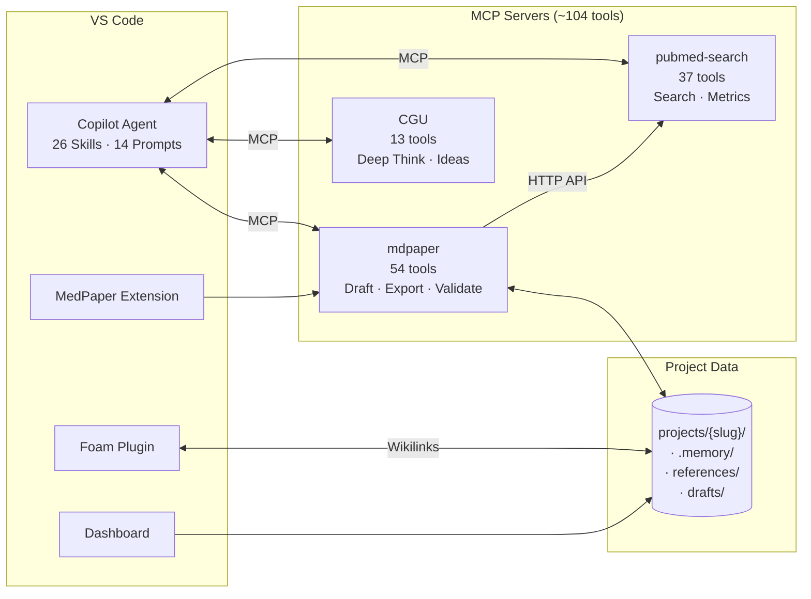

# Medical Paper Assistant

<p align="center">
  <a href="https://www.python.org/downloads/"></a>
  <a href="https://modelcontextprotocol.io/"></a>
  <a href="https://github.com/features/copilot"></a>
  <a href="https://github.com/u9401066/med-paper-assistant"></a>
</p>

<p align="center">
  
  
  
</p>

<p align="center">
  <b>🔬 An Integrated AI Toolkit for Medical Paper Writing</b><br>
  <i>3 MCP Servers · ~104 Tools · 26 Skills · 14 Prompt Workflows — All in VS Code</i>
</p>

> 📖 [繁體中文版](README.zh-TW.md)

---

## 📦 What's in the Box

This is a **monorepo toolkit** that bundles everything a medical researcher needs — from literature search to Word/LaTeX export — into one integrated VS Code environment.

| Component                                                          | Type                   | Tools  | Description                                                               |
| ------------------------------------------------------------------ | ---------------------- | ------ | ------------------------------------------------------------------------- |
| **[mdpaper](#-mdpaper-mcp-tools)**                                 | Core MCP Server        | 54     | Paper writing: projects, references, drafts, analysis, validation, export |
| **[pubmed-search](https://github.com/u9401066/pubmed-search-mcp)** | MCP Server (submodule) | 37     | PubMed/Europe PMC/CORE search, PICO, citation metrics, session mgmt       |
| **[CGU](https://github.com/u9401066/creativity-generation-unit)**  | MCP Server (submodule) | 13     | Creative generation: brainstorm, deep think, spark collision              |
| **[VS Code Extension](vscode-extension/)**                         | Extension              | 3 cmds | MCP server lifecycle, `@mdpaper` chat participant                         |
| **[Dashboard](dashboard/)**                                        | Next.js Web App        | —      | Project management UI, diagram editor                                     |
| **[Foam](https://foambubble.github.io/foam/)**                     | VS Code Extension      | —      | `[[wikilink]]` citation linking, hover preview, graph view                |
| **[Skills](.claude/skills/)**                                      | Agent Workflows        | 26     | Guided multi-tool workflows (literature review, draft writing...)         |
| **[Prompts](.github/prompts/)**                                    | Prompt Files           | 14     | `/mdpaper.search`, `/mdpaper.draft`, etc.                                 |

**External MCP Servers** (optional, installed via uvx):

- **drawio** — CONSORT/PRISMA flowchart generation
- **zotero-keeper** — Import references from Zotero library

### How the Pieces Fit Together



---

## 🎯 Why This Tool?

**Traditional paper writing tools** require you to know exactly what you want before you start. But research is rarely that linear.

**Medical Paper Assistant** is different:

- 🔍 **Explore First, Decide Later** — Browse literature freely, save interesting papers, then decide your research direction
- 💬 **Conversational Workflow** — Chat naturally with AI to refine your ideas, not fight with forms
- 🧭 **Guided Process** — Step-by-step prompts guide you from concept to publication-ready manuscript
- 🔗 **All-in-One** — Search, write, cite, analyze, export — all integrated inside VS Code

| Traditional Tools                   | Medical Paper Assistant                |
| ----------------------------------- | -------------------------------------- |
| Fixed templates, rigid workflow     | Flexible, exploratory approach         |
| Separate apps for search/write/cite | All-in-one: ~104 tools in VS Code      |
| Manual reference management         | Auto-save with verified PubMed data    |
| Export then format                  | Direct Word export with journal styles |
| Learn complex UI                    | Natural language conversation          |

---

## 🚀 Quick Start

### Prerequisites

| Requirement        | Version    | Check               |
| ------------------ | ---------- | ------------------- |
| **Python**         | 3.12+      | `python3 --version` |
| **Git**            | Any recent | `git --version`     |
| **VS Code**        | Latest     | Help → About        |
| **GitHub Copilot** | Extension  | Extensions panel    |

### Install

```bash
# Clone with submodules
git clone --recursive https://github.com/u9401066/med-paper-assistant.git
cd med-paper-assistant

# Run setup script
./scripts/setup.sh          # Linux/macOS
.\scripts\setup.ps1         # Windows PowerShell
```

The script will:

1. ✅ Create Python virtual environment (`.venv/`)
2. ✅ Install all dependencies (via `uv`)
3. ✅ Create `.vscode/mcp.json` configuration
4. ✅ Verify installation

**Verify**: In Copilot Chat, type `/mcp` — you should see `mdpaper` listed 🎉

### Optional Integrations

```bash
# Foam for reference linking (highly recommended)
code --install-extension foam.foam-vscode

# Draw.io for diagram generation
./scripts/setup-integrations.sh && ./scripts/start-drawio.sh
```

---

## 💬 MCP Prompts — Just Type and Go

In Copilot Chat, type these prompts to trigger guided workflows:

| Prompt              | Description                                         |
| ------------------- | --------------------------------------------------- |
| `/mdpaper.search`   | 🔍 **Start here!** Explore literature, save papers  |
| `/mdpaper.concept`  | 📝 Develop research concept with novelty validation |
| `/mdpaper.draft`    | ✍️ Write manuscript with auto-citations             |
| `/mdpaper.analysis` | 📊 Analyze CSV data, generate figures & Table 1     |
| `/mdpaper.format`   | 📄 Export to Word with journal formatting           |
| `/mdpaper.clarify`  | 🔄 Refine specific sections through conversation    |
| `/mdpaper.project`  | 📁 Create or switch research projects               |
| `/mdpaper.strategy` | ⚙️ Configure search strategy (dates, filters)       |
| `/mdpaper.help`     | ❓ Show all available commands                      |

> 💡 **Recommended Workflow**: `/mdpaper.search` → `/mdpaper.concept` → `/mdpaper.draft` → `/mdpaper.format`

---

## 🧠 Skill System + Project Memory

**Our core differentiator:** We don't just provide tools — we provide **guided workflows** that know how to combine tools effectively, AND **project memory** that remembers your research journey across sessions.

### What is a Skill?

```
Tool  = Single capability (search, save, analyze...)
Skill = Complete knowledge (how to combine tools to accomplish tasks)
```

**26 Skills** covering the full research lifecycle:

| Category       | Skills                                                                              | Triggers                                  |
| -------------- | ----------------------------------------------------------------------------------- | ----------------------------------------- |
| 🔬 Research    | `literature-review`, `concept-development`, `concept-validation`, `parallel-search` | "找論文", "search", "concept", "validate" |
| ✍️ Writing     | `draft-writing`, `reference-management`, `word-export`                              | "寫草稿", "draft", "citation", "export"   |
| 📁 Management  | `project-management`, `memory-updater`, `memory-checkpoint`                         | "新專案", "切換", "存檔"                  |
| 🛠️ Development | `git-precommit`, `code-refactor`, `test-generator`, `code-reviewer`                 | "commit", "refactor", "test"              |

### Project Memory

Each project maintains its own `.memory/` folder, so the AI continues previous research coherently:

```
projects/{slug}/
├── .memory/
│   ├── activeContext.md   ← Agent's working memory
│   └── progress.md        ← Research milestones
├── concept.md             ← Research concept (with 🔒 protected sections)
├── references/            ← Foam-compatible literature library
├── drafts/                ← Markdown drafts with [[citations]]
├── data/                  ← CSV data files
└── results/               ← Figures, .docx exports
```

---

## ✨ Key Features

### Literature & References

- **PubMed + Europe PMC + CORE** search (37 search tools)
- **PICO parsing** for clinical questions
- **MCP-to-MCP verified data** — PMID sent directly, no agent hallucination
- Layered trust: 🔒 VERIFIED (PubMed) · 🤖 AGENT (AI notes) · ✏️ USER (your notes)
- Foam wikilinks: `[[author2024_12345678]]` with hover preview & backlinks

### Writing & Editing

- **AI draft generation** per section (Introduction, Methods, Results, Discussion)
- **Citation-Aware Editing** — `patch_draft` validates all `[[wikilinks]]` before saving
- **Auto-fix citation format** — `[[12345678]]` → `[[author2024_12345678]]`
- **Novelty validation** — 3-round independent scoring (threshold: 75/100)
- **Anti-AI writing rules** — Evidence funnel structure, no clichés

### Data Analysis

- CSV dataset analysis with descriptive statistics
- Statistical tests (t-test, ANOVA, chi², correlation, Mann-Whitney, Fisher's)
- **Table 1 generator** — Baseline characteristics with automatic variable detection
- Publication-ready figures (matplotlib/seaborn)

### Export & Submission

- **Word export** with journal template support
- Cover letter + highlights generation
- Manuscript consistency checker
- Reviewer response generator (point-by-point format)
- Submission checklist (word count, figure format, etc.)

### Infrastructure

- **DDD Architecture** (Domain-Driven Design) with clean layer separation
- **13 pre-commit hooks** (ruff, mypy, bandit, pytest, whitespace, yaml...)
- **Workspace State** recovery for cross-session continuity
- **uv** for all Python package management

---

## 🏗️ Architecture

```
┌──────────────────────────────────────────────────────────────────────────┐
│                          👤 User Layer                                    │
│  ┌─────────────────┐    ┌──────────────────────────────┐  ┌──────────┐  │
│  │   VS Code        │    │  Foam Extension               │  │Dashboard │  │
│  │   Editor         │    │  [[wikilinks]] autocomplete    │  │(Next.js) │  │
│  │                  │    │  hover preview · backlinks     │  │          │  │
│  └─────────────────┘    └──────────────────────────────┘  └──────────┘  │
└──────────────────────────────────────────────────────────────────────────┘
                                    │
                                    ▼
┌──────────────────────────────────────────────────────────────────────────┐
│               🤖 Copilot Agent (Orchestrator)                             │
│      26 Skills + 14 Prompt Workflows + Agent Customization               │
│   /mdpaper.search → /mdpaper.concept → /mdpaper.draft → export          │
└───────┬──────────────────┬──────────────────┬──────────────────┬─────────┘
        │                  │                  │                  │
        ▼                  ▼                  ▼                  ▼
┌───────────────┐  ┌───────────────┐  ┌───────────────┐  ┌───────────────┐
│ 📝 mdpaper    │  │🔍 pubmed-     │  │💡 cgu         │  │🔌 External    │
│  54 tools     │  │  search       │  │  13 tools     │  │   MCPs (uvx)  │
│               │  │  37 tools     │  │               │  │               │
│ • projects    │  │ • PubMed      │  │ • brainstorm  │  │ 🎨 drawio     │
│ • references  │  │ • Europe PMC  │  │ • deep_think  │  │ • diagrams    │
│ • drafts      │  │ • CORE        │  │ • spark       │  │               │
│ • validation  │  │ • PICO        │  │ • methods     │  │ 📖 zotero     │
│ • analysis    │  │ • Gene/Chem   │  │               │  │ • import refs │
│ • export      │  │ • Session     │  │               │  │               │
└───────┬───────┘  └───────────────┘  └───────────────┘  └───────────────┘
        │
        ▼
┌──────────────────────────────────────────────────────────────────────────┐
│                          💾 Local Storage                                 │
│  projects/{slug}/                                                        │
│  ├── concept.md          ← Research concept with 🔒 protected sections   │
│  ├── references/{pmid}/  ← Foam-compatible .md + metadata.json           │
│  ├── drafts/             ← Markdown drafts with [[citations]]            │
│  ├── data/               ← CSV data files                                │
│  └── results/            ← Figures, .docx exports                        │
└──────────────────────────────────────────────────────────────────────────┘
```

### MCP-to-MCP Direct Communication

When saving references, data flows directly between MCP servers — the Agent only passes a PMID, never full metadata:

```
Agent: "save PMID:24891204"
     │
     ▼
mdpaper.save_reference_mcp(pmid="24891204")
     │  Direct HTTP call (not through Agent)
     ▼
pubmed-search: GET /api/cached_article/24891204
     │  Returns verified PubMed data
     ▼
Saved with layered trust:
  🔒 VERIFIED: PubMed data (immutable)
  🤖 AGENT:    AI notes (marked source)
  ✏️ USER:     Your notes (editable)
```

---

## 🛠️ mdpaper MCP Tools

**54 active tools** organized into 7 groups:

### 📁 Project Management (15 tools)

Projects, exploration mode, workspace state recovery, diagram management.

| Key Tools                                              | Description                          |
| ------------------------------------------------------ | ------------------------------------ |
| `create_project` / `switch_project` / `delete_project` | Project lifecycle                    |
| `start_exploration` / `convert_exploration_to_project` | Explore-first workflow               |
| `get_workspace_state` / `sync_workspace_state`         | Cross-session recovery               |
| `save_diagram` / `list_diagrams`                       | Draw.io integration                  |
| `setup_project_interactive`                            | Interactive paper type configuration |

### 📚 Reference Management (10 tools)

Save, search, format, and manage references with Foam integration.

| Key Tools                                           | Description                                                   |
| --------------------------------------------------- | ------------------------------------------------------------- |
| `save_reference_mcp`                                | **Recommended** — Save by PMID via MCP-to-MCP (verified data) |
| `list_saved_references` / `search_local_references` | Browse & search library                                       |
| `format_references` / `set_citation_style`          | Vancouver / APA / Nature                                      |
| `sync_references`                                   | Sync `[[wikilinks]]` to numbered references                   |

### ✍️ Draft & Editing (13 tools)

Write, edit, cite — with built-in validation.

| Key Tools                                  | Description                                              |
| ------------------------------------------ | -------------------------------------------------------- |
| `write_draft` / `draft_section`            | Create and write sections                                |
| `get_available_citations`                  | List all valid `[[citation_key]]` before editing         |
| `patch_draft`                              | **Citation-aware** partial edit with wikilink validation |
| `insert_citation` / `suggest_citations`    | Smart citation insertion                                 |
| `scan_draft_citations` / `sync_references` | Citation management                                      |
| `get_section_template`                     | Section-specific writing guidelines                      |

### ✅ Validation (3 tools)

| Tool                     | Description                                         |
| ------------------------ | --------------------------------------------------- |
| `validate_concept`       | Full novelty scoring (3 rounds, threshold 75/100)   |
| `validate_concept_quick` | Quick structural check                              |
| `validate_wikilinks`     | Auto-fix `[[12345678]]` → `[[author2024_12345678]]` |
| `validate_for_section`   | Check concept before writing specific section       |

### 📊 Data Analysis (6 tools)

| Tool                   | Description                                           |
| ---------------------- | ----------------------------------------------------- |
| `analyze_dataset`      | Descriptive statistics for CSV                        |
| `run_statistical_test` | t-test, ANOVA, chi², correlation, etc.                |
| `generate_table_one`   | Baseline characteristics with auto variable detection |
| `create_plot`          | Publication-ready figures                             |

### 📄 Export & Submission (6 + 1 tools)

| Category        | Key Tools                                                                    |
| --------------- | ---------------------------------------------------------------------------- |
| **Word Export** | `export_word`, `list_templates`, `start_document_session`, `verify_document` |
| **Submission**  | `generate_cover_letter`, `check_formatting`, `generate_highlights`           |
| **Review**      | `create_reviewer_response`, `format_revision_changes`                        |

### 🔍 pubmed-search MCP Tools (37 tools)

| Category        | Key Tools                                                                 |
| --------------- | ------------------------------------------------------------------------- |
| **Search**      | `search_literature`, `generate_search_queries`, `parse_pico`              |
| **Databases**   | PubMed, Europe PMC (fulltext + text mining), CORE (200M+ open access)     |
| **Gene/Chem**   | `search_gene`, `get_gene_details`, `search_compound`, `search_clinvar`    |
| **Exploration** | `find_related_articles`, `find_citing_articles`, `get_article_references` |
| **Export**      | `prepare_export` (RIS/BibTeX/CSV), `get_citation_metrics` (iCite RCR)     |
| **Session**     | `get_session_pmids`, `list_search_history` (survives AI memory limits)    |

### 💡 CGU Creative Tools (13 tools)

| Category     | Key Tools                                                   |
| ------------ | ----------------------------------------------------------- |
| **Ideation** | `generate_ideas`, `spark_collision`, `spark_collision_deep` |
| **Analysis** | `deep_think`, `multi_agent_brainstorm`                      |
| **Methods**  | `list_methods`, `select_method`, `apply_method`             |

---

## 🔗 Foam Integration

| Feature               | How to Use                          | Benefit                               |
| --------------------- | ----------------------------------- | ------------------------------------- |
| **Wikilinks**         | `[[greer2017_27345583]]`            | Link references in drafts             |
| **Hover Preview**     | Mouse over any `[[link]]`           | See abstract without opening file     |
| **Backlinks Panel**   | Open reference file                 | See which drafts cite this paper      |
| **Graph View**        | `Ctrl+Shift+P` → `Foam: Show Graph` | Visualize paper connections           |
| **Project Isolation** | Auto-switches on `switch_project`   | Only see current project's references |

### Citation Autocomplete

Type `[[` in any draft to trigger the autocomplete menu:

<!-- prettier-ignore -->
```markdown
According to previous studies [[    ← Type [[ here
                              ┌─────────────────────────────┐
                              │ 🔍 greer2017_27345583       │
                              │    smith2020_12345678       │
                              │    chen2019_87654321        │
                              └─────────────────────────────┘
```

Search by author (`[[greer`), year (`[[2017`), PMID (`[[27345583`), or keyword (`[[sedation`).

---

## 📚 Reference File Structure

References are stored with **Foam-optimized, layered-trust** structure:

```
references/{pmid}/
├── {citation_key}.md   ← YAML frontmatter + abstract (human-readable)
└── metadata.json       ← Full metadata (programmatic access)
```

```yaml
---
# 🔒 VERIFIED (from PubMed, immutable)
title: "Complications of airway management"
author:
  - { family: Pacheco-Lopez, given: Paulette C }
year: 2014
journal: Respiratory Care
pmid: "24891204"
_source:
  mcp: pubmed-search
  verified: true

# 🤖 AGENT (AI-generated, marked)
_agent:
  notes: "Key review on airway complications"
  relevance: high

# Foam
aliases: [pachecolopez2014, "PMID:24891204"]
tags: [reference, airway, review]
---
```

---

## 📂 Project Structure

```
med-paper-assistant/
├── src/med_paper_assistant/       # Core MCP server (DDD architecture)
│   ├── domain/                    #   Business logic, entities, value objects
│   ├── application/               #   Use cases, services
│   ├── infrastructure/            #   DAL, external services
│   └── interfaces/mcp/            #   MCP server, 54 tools in 7 groups
│
├── integrations/                  # Bundled MCP servers
│   ├── pubmed-search-mcp/         #   PubMed/PMC/CORE search (37 tools)
│   └── cgu/                       #   Creative generation (13 tools)
│
├── vscode-extension/              # VS Code Extension
│   ├── src/                       #   Extension source
│   ├── skills/                    #   Agent skill definitions
│   └── prompts/                   #   Quick-action prompts
│
├── dashboard/                     # Next.js project management UI
│   └── src/
│
├── projects/                      # Research projects (isolated workspaces)
│   └── {slug}/
│       ├── .memory/               #   Cross-session AI memory
│       ├── concept.md             #   Research concept
│       ├── references/            #   Local reference library
│       ├── drafts/                #   Markdown drafts
│       └── results/               #   Figures, exports
│
├── .claude/skills/                # 26 Agent skill definitions
├── .github/prompts/               # 14 Prompt workflow files
├── templates/                     # Journal Word templates
├── memory-bank/                   # Global project memory
└── tests/                         # pytest test suite
```

---

## 🗺️ Roadmap

| Status | Feature                     | Description                                            |
| ------ | --------------------------- | ------------------------------------------------------ |
| ✅     | **3 MCP Servers**           | mdpaper (54) + pubmed-search (37) + CGU (13)           |
| ✅     | **Foam Integration**        | Wikilinks, hover preview, backlinks, project isolation |
| ✅     | **Project Memory**          | `.memory/` for cross-session AI context                |
| ✅     | **Table 1 Generator**       | Auto-generate baseline characteristics                 |
| ✅     | **Novelty Validation**      | 3-round scoring with 75/100 threshold                  |
| ✅     | **Citation-Aware Editing**  | `patch_draft` with wikilink validation                 |
| ✅     | **MCP-to-MCP Trust**        | Verified PubMed data via direct HTTP                   |
| ✅     | **Pre-commit Hooks**        | 13 hooks (ruff, mypy, bandit, pytest...)               |
| 🔜     | **Full VSX Extension**      | TreeView, CodeLens, Diagnostics (Direction C)          |
| 🔜     | **Pandoc Export**           | Word + LaTeX dual export with CSL citations            |
| 📋     | **Systematic Review**       | PRISMA flow, Risk of Bias, meta-analysis               |
| 📋     | **AI Writing Intelligence** | Citation intelligence, coherence engine                |
| 📋     | **REST API Mode**           | Expose tools as REST API                               |

**Architecture Direction**: [Direction C — Full VSX + Foam + Pandoc](ROADMAP.md)

**Legend:** ✅ Complete | 🔜 In Progress | 📋 Planned

---

## 🤝 Contributing

We welcome contributions! See [CONTRIBUTING.md](CONTRIBUTING.md) for guidelines.

- 🐛 **Report bugs** — Open an issue
- 💡 **Suggest features** — Share your ideas
- 🔧 **Submit code** — Fork → Branch → PR

---

## 📄 License

Apache License 2.0 — See [LICENSE](LICENSE)
