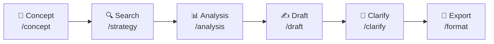
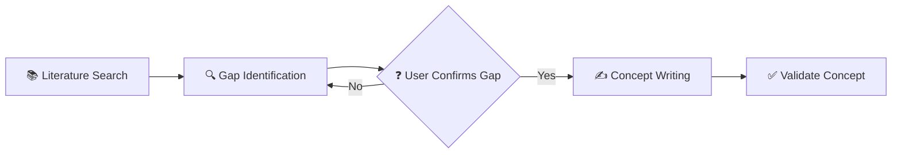
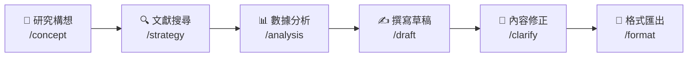
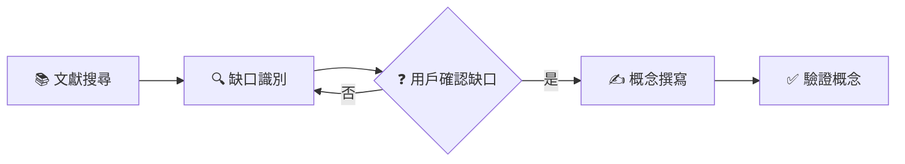

# Medical Paper Assistant 醫學論文寫作助手

[English](#english) | [繁體中文](#繁體中文)

---

<a name="english"></a>
## 🇬🇧 English

### Overview

Medical Paper Assistant is an AI-powered writing tool designed specifically for medical researchers. Built on the **Model Context Protocol (MCP)**, it integrates seamlessly with VS Code through GitHub Copilot, providing a comprehensive workflow from literature search and data analysis to manuscript drafting and formatted export.

### ✨ Key Features

| Feature | Description |
|---------|-------------|
| **Literature Search & Management** | Connect to PubMed API, search articles, download PDFs from PMC Open Access, and build a local reference library |
| **Data Analysis** | Automatically read CSV data, perform statistical tests (t-test, correlation, etc.), and generate publication-ready figures |
| **Smart Draft Generation** | Generate manuscript drafts based on your research concept and analysis results |
| **Automatic Citations** | Insert citation markers \`[1]\` and generate formatted reference lists (Vancouver, APA, Nature styles) |
| **Interactive Refinement** | Fine-tune specific sections through conversational dialogue |
| **Word Export** | Export Markdown drafts to \`.docx\` files conforming to journal templates |

### 🚀 Installation

#### Prerequisites

Before you begin, ensure you have the following installed:

| Requirement | Version | How to Check | Installation Guide |
|-------------|---------|--------------|-------------------|
| **Python** | 3.10 or higher | \`python3 --version\` | [python.org](https://www.python.org/downloads/) |
| **Git** | Any recent version | \`git --version\` | [git-scm.com](https://git-scm.com/) |
| **VS Code** | Latest | Open VS Code → Help → About | [code.visualstudio.com](https://code.visualstudio.com/) |
| **GitHub Copilot** | Extension | VS Code Extensions panel | Search "GitHub Copilot" in Extensions |

#### Quick Installation (Recommended)

**Step 1: Clone the Repository**

Open a terminal and run:

\`\`\`bash
# Navigate to where you want to store the project
cd ~/projects  # or any directory of your choice

# Clone the repository
git clone https://github.com/u9401066/med-paper-assistant.git

# Enter the project directory
cd med-paper-assistant
\`\`\`

**Step 2: Run the Setup Script**

\`\`\`bash
# Make the script executable (Linux/Mac only)
chmod +x scripts/setup.sh

# Run the setup script
./scripts/setup.sh
\`\`\`

This script will:
1. ✅ Create a Python virtual environment (\`.venv/\`)
2. ✅ Install all required dependencies
3. ✅ Create the \`.vscode/mcp.json\` configuration file
4. ✅ Set up the project directory structure

**Step 3: Reload VS Code**

After setup completes:
1. Open VS Code
2. Press \`Ctrl+Shift+P\` (Windows/Linux) or \`Cmd+Shift+P\` (Mac)
3. Type \`Developer: Reload Window\` and press Enter

**Step 4: Verify Installation**

In VS Code's Copilot Chat panel:
1. Type `/mcp` and press Enter
2. You should see `mdpaper (33 tools)` in the list
3. If you see this, the installation was successful! 🎉

#### Manual Installation (If Setup Script Fails)

<details>
<summary>Click to expand manual installation steps</summary>

**Step 1: Clone the Repository**

\`\`\`bash
git clone https://github.com/u9401066/med-paper-assistant.git
cd med-paper-assistant
\`\`\`

**Step 2: Create Virtual Environment**

\`\`\`bash
# Create a virtual environment named .venv
python3 -m venv .venv

# Activate the virtual environment
# On Linux/Mac:
source .venv/bin/activate

# On Windows (Command Prompt):
.venv\Scripts\activate.bat

# On Windows (PowerShell):
.venv\Scripts\Activate.ps1
\`\`\`

> 💡 **What is a virtual environment?**
> A virtual environment is an isolated Python environment that keeps this project's dependencies separate from your system Python. This prevents conflicts with other projects.

**Step 3: Install Dependencies**

\`\`\`bash
# Upgrade pip first (recommended)
pip install --upgrade pip

# Install the project in editable mode
pip install -e .
\`\`\`

**Step 4: Configure VS Code MCP**

Create the file \`.vscode/mcp.json\` in the project root:

\`\`\`bash
# Create .vscode directory if it doesn't exist
mkdir -p .vscode

# Create the mcp.json file
cat > .vscode/mcp.json << 'EOF'
{
  "inputs": [],
  "servers": {
    "mdpaper": {
      "command": "\${workspaceFolder}/.venv/bin/python",
      "args": ["-m", "med_paper_assistant.mcp_server.server"],
      "env": {
        "PYTHONPATH": "\${workspaceFolder}/src"
      }
    }
  }
}
EOF
\`\`\`

> ⚠️ **Windows Users**: Replace \`.venv/bin/python\` with \`.venv\\Scripts\\python.exe\`

**Step 5: Reload VS Code**

Press \`Ctrl+Shift+P\` → Type \`Developer: Reload Window\` → Press Enter

</details>

#### Troubleshooting

<details>
<summary>❌ "Command not found: python3"</summary>

**Problem**: Python is not installed or not in your PATH.

**Solution**:
1. Install Python from [python.org](https://www.python.org/downloads/)
2. During installation, check "Add Python to PATH"
3. Restart your terminal and try again

</details>

<details>
<summary>❌ MCP server not showing in Copilot</summary>

**Problem**: The MCP server is not being detected by VS Code.

**Solutions**:
1. Ensure \`.vscode/mcp.json\` exists and has correct paths
2. Check that the virtual environment was created: \`ls .venv/\`
3. Try reloading VS Code: \`Ctrl+Shift+P\` → \`Developer: Reload Window\`
4. Check VS Code Output panel: \`View\` → \`Output\` → Select "MCP" from dropdown

</details>

<details>
<summary>❌ "ModuleNotFoundError: med_paper_assistant"</summary>

**Problem**: The package is not installed or PYTHONPATH is incorrect.

**Solution**:
\`\`\`bash
# Activate virtual environment first
source .venv/bin/activate  # Linux/Mac
# .venv\Scripts\activate   # Windows

# Reinstall the package
pip install -e .
\`\`\`

</details>

---

### 📖 Usage Guide

This assistant integrates with GitHub Copilot through MCP. Use \`/mcp.mdpaper.*\` commands in Copilot Chat.

#### Workflow Overview



#### Step 1: Prepare Your Data

Before starting, organize your files:

| Directory | Purpose |
|-----------|--------|
| `data/` | Place your CSV research data here |
| `templates/` | (Optional) Journal Word templates |

#### Step 2: Develop Your Research Concept

**Command**: \`/mcp.mdpaper.concept\`

This guided workflow helps you develop a well-structured research concept with **novelty protection**:



**Step-by-step process:**

1. **📚 Literature Search** (Mandatory)
   - Agent searches PubMed for 5-10 relevant studies
   - Key papers are saved to your reference library

2. **🔍 Gap Identification** (Mandatory)
   - Agent presents literature summary
   - Identifies research gaps and limitations
   - **🛑 Asks you to confirm** which gap your research addresses

3. **✍️ Concept Writing** (After your confirmation)
   - Creates structured concept with protected sections:
     - 🔒 **NOVELTY STATEMENT** - What's new (protected)
     - 🔒 **KEY SELLING POINTS** - Your 3-5 key differentiators (protected)
     - 📝 Background, Methods, Expected Outcomes (editable)

4. **✅ Validation**
   - Use `validate_concept` tool to verify completeness

The output is saved to \`drafts/concept_*.md\`.

> 💡 **Why Protected Sections?** The 🔒 markers ensure your key innovations are preserved when writing the full paper. The Agent must ask before modifying these sections.

#### Step 3: Configure Search Strategy

**Command**: \`/mcp.mdpaper.strategy\`

Set up your literature search parameters:
- Keywords and MeSH terms
- Exclusion criteria
- Article types (Review, Clinical Trial, Meta-Analysis)
- Date range
- Minimum sample size

#### Step 4: Analyze Your Data

**Command**: \`/mcp.mdpaper.analysis\`

The assistant will:
1. List available CSV files in \`data/\`
2. Ask you to specify grouping and outcome variables
3. Perform appropriate statistical tests
4. Generate figures (saved to \`results/figures/\`)
5. Create Table 1 (baseline characteristics)

#### Step 5: Write Your Draft

**Command**: \`/mcp.mdpaper.draft\`

The assistant will:
1. Read your \`concept.md\` and analysis results
2. Ask which template to use
3. Generate a Markdown draft with:
   - Embedded figures
   - Automatic citations
   - Formatted tables

> ⚠️ **Important**: This command requires a concept file. Create one using \`/mcp.mdpaper.concept\` first.

#### Step 6: Refine Your Content

**Command**: \`/mcp.mdpaper.clarify\`

Interactively improve specific sections:
- "Make the Introduction more conservative"
- "Expand the limitations section"
- "Simplify the statistical methods description"

#### Step 7: Export to Word

**Command**: `/mcp.mdpaper.format`

This follows a 7-step workflow:
1. Read template structure
2. Read draft content
3. Map sections
4. Insert content
5. Verify document
6. Check word limits
7. Save final document

Output: `results/your_paper.docx`

---

### 📂 Project Structure

| Directory | Purpose |
|-----------|--------|
| `data/` | Raw data files (CSV) |
| `results/figures/` | Generated plots |
| `results/tables/` | Generated tables |
| `drafts/` | Markdown drafts |
| `references/{PMID}/` | Local reference library |
| └ `metadata.json` | Citation info, formatted references |
| └ `content.md` | Abstract and notes |
| └ `fulltext.pdf` | PDF (if available from PMC) |
| `templates/` | Journal Word templates (`.docx` for export) |
| `src/med_paper_assistant/core/` | Core logic modules |
| `src/med_paper_assistant/mcp_server/` | MCP server implementation |
| └ `templates/` | Internal templates for Agent guidance (`.md`) |
| `tests/` | Test suite |
| `.memory/` | Project context files |
| └ `.agent_constitution.md` | **Agent behavior rules (dynamically loaded)** |

---

### ⚖️ Agent Constitution

The MCP server dynamically loads the Agent Constitution from `.memory/.agent_constitution.md`. This file defines the core behavior rules that Copilot must follow.

**Default Constitution:**
```markdown
# Agent Constitution

## Core Directives
1. **Language**: Communicate in Traditional Chinese (繁體中文)
2. **Memory Bank Maintenance**: Read/update Memory files at task start/end
3. **Code Quality**: Write clean, documented, efficient code
4. **User Privacy**: Do not store sensitive information

## Interaction Guidelines
- Be helpful and proactive
- Clarify ambiguous requests
- Provide step-by-step explanations
```

**To customize:** Edit `.memory/.agent_constitution.md` and reload VS Code. The new rules will be automatically applied.

---

### 🛠️ Available Tools (33 Total)

| Category | Tools | Description |
|----------|-------|-------------|
| **Search** (5) | `search_literature`, `find_related_articles`, `find_citing_articles`, `configure_search_strategy`, `get_search_strategy` | Literature discovery |
| **Reference** (8) | `save_reference`, `list_saved_references`, `search_local_references`, `get_reference_details`, `read_reference_fulltext`, `retry_pdf_download`, `format_references`, `set_citation_style` | Reference management |
| **Writing** (8) | `write_draft`, `read_draft`, `list_drafts`, `insert_citation`, `draft_section`, `get_section_template`, `count_words`, `validate_concept` | Manuscript preparation |
| **Analysis** (4) | `analyze_dataset`, `run_statistical_test`, `create_plot`, `generate_table_one` | Data analysis |
| **Export** (8) | `read_template`, `list_templates`, `start_document_session`, `insert_section`, `verify_document`, `check_word_limits`, `save_document`, `export_word` | Document export |

---

### 🧪 Development & Testing

\`\`\`bash
# Activate virtual environment
source .venv/bin/activate

# Run all tests
pytest tests/

# Run specific test file
pytest tests/test_search.py

# Run with verbose output
pytest tests/ -v
\`\`\`

---

### 📄 License

This project is licensed under the MIT License. See [LICENSE](LICENSE) for details.

---

<a name="繁體中文"></a>
## 🇹🇼 繁體中文

### 概述

Medical Paper Assistant（醫學論文寫作助手）是一款專為醫學研究人員設計的 AI 輔助寫作工具。基於 **Model Context Protocol (MCP)** 架構，可與 VS Code 的 GitHub Copilot 無縫整合，提供從文獻檢索、數據分析、草稿生成到格式化輸出的完整工作流程。

### ✨ 主要功能

| 功能 | 說明 |
|------|------|
| **文獻檢索與管理** | 連接 PubMed API 搜尋文獻，從 PMC Open Access 下載 PDF，建立本地文獻庫 |
| **數據分析** | 自動讀取 CSV 數據，執行統計檢定（t-test、相關性分析等），生成出版品質的圖表 |
| **智慧草稿生成** | 根據您的研究構想與分析結果，自動生成論文草稿 |
| **自動引用** | 插入引用標記 \`[1]\` 並生成格式化的參考文獻列表（支援 Vancouver、APA、Nature 格式）|
| **互動式修正** | 透過對話方式微調特定段落 |
| **Word 匯出** | 將 Markdown 草稿匯出為符合期刊格式的 \`.docx\` 檔案 |

### 🚀 安裝指南

#### 系統需求

開始之前，請確認您已安裝以下軟體：

| 需求 | 版本 | 檢查方式 | 安裝指南 |
|------|------|----------|----------|
| **Python** | 3.10 或更高 | 終端機輸入 \`python3 --version\` | [python.org](https://www.python.org/downloads/) |
| **Git** | 任何近期版本 | 終端機輸入 \`git --version\` | [git-scm.com](https://git-scm.com/) |
| **VS Code** | 最新版 | 開啟 VS Code → 說明 → 關於 | [code.visualstudio.com](https://code.visualstudio.com/) |
| **GitHub Copilot** | 擴充功能 | VS Code 擴充功能面板 | 在擴充功能中搜尋 "GitHub Copilot" |

#### 快速安裝（推薦）

**步驟 1：複製專案**

開啟終端機並執行：

\`\`\`bash
# 切換到您想存放專案的目錄
cd ~/projects  # 或任何您選擇的目錄

# 複製專案
git clone https://github.com/u9401066/med-paper-assistant.git

# 進入專案目錄
cd med-paper-assistant
\`\`\`

> 💡 **什麼是 \`git clone\`？**
> \`git clone\` 會從 GitHub 下載完整的專案副本到您的電腦。這包含所有程式碼、歷史記錄和分支。

**步驟 2：執行安裝腳本**

\`\`\`bash
# 給予腳本執行權限（僅 Linux/Mac 需要）
chmod +x scripts/setup.sh

# 執行安裝腳本
./scripts/setup.sh
\`\`\`

這個腳本會自動完成：
1. ✅ 建立 Python 虛擬環境（\`.venv/\`）
2. ✅ 安裝所有必要的套件
3. ✅ 建立 \`.vscode/mcp.json\` 設定檔
4. ✅ 設定專案目錄結構

> 💡 **什麼是虛擬環境？**
> 虛擬環境是一個隔離的 Python 環境，讓這個專案的套件與系統的 Python 分開。這樣可以避免與其他專案產生衝突。

**步驟 3：重新載入 VS Code**

安裝完成後：
1. 開啟 VS Code
2. 按下 \`Ctrl+Shift+P\`（Windows/Linux）或 \`Cmd+Shift+P\`（Mac）
3. 輸入 \`Developer: Reload Window\` 並按 Enter

> 💡 **為什麼要重新載入？**
> VS Code 需要重新讀取 \`.vscode/mcp.json\` 設定檔才能啟動 MCP 伺服器。

**步驟 4：驗證安裝**

在 VS Code 的 Copilot Chat 面板中：
1. 輸入 `/mcp` 並按 Enter
2. 您應該會看到列表中有 `mdpaper (33 tools)`
3. 如果看到這個，表示安裝成功！🎉

#### 手動安裝（如果腳本失敗）

<details>
<summary>點擊展開手動安裝步驟</summary>

**步驟 1：複製專案**

\`\`\`bash
git clone https://github.com/u9401066/med-paper-assistant.git
cd med-paper-assistant
\`\`\`

**步驟 2：建立虛擬環境**

\`\`\`bash
# 建立名為 .venv 的虛擬環境
python3 -m venv .venv

# 啟動虛擬環境
# Linux/Mac：
source .venv/bin/activate

# Windows（命令提示字元）：
.venv\Scripts\activate.bat

# Windows（PowerShell）：
.venv\Scripts\Activate.ps1
\`\`\`

> 💡 **如何確認虛擬環境已啟動？**
> 啟動後，您的終端機提示符前面會出現 \`(.venv)\`，例如：
> \`\`\`
> (.venv) user@computer:~/med-paper-assistant$
> \`\`\`

**步驟 3：安裝套件**

\`\`\`bash
# 先更新 pip（建議）
pip install --upgrade pip

# 以可編輯模式安裝專案
pip install -e .
\`\`\`

> 💡 **什麼是 \`pip install -e .\`？**
> \`-e\` 代表「可編輯模式」（editable mode），這表示當您修改程式碼時，不需要重新安裝就能看到變更。\`.\` 代表當前目錄。

**步驟 4：設定 VS Code MCP**

在專案根目錄建立 \`.vscode/mcp.json\` 檔案：

\`\`\`bash
# 建立 .vscode 目錄（如果不存在）
mkdir -p .vscode

# 建立 mcp.json 檔案
cat > .vscode/mcp.json << 'EOF'
{
  "inputs": [],
  "servers": {
    "mdpaper": {
      "command": "\${workspaceFolder}/.venv/bin/python",
      "args": ["-m", "med_paper_assistant.mcp_server.server"],
      "env": {
        "PYTHONPATH": "\${workspaceFolder}/src"
      }
    }
  }
}
EOF
\`\`\`

> ⚠️ **Windows 使用者注意**：請將 \`.venv/bin/python\` 改為 \`.venv\\Scripts\\python.exe\`

**步驟 5：重新載入 VS Code**

按下 \`Ctrl+Shift+P\` → 輸入 \`Developer: Reload Window\` → 按 Enter

</details>

#### 疑難排解

<details>
<summary>❌ 「找不到命令：python3」</summary>

**問題**：Python 未安裝或不在系統 PATH 中。

**解決方案**：
1. 從 [python.org](https://www.python.org/downloads/) 下載並安裝 Python
2. 安裝時，務必勾選「Add Python to PATH」選項
3. 重新啟動終端機後再試一次

</details>

<details>
<summary>❌ Copilot 中看不到 MCP 伺服器</summary>

**問題**：VS Code 無法偵測到 MCP 伺服器。

**解決方案**：
1. 確認 \`.vscode/mcp.json\` 檔案存在且路徑正確
2. 確認虛擬環境已建立：執行 \`ls .venv/\`
3. 嘗試重新載入 VS Code：\`Ctrl+Shift+P\` → \`Developer: Reload Window\`
4. 檢查 VS Code 輸出面板：\`檢視\` → \`輸出\` → 從下拉選單選擇「MCP」

</details>

<details>
<summary>❌ 「ModuleNotFoundError: med_paper_assistant」</summary>

**問題**：套件未安裝或 PYTHONPATH 設定錯誤。

**解決方案**：
\`\`\`bash
# 先啟動虛擬環境
source .venv/bin/activate  # Linux/Mac
# .venv\Scripts\activate   # Windows

# 重新安裝套件
pip install -e .
\`\`\`

</details>

---

### 📖 使用指南

本助手透過 MCP 與 GitHub Copilot 整合。在 Copilot Chat 中使用 \`/mcp.mdpaper.*\` 指令。

#### 工作流程概覽



#### 步驟 1：準備您的資料

開始之前，請整理您的檔案：

| 目錄 | 用途 |
|------|------|
| `data/` | 將您的 CSV 研究數據放在這裡 |
| `templates/` | （選用）期刊 Word 範本 |

#### 步驟 2：發展研究構想

**指令**：\`/mcp.mdpaper.concept\`

這個引導式流程會幫助您建構具有**創新性保護**的結構化研究構想：



**逐步流程：**

1. **📚 文獻搜尋**（強制）
   - Agent 搜尋 PubMed 找出 5-10 篇相關研究
   - 重要文獻自動儲存到參考文獻庫

2. **🔍 缺口識別**（強制）
   - Agent 呈現文獻摘要
   - 識別研究缺口與限制
   - **🛑 詢問您確認**您的研究要解決哪個缺口

3. **✍️ 概念撰寫**（用戶確認後）
   - 建立具有保護區塊的結構化概念：
     - 🔒 **NOVELTY STATEMENT** - 創新性聲明（受保護）
     - 🔒 **KEY SELLING POINTS** - 您的 3-5 個核心賣點（受保護）
     - 📝 背景、方法、預期結果（可編輯）

4. **✅ 驗證**
   - 使用 `validate_concept` 工具驗證完整性

輸出會儲存到 \`drafts/concept_*.md\`。

> 💡 **為什麼需要受保護區塊？** 🔒 標記確保您的關鍵創新點在撰寫完整論文時被保留。Agent 必須在修改這些區塊前先詢問您。

#### 步驟 3：設定搜尋策略

**指令**：\`/mcp.mdpaper.strategy\`

設定文獻搜尋參數：
- 關鍵字與 MeSH 術語
- 排除條件
- 文章類型（Review、Clinical Trial、Meta-Analysis）
- 日期範圍
- 最小樣本數

#### 步驟 4：分析數據

**指令**：\`/mcp.mdpaper.analysis\`

助手會：
1. 列出 \`data/\` 中可用的 CSV 檔案
2. 詢問您指定分組變數與結果變數
3. 執行適當的統計檢定
4. 生成圖表（儲存到 \`results/figures/\`）
5. 建立 Table 1（基線特徵表）

#### 步驟 5：撰寫草稿

**指令**：\`/mcp.mdpaper.draft\`

助手會：
1. 讀取您的 \`concept.md\` 和分析結果
2. 詢問使用哪個範本
3. 生成 Markdown 草稿，包含：
   - 嵌入的圖表
   - 自動引用
   - 格式化的表格

> ⚠️ **重要提示**：此指令需要 concept 檔案。請先使用 \`/mcp.mdpaper.concept\` 建立。

#### 步驟 6：修正內容

**指令**：\`/mcp.mdpaper.clarify\`

互動式改善特定段落：
- 「讓 Introduction 寫得更保守一點」
- 「擴充 limitations 段落」
- 「簡化統計方法的描述」

#### 步驟 7：匯出到 Word

**指令**：`/mcp.mdpaper.format`

依照 7 步驟流程：
1. 讀取範本結構
2. 讀取草稿內容
3. 對應章節
4. 插入內容
5. 驗證文件
6. 檢查字數限制
7. 儲存最終文件

輸出：`results/your_paper.docx`

---

### 📂 專案結構

| 目錄 | 用途 |
|------|------|
| `data/` | 原始資料檔案（CSV） |
| `results/figures/` | 生成的圖表 |
| `results/tables/` | 生成的表格 |
| `drafts/` | Markdown 草稿 |
| `references/{PMID}/` | 本地文獻庫 |
| └ `metadata.json` | 引用資訊、格式化的參考文獻 |
| └ `content.md` | 摘要與筆記 |
| └ `fulltext.pdf` | PDF（若可從 PMC 取得） |
| `templates/` | 期刊 Word 範本（`.docx` 用於匯出） |
| `src/med_paper_assistant/core/` | 核心邏輯模組 |
| `src/med_paper_assistant/mcp_server/` | MCP 伺服器實作 |
| └ `templates/` | Agent 引導用內部範本（`.md`） |
| `tests/` | 測試套件 |
| `.memory/` | 專案脈絡檔案 |
| └ `.agent_constitution.md` | **Agent 行為規則（動態載入）** |

---

### ⚖️ Agent 憲法

MCP 伺服器會動態載入 `.memory/.agent_constitution.md` 中的 Agent 憲法。此檔案定義 Copilot 必須遵循的核心行為規則。

**預設憲法：**
```markdown
# Agent Constitution

## Core Directives
1. **Language**: 使用繁體中文溝通
2. **Memory Bank Maintenance**: 在任務開始/結束時讀取/更新 Memory 檔案
3. **Code Quality**: 撰寫乾淨、有文件、高效的程式碼
4. **User Privacy**: 不儲存敏感資訊

## Interaction Guidelines
- 主動提供幫助
- 澄清模糊的請求
- 提供逐步說明
```

**自訂方式：** 編輯 `.memory/.agent_constitution.md` 並重新載入 VS Code，新規則將自動套用。

---

### 🛠️ 可用工具（共 33 個）

| 類別 | 工具 | 說明 |
|------|------|------|
| **搜尋** (5) | `search_literature`, `find_related_articles`, `find_citing_articles`, `configure_search_strategy`, `get_search_strategy` | 文獻探索 |
| **參考文獻** (8) | `save_reference`, `list_saved_references`, `search_local_references`, `get_reference_details`, `read_reference_fulltext`, `retry_pdf_download`, `format_references`, `set_citation_style` | 參考文獻管理 |
| **寫作** (8) | `write_draft`, `read_draft`, `list_drafts`, `insert_citation`, `draft_section`, `get_section_template`, `count_words`, `validate_concept` | 草稿準備 |
| **分析** (4) | `analyze_dataset`, `run_statistical_test`, `create_plot`, `generate_table_one` | 數據分析 |
| **匯出** (8) | `read_template`, `list_templates`, `start_document_session`, `insert_section`, `verify_document`, `check_word_limits`, `save_document`, `export_word` | 文件匯出 |

---

### 🧪 開發與測試

\`\`\`bash
# 啟動虛擬環境
source .venv/bin/activate

# 執行所有測試
pytest tests/

# 執行特定測試檔案
pytest tests/test_search.py

# 顯示詳細輸出
pytest tests/ -v
\`\`\`

---

### 📄 授權

本專案採用 MIT 授權。詳見 [LICENSE](LICENSE) 檔案。

---

## 🤝 Contributing 貢獻

Contributions are welcome! Please see [CONTRIBUTING.md](CONTRIBUTING.md) for guidelines.

歡迎貢獻！請參閱 [CONTRIBUTING.md](CONTRIBUTING.md) 了解貢獻指南。
