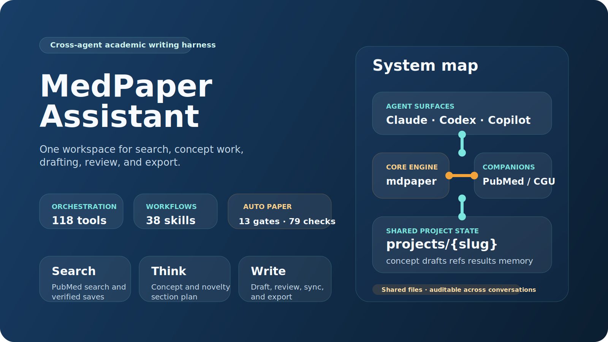
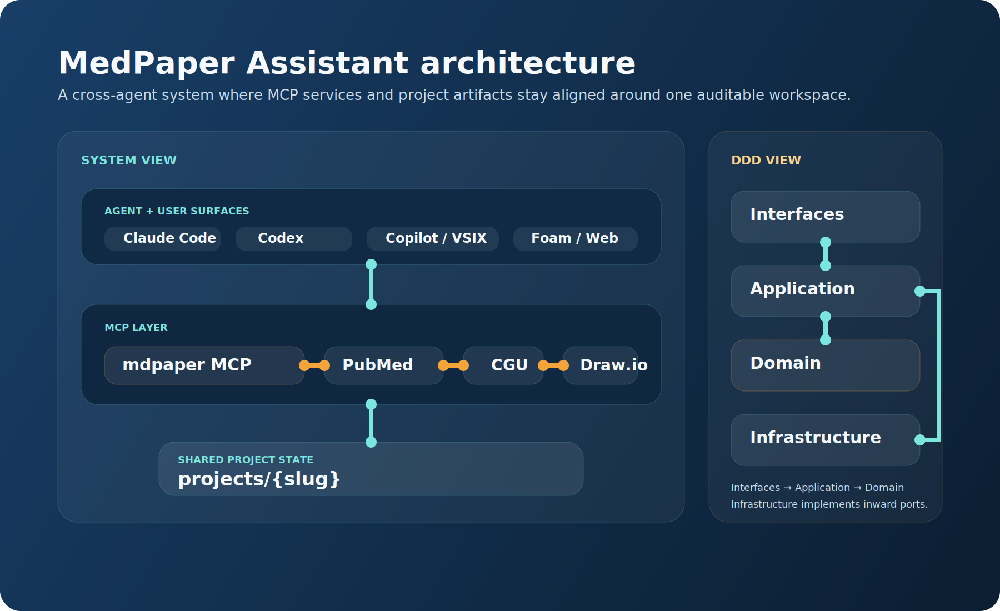

# Medical Paper Assistant

[](https://www.python.org/downloads/)
[](https://modelcontextprotocol.io/)
[](https://github.com/features/copilot)
[](https://github.com/u9401066/med-paper-assistant)


## 🔬 An Integrated AI Toolkit for Medical Paper Writing and LLM Wiki Workflows

3 MCP Servers · 165+ Tools · 26 Skills · 15 Prompts Workflows — All in VS Code

> 📖 [繁體中文版](README.zh-TW.md)
> 🤖 **[Auto-Paper: Fully Autonomous Paper Writing Guide](docs/auto-paper-guide.md)** — 11-Phase Pipeline, 78 Quality Hooks, Structured Review Loop



---

## 📦 What's in the Box

This is a **monorepo toolkit** that bundles everything a medical researcher needs — from literature search to Word/LaTeX export — into one integrated VS Code environment.

| Component                                                          | Type                   | Tools                            | Description                                                                                   |
| ------------------------------------------------------------------ | ---------------------- | -------------------------------- | --------------------------------------------------------------------------------------------- |
| **mdpaper**                                                        | Core MCP Server        | 115 (full) / 21 (compact default) | Dual workflow server for manuscript and library-wiki paths, plus 3 MCP prompts and 3 MCP resources |
| **[pubmed-search](https://github.com/u9401066/pubmed-search-mcp)** | MCP Server (submodule) | 37                               | PubMed/Europe PMC/CORE search, PICO, citation metrics, session mgmt                           |
| **[CGU](https://github.com/u9401066/creativity-generation-unit)**  | MCP Server (submodule) | 13                               | Creative generation: brainstorm, deep think, spark collision                                  |
| **[VS Code Extension](vscode-extension/)**                         | Extension              | 10 cmds + 10 chat                | MCP auto-registration, workspace setup, LLM wiki guide, Foam graph views, `@mdpaper` chat participant |
| **[Dashboard](dashboard/)**                                        | Next.js Web App        | —                                | Project management UI, diagram editor                                                         |
| **[Foam](https://foambubble.github.io/foam/)**                     | VS Code Extension      | —                                | `[[wikilink]]` citation linking, hover preview, graph view                                    |
| **[Skills](.claude/skills/)**                                      | Agent Workflows        | 26                               | Guided multi-tool workflows (literature review, draft writing...)                             |
| **[Prompts](.github/prompts/)**                                    | Prompt Files           | 15                               | `/mdpaper.search`, `/mdpaper.draft`, etc.                                                     |

**External MCP Servers** (optional, installed via uvx):

- **drawio** — CONSORT/PRISMA flowchart generation
- **zotero-keeper** — Import references from Zotero library

**VSX note**: The MedPaper VS Code extension installs Python MCP tools persistently per machine via `uv tool install`, attempts `uv tool upgrade` on later activations, and skips duplicate PubMed Search / Zotero Keeper registration when another installed VS Code extension already provides those MCP servers. CI smoke now covers `ubuntu-latest`, `windows-latest`, `macos-13`, and `macos-14`, including official MCP client checks plus VSX validation smoke.

### How the Pieces Fit Together



---

## 🎯 Why This Tool?

**Traditional paper writing tools** require you to know exactly what you want before you start. But research is rarely that linear.

**Medical Paper Assistant** is different:

- 🔍 **Explore First, Decide Later** — Browse literature freely, save interesting papers, then decide your research direction
- 💬 **Conversational Workflow** — Chat naturally with AI to refine your ideas, not fight with forms
- 🧭 **Guided Process** — Step-by-step prompts guide you from concept to publication-ready manuscript
- 🔗 **All-in-One** — Search, write, cite, analyze, export — all integrated inside VS Code

| Traditional Tools                   | Medical Paper Assistant                |
| ----------------------------------- | -------------------------------------- |
| Fixed templates, rigid workflow     | Flexible, exploratory approach         |
| Separate apps for search/write/cite | All-in-one: 165+ tools in VS Code      |
| Manual reference management         | Auto-save with verified PubMed data    |
| Export then format                  | Direct Word export with journal styles |
| Learn complex UI                    | Natural language conversation          |

---

## 🚀 Quick Start

### Prerequisites

| Requirement        | Version    | Check               |
| ------------------ | ---------- | ------------------- |
| **Python**         | 3.12+      | `python3 --version` |
| **Git**            | Any recent | `git --version`     |
| **VS Code**        | Latest     | Help → About        |
| **GitHub Copilot** | Extension  | Extensions panel    |

### Install

```bash
# Clone with submodules
git clone --recursive https://github.com/u9401066/med-paper-assistant.git
cd med-paper-assistant

# Run setup script
./scripts/setup.sh          # Linux/macOS
.\scripts\setup.ps1         # Windows PowerShell
```

The script will:

1. ✅ Create Python virtual environment (`.venv/`)
2. ✅ Initialize pinned Git submodules from this repository
3. ✅ Install all dependencies (via `uv`)
4. ✅ Create `.vscode/mcp.json` configuration for `mdpaper`, `pubmed-search`, `cgu`, `zotero-keeper`, `asset-aware`, and `drawio`
5. ✅ Verify MedPaper and CGU startup paths

Important installation notes:

- The setup script uses pinned submodule commits for reproducible installs. It does not auto-track the latest upstream submodule HEAD.
- If you intentionally want newer submodule code, run `git submodule update --remote --merge` yourself and test before committing.
- `drawio` uses `npx -y @drawio/mcp`, so Node.js/npm must be available on the machine.
- `zotero-keeper` and `pubmed-search` are launched via `uvx` in the repo workflow. In the VSX workflow they may be provided either by MedPaper itself or by separate installed VS Code extensions.

**Verify**: In Copilot Chat, type `/mcp` — you should see `mdpaper` listed 🎉

### Optional Integrations

```bash
# Foam for reference linking (highly recommended)
code --install-extension foam.foam-vscode

# Draw.io for diagram generation
./scripts/setup-integrations.sh && ./scripts/start-drawio.sh
```

Windows PowerShell:

```powershell
.\scripts\setup-integrations.ps1
.\scripts\start-drawio.ps1
```

---

## 💬 MCP Prompts — Just Type and Go

In Copilot Chat, type these prompts to trigger guided workflows:

| Prompt              | Description                                         |
| ------------------- | --------------------------------------------------- |
| `/mdpaper.search`   | 🔍 **Start here!** Explore literature, save papers  |
| `/mdpaper.concept`  | 📝 Develop research concept with novelty validation |
| `/mdpaper.draft`    | ✍️ Write manuscript with auto-citations             |
| `/mdpaper.analysis` | 📊 Analyze CSV data, generate figures & Table 1     |
| `/mdpaper.format`   | 📄 Export to Word with journal formatting           |
| `/mdpaper.clarify`  | 🔄 Refine specific sections through conversation    |
| `/mdpaper.project`  | 📁 Create or switch research projects               |
| `/mdpaper.strategy` | ⚙️ Configure search strategy (dates, filters)       |
| `/mdpaper.help`     | ❓ Show all available commands                      |

### Two Workflow Paths

**Library Wiki Path**

- Create a project with `workflow_mode="library-wiki"`
- Move through `search/save_reference_mcp` → `write_library_note` / `move_library_note` → `show_reading_queues` / `build_library_dashboard`
- Use `materialize_agent_wiki`, Foam graph views, and `docs/how-to/llm-wiki.md` for cross-note synthesis and traversal

**Manuscript Path**

- Create a project with `workflow_mode="manuscript"`
- Move through `/mdpaper.search` → `/mdpaper.concept` → `/mdpaper.draft` → `/mdpaper.format`
- Only this path enforces concept validation, review loops, and export gates

> 💡 **Recommended usage**: converge your literature and concepts in Library Wiki Path first, then switch to Manuscript Path for formal drafting.

---

## 🧠 Skill System + Project Memory

**Our core differentiator:** We don't just provide tools — we provide **guided workflows** that know how to combine tools effectively, AND **project memory** that remembers your research journey across sessions.

### What is a Skill?

```text
Tool  = Single capability (search, save, analyze...)
Skill = Complete knowledge (how to combine tools to accomplish tasks)
```

**26 Skills** covering the full research lifecycle:

| Category       | Skills                                                                              | Triggers                                  |
| -------------- | ----------------------------------------------------------------------------------- | ----------------------------------------- |
| 🔬 Research    | `literature-review`, `concept-development`, `concept-validation`, `parallel-search` | "找論文", "search", "concept", "validate" |
| ✍️ Writing     | `draft-writing`, `reference-management`, `word-export`                              | "寫草稿", "draft", "citation", "export"   |
| 📁 Management  | `project-management`, `memory-updater`, `memory-checkpoint`                         | "新專案", "切換", "存檔"                  |
| 🛠️ Development | `git-precommit`, `code-refactor`, `test-generator`, `code-reviewer`                 | "commit", "refactor", "test"              |

### Project Memory

Each project maintains its own `.memory/` folder so the AI can continue previous research coherently. The directory layout now splits by workflow mode:

**Manuscript Path**

```text
projects/{slug}/
├── .memory/
│   ├── activeContext.md   ← Agent's working memory
│   └── progress.md        ← Research milestones
├── concept.md             ← Research concept (with 🔒 protected sections)
├── references/            ← Foam-compatible literature library
├── drafts/                ← Markdown drafts with [[citations]]
├── data/                  ← CSV data files
└── results/               ← Figures, .docx exports
```

**Library Wiki Path**

```text
projects/{slug}/
├── .memory/
│   ├── activeContext.md   ← Current library/wiki focus and triage state
│   └── progress.md        ← ingest / organize / synthesize milestones
├── concept.md             ← library workspace seed
├── references/            ← materialized reference notes
├── inbox/                 ← raw notes and capture queue
├── concepts/              ← atomic concept pages and backlinks
└── projects/              ← synthesis pages / workstreams
```

---

## ✨ Key Features

### Literature & References

- **PubMed + Europe PMC + CORE** search (37 search tools)
- **PICO parsing** for clinical questions
- **MCP-to-MCP verified data** — PMID sent directly, no agent hallucination
- Layered trust: 🔒 VERIFIED (PubMed) · 🤖 AGENT (AI notes) · ✏️ USER (your notes)
- Foam wikilinks: `[[author2024_12345678]]` with hover preview & backlinks
- **Library Wiki Path** — `inbox/`, `concepts/`, and `projects/` note flow with reading queues and cross-note dashboards
- **LLM wiki materialization** — auto-generated `notes/index.md`, `notes/library/overview.md`, context hubs, and draft / figure / table graph notes

### Writing & Editing

- **AI draft generation** per section (Introduction, Methods, Results, Discussion)
- **Citation-Aware Editing** — `patch_draft` validates all `[[wikilinks]]` before saving
- **Auto-fix citation format** — `[[12345678]]` → `[[author2024_12345678]]`
- **Novelty validation** — 3-round independent scoring (threshold: 75/100)
- **Anti-AI writing rules** — Evidence funnel structure, no clichés

### Data Analysis

- CSV dataset analysis with descriptive statistics
- Statistical tests (t-test, ANOVA, chi², correlation, Mann-Whitney, Fisher's)
- **Table 1 generator** — Baseline characteristics with automatic variable detection
- Publication-ready figures (matplotlib/seaborn)

### Export & Submission

- **Word export** with journal template support
- Cover letter + highlights generation
- Manuscript consistency checker
- Reviewer response generator (point-by-point format)
- Submission checklist (word count, figure format, etc.)

### Infrastructure

- **DDD Architecture** (Domain-Driven Design) with clean layer separation
- **16 pre-commit hooks** (ruff, mypy, bandit, pytest, prettier, doc-update...)
- **Workspace State** recovery for cross-session continuity
- **uv** for all Python package management
- **MCP SDK features in active use** — tools, elicitation, and progress notifications for long-running audit/review operations
- **Managed Foam graph views** — named Default, Evidence, Writing, Assets, and Review graph slices

---

## 🏗️ Architecture

```text
┌──────────────────────────────────────────────────────────────────────────┐
│                          👤 User Layer                                    │
│  ┌─────────────────┐    ┌──────────────────────────────┐  ┌──────────┐  │
│  │   VS Code        │    │  Foam Extension               │  │Dashboard │  │
│  │   Editor         │    │  [[wikilinks]] autocomplete    │  │(Next.js) │  │
│  │                  │    │  hover preview · backlinks     │  │          │  │
│  └─────────────────┘    └──────────────────────────────┘  └──────────┘  │
└──────────────────────────────────────────────────────────────────────────┘
                                    │
                                    ▼
┌──────────────────────────────────────────────────────────────────────────┐
│               🤖 Copilot Agent (Orchestrator)                             │
│      26 Skills + 15 Prompt Workflows + Agent Customization               │
│   /mdpaper.search → /mdpaper.concept → /mdpaper.draft → export          │
└───────┬──────────────────┬──────────────────┬──────────────────┬─────────┘
        │                  │                  │                  │
        ▼                  ▼                  ▼                  ▼
┌───────────────┐  ┌───────────────┐  ┌───────────────┐  ┌───────────────┐
│ 📝 mdpaper    │  │🔍 pubmed-     │  │💡 cgu         │  │🔌 External    │
│  94/44 tools  │  │  search       │  │  13 tools     │  │   MCPs (uvx)  │
│               │  │  37 tools     │  │               │  │               │
│ • projects    │  │ • PubMed      │  │ • brainstorm  │  │ 🎨 drawio     │
│ • references  │  │ • Europe PMC  │  │ • deep_think  │  │ • diagrams    │
│ • drafts      │  │ • CORE        │  │ • spark       │  │               │
│ • validation  │  │ • PICO        │  │ • methods     │  │ 📖 zotero     │
│ • analysis    │  │ • Gene/Chem   │  │               │  │ • import refs │
│ • export      │  │ • Session     │  │               │  │               │
└───────┬───────┘  └───────────────┘  └───────────────┘  └───────────────┘
        │
        ▼
┌──────────────────────────────────────────────────────────────────────────┐
│                          💾 Local Storage                                 │
│  projects/{slug}/                                                        │
│  ├── concept.md          ← Research concept with 🔒 protected sections   │
│  ├── references/{pmid}/  ← Foam-compatible .md + metadata.json           │
│  ├── drafts/             ← Markdown drafts with [[citations]]            │
│  ├── data/               ← CSV data files                                │
│  └── results/            ← Figures, .docx exports                        │
└──────────────────────────────────────────────────────────────────────────┘
```

### MCP-to-MCP Direct Communication

When saving references, data flows directly between MCP servers — the Agent only passes a PMID, never full metadata:

```text
Agent: "save PMID:24891204"
     │
     ▼
mdpaper.save_reference_mcp(pmid="24891204")
     │  Direct HTTP call (not through Agent)
     ▼
pubmed-search: GET /api/cached_article/24891204
     │  Returns verified PubMed data
     ▼
Saved with layered trust:
  🔒 VERIFIED: PubMed data (immutable)
  🤖 AGENT:    AI notes (marked source)
  ✏️ USER:     Your notes (editable)
```

---

## 🛠️ mdpaper MCP Tools

**94 tools (full surface) / 44 tools (compact default)**, plus **3 MCP prompts** and **3 MCP resources** for official MCP clients.

Compact mode keeps the main facade entrypoints (project/workspace/review/pipeline/export) and hides most granular public verbs; set `MEDPAPER_TOOL_SURFACE=full` to expose the complete surface.

The seven sections below describe the 88 granular domain tools. The remaining six full-surface entrypoints are the facade verbs (`project_action`, `workspace_state_action`, `run_quality_checks`, `pipeline_action`, `export_document`, `inspect_export`).

### 📁 Project Management (17 tools)

Projects, exploration mode, workspace state recovery, diagram management.

| Key Tools                                              | Description                          |
| ------------------------------------------------------ | ------------------------------------ |
| `create_project` / `switch_project` / `delete_project` | Project lifecycle                    |
| `start_exploration` / `convert_exploration_to_project` | Explore-first workflow               |
| `get_workspace_state` / `sync_workspace_state`         | Cross-session recovery               |
| `save_diagram` / `list_diagrams`                       | Draw.io integration                  |
| `setup_project_interactive`                            | Interactive paper type configuration |
| `update_authors`                                       | Manage structured author metadata    |

### 📚 Reference Management (12 tools)

Save, search, format, and manage references with Foam integration.

| Key Tools                                           | Description                                                   |
| --------------------------------------------------- | ------------------------------------------------------------- |
| `save_reference_mcp`                                | **Recommended** — Save by PMID via MCP-to-MCP (verified data) |
| `list_saved_references` / `search_local_references` | Browse & search library                                       |
| `format_references` / `set_citation_style`          | Vancouver / APA / Nature                                      |
| `sync_references`                                   | Sync `[[wikilinks]]` to numbered references                   |

### ✍️ Draft & Editing (13 tools)

Write, edit, cite — with built-in validation.

| Key Tools                                     | Description                                              |
| --------------------------------------------- | -------------------------------------------------------- |
| `draft_section` / `write_draft`               | Create and write sections                                |
| `list_drafts` / `read_draft` / `delete_draft` | Draft lifecycle                                          |
| `get_available_citations`                     | List all valid `[[citation_key]]` before editing         |
| `patch_draft`                                 | **Citation-aware** partial edit with wikilink validation |
| `insert_citation` / `suggest_citations`       | Smart citation insertion                                 |
| `scan_draft_citations` / `sync_references`    | Citation management                                      |
| `count_words`                                 | Section and manuscript word-count checks                 |

### ✅ Validation (3 tools)

| Tool                      | Description                                         |
| ------------------------- | --------------------------------------------------- |
| `validate_concept`        | Full novelty scoring against the active concept     |
| `validate_wikilinks`      | Auto-fix `[[12345678]]` → `[[author2024_12345678]]` |
| `compare_with_literature` | Compare the current idea against saved references   |

### 📊 Data Analysis (10 tools)

| Tool                   | Description                                           |
| ---------------------- | ----------------------------------------------------- |
| `analyze_dataset`      | Descriptive statistics for CSV                        |
| `run_statistical_test` | t-test, ANOVA, chi², correlation, etc.                |
| `generate_table_one`   | Baseline characteristics with auto variable detection |
| `create_plot`          | Publication-ready figures                             |
| `insert_figure`        | Insert figure into draft with archive validation      |
| `insert_table`         | Insert table into draft with archive validation       |
| `list_assets`          | List figures and tables in project results            |

### 🔍 Review & Audit (23 tools)

| Category               | Key Tools                                                                 |
| ---------------------- | ------------------------------------------------------------------------- |
| **Pipeline Gates**     | `validate_phase_gate`, `pipeline_heartbeat`, `validate_project_structure` |
| **Review Loop**        | `start_review_round`, `submit_review_round`, `request_section_rewrite`    |
| **Pipeline Control**   | `pause_pipeline`, `resume_pipeline`, `approve_section`                    |
| **Audit & Hooks**      | `run_quality_audit`, `run_writing_hooks`, `record_hook_event`             |
| **Self-Evolution**     | `run_meta_learning`, `verify_evolution`, `apply_pending_evolutions`       |
| **Domain Constraints** | `check_domain_constraints`, `evolve_constraint`                           |
| **Data & Health**      | `validate_data_artifacts`, `diagnose_tool_health`, `check_formatting`     |

### 📄 Export & Submission (10 tools)

| Category          | Key Tools                                                                    |
| ----------------- | ---------------------------------------------------------------------------- |
| **Word Export**   | `export_word`, `list_templates`, `start_document_session`, `verify_document` |
| **Pandoc Export** | `export_docx`, `export_pdf`, `preview_citations`, `build_bibliography`       |
| **Submission**    | `generate_cover_letter`, `generate_highlights`                               |

### 🧩 MCP Prompts & Resources

| Capability    | Names / URIs                                                                                  | Purpose                                                                              |
| ------------- | --------------------------------------------------------------------------------------------- | ------------------------------------------------------------------------------------ |
| **Prompts**   | `project_bootstrap`, `draft_section_plan`, `word_export_checklist`                            | Materialize guided prompt workflows through the official MCP prompt API              |
| **Resources** | `medpaper://workspace/state`, `medpaper://workspace/projects`, `medpaper://templates/catalog` | Surface live workspace state, project lists, and template metadata via MCP resources |

### 🔍 pubmed-search MCP Tools (37 tools)

| Category        | Key Tools                                                                 |
| --------------- | ------------------------------------------------------------------------- |
| **Search**      | `search_literature`, `generate_search_queries`, `parse_pico`              |
| **Databases**   | PubMed, Europe PMC (fulltext + text mining), CORE (200M+ open access)     |
| **Gene/Chem**   | `search_gene`, `get_gene_details`, `search_compound`, `search_clinvar`    |
| **Exploration** | `find_related_articles`, `find_citing_articles`, `get_article_references` |
| **Export**      | `prepare_export` (RIS/BibTeX/CSV), `get_citation_metrics` (iCite RCR)     |
| **Session**     | `get_session_pmids`, `list_search_history` (survives AI memory limits)    |

### 💡 CGU Creative Tools (13 tools)

| Category     | Key Tools                                                   |
| ------------ | ----------------------------------------------------------- |
| **Ideation** | `generate_ideas`, `spark_collision`, `spark_collision_deep` |
| **Analysis** | `deep_think`, `multi_agent_brainstorm`                      |
| **Methods**  | `list_methods`, `select_method`, `apply_method`             |

CGU runtime notes:

- In the repository workflow, CGU is started from the pinned submodule with `uv run --directory integrations/cgu python -m cgu.server`.
- In the VSX workflow, MedPaper registers CGU when bundled code or the workspace submodule is available; otherwise CGU is simply skipped.
- CGU itself supports Python `>=3.11`, but this repository currently requires Python `>=3.12`, so cross-platform repo setup should be treated as Python 3.12 baseline on macOS, Linux, and Windows.
- The default repo MCP example uses `CGU_THINKING_ENGINE=simple`, which is the low-friction mode. Advanced LLM-backed modes still depend on CGU-side model/provider configuration.

---

## 🔗 Foam Integration

| Feature               | How to Use                                        | Benefit                                                       |
| --------------------- | ------------------------------------------------- | ------------------------------------------------------------- |
| **Wikilinks**         | `[[greer2017_27345583]]`                          | Link drafts, concept pages, and synthesis notes               |
| **Hover Preview**     | Mouse over any `[[link]]`                         | See abstract without opening file                             |
| **Backlinks Panel**   | Open reference file                               | See which drafts or wiki notes cite this paper                |
| **Graph View**        | `Ctrl+Shift+P` → `MedPaper: Show Foam Graph: ...` | Jump directly to Default / Evidence / Writing / Assets / Review |
| **Materialized Views**| `notes/index.md`, `notes/library/overview.md`     | Review live counts, context hubs, and asset/draft graph nodes |
| **Project Isolation** | Auto-switches on `switch_project`                 | Only see current project's references                         |

### LLM Wiki Enhancements

- `notes/index.md` emits live Foam query counts
- registered figures and tables materialize as first-class graph notes
- draft sections plus journal/author/topic/context hubs carry graph-friendly frontmatter
- the library dashboard now exposes `overview`, `queues`, `concepts`, `links`, and `synthesis` cross-note views

### Citation Autocomplete

Type `[[` in any draft to trigger the autocomplete menu:

<!-- prettier-ignore -->
```markdown
According to previous studies [[    ← Type [[ here
                              ┌─────────────────────────────┐
                              │ 🔍 greer2017_27345583       │
                              │    smith2020_12345678       │
                              │    chen2019_87654321        │
                              └─────────────────────────────┘
```

Search by author (`[[greer`), year (`[[2017`), PMID (`[[27345583`), or keyword (`[[sedation`).

---

## 📚 Reference File Structure

References are stored with **Foam-optimized, layered-trust** structure:

```text
references/{pmid}/
├── {citation_key}.md   ← YAML frontmatter + abstract (human-readable)
└── metadata.json       ← Full metadata (programmatic access)
```

```yaml
---
# 🔒 VERIFIED (from PubMed, immutable)
title: "Complications of airway management"
author:
  - { family: Pacheco-Lopez, given: Paulette C }
year: 2014
journal: Respiratory Care
pmid: "24891204"
_source:
  mcp: pubmed-search
  verified: true

# 🤖 AGENT (AI-generated, marked)
_agent:
  notes: "Key review on airway complications"
  relevance: high

# Foam
aliases: [pachecolopez2014, "PMID:24891204"]
tags: [reference, airway, review]
---
```

---

## 📂 Project Structure

```text
med-paper-assistant/
├── src/med_paper_assistant/       # Core MCP server (DDD architecture)
│   ├── domain/                    #   Business logic, entities, value objects
│   ├── application/               #   Use cases, services
│   ├── infrastructure/            #   DAL, external services
│   └── interfaces/mcp/            #   MCP server, 115 full / 21 compact tools + 3 prompts + 3 resources
│
├── integrations/                  # Bundled MCP servers
│   ├── pubmed-search-mcp/         #   PubMed/PMC/CORE search (37 tools)
│   └── cgu/                       #   Creative generation (13 tools)
│
├── vscode-extension/              # VS Code Extension
│   ├── src/                       #   Extension source
│   ├── skills/                    #   Agent skill definitions
│   └── prompts/                   #   Quick-action prompts
│
├── dashboard/                     # Next.js project management UI
│   └── src/
│
├── projects/                      # Research projects (isolated workspaces)
│   └── {slug}/
│       ├── .memory/               #   Cross-session AI memory
│       ├── concept.md             #   Research concept or library workspace seed
│       ├── references/            #   Local reference library
│       ├── drafts/                #   Markdown drafts (manuscript path)
│       ├── inbox/                 #   Raw notes (library-wiki path)
│       ├── concepts/              #   Atomic concept pages (library-wiki path)
│       ├── projects/              #   Synthesis pages / workstreams (library-wiki path)
│       └── results/               #   Figures, exports
│
├── .claude/skills/                # 26 Agent skill definitions
├── .github/prompts/               # 15 Prompt workflow files
├── templates/                     # Journal Word templates
├── memory-bank/                   # Global project memory
└── tests/                         # pytest test suite
```

---

## 🗺️ Roadmap

| Status | Feature                     | Description                                                    |
| ------ | --------------------------- | -------------------------------------------------------------- |
| ✅     | **3 MCP Servers**           | mdpaper (115 full / 21 compact) + pubmed-search (37) + CGU (13) |
| ✅     | **Foam Integration**        | Wikilinks, hover preview, backlinks, named graph views, project isolation |
| ✅     | **Project Memory**          | `.memory/` for cross-session AI context                        |
| ✅     | **Table 1 Generator**       | Auto-generate baseline characteristics                         |
| ✅     | **Novelty Validation**      | 3-round scoring with 75/100 threshold                          |
| ✅     | **Citation-Aware Editing**  | `patch_draft` with wikilink validation                         |
| ✅     | **MCP-to-MCP Trust**        | Verified PubMed data via direct HTTP                           |
| ✅     | **Pre-commit Hooks**        | 16 hooks (ruff, mypy, bandit, pytest, prettier...)             |
| 🔜     | **Full VSX Extension**      | TreeView, CodeLens, Diagnostics (Direction C)                  |
| 🔜     | **Pandoc Export**           | Word + LaTeX dual export with CSL citations                    |
| 📋     | **Systematic Review**       | PRISMA flow, Risk of Bias, meta-analysis                       |
| 📋     | **AI Writing Intelligence** | Citation intelligence, coherence engine                        |
| 📋     | **REST API Mode**           | Expose tools as REST API                                       |

**Architecture Direction**: [Direction C — Full VSX + Foam + Pandoc](ROADMAP.md)

**Legend:** ✅ Complete | 🔜 In Progress | 📋 Planned

---

## 🤝 Contributing

We welcome contributions! See [CONTRIBUTING.md](CONTRIBUTING.md) for guidelines.

- 🐛 **Report bugs** — Open an issue
- 💡 **Suggest features** — Share your ideas
- 🔧 **Submit code** — Fork → Branch → PR

---

## � Citation

If you use Medical Paper Assistant in your research, please cite our paper:

```bibtex
@article{medpaper2025,
  title   = {MedPaper Assistant: A Self-Evolving, MCP-Based Framework for
             AI-Assisted Medical Paper Writing with Closed-Loop Quality Assurance},
  author  = {[Authors]},
  year    = {2025},
  note    = {Submitted to medRxiv},
  url     = {https://github.com/u9401066/med-paper-assistant}
}
```

> **Note:** This paper was produced entirely by the MedPaper Assistant's autonomous pipeline as a self-referential demonstration. The manuscript, audit trail, and all quality metrics are available in [`projects/self-evolving-ai-paper-writing-framework/`](projects/self-evolving-ai-paper-writing-framework/). The preprint is being submitted to [medRxiv](https://submit.medrxiv.org/) — this section will be updated with the DOI once available.

---

## �📄 License

Apache License 2.0 — See [LICENSE](LICENSE)
