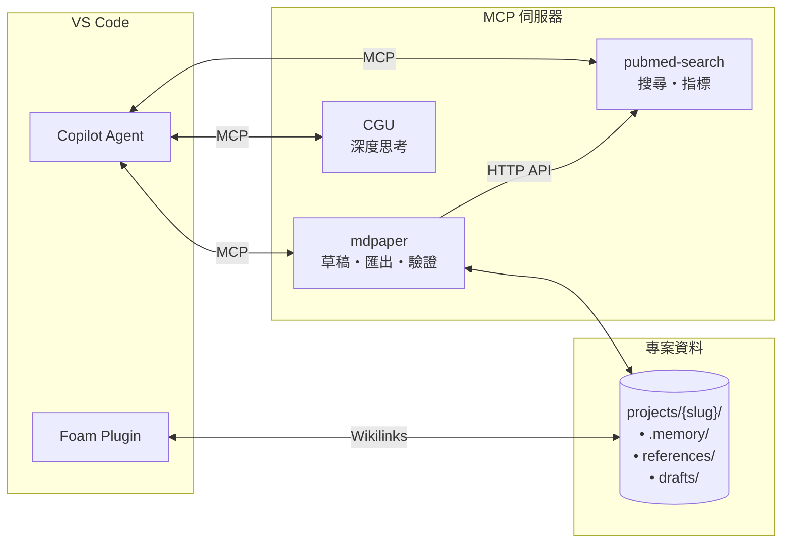

# Medical Paper Assistant 醫學論文寫作助手

<p align="center">
  <a href="https://www.python.org/downloads/"></a>
  <a href="https://modelcontextprotocol.io/"></a>
  <a href="https://github.com/features/copilot"></a>
  <a href="https://github.com/u9401066/med-paper-assistant"></a>
</p>

<p align="center">
  <b>🔬 引導式、探索式醫學論文寫作工具</b><br>
  <i>由 MCP + GitHub Copilot 驅動</i>
</p>

> 📖 [English Version](README.md)

---

## 🎯 為什麼選擇這個工具？

**傳統論文寫作工具**要求你在開始前就知道確切的方向。但研究很少是這麼線性的。

**Medical Paper Assistant** 不一樣：
- 🔍 **先探索，後決定** - 自由瀏覽文獻、儲存有興趣的論文，再決定研究方向
- 💬 **對話式工作流程** - 用自然語言與 AI 對話來精煉想法，不用填表單
- 🧭 **引導式流程** - 一步步的提示引導你從構思到可投稿的論文
- 🔗 **原生 MCP + Copilot 整合** - 直接在 VS Code 中運作，不用切換應用程式

### 💡 我們的獨特之處

| 傳統工具 | Medical Paper Assistant |
|---------|------------------------|
| 固定模板、僵化流程 | 彈性、探索式方法 |
| 搜尋/寫作/引用分開多個 App | 一站式整合體驗 |
| 手動管理參考文獻 | 自動儲存 + 豐富 metadata + 引用格式 |
| 匯出後再排版 | 直接匯出符合期刊格式的 Word |
| 學習複雜介面 | 自然語言對話 |

### 🌐 我們的生態系統



| 元件 | 角色 | 關鍵特色 |
|------|------|----------|
| **mdpaper** | 論文寫作、匯出 | MCP-to-MCP 驗證資料 |
| **pubmed-search** | 文獻搜尋 | 跨 MCP HTTP API |
| **Foam** | 知識圖譜 | `[[citation_key]]` 連結 |
| **CGU** | 創意思考 | 概念深度分析 |
| **Project Memory** | 跨 session 記憶 | `.memory/` 持久化 |

---

## 🚀 快速開始：Prompt Files 指令

在 Copilot Chat 中輸入這些指令即可開始：

| 指令 | 功能 | Prompt File |
|------|------|-------------|
| `/mdpaper.help` | ❓ 顯示所有可用指令 | [mdpaper.help.prompt.md](.github/prompts/mdpaper.help.prompt.md) |
| `/mdpaper.project` | 📁 設置或切換研究專案 | [mdpaper.project.prompt.md](.github/prompts/mdpaper.project.prompt.md) |
| `/mdpaper.search` | 🔍 **從這裡開始！** 自由探索文獻 | [mdpaper.search.prompt.md](.github/prompts/mdpaper.search.prompt.md) |
| `/mdpaper.concept` | 📝 發展研究概念，含新穎性驗證 | [mdpaper.concept.prompt.md](.github/prompts/mdpaper.concept.prompt.md) |
| `/mdpaper.strategy` | ⚙️ 設定搜尋策略 | [mdpaper.strategy.prompt.md](.github/prompts/mdpaper.strategy.prompt.md) |
| `/mdpaper.draft` | ✍️ 撰寫草稿，自動插入引用 | [mdpaper.draft.prompt.md](.github/prompts/mdpaper.draft.prompt.md) |
| `/mdpaper.analysis` | 📊 分析 CSV 數據，生成圖表和 Table 1 | [mdpaper.analysis.prompt.md](.github/prompts/mdpaper.analysis.prompt.md) |
| `/mdpaper.clarify` | 🔄 對話式修正特定段落 | [mdpaper.clarify.prompt.md](.github/prompts/mdpaper.clarify.prompt.md) |
| `/mdpaper.format` | 📄 匯出符合期刊格式的 Word | [mdpaper.format.prompt.md](.github/prompts/mdpaper.format.prompt.md) |

> 💡 **建議工作流程**：`/mdpaper.project` → `/mdpaper.search` → `/mdpaper.concept` → `/mdpaper.draft` → `/mdpaper.format`

### 🔧 Prompt Files + MCP Tools 架構

```
┌─────────────────────────────────────────────────────────┐
│  Prompt Files (本機)                                    │
│  .github/prompts/mdpaper.*.prompt.md                    │
│  → 定義「做什麼」（工作流程）                            │
│  → VS Code Copilot 直接讀取                             │
└─────────────────────────────────────────────────────────┘
                          │
                          │ Agent 執行時呼叫
                          ▼
┌─────────────────────────────────────────────────────────┐
│  MCP Tools (Server)                                     │
│  mcp_mdpaper_*, mcp_pubmed-search_*                     │
│  → 定義「怎麼做」（具體邏輯 + 驗證）                     │
│  → Hard-coded 規則確保資料完整性                        │
└─────────────────────────────────────────────────────────┘
```

**好處**：
- ✅ 工作流程在 `.md` 檔案 → 易編輯、版本控制
- ✅ 驗證邏輯在 MCP → 安全、一致、不會被繞過
- ✅ 兩者互補 → Prompt 說「做什麼」，Tool 管「怎麼做」

---

## ✨ 主要功能

| 功能 | 說明 |
|------|------|
| **文獻檢索與管理** | 連接 PubMed API 搜尋文獻，從 PMC 下載 PDF，建立本地文獻庫（支援 Foam 整合）|
| **智慧參考文獻儲存** | 儲存參考文獻時自動產生 YAML frontmatter、預格式化引用（Vancouver/APA/Nature）、Foam wikilink |
| **數據分析** | 讀取 CSV 數據，執行統計檢定（t-test、相關性等），生成出版品質圖表 |
| **智慧草稿生成** | 根據研究構想和分析結果生成論文草稿 |
| **自動引用** | 插入 `[[citation_key]]` wikilink，匯出時自動轉換為數字引用 |
| **Wikilink 驗證** | 自動偵測修復 `[[12345678]]` → `[[author2024_12345678]]` 格式 |
| **Pre-Analysis Checklist** | 進入分析前驗證概念完整度（研究設計、樣本數、結果指標）|
| **互動式修正** | 透過對話方式微調特定段落 |
| **Word 匯出** | 將 Markdown 草稿匯出為符合期刊格式的 `.docx` |

---

## 🏗️ 架構：MCP 協調模式

本專案採用**模組化 MCP 架構**，遵循領域驅動設計 (DDD)：

```
┌──────────────────────────────────────────────────────────────────────────┐
│                          👤 使用者層                                      │
│  ┌─────────────────┐    ┌──────────────────────────────────────────────┐ │
│  │   VS Code       │    │  Foam 擴充功能                               │ │
│  │   編輯器        │    │  • [[wikilinks]] 自動補全                    │ │
│  │                 │    │  • 懸停預覽（查看摘要）                       │ │
│  │                 │    │  • 反向連結面板                              │ │
│  └─────────────────┘    └──────────────────────────────────────────────┘ │
└──────────────────────────────────────────────────────────────────────────┘
                                    │
                                    ▼
┌──────────────────────────────────────────────────────────────────────────┐
│                    🤖 VS Code Copilot Agent（協調者）                      │
│                                                                          │
│    /mdpaper.search  →  /mdpaper.concept  →  /mdpaper.draft  →  匯出     │
└───────┬──────────────────┬──────────────────┬──────────────────┬─────────┘
        │                  │                  │                  │
        ▼                  ▼                  ▼                  ▼
┌───────────────┐  ┌───────────────┐  ┌───────────────┐  ┌───────────────┐
│ 📝 mdpaper    │  │🔍 pubmed-     │  │💡 cgu         │  │🔌 外部 MCPs   │
│  (46 工具)    │  │  search       │  │  (submodule)  │  │   (uvx)       │
│               │  │  (submodule)  │  │               │  │               │
│ • 專案管理    │  │ • 搜尋        │  │ • 腦力激盪    │  │ 🎨 drawio     │
│ • 參考文獻    │  │ • PICO        │  │ • 深度思考    │  │ • 流程圖      │
│ • 草稿        │  │ • 引用網絡    │  │ • 創意方法    │  │               │
│ • 資料分析    │  │ • session     │  │               │  │ 📖 zotero     │
│ • 匯出        │  │               │  │               │  │ • 匯入文獻    │
└───────┬───────┘  └───────────────┘  └───────────────┘  └───────────────┘
        │
        ▼
┌──────────────────────────────────────────────────────────────────────────┐
│                          💾 本地儲存                                      │
│  projects/{slug}/                                                        │
│  ├── concept.md          ← 研究構想（含 🔒 保護區塊）                     │
│  ├── references/{pmid}/  ← Foam 相容 .md + metadata.json                 │
│  ├── drafts/             ← Markdown 草稿（含 [[引用]]）                   │
│  ├── data/               ← CSV 資料檔                                    │
│  └── results/            ← 圖表、.docx 匯出                              │
└──────────────────────────────────────────────────────────────────────────┘
```

### 完整整合堆疊

| 元件 | 類型 | 用途 |
|------|------|------|
| **mdpaper** | 核心 MCP | 論文寫作：專案、參考文獻、草稿、分析、匯出 |
| **pubmed-search** | 子模組 | 文獻搜尋：PubMed API、PICO、session 管理 |
| **cgu** | 子模組 | 創意思考：腦力激盪、深度思考、創意方法 |
| **drawio** | 外部 (uvx) | 流程圖：CONSORT、PRISMA |
| **zotero-keeper** | 外部 (uvx) | 從 Zotero 匯入參考文獻 |
| **Foam** | VS Code 擴充 | Wikilinks、懸停預覽、反向連結、圖譜視圖 |

**核心原則：MCP 對 MCP 只透過 Agent**
- MCP 伺服器之間不直接 import
- Agent 協調資料流轉
- 範例：`pubmed-search` 回傳 metadata → Agent 傳給 `mdpaper.save_reference()`

---

## 📚 參考文獻檔案結構

參考文獻採用 Foam 優化的結構儲存：

```
references/
└── {pmid}/
    ├── {citation_key}.md   ← 主檔案，包含 YAML frontmatter
    └── metadata.json       ← 完整 metadata（程式用）
```

**範例**: `references/27345583/greer2017_27345583.md`

```yaml
---
aliases:
  - greer2017_27345583      # 主要 wikilink
  - "PMID:27345583"         # PMID 格式
  - "27345583"              # 純數字
type: reference
source: "pubmed"
pmid: "27345583"
year: 2017

# 預格式化引用
cite:
  vancouver: "Greer D, Marshall KE. Review of..."
  apa: "Greer, D. & Marshall, K. E. (2017)..."
  inline: "Greer & Marshall, 2017"
---

# 標題

**Authors**: Greer Devon, Marshall Kathryn E

## Abstract
...
```

---

## 🔗 Foam 整合

本專案整合 [Foam](https://foambubble.github.io/foam/) 提供強大的參考文獻管理：

| 功能 | 使用方式 | 好處 |
|------|----------|------|
| **Wikilinks** | `[[greer2017_27345583]]` | 在草稿中連結參考文獻 |
| **懸停預覽** | 滑鼠移到 `[[連結]]` | 不用開檔案就能看摘要 |
| **反向連結** | 開啟參考文獻檔案 | 查看哪些草稿引用了這篇論文 |
| **圖譜視圖** | `Ctrl+Shift+P` → `Foam: Show Graph` | 視覺化論文關聯 |

### 📝 引用自動補全（使用方式）

撰寫草稿時，輸入 `[[` 觸發引用選單：

```markdown
根據先前研究 [[    ← 在這裡輸入 [[
               ┌─────────────────────────────┐
               │ 🔍 greer2017_27345583       │
               │    smith2020_12345678       │
               │    chen2019_87654321        │
               └─────────────────────────────┘
```

**搜尋選項：**
| 輸入 | 範例 | 匹配 |
|------|------|------|
| 作者 | `[[greer` | Greer 的論文 |
| 年份 | `[[2017` | 2017 年的論文 |
| PMID | `[[27345583` | 特定 PMID 的論文 |
| 關鍵字 | `[[sedation` | 標題含 "sedation" 的論文 |

**快捷鍵：**
- `[[` - 開啟自動補全選單
- `Ctrl+Space` - 強制觸發選單
- `↑↓` - 瀏覽選項
- `Enter` - 插入選中的引用

### ⚠️ 專案隔離

切換專案時，系統會自動更新 Foam 設定，確保**只看到當前專案的參考文獻**：

```
switch_project("my-research")
→ Foam 只顯示 projects/my-research/references/ 的引用
→ 其他專案的引用被自動排除
```

這避免了 A 專案誤用 B 專案引用的問題！

---

## 🚀 安裝指南

### 系統需求

| 需求 | 版本 | 檢查方式 |
|------|------|----------|
| **Python** | 3.11+ | `python3 --version` |
| **Git** | 任何近期版本 | `git --version` |
| **VS Code** | 最新版 | 說明 → 關於 |
| **GitHub Copilot** | 擴充功能 | 擴充功能面板 |

### 快速安裝

```bash
# 複製專案
git clone https://github.com/u9401066/med-paper-assistant.git
cd med-paper-assistant

# 執行安裝腳本
# Linux/macOS:
./scripts/setup.sh

# Windows (PowerShell):
.\scripts\setup.ps1
```

腳本會自動：
1. ✅ 建立 Python 虛擬環境 (`.venv/`)
2. ✅ 安裝所有依賴
3. ✅ 建立 `.vscode/mcp.json` 設定
4. ✅ 驗證安裝

**驗證**：在 Copilot Chat 輸入 `/mcp`，應該看到 `mdpaper (46 tools)` 🎉

### 選用：推薦擴充功能

```bash
# Foam - 參考文獻連結
code --install-extension foam.foam-vscode

# Project Manager - 多專案工作流
code --install-extension alefragnani.project-manager
```

### 選用：Draw.io 整合

如需圖表生成功能（CONSORT/PRISMA 流程圖）：

```bash
./scripts/setup-integrations.sh
./scripts/start-drawio.sh
```

---

## 📂 專案結構

```
med-paper-assistant/
├── src/med_paper_assistant/
│   ├── domain/           # 核心業務邏輯 (DDD)
│   ├── application/      # 用例、服務
│   ├── infrastructure/   # DAL、外部服務
│   └── interfaces/       # MCP 伺服器、API
│
├── projects/             # 研究專案（獨立工作區）
│   └── {project-slug}/
│       ├── concept.md    # 研究構想（含 🔒 保護區塊）
│       ├── drafts/       # Markdown 草稿
│       ├── references/   # 本地文獻庫
│       ├── data/         # CSV 資料檔
│       └── results/      # 生成的輸出（圖表、.docx）
│
├── integrations/         # 外部 MCP 伺服器
│   ├── pubmed-search-mcp/
│   └── cgu/              # 創意生成工具
│
├── memory-bank/          # 專案記憶（跨 session 脈絡）
├── .claude/skills/       # Agent 技能定義
└── templates/            # 期刊 Word 範本
```

---

## 🛠️ 可用工具

### 📝 mdpaper MCP 工具（69 個）

#### 📁 專案管理 (20 工具)

| 工具 | 說明 |
|------|------|
| `create_project` | 建立新研究專案，包含獨立工作區 |
| `list_projects` | 列出所有研究論文專案 |
| `switch_project` | 切換到不同專案 |
| `get_current_project` | 取得目前啟用的專案資訊 |
| `delete_project` | 刪除專案（需確認） |
| `archive_project` | 封存專案以便稍後取回 |
| `update_project_status` | 更新專案狀態（concept/drafting/review/submitted/published） |
| `update_project_settings` | 變更論文類型或偏好設定 |
| `get_project_paths` | 取得專案目錄路徑 |
| `get_project_file_paths` | 取得特定專案檔案路徑 |
| `open_project_files` | 在 VS Code 開啟專案檔案 |
| `close_other_project_files` | 關閉其他專案的檔案 |
| `get_paper_types` | 列出可用的論文類型 |
| `setup_project_interactive` | 互動式設定專案 |
| `start_exploration` | 開始探索工作區（無需正式專案） |
| `get_exploration_status` | 檢查探索工作區狀態 |
| `convert_exploration_to_project` | 將探索轉換為正式專案 |
| `save_diagram` | 儲存 Draw.io 圖表到專案 |
| `save_diagram_standalone` | 無專案情境下儲存圖表 |
| `list_diagrams` | 列出目前專案的圖表 |

#### 📚 參考文獻管理 (17 工具)

| 工具 | 說明 |
|------|------|
| `save_reference` | 使用 PubMed 搜尋的 metadata 儲存參考文獻 |
| `save_reference_mcp` | **【推薦】** 透過 PMID 使用 MCP-to-MCP 儲存（驗證資料） |
| `save_reference_pdf` | 儲存參考文獻並下載 PDF |
| `list_saved_references` | 列出資料庫中所有已儲存的參考文獻 |
| `get_reference_details` | 取得參考文獻的完整引用資訊 |
| `search_local_references` | 在已儲存的參考文獻中搜尋 |
| `delete_reference` | 從資料庫刪除參考文獻 |
| `check_reference_exists` | 檢查參考文獻是否存在於資料庫 |
| `read_reference_fulltext` | 讀取已儲存參考文獻的 PDF 內容 |
| `format_references` | 以各種格式輸出參考文獻列表 |
| `set_citation_style` | 設定預設引用格式（Vancouver/APA/Nature） |
| `rebuild_foam_aliases` | 重建 Foam 相容的別名檔案 |
| `find_citation_for_claim` | 為特定主張尋找引用 |
| `suggest_citations` | 分析文字並建議適當的引用 |
| `insert_citation` | 插入引用到草稿文字 |
| `scan_draft_citations` | 掃描草稿中的引用 wikilinks |
| `sync_references` | 同步 [[wikilinks]] 為編號引用 |

#### ✍️ 草稿撰寫 (9 工具)

| 工具 | 說明 |
|------|------|
| `write_draft` | 建立或更新草稿檔案 |
| `draft_section` | 使用 AI 輔助撰寫特定章節 |
| `read_draft` | 讀取草稿內容 |
| `list_drafts` | 列出可用的草稿檔案 |
| `delete_draft` | 刪除草稿檔案 |
| `count_words` | 計算草稿字數 |
| `get_section_template` | 取得章節撰寫指引 |
| `insert_section` | 插入內容到文件章節 |
| `validate_for_section` | 章節撰寫前驗證概念 |

#### ✅ 驗證 (3 工具)

| 工具 | 說明 |
|------|------|
| `validate_concept` | 完整驗證（含新穎性評分，3 輪） |
| `validate_concept_quick` | 僅結構性快速檢查 |
| `validate_wikilinks` | 自動偵測並修復引用格式問題 |

#### 📊 資料分析 (6 工具)

| 工具 | 說明 |
|------|------|
| `analyze_dataset` | 取得 CSV 資料集的描述性統計 |
| `run_statistical_test` | 執行統計檢定（t-test、ANOVA、chi2、correlation 等） |
| `create_plot` | 建立出版品質的圖表 |
| `generate_table_one` | 產生基線特徵表 |
| `detect_variable_types` | 自動偵測資料集中的變數類型 |
| `list_data_files` | 列出專案中可用的資料檔案 |

#### 🔍 審稿 (3 工具)

| 工具 | 說明 |
|------|------|
| `check_manuscript_consistency` | 投稿前檢查一致性問題 |
| `create_reviewer_response` | 產生對審稿意見的結構化回覆 |
| `format_revision_changes` | 格式化修訂時所做的變更 |

#### 📮 投稿準備 (3 工具)

| 工具 | 說明 |
|------|------|
| `generate_cover_letter` | 產生專業的 Cover Letter |
| `check_submission_checklist` | 檢查稿件是否符合期刊要求 |
| `list_supported_journals` | 列出支援的期刊及其要求 |
| `generate_highlights` | 產生投稿用的重點摘要 |

#### 📄 Word 匯出 (7 工具)

| 工具 | 說明 |
|------|------|
| `export_word` | 將 markdown 草稿匯出為 Word 文件 |
| `list_templates` | 列出可用的 Word 範本 |
| `read_template` | 讀取範本結構和章節 |
| `start_document_session` | 開始文件編輯 session |
| `verify_document` | 驗證文件狀態和字數 |
| `check_word_limits` | 檢查字數限制是否符合範本 |
| `save_document` | 儲存文件 session 為檔案 |

### 🔍 pubmed-search MCP 工具

| 類別 | 主要工具 |
|------|----------|
| **搜尋** | `search_literature`, `generate_search_queries`, `parse_pico`, `merge_search_results` |
| **文章資訊** | `fetch_article_details`, `find_related_articles`, `find_citing_articles` |
| **匯出** | `prepare_export`, `get_article_fulltext_links`, `analyze_fulltext_access` |
| **Session** | `get_session_pmids`, `list_search_history`, `get_session_summary` |

---

## 🎯 新穎性驗證系統

撰寫草稿前，概念必須通過新穎性驗證：

| 設定 | 值 | 說明 |
|------|---|------|
| **輪數** | 3 | 獨立評估次數 |
| **門檻** | 75/100 | 每輪最低分數 |
| **通過條件** | 3 輪皆 ≥ 75 | 必須全部通過 |

---

## 🗺️ 開發藍圖

| 狀態 | 功能 | 說明 |
|------|------|------|
| ✅ | **Foam 整合** | Wikilinks、懸停預覽、反向連結 |
| ✅ | **專案隔離** | 切換專案時自動更新 Foam 設定 |
| ✅ | **PubMed MCP** | 獨立文獻搜尋伺服器 |
| ✅ | **並行搜尋** | 多查詢並行執行 |
| ✅ | **Table 1 生成器** | 自動生成基線特徵表 |
| ✅ | **參考文獻重構** | 單一 .md + YAML frontmatter + aliases |
| ✅ | **Project Memory** | `.memory/` 資料夾跨 session 保存 Agent 記憶 |
| ✅ | **Wikilink 驗證器** | 自動修復草稿中的引用格式 |
| ✅ | **Pre-Analysis Checklist** | 概念 → 分析前完整度驗證 |
| 🔜 | **引用工具** | `insert_citation`、`auto_cite_draft`、`verify_citations` |
| 📋 | **多語言支援** | 完整 UI 本地化 |
| 📋 | **期刊樣式庫** | 預設期刊格式 |
| 📋 | **REST API 模式** | 公開工具為 REST API |

**圖例：** ✅ 已完成 | 🔜 進行中 | 📋 規劃中

---

## 🤝 參與貢獻

我們歡迎貢獻！詳見 [CONTRIBUTING.md](CONTRIBUTING.md)。

- 🐛 **回報 Bug** - 開 issue
- 💡 **建議功能** - 分享想法
- 🔧 **提交程式碼** - Fork → Branch → PR

---

## 📄 授權

Apache License 2.0 - 詳見 [LICENSE](LICENSE)
