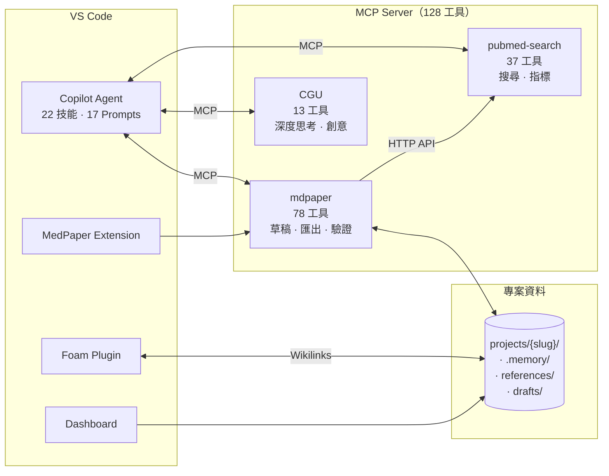

# Medical Paper Assistant 醫學論文寫作助手

<p align="center">
  <a href="https://www.python.org/downloads/"></a>
  <a href="https://modelcontextprotocol.io/"></a>
  <a href="https://github.com/features/copilot"></a>
  <a href="https://github.com/u9401066/med-paper-assistant"></a>
</p>

<p align="center">
  <b>🔬 醫學論文寫作的整合式 AI 工具包</b><br>
  <i>3 個 MCP Server · 128 個工具 · 22 個技能 · 17 個 Prompt 工作流 — 全在 VS Code 裡</i>
</p>

> 📖 [English Version](README.md)

---

## 📦 工具包內容一覽

這是一個 **Monorepo 工具包**，將醫學研究者需要的一切 — 從文獻搜尋到 Word/LaTeX 匯出 — 整合在一個 VS Code 環境中。

| 元件 | 類型 | 工具數 | 說明 |
|------|------|--------|------|
| **[mdpaper](#-mdpaper-mcp-工具)** | 核心 MCP Server | 78 | 論文寫作：專案、文獻、草稿、分析、驗證、匯出 |
| **[pubmed-search](integrations/pubmed-search-mcp/)** | MCP Server（子模組） | 37 | PubMed/Europe PMC/CORE 搜尋、PICO、引用指標、session 管理 |
| **[CGU](integrations/cgu/)** | MCP Server（子模組） | 13 | 創意發想：腦力激盪、深度思考、火花碰撞 |
| **[VS Code Extension](vscode-extension/)** | 擴充功能 | 3 指令 | MCP Server 生命週期、`@mdpaper` 聊天參與者 |
| **[Dashboard](dashboard/)** | Next.js Web App | — | 專案管理 UI、圖表編輯器 |
| **[Foam](https://foambubble.github.io/foam/)** | VS Code 擴充功能 | — | `[[wikilink]]` 引用連結、懸停預覽、圖譜視圖 |
| **[Skills](.claude/skills/)** | Agent 工作流 | 22 | 引導式多工具工作流（文獻回顧、草稿寫作...） |
| **[Prompts](.github/prompts/)** | Prompt Files | 17 | `/mdpaper.search`、`/mdpaper.draft` 等 |

**外部 MCP Server**（選用，透過 uvx 安裝）：
- **drawio** — CONSORT/PRISMA 流程圖生成
- **zotero-keeper** — 從 Zotero 匯入參考文獻

### 各元件如何協作



---

## 🎯 為什麼選擇這個工具？

**傳統論文寫作工具**要求你在開始前就知道確切的方向。但研究很少是這麼線性的。

**Medical Paper Assistant** 不一樣：
- 🔍 **先探索，後決定** — 自由瀏覽文獻、儲存有興趣的論文，再決定研究方向
- 💬 **對話式工作流程** — 用自然語言與 AI 對話來精煉想法，不用填表單
- 🧭 **引導式流程** — 一步步的提示引導你從構思到可投稿的論文
- 🔗 **全部整合** — 搜尋、寫作、引用、分析、匯出 — 全部在 VS Code 裡

| 傳統工具 | Medical Paper Assistant |
|---------|------------------------|
| 固定模板、僵化流程 | 彈性、探索式方法 |
| 搜尋/寫作/引用分開多個 App | 一站式：128 個工具在 VS Code 裡 |
| 手動管理參考文獻 | 自動儲存 + PubMed 驗證資料 |
| 匯出後再排版 | 直接匯出符合期刊格式的 Word |
| 學習複雜介面 | 自然語言對話 |

---

## 🚀 快速開始

### 系統需求

| 需求 | 版本 | 檢查方式 |
|------|------|----------|
| **Python** | 3.12+ | `python3 --version` |
| **Git** | 任何近期版本 | `git --version` |
| **VS Code** | 最新版 | 說明 → 關於 |
| **GitHub Copilot** | 擴充功能 | 擴充功能面板 |

### 安裝

```bash
# 含子模組一起 clone
git clone --recursive https://github.com/u9401066/med-paper-assistant.git
cd med-paper-assistant

# 執行安裝腳本
./scripts/setup.sh          # Linux/macOS
.\scripts\setup.ps1         # Windows PowerShell
```

腳本會自動：
1. ✅ 建立 Python 虛擬環境（`.venv/`）
2. ✅ 安裝所有依賴（透過 `uv`）
3. ✅ 建立 `.vscode/mcp.json` 設定
4. ✅ 驗證安裝

**驗證**：在 Copilot Chat 輸入 `/mcp`，應該看到 `mdpaper` 🎉

### 選用整合

```bash
# Foam：參考文獻連結（強烈推薦）
code --install-extension foam.foam-vscode

# Draw.io：圖表生成
./scripts/setup-integrations.sh && ./scripts/start-drawio.sh
```

---

## 💬 MCP Prompts — 輸入指令即可開始

在 Copilot Chat 中輸入這些指令觸發引導式工作流：

| 指令 | 說明 |
|------|------|
| `/mdpaper.search` | 🔍 **從這裡開始！** 探索文獻、儲存論文 |
| `/mdpaper.concept` | 📝 發展研究概念，含新穎性驗證 |
| `/mdpaper.draft` | ✍️ 撰寫草稿，自動插入引用 |
| `/mdpaper.analysis` | 📊 分析 CSV 數據，生成圖表和 Table 1 |
| `/mdpaper.format` | 📄 匯出符合期刊格式的 Word |
| `/mdpaper.clarify` | 🔄 對話式修正特定段落 |
| `/mdpaper.project` | 📁 建立或切換研究專案 |
| `/mdpaper.strategy` | ⚙️ 設定搜尋策略（日期、篩選） |
| `/mdpaper.help` | ❓ 顯示所有可用指令 |

> 💡 **建議工作流程**：`/mdpaper.search` → `/mdpaper.concept` → `/mdpaper.draft` → `/mdpaper.format`

---

## 🧠 技能系統 + 專案記憶

**核心差異化**：我們不只提供工具 — 我們提供**引導式工作流**來有效組合工具，以及**專案記憶**來跨 session 記住你的研究歷程。

### 什麼是技能？

```
工具 (Tool) = 單一能力（搜尋、儲存、分析...）
技能 (Skill) = 完整知識（如何組合工具完成任務）
```

**22 個技能**涵蓋完整研究生命週期：

| 分類 | 技能 | 觸發語 |
|------|------|--------|
| 🔬 研究 | `literature-review`, `concept-development`, `concept-validation`, `parallel-search` | 「找論文」「search」「concept」「validate」 |
| ✍️ 寫作 | `draft-writing`, `reference-management`, `word-export` | 「寫草稿」「draft」「citation」「export」 |
| 📁 管理 | `project-management`, `memory-updater`, `memory-checkpoint` | 「新專案」「切換」「存檔」 |
| 🛠️ 開發 | `git-precommit`, `code-refactor`, `test-generator`, `code-reviewer` | 「commit」「refactor」「test」 |

### 專案記憶

每個專案維持自己的 `.memory/` 資料夾，讓 AI 跨 session 連貫地延續研究：

```
projects/{slug}/
├── .memory/
│   ├── activeContext.md   ← Agent 的工作記憶
│   └── progress.md        ← 研究里程碑
├── concept.md             ← 研究構想（含 🔒 保護區塊）
├── references/            ← Foam 相容的文獻庫
├── drafts/                ← Markdown 草稿（含 [[引用]]）
├── data/                  ← CSV 資料檔
└── results/               ← 圖表、.docx 匯出
```

---

## ✨ 主要功能

### 文獻搜尋與管理
- **PubMed + Europe PMC + CORE** 搜尋（37 個搜尋工具）
- **PICO 解析** 處理臨床問題
- **MCP-to-MCP 驗證資料** — 只傳 PMID，杜絕 Agent 幻覺
- 分層信任：🔒 VERIFIED（PubMed）· 🤖 AGENT（AI 筆記）· ✏️ USER（你的筆記）
- Foam wikilink：`[[author2024_12345678]]` 含懸停預覽和反向連結

### 寫作與編輯
- **AI 草稿生成**（Introduction、Methods、Results、Discussion 逐章節）
- **Citation-Aware Editing** — `patch_draft` 儲存前驗證所有 `[[wikilinks]]`
- **自動修復引用格式** — `[[12345678]]` → `[[author2024_12345678]]`
- **新穎性驗證** — 3 輪獨立評分（門檻：75/100）
- **Anti-AI 寫作規則** — 證據漏斗結構、禁止陳腔濫調

### 資料分析
- CSV 資料集分析（描述性統計）
- 統計檢定（t-test、ANOVA、chi²、相關性、Mann-Whitney、Fisher's）
- **Table 1 生成器** — 基線特徵表，自動偵測變數類型
- 出版品質圖表（matplotlib/seaborn）

### 匯出與投稿
- **Word 匯出**，支援期刊模板
- Cover Letter + Highlights 生成
- 稿件一致性檢查器
- Reviewer 回覆生成器（逐條回覆格式）
- 投稿清單檢查（字數、圖片格式等）

### 基礎架構
- **DDD 架構**（Domain-Driven Design）清晰的分層設計
- **13 個 pre-commit hooks**（ruff、mypy、bandit、pytest、whitespace、yaml...）
- **Workspace State** 跨 session 狀態恢復
- **uv** 管理所有 Python 套件

---

## 🏗️ 架構

```
┌──────────────────────────────────────────────────────────────────────────┐
│                          👤 使用者層                                      │
│  ┌─────────────────┐    ┌──────────────────────────────┐  ┌──────────┐  │
│  │   VS Code        │    │  Foam 擴充功能                │  │Dashboard │  │
│  │   編輯器         │    │  [[wikilinks]] 自動補全       │  │(Next.js) │  │
│  │                  │    │  懸停預覽 · 反向連結           │  │          │  │
│  └─────────────────┘    └──────────────────────────────┘  └──────────┘  │
└──────────────────────────────────────────────────────────────────────────┘
                                    │
                                    ▼
┌──────────────────────────────────────────────────────────────────────────┐
│               🤖 Copilot Agent（協調者）                                   │
│      22 技能 + 17 Prompt 工作流 + Agent 自訂                              │
│   /mdpaper.search → /mdpaper.concept → /mdpaper.draft → 匯出            │
└───────┬──────────────────┬──────────────────┬──────────────────┬─────────┘
        │                  │                  │                  │
        ▼                  ▼                  ▼                  ▼
┌───────────────┐  ┌───────────────┐  ┌───────────────┐  ┌───────────────┐
│ 📝 mdpaper    │  │🔍 pubmed-     │  │💡 cgu         │  │🔌 外部 MCPs   │
│  78 工具      │  │  search       │  │  13 工具      │  │   (uvx)       │
│               │  │  37 工具      │  │               │  │               │
│ • 專案管理    │  │ • PubMed      │  │ • 腦力激盪    │  │ 🎨 drawio     │
│ • 參考文獻    │  │ • Europe PMC  │  │ • 深度思考    │  │ • 流程圖      │
│ • 草稿        │  │ • CORE        │  │ • 火花碰撞    │  │               │
│ • 驗證        │  │ • PICO        │  │ • 創意方法    │  │ 📖 zotero     │
│ • 資料分析    │  │ • 基因/化合物 │  │               │  │ • 匯入文獻    │
│ • 匯出        │  │ • Session     │  │               │  │               │
└───────┬───────┘  └───────────────┘  └───────────────┘  └───────────────┘
        │
        ▼
┌──────────────────────────────────────────────────────────────────────────┐
│                          💾 本地儲存                                      │
│  projects/{slug}/                                                        │
│  ├── concept.md          ← 研究構想（含 🔒 保護區塊）                     │
│  ├── references/{pmid}/  ← Foam 相容 .md + metadata.json                 │
│  ├── drafts/             ← Markdown 草稿（含 [[引用]]）                   │
│  ├── data/               ← CSV 資料檔                                    │
│  └── results/            ← 圖表、.docx 匯出                              │
└──────────────────────────────────────────────────────────────────────────┘
```

### MCP-to-MCP 直接通訊

儲存文獻時，資料在 MCP Server 之間直接傳遞 — Agent 只傳 PMID，不傳完整 metadata：

```
Agent: "儲存 PMID:24891204"
     │
     ▼
mdpaper.save_reference_mcp(pmid="24891204")
     │  直接 HTTP 呼叫（不經過 Agent）
     ▼
pubmed-search: GET /api/cached_article/24891204
     │  回傳已驗證的 PubMed 資料
     ▼
以分層信任儲存：
  🔒 VERIFIED: PubMed 資料（不可修改）
  🤖 AGENT:    AI 筆記（標示來源）
  ✏️ USER:     你的筆記（可編輯）
```

---

## 🛠️ mdpaper MCP 工具

**78 個啟用中的工具**，分為 6 大類：

### 📁 專案管理（23 工具）
專案、探索模式、工作區狀態恢復、圖表管理。

| 關鍵工具 | 說明 |
|----------|------|
| `create_project` / `switch_project` / `delete_project` | 專案生命週期 |
| `start_exploration` / `convert_exploration_to_project` | 先探索後建專案 |
| `get_workspace_state` / `sync_workspace_state` | 跨 session 狀態恢復 |
| `save_diagram` / `list_diagrams` | Draw.io 整合 |
| `setup_project_interactive` | 互動式論文類型設定 |

### 📚 參考文獻管理（12 工具）
儲存、搜尋、格式化、管理參考文獻，整合 Foam。

| 關鍵工具 | 說明 |
|----------|------|
| `save_reference_mcp` | **推薦** — 透過 PMID 經由 MCP-to-MCP 儲存（驗證資料）|
| `list_saved_references` / `search_local_references` | 瀏覽和搜尋已存文獻 |
| `format_references` / `set_citation_style` | Vancouver / APA / Nature |
| `sync_references` | 將 `[[wikilinks]]` 同步為編號引用 |

### ✍️ 草稿與編輯（14 工具）
寫作、編輯、引用 — 內建驗證。

| 關鍵工具 | 說明 |
|----------|------|
| `write_draft` / `draft_section` | 建立和撰寫各章節 |
| `get_available_citations` | 編輯前列出所有可用的 `[[citation_key]]` |
| `patch_draft` | **Citation-aware** 部分編輯，自動驗證 wikilinks |
| `insert_citation` / `suggest_citations` | 智慧引用插入 |
| `scan_draft_citations` / `sync_references` | 引用管理 |
| `get_section_template` | 章節寫作指引 |

### ✅ 驗證（4 工具）
| 工具 | 說明 |
|------|------|
| `validate_concept` | 完整新穎性評分（3 輪，門檻 75/100）|
| `validate_concept_quick` | 快速結構檢查 |
| `validate_wikilinks` | 自動修復 `[[12345678]]` → `[[author2024_12345678]]` |
| `validate_for_section` | 章節寫作前驗證概念 |

### 📊 資料分析（6 工具）
| 工具 | 說明 |
|------|------|
| `analyze_dataset` | CSV 描述性統計 |
| `run_statistical_test` | t-test、ANOVA、chi²、相關性等 |
| `generate_table_one` | 基線特徵表，自動偵測變數類型 |
| `create_plot` | 出版品質圖表 |

### 📄 匯出與投稿（8 + 11 工具）
| 分類 | 關鍵工具 |
|------|----------|
| **Word 匯出** | `export_word`、`list_templates`、`start_document_session`、`verify_document` |
| **投稿準備** | `generate_cover_letter`、`check_submission_checklist`、`generate_highlights` |
| **審稿回覆** | `check_manuscript_consistency`、`create_reviewer_response`、`format_revision_changes` |

### 🔍 pubmed-search MCP 工具（37 工具）

| 分類 | 關鍵工具 |
|------|----------|
| **搜尋** | `search_literature`、`generate_search_queries`、`parse_pico` |
| **資料庫** | PubMed、Europe PMC（全文 + 文本挖掘）、CORE（2 億+ 開放取用）|
| **基因/化合物** | `search_gene`、`get_gene_details`、`search_compound`、`search_clinvar` |
| **探索** | `find_related_articles`、`find_citing_articles`、`get_article_references` |
| **匯出** | `prepare_export`（RIS/BibTeX/CSV）、`get_citation_metrics`（iCite RCR）|
| **Session** | `get_session_pmids`、`list_search_history`（不受 AI 記憶限制） |

### 💡 CGU 創意工具（13 工具）

| 分類 | 關鍵工具 |
|------|----------|
| **發想** | `generate_ideas`、`spark_collision`、`spark_collision_deep` |
| **分析** | `deep_think`、`multi_agent_brainstorm` |
| **方法** | `list_methods`、`select_method`、`apply_method` |

---

## 🔗 Foam 整合

| 功能 | 使用方式 | 好處 |
|------|----------|------|
| **Wikilinks** | `[[greer2017_27345583]]` | 在草稿中連結參考文獻 |
| **懸停預覽** | 滑鼠移到 `[[連結]]` | 不用開檔案就能看摘要 |
| **反向連結** | 開啟參考文獻檔案 | 查看哪些草稿引用了這篇論文 |
| **圖譜視圖** | `Ctrl+Shift+P` → `Foam: Show Graph` | 視覺化論文關聯 |
| **專案隔離** | `switch_project` 自動切換 | 只看到當前專案的引用 |

### 引用自動補全

撰寫草稿時，輸入 `[[` 觸發引用選單：

```markdown
根據先前研究 [[    ← 在這裡輸入 [[
               ┌─────────────────────────────┐
               │ 🔍 greer2017_27345583       │
               │    smith2020_12345678       │
               │    chen2019_87654321        │
               └─────────────────────────────┘
```

可依作者（`[[greer`）、年份（`[[2017`）、PMID（`[[27345583`）、關鍵字（`[[sedation`）搜尋。

---

## 📚 參考文獻檔案結構

參考文獻以 **Foam 優化、分層信任** 的結構儲存：

```
references/{pmid}/
├── {citation_key}.md   ← YAML frontmatter + 摘要（人類可讀）
└── metadata.json       ← 完整 metadata（程式用）
```

```yaml
---
# 🔒 VERIFIED（來自 PubMed，不可修改）
title: "Complications of airway management"
author:
  - {family: Pacheco-Lopez, given: Paulette C}
year: 2014
journal: Respiratory Care
pmid: "24891204"
_source:
  mcp: pubmed-search
  verified: true

# 🤖 AGENT（AI 生成，已標示）
_agent:
  notes: "呼吸道管理併發症的重要 review"
  relevance: high

# Foam
aliases: [pachecolopez2014, "PMID:24891204"]
tags: [reference, airway, review]
---
```

---

## 📂 專案結構

```
med-paper-assistant/
├── src/med_paper_assistant/       # 核心 MCP Server（DDD 架構）
│   ├── domain/                    #   業務邏輯、實體、值物件
│   ├── application/               #   用例、服務
│   ├── infrastructure/            #   DAL、外部服務
│   └── interfaces/mcp/            #   MCP Server，78 工具分 6 大類
│
├── integrations/                  # 內建 MCP Server
│   ├── pubmed-search-mcp/         #   PubMed/PMC/CORE 搜尋（37 工具）
│   └── cgu/                       #   創意發想（13 工具）
│
├── vscode-extension/              # VS Code 擴充功能
│   ├── src/                       #   擴充功能原始碼
│   ├── skills/                    #   Agent 技能定義
│   └── prompts/                   #   快速操作 Prompts
│
├── dashboard/                     # Next.js 專案管理 UI
│   └── src/
│
├── projects/                      # 研究專案（獨立工作區）
│   └── {slug}/
│       ├── .memory/               #   跨 session AI 記憶
│       ├── concept.md             #   研究構想
│       ├── references/            #   本地文獻庫
│       ├── drafts/                #   Markdown 草稿
│       └── results/               #   圖表、匯出
│
├── .claude/skills/                # 22 個 Agent 技能定義
├── .github/prompts/               # 17 個 Prompt 工作流
├── templates/                     # 期刊 Word 範本
├── memory-bank/                   # 全域專案記憶
└── tests/                         # pytest 測試套件
```

---

## 🗺️ 開發藍圖

| 狀態 | 功能 | 說明 |
|------|------|------|
| ✅ | **3 個 MCP Server** | mdpaper (78) + pubmed-search (37) + CGU (13) |
| ✅ | **Foam 整合** | Wikilinks、懸停預覽、反向連結、專案隔離 |
| ✅ | **Project Memory** | `.memory/` 跨 session AI 記憶 |
| ✅ | **Table 1 生成器** | 自動生成基線特徵表 |
| ✅ | **新穎性驗證** | 3 輪評分，門檻 75/100 |
| ✅ | **Citation-Aware Editing** | `patch_draft` 含 wikilink 驗證 |
| ✅ | **MCP-to-MCP 信任** | 透過 HTTP 直接取得 PubMed 驗證資料 |
| ✅ | **Pre-commit Hooks** | 13 hooks（ruff、mypy、bandit、pytest...） |
| 🔜 | **完整 VSX Extension** | TreeView、CodeLens、Diagnostics（方向 C）|
| 🔜 | **Pandoc 匯出** | Word + LaTeX 雙格式匯出（CSL 引用）|
| 📋 | **系統性回顧** | PRISMA 流程、偏差風險、統合分析 |
| 📋 | **AI Writing Intelligence** | 引用智慧、連貫性引擎 |
| 📋 | **REST API 模式** | 將工具公開為 REST API |

**架構方向**：[Direction C — Full VSX + Foam + Pandoc](ROADMAP.md)

**圖例：** ✅ 已完成 | 🔜 進行中 | 📋 規劃中

---

## 🤝 參與貢獻

我們歡迎貢獻！詳見 [CONTRIBUTING.md](CONTRIBUTING.md)。

- 🐛 **回報 Bug** — 開 issue
- 💡 **建議功能** — 分享想法
- 🔧 **提交程式碼** — Fork → Branch → PR

---

## 📄 授權

Apache License 2.0 — 詳見 [LICENSE](LICENSE)
