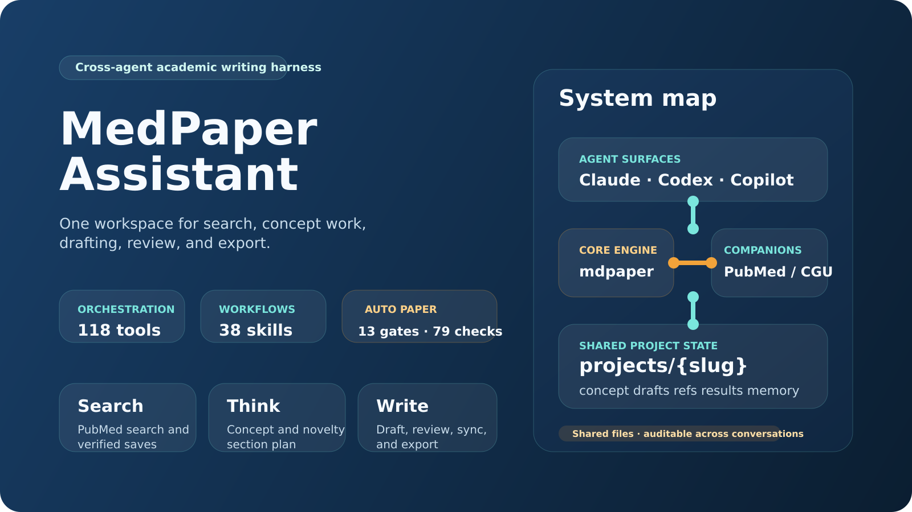
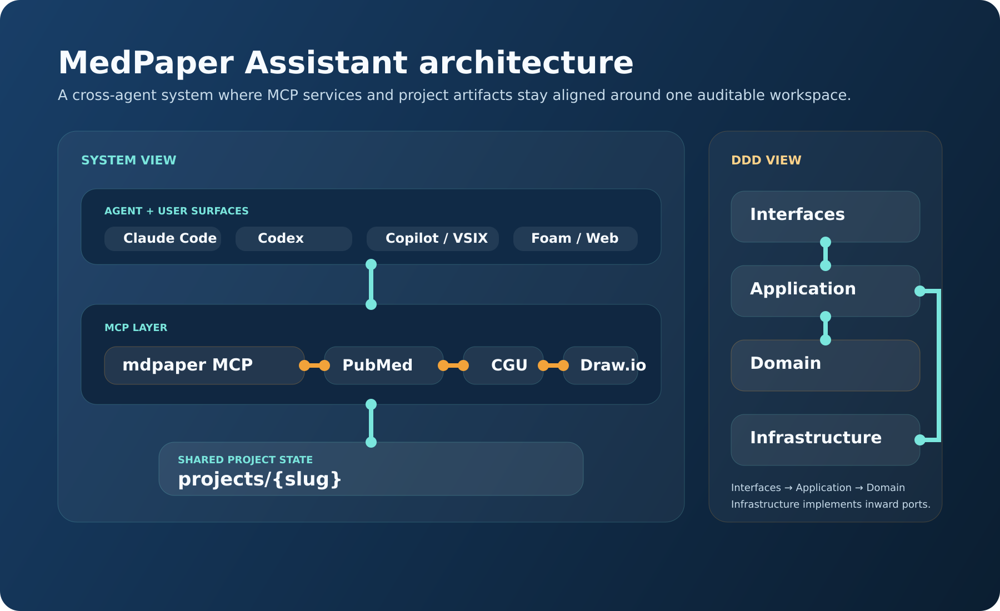

# Medical Paper Assistant 醫學論文寫作助手

<p align="center">
  <a href="https://www.python.org/downloads/"></a>
  <a href="https://modelcontextprotocol.io/"></a>
  <a href="https://github.com/features/copilot"></a>
  <a href="https://u9401066.github.io/med-paper-assistant/"></a>
  <a href="https://github.com/u9401066/med-paper-assistant"></a>
</p>

<p align="center">
  <b>🔬 可稽核的 MCP 自主與人機協作學術寫作工作區</b><br>
  <i>核心研究面：mdpaper 118 full / 12 compact + PubMed 45 + CGU 24 · 6 個受管 MCP（加上 Asset-Aware 30 + Draw.io 23 + Zotero Keeper 32）· 38 個技能 · 15 個 Prompt 工作流</i>
</p>

> 📖 [English Version](README.md)

> 🤖 **[Auto-Paper：自主＋人類協作寫作指南](docs/auto-paper-guide.md)** — 13 個主線 gate checkpoint + Phase 2.1 sub-gate、79 項品質檢查、結構化 Review Loop
>
> 🧭 **[GitHub Pages Wiki](https://u9401066.github.io/med-paper-assistant/)** — 36 個主題頁、Mermaid 流程圖、SVG 架構圖、全文搜尋與深色模式
>
> 🚦 **[每階段檢查與修正](https://u9401066.github.io/med-paper-assistant/wiki/research-pipeline/)** — 以人類看得懂的方式說明每個 code phase 的擋關、流程要求、提醒、修正路徑與人工判斷

核心目標不是一次生成整篇文字，而是讓受邊界約束的自主流程與研究者主導的寫作共用可觀察 checkpoint、evidence locator、quality gate、審閱 receipt 與可重現匯出。Solver 負責產生 artifacts，獨立檢查負責評分，未被證據支持的內容不會因文字流暢而取得 evidence credit。



---

## 📦 工具包內容一覽

這個 repository 是 MedPaper Assistant 的**完整作者面與整合工作區**。它把核心 MCP runtime、可安裝的 VSIX 擴充功能、bundled 教學文件，以及釘選的整合子模組放在同一個地方維護。

| 元件                                                               | 類型                 | 工具數                          | 說明                                                                                                   |
| ------------------------------------------------------------------ | -------------------- | ------------------------------- | ------------------------------------------------------------------------------------------------------ |
| **mdpaper**                                                        | 核心 MCP Server      | 118（full）/ 12（compact 預設） | manuscript 與 library-wiki 雙工作流，另含 3 個 MCP prompts 與 3 個 MCP resources                       |
| **[pubmed-search](https://github.com/u9401066/pubmed-search-mcp)** | MCP Server（子模組） | 45                              | PubMed/Europe PMC/CORE 搜尋、PICO、引用指標、session 管理                                              |
| **[CGU](https://github.com/u9401066/creativity-generation-unit)**  | MCP Server（子模組） | 24                              | 創意發想：腦力激盪、深度思考、火花碰撞                                                                 |
| **[VS Code Extension](vscode-extension/)**                         | 擴充功能             | 9 指令 + 10 chat                | MCP 自動註冊、compact-first 打包面、workspace 設定、LLM wiki 指南、Foam graph views、`@mdpaper` 參與者 |
| **[Dashboard](dashboard/)**                                        | Next.js Web App      | —                               | 專案管理 UI、圖表編輯器                                                                                |
| **[Foam](https://foambubble.github.io/foam/)**                     | VS Code 擴充功能     | —                               | `[[wikilink]]` 引用連結、懸停預覽、圖譜視圖                                                            |
| **[Skills](.claude/skills/)**                                      | Agent 工作流         | 38                              | 引導式多工具工作流，加上 Claude Code / Codex / OpenClaw 共用學術寫作契約                               |
| **[Prompts](.github/prompts/)**                                    | Prompt Files         | 15                              | `/mdpaper.search`、`/mdpaper.draft` 等                                                                 |

上表是三個核心研究 server；以下選用 server 補齊 6 個受管 MCP（透過 uvx 安裝）：

- **asset-aware（30 工具）** — 寫作前解析用戶提供的 DOCX/XLSX/PDF/PPTX 原始素材與文獻全文
- **drawio（23 工具）** — CONSORT/PRISMA 流程圖生成
- **zotero-keeper（32 工具）** — 從 Zotero 匯入參考文獻

上表與 MCP tool surface 的計數以 `tool-surface-authority.json` 與 `vscode-extension/bundle-manifest.json` 為單一來源，release / validate gate 會自動驗證。

### 如何選擇安裝面

| 安裝面              | 適合誰                            | 你會拿到什麼                                                                                                                                                                                 |
| ------------------- | --------------------------------- | -------------------------------------------------------------------------------------------------------------------------------------------------------------------------------------------- |
| **完整 repository** | 維護者、進階使用者、workflow 作者 | 核心 `mdpaper` runtime、釘選 MCP 整合/子模組、38 個 skills、15 個 prompt workflows、跨 Agent harness、repo scripts、tests 與作者文件                                                         |
| **VSIX 擴充功能**   | 想直接用打包體驗的終端使用者      | `@mdpaper`、9 個 palette commands、compact-first `mdpaper` runtime（預設 12 工具 / 可切 118）、14 個 bundled skills、13 個 bundled prompt workflows、9 個 bundled agents，以及 LLM wiki 文件 |

也就是說：repository 是較寬的工程面；VSIX 是較收斂的終端使用者面。

**VSX 說明**：擴充功能會驗證或安裝具 SHA-256 allowlist 的 `uv`/`uvx` 0.12.5，再以隔離且精確釘選的 SDK 2 來源啟動同版核心套件與所有受管外部 MCP。若 workspace 已在 `.vscode/mcp.json` 明確定義 `mdpaper`，該設定仍具最高權威並停用擴充功能自動註冊。CI smoke 覆蓋 `ubuntu-latest`、`windows-latest`、`macos-14`，以及五套 exact-archive integration。

### 各元件如何協作



### Claude Code、Codex 與 OpenClaw

三種 runtime 共用相同的證據與品質 gate：

| Runtime     | 專案指引                                             | 學術寫作 skill                                                                         |
| ----------- | ---------------------------------------------------- | -------------------------------------------------------------------------------------- |
| Claude Code | [`CLAUDE.md`](CLAUDE.md) 與 [`AGENTS.md`](AGENTS.md) | [`.claude/skills/academic-writing-harness/`](.claude/skills/academic-writing-harness/) |
| Codex       | [`AGENTS.md`](AGENTS.md)                             | [`.agents/skills/academic-writing-harness/`](.agents/skills/academic-writing-harness/) |
| OpenClaw    | [`AGENTS.md`](AGENTS.md) 加 workspace policy         | [`.agents/skills/academic-writing-harness/`](.agents/skills/academic-writing-harness/) |

平台中立的[學術寫作 workflow](docs/harness/academic-writing-workflow.md)涵蓋正式論文、計畫書、結案報告、小論文、preprint、審計 gate 與安全的範本文獻使用方式。

---

## 🎯 為什麼選擇這個工具？

**傳統論文寫作工具**要求你在開始前就知道確切的方向。但研究很少是這麼線性的。

**Medical Paper Assistant** 不只是寫作助手，而是研究工作區協調器：

- 🔍 **先探索，後決定** — 自由瀏覽文獻、儲存有興趣的論文，再決定研究方向
- 📥 **先登記原始素材** — Phase 0 會掃描用戶提供的 DOCX/XLSX/PDF/CSV，並標記必須先交給 asset-aware 解析的檔案
- 💬 **對話式工作流程** — 用自然語言與 AI 對話來精煉想法，不用填表單
- 🧭 **引導式流程** — 一步步的提示引導你從構思到可投稿的論文
- 🔗 **全部整合** — 搜尋、寫作、引用、分析、匯出 — 全部在 VS Code 裡

| 傳統工具                   | Medical Paper Assistant                                          |
| -------------------------- | ---------------------------------------------------------------- |
| 固定模板、僵化流程         | 彈性、探索式方法                                                 |
| 搜尋/寫作/引用分開多個 App | 同一工作區：118/12 mdpaper + 45 PubMed + 24 CGU 工具與打包工作流 |
| 手動管理參考文獻           | 自動儲存 + PubMed 驗證資料                                       |
| 匯出後再排版               | 直接匯出符合期刊格式的 Word                                      |
| 學習複雜介面               | 自然語言對話                                                     |

---

## 🚀 快速開始

### 系統需求

| 需求               | 版本         | 檢查方式                                               |
| ------------------ | ------------ | ------------------------------------------------------ |
| **Python**         | 3.12+        | `python3 --version`                                    |
| **Node.js**        | 24+          | `node --version`（僅維護者建置 VSIX/dashboard 時需要） |
| **Git**            | 任何近期版本 | `git --version`                                        |
| **VS Code**        | 最新版       | 說明 → 關於                                            |
| **GitHub Copilot** | 擴充功能     | 擴充功能面板                                           |

### 安裝

```bash
# 含子模組一起 clone
git clone --recursive https://github.com/u9401066/med-paper-assistant.git
cd med-paper-assistant

# 執行安裝腳本
./scripts/setup.sh          # Linux/macOS
.\scripts\setup.ps1         # Windows PowerShell
```

腳本會自動：

1. ✅ 建立 Python 虛擬環境（`.venv/`）
2. ✅ 初始化本 repository 釘選的 Git 子模組版本
3. ✅ 安裝所有依賴（透過 `uv`）
4. ✅ 建立 `.vscode/mcp.json` 設定，包含 `mdpaper`、`pubmed-search`、`cgu`、`zotero-keeper`、`asset-aware`、`drawio`
5. ✅ 驗證 MedPaper 與 CGU 啟動路徑

重要安裝說明：

- 安裝腳本使用本 repository 釘選的 submodule commit，確保可重現安裝；不會在安裝時自動追最新 upstream HEAD。
- 如果你要刻意升級 submodule，請自行執行 `git submodule update --remote --merge`，並在提交前完成測試。
- Draw.io MCP server 使用 submodule 內釘選的 Python SDK 2 套件（或對應不可變 commit archive）。只有選用的互動式 Draw.io web UI 需要 Node.js/npm，不再把 Node MCP 1 當 fallback。
- Repository mode 啟動釘選 submodule；Marketplace mode 對 PubMed、CGU、Zotero Keeper 與 Draw.io 安裝精確的 SDK 2 commit archive，不會漂移到未驗證的 latest package。
- Python frozen lock 目前解析到 stable MCP SDK 2.1.1。VSIX 與 dashboard 的 source build 採用與 CI 相同的 Node.js 24 基線；Marketplace 使用者執行已打包擴充功能時不需要 Node.js。

**驗證**：在 Copilot Chat 輸入 `/mcp`，應該看到 `mdpaper` 🎉

### 選用整合

```bash
# Foam：參考文獻連結（強烈推薦）
code --install-extension foam.foam-vscode

# Draw.io：圖表生成
./scripts/setup-integrations.sh && ./scripts/start-drawio.sh
```

Windows PowerShell：

```powershell
.\scripts\setup-integrations.ps1
.\scripts\start-drawio.ps1
```

---

## 💬 MCP Prompts — 輸入指令即可開始

在 Copilot Chat 中輸入這些指令觸發引導式工作流：

| 指令                | 說明                                   |
| ------------------- | -------------------------------------- |
| `/mdpaper.search`   | 🔍 **從這裡開始！** 探索文獻、儲存論文 |
| `/mdpaper.concept`  | 📝 發展研究概念，含新穎性驗證          |
| `/mdpaper.draft`    | ✍️ 撰寫草稿，自動插入引用              |
| `/mdpaper.analysis` | 📊 分析 CSV 數據，生成圖表和 Table 1   |
| `/mdpaper.format`   | 📄 匯出符合期刊格式的 Word             |
| `/mdpaper.clarify`  | 🔄 對話式修正特定段落                  |
| `/mdpaper.project`  | 📁 建立或切換研究專案                  |
| `/mdpaper.strategy` | ⚙️ 設定搜尋策略（日期、篩選）          |
| `/mdpaper.help`     | ❓ 顯示所有可用指令                    |

### 兩條工作流路徑

**Library Wiki Path**

- 先建立 `workflow_mode="library-wiki"` 專案
- 走 `reference_action` 加上直接的 `save_reference_mcp` verified save → `library_action` → 必要時切 full surface 生成 wiki
- 需要時再用 `materialize_agent_wiki`、Foam graph views 與 `docs/how-to/llm-wiki.md` 做跨筆記合成與巡覽

**Manuscript Path**

- 建立 `workflow_mode="manuscript"` 專案
- 走 `/mdpaper.search` → `/mdpaper.concept` → `/mdpaper.draft` → `/mdpaper.format`
- 只有這條路才套用 concept validation、review loop、export gates

> 💡 **建議用法**：先用 Library Wiki Path 收斂文獻與概念，再切去 Manuscript Path 進入正式寫稿。

## Foam + Copilot 個人知識庫

MedPaper 目前已把 Foam 放在瀏覽與圖譜層，讓 Copilot 專注於 ingest、身份正規化、knowledge map / synthesis page 生成、evidence block anchors，以及受管的 graph views。

目前這層整合已經包含 orphan / placeholder 修復流程、寫入 `inbox/` / `review/` / `daily/` 的模板化 capture、更豐富的 `foam-query` dashboard、輸出到 `notes/publish/` 的 publish-safe wikilink reference pack，以及專案專用的 `graph_views_json` graph slice。

教學與參考文件：

- [GitHub Pages Wiki](https://u9401066.github.io/med-paper-assistant/)
- [正式學術產出型別](docs/harness/output-profiles.md)
- [生產級學術寫作架構](docs/design/production-academic-writing-harness.md)
- [MedPaper LLM Wiki 使用指南](docs/how-to/llm-wiki.md)
- [Foam 相依層參考](docs/reference/foam.md)
- [ICU sedation / delirium graph view 範例](docs/how-to/llm-wiki.md)

---

## 🧠 技能系統 + 專案記憶

**核心差異化**：我們不只提供工具 — 我們提供**引導式工作流**來有效組合工具，以及**專案記憶**來跨 session 記住你的研究歷程。

### 什麼是技能？

```
工具 (Tool) = 單一能力（搜尋、儲存、分析...）
技能 (Skill) = 完整知識（如何組合工具完成任務）
```

以下是 38 個技能中的代表性技能家族：

| 分類    | 技能                                                                                | 觸發語                                      |
| ------- | ----------------------------------------------------------------------------------- | ------------------------------------------- |
| 🔬 研究 | `literature-review`, `concept-development`, `concept-validation`, `parallel-search` | 「找論文」「search」「concept」「validate」 |
| ✍️ 寫作 | `draft-writing`, `reference-management`, `word-export`                              | 「寫草稿」「draft」「citation」「export」   |
| 📁 管理 | `project-management`, `memory-updater`, `memory-checkpoint`                         | 「新專案」「切換」「存檔」                  |
| 🛠️ 開發 | `git-precommit`, `code-refactor`, `test-generator`, `code-reviewer`                 | 「commit」「refactor」「test」              |

### 專案記憶

每個專案維持自己的 `.memory/` 資料夾，讓 AI 跨 session 連貫地延續研究；實際目錄會依 workflow mode 分流：

**Manuscript Path**

```
projects/{slug}/
├── .memory/
│   ├── activeContext.md   ← Agent 的工作記憶
│   └── progress.md        ← 研究里程碑
├── concept.md             ← 研究構想（含 🔒 保護區塊）
├── references/            ← Foam 相容的文獻庫
├── drafts/                ← Markdown 草稿（含 [[引用]]）
├── data/                  ← CSV 資料檔
└── results/               ← 圖表、.docx 匯出
```

**Library Wiki Path**

```
projects/{slug}/
├── .memory/
│   ├── activeContext.md   ← 文獻庫目前焦點與 triage 狀態
│   └── progress.md        ← ingest / organize / synthesize 進度
├── concept.md             ← library workspace seed
├── references/            ← 物化的 reference notes
├── inbox/                 ← 原始筆記與捕捉區
├── concepts/              ← 原子概念頁與雙向連結
├── review/                ← graph 修復工作單與審閱筆記
├── daily/                 ← 模板化每日捕捉頁
└── projects/              ← synthesis pages / workstreams
```

---

## ✨ 主要功能

### 文獻搜尋與管理

- **PubMed + Europe PMC + CORE** 搜尋（45 個搜尋工具）
- **PICO 解析** 處理臨床問題
- **MCP-to-MCP 驗證 metadata** — PMID 查詢保留來源回應與信任層；後續詮釋仍須通過 evidence checks
- 分層信任：🔒 VERIFIED（PubMed）· 🤖 AGENT（AI 筆記）· ✏️ USER（你的筆記）
- Foam wikilink：`[[author2024_12345678]]` 含懸停預覽和反向連結
- **Library Wiki Path** — `inbox/`、`concepts/`、`projects/` 三層筆記流，支援 reading queues 與 cross-note dashboard
- **LLM wiki 物化** — 自動生成 `notes/index.md`、`notes/library/overview.md`、context hubs、draft section / figure / table graph notes

### 寫作與編輯

- **AI 草稿生成**（Introduction、Methods、Results、Discussion 逐章節）
- **Citation-Aware Editing** — `patch_draft` 儲存前驗證所有 `[[wikilinks]]`
- **自動修復引用格式** — `[[12345678]]` → `[[author2024_12345678]]`
- **新穎性驗證** — 3 輪獨立評分（門檻：75/100）
- **語體與作者完整性** — 證據導向、voice/clarity 與揭露檢查；不以規避 AI detector 為優化目標

### 資料分析

- CSV 資料集分析（描述性統計）
- 統計檢定（t-test、ANOVA、chi²、相關性、Mann-Whitney、Fisher's）
- **Table 1 生成器** — 基線特徵表，自動偵測變數類型
- 出版品質圖表（matplotlib/seaborn）
- **內容完整性審閱** — SHA-256/MIME receipt、可選 C2PA 驗證，以及版本鎖定的 `remove-ai-watermarks` 可見／公開 DWT detector；全程離線、只做偵測、保留原件、不寫出去除後衍生檔，且「未偵測」永遠不等於乾淨

### 匯出與投稿

- **Word 匯出**，支援期刊模板
- Cover Letter + Highlights 生成
- 稿件一致性檢查器
- Reviewer 回覆生成器（逐條回覆格式）
- 投稿清單檢查（字數、圖片格式等）

### 基礎架構

- **DDD 架構**（Domain-Driven Design）清晰的分層設計
- **16 個 pre-commit hooks**（ruff、mypy、bandit、pytest、prettier、doc-update...）
- **Workspace State** 跨 session 狀態恢復
- **uv** 管理所有 Python 套件
- **MCP SDK 2.x** — 不支援舊 1.x runtime；tools、prompts、resources、elicitation 與長任務 progress notifications 均走 v2 SDK surface
- **受管 Foam graph views** — Default、Evidence、Writing、Assets、Review 五個命名圖譜切片

---

## 🏗️ 架構

```
┌──────────────────────────────────────────────────────────────────────────┐
│                          👤 使用者層                                      │
│  ┌─────────────────┐    ┌──────────────────────────────┐  ┌──────────┐  │
│  │   VS Code        │    │  Foam 擴充功能                │  │Dashboard │  │
│  │   編輯器         │    │  [[wikilinks]] 自動補全       │  │(Next.js) │  │
│  │                  │    │  懸停預覽 · 反向連結           │  │          │  │
│  └─────────────────┘    └──────────────────────────────┘  └──────────┘  │
└──────────────────────────────────────────────────────────────────────────┘
                                    │
                                    ▼
┌──────────────────────────────────────────────────────────────────────────┐
│               🤖 Copilot Agent（協調者）                                   │
│      38 技能 + 15 Prompt 工作流 + 跨 Agent 自訂                           │
│   /mdpaper.search → /mdpaper.concept → /mdpaper.draft → 匯出            │
└───────┬──────────────────┬──────────────────┬──────────────────┬─────────┘
        │                  │                  │                  │
        ▼                  ▼                  ▼                  ▼
┌───────────────┐  ┌───────────────┐  ┌───────────────┐  ┌───────────────┐
│ 📝 mdpaper    │  │🔍 pubmed-     │  │💡 cgu         │  │🔌 外部 MCPs   │
│ 118/12 工具   │  │  search       │  │  24 工具      │  │   (uvx)       │
│               │  │  45 工具      │  │               │  │               │
│ • 專案管理    │  │ • PubMed      │  │ • 腦力激盪    │  │ 🎨 drawio     │
│ • 參考文獻    │  │ • Europe PMC  │  │ • 深度思考    │  │ • 流程圖      │
│ • 草稿        │  │ • CORE        │  │ • 火花碰撞    │  │               │
│ • 驗證        │  │ • PICO        │  │ • 創意方法    │  │ 📖 zotero     │
│ • 資料分析    │  │ • 基因/化合物 │  │               │  │ • 匯入文獻    │
│ • 匯出        │  │ • Session     │  │               │  │ 📥 asset-aware│
│               │  │               │  │               │  │ • docx/xlsx   │
│               │  │               │  │               │  │ • fulltext    │
└───────┬───────┘  └───────────────┘  └───────────────┘  └───────────────┘
        │
        ▼
┌──────────────────────────────────────────────────────────────────────────┐
│                          💾 本地儲存                                      │
│  projects/{slug}/                                                        │
│  ├── .audit/source-materials.yaml ← Phase 0 掃描用戶原始素材             │
│  ├── concept.md          ← 研究構想（含 🔒 保護區塊）                     │
│  ├── references/{pmid}/  ← Foam 相容 .md + metadata.json                 │
│  ├── drafts/             ← Markdown 草稿（含 [[引用]]）                   │
│  ├── data/               ← CSV 資料檔                                    │
│  └── results/            ← 圖表、.docx 匯出                              │
└──────────────────────────────────────────────────────────────────────────┘
```

### MCP-to-MCP 直接通訊

儲存文獻時，資料在 MCP Server 之間直接傳遞 — Agent 只傳 PMID，不傳完整 metadata：

```
Agent: "儲存 PMID:24891204"
     │
     ▼
mdpaper.save_reference_mcp(pmid="24891204")
     │  直接 HTTP 呼叫（不經過 Agent）
     ▼
pubmed-search: GET /api/cached_article/24891204
     │  回傳已驗證的 PubMed 資料
     ▼
以分層信任儲存：
  🔒 VERIFIED: PubMed 資料（不可修改）
  🤖 AGENT:    AI 筆記（標示來源）
  ✏️ USER:     你的筆記（可編輯）
```

---

## 🛠️ mdpaper MCP 工具

mdpaper MCP server 暴露 **118（full）/ 12（compact 預設）** 個工具，另加 **3 個 MCP prompts** 與 **3 個 MCP resources**。

這些數字由 `tool-surface-authority.json` 與 `scripts/check_tool_surface_authority.py` 依實際 runtime 註冊結果驗證；只要文件與權威數據漂移，validate / release gate 就會失敗。

compact 模式只暴露以下 12 個穩定入口，隱藏多數細粒度 public verbs；若要完整 surface，設定 `MEDPAPER_TOOL_SURFACE=full`。

| Compact 能力 | 工具                                                       |
| ------------ | ---------------------------------------------------------- |
| 專案／狀態   | `project_action`、`workspace_state_action`                 |
| 知識庫／文獻 | `library_action`、`reference_action`、`save_reference_mcp` |
| 草稿／分析   | `draft_action`、`analysis_action`                          |
| 驗證／審閱   | `validation_action`、`run_quality_checks`                  |
| Pipeline     | `pipeline_action`                                          |
| 匯出         | `export_document`、`inspect_export`                        |

`save_reference_mcp(pmid)` 刻意保留為直接的 compact safe verb，避免 verified PubMed retrieval 與較低信任層的 `reference_action(action="save_agent")` fallback 混淆。

以下表格整理具代表性的 full-surface 工具；compact client 透過上述入口抵達相同 domain capabilities。

### 📁 專案管理

專案、探索模式、工作區狀態恢復、圖表管理。

| 關鍵工具                                               | 說明                |
| ------------------------------------------------------ | ------------------- |
| `create_project` / `switch_project` / `delete_project` | 專案生命週期        |
| `start_exploration` / `convert_exploration_to_project` | 先探索後建專案      |
| `get_workspace_state` / `sync_workspace_state`         | 跨 session 狀態恢復 |
| `save_diagram` / `list_diagrams`                       | Draw.io 整合        |
| `setup_project_interactive`                            | 互動式論文類型設定  |
| `update_authors`                                       | 管理結構化作者資訊  |

### 📚 參考文獻管理

儲存、搜尋、格式化、管理參考文獻，整合 Foam。

| 關鍵工具                                            | 說明                                                  |
| --------------------------------------------------- | ----------------------------------------------------- |
| `reference_action`                                  | **Compact 預設** — 瀏覽、讀取、格式化與分析文獻       |
| `save_reference_mcp`                                | **推薦** — 透過 PMID 經由 MCP-to-MCP 儲存（驗證資料） |
| `list_saved_references` / `search_local_references` | 瀏覽和搜尋已存文獻                                    |
| `format_references` / `set_citation_style`          | Vancouver / APA / Nature                              |
| `sync_references`                                   | 將 `[[wikilinks]]` 同步為編號引用                     |

### ✍️ 草稿與編輯

寫作、編輯、引用 — 內建驗證。

| 關鍵工具                                      | 說明                                            |
| --------------------------------------------- | ----------------------------------------------- |
| `draft_section` / `write_draft`               | 建立和撰寫各章節                                |
| `list_drafts` / `read_draft` / `delete_draft` | 草稿生命週期                                    |
| `get_available_citations`                     | 編輯前列出所有可用的 `[[citation_key]]`         |
| `patch_draft`                                 | **Citation-aware** 部分編輯，自動驗證 wikilinks |
| `insert_citation` / `suggest_citations`       | 智慧引用插入                                    |
| `scan_draft_citations` / `sync_references`    | 引用管理                                        |
| `count_words`                                 | 段落、章節與全文字數檢查                        |

### ✅ 驗證

| 工具                      | 說明                                                |
| ------------------------- | --------------------------------------------------- |
| `validate_concept`        | 對目前 concept 做完整新穎性評估                     |
| `validate_wikilinks`      | 自動修復 `[[12345678]]` → `[[author2024_12345678]]` |
| `compare_with_literature` | 將研究想法與已存文獻做差異與重疊比較                |

### 📊 資料分析

| 工具                   | 說明                          |
| ---------------------- | ----------------------------- |
| `analyze_dataset`      | CSV 描述性統計                |
| `run_statistical_test` | t-test、ANOVA、chi²、相關性等 |
| `generate_table_one`   | 基線特徵表，自動偵測變數類型  |
| `create_plot`          | 出版品質圖表                  |
| `insert_figure`        | 插入圖片至草稿，含歸檔驗證    |
| `insert_table`         | 插入表格至草稿，含歸檔驗證    |
| `list_assets`          | 列出專案 results 中的圖表資源 |

### 🔍 審查與審計

| 分類              | 關鍵工具                                                                  |
| ----------------- | ------------------------------------------------------------------------- |
| **Pipeline 閘門** | `validate_phase_gate`、`pipeline_heartbeat`、`validate_project_structure` |
| **Review 迴圈**   | `start_review_round`、`submit_review_round`、`request_section_rewrite`    |
| **Pipeline 控制** | `pause_pipeline`、`resume_pipeline`、`approve_section`                    |
| **審計與 Hooks**  | `run_quality_audit`、`run_writing_hooks`、`record_hook_event`             |
| **自我演進**      | `run_meta_learning`、`verify_evolution`、`apply_pending_evolutions`       |
| **領域約束**      | `check_domain_constraints`、`evolve_constraint`                           |
| **資料與健康**    | `validate_data_artifacts`、`diagnose_tool_health`、`check_formatting`     |

### 📄 匯出與投稿

| 分類         | 關鍵工具                                                                                                                        |
| ------------ | ------------------------------------------------------------------------------------------------------------------------------- |
| **檢查**     | `inspect_export(action="list_templates")`、`inspect_export(action="read_template")`、`inspect_export(action="verify_document")` |
| **Session**  | `export_document(action="session_start")`、`export_document(action="session_insert")`、`export_document(action="session_save")` |
| **Pandoc**   | `export_document(action="docx")`、`export_document(action="pdf")`、`inspect_export(action="docx_smoke")`                        |
| **投稿準備** | `generate_cover_letter`、`generate_highlights`                                                                                  |

### 🧩 MCP Prompts 與 Resources

| 能力          | 名稱 / URI                                                                                    | 用途                                                  |
| ------------- | --------------------------------------------------------------------------------------------- | ----------------------------------------------------- |
| **Prompts**   | `project_bootstrap`、`draft_section_plan`、`word_export_checklist`                            | 透過官方 MCP prompt API 生成引導式工作流內容          |
| **Resources** | `medpaper://workspace/state`、`medpaper://workspace/projects`、`medpaper://templates/catalog` | 透過 MCP resources 暴露工作區狀態、專案列表與模板資訊 |

### 🔍 pubmed-search MCP 工具（45 工具）

| 分類            | 關鍵工具                                                                  |
| --------------- | ------------------------------------------------------------------------- |
| **搜尋**        | `unified_search`、`generate_search_queries`、`parse_pico`                 |
| **資料庫**      | PubMed、Europe PMC（全文 + 文本挖掘）、CORE（2 億+ 開放取用）             |
| **基因/化合物** | `search_gene`、`get_gene_details`、`search_compound`、`search_clinvar`    |
| **探索**        | `find_related_articles`、`find_citing_articles`、`get_article_references` |
| **匯出**        | `prepare_export`（RIS/BibTeX/CSV）、`get_citation_metrics`（iCite RCR）   |
| **Session**     | `read_session(action="pmids")`、`get_session_log`（不受 AI 記憶限制）     |

### 💡 CGU 創意工具（24 工具）

| 分類     | 關鍵工具                                                    |
| -------- | ----------------------------------------------------------- |
| **發想** | `generate_ideas`、`spark_collision`、`spark_collision_deep` |
| **分析** | `deep_think`、`multi_agent_brainstorm`                      |
| **方法** | `list_methods`、`select_method`、`apply_method`             |

CGU 執行說明：

- 在 repository 工作流中，CGU 透過釘選子模組啟動：`uv run --directory integrations/cgu python -m cgu.server`
- 在 VSX 工作流中，MedPaper 只有在 bundled code 或 workspace submodule 可用時才會註冊 CGU；否則會安全略過，不會阻塞其他功能
- CGU 自身支援 Python `>=3.11`，但本 repository 目前要求 Python `>=3.12`，因此 macOS、Linux、Windows 的 repo 安裝都應以 Python 3.12 為基線
- 預設 `.vscode/mcp.json` 使用 `CGU_THINKING_ENGINE=simple`，這是低摩擦模式；較進階的 LLM 模式仍需要 CGU 端模型與 provider 設定

---

## 🔗 Foam 整合

| 功能          | 使用方式                                          | 好處                                                    |
| ------------- | ------------------------------------------------- | ------------------------------------------------------- |
| **Wikilinks** | `[[greer2017_27345583]]`                          | 在草稿、concept pages、synthesis pages 間互連           |
| **懸停預覽**  | 滑鼠移到 `[[連結]]`                               | 不用開檔案就能看摘要                                    |
| **反向連結**  | 開啟參考文獻檔案                                  | 查看哪些草稿或 wiki 筆記引用了這篇論文                  |
| **圖譜視圖**  | `Ctrl+Shift+P` → `MedPaper: Show Foam Graph: ...` | 直接切到 Default / Evidence / Writing / Assets / Review |
| **物化索引**  | `notes/index.md`、`notes/library/overview.md`     | 查看 live counts、context hubs、asset/draft graph nodes |
| **專案隔離**  | `switch_project` 自動切換                         | 只看到當前專案的引用                                    |

### LLM Wiki 補強點

- `notes/index.md` 會輸出 live Foam query counts
- registered figures / tables 會 materialize 成一級 graph notes
- draft sections 與 journal/author/topic/context hubs 會帶 graph-friendly frontmatter
- library dashboard 支援 `overview`、`queues`、`concepts`、`links`、`synthesis` 五種 cross-note 視圖

### 引用自動補全

撰寫草稿時，輸入 `[[` 觸發引用選單：

<!-- prettier-ignore -->
```markdown
根據先前研究 [[    ← 在這裡輸入 [[
               ┌─────────────────────────────┐
               │ 🔍 greer2017_27345583       │
               │    smith2020_12345678       │
               │    chen2019_87654321        │
               └─────────────────────────────┘
```

可依作者（`[[greer`）、年份（`[[2017`）、PMID（`[[27345583`）、關鍵字（`[[sedation`）搜尋。

---

## 📚 參考文獻檔案結構

參考文獻以 **Foam 優化、分層信任** 的結構儲存：

```
references/{pmid}/
├── {citation_key}.md   ← YAML frontmatter + 摘要（人類可讀）
└── metadata.json       ← 完整 metadata（程式用）
```

```yaml
---
# 🔒 VERIFIED（來自 PubMed，不可修改）
title: "Complications of airway management"
author:
  - { family: Pacheco-Lopez, given: Paulette C }
year: 2014
journal: Respiratory Care
pmid: "24891204"
_source:
  mcp: pubmed-search
  verified: true

# 🤖 AGENT（AI 生成，已標示）
_agent:
  notes: "呼吸道管理併發症的重要 review"
  relevance: high

# Foam
aliases: [pachecolopez2014, "PMID:24891204"]
tags: [reference, airway, review]
---
```

---

## 📂 專案結構

```
med-paper-assistant/
├── src/med_paper_assistant/       # 核心 MCP Server（DDD 架構）
│   ├── domain/                    #   業務邏輯、實體、值物件
│   ├── application/               #   用例、服務
│   ├── infrastructure/            #   DAL、外部服務
│   └── interfaces/mcp/            #   MCP Server，118 full / 12 compact 工具 + 3 prompts + 3 resources
│
├── integrations/                  # 內建 MCP Server
│   ├── pubmed-search-mcp/         #   PubMed/PMC/CORE 搜尋（45 工具）
│   └── cgu/                       #   創意發想（24 工具）
│
├── vscode-extension/              # 打包後的 VSIX surface
│   ├── src/                       #   擴充功能原始碼
│   ├── bundled/tool/              #   marketplace 安裝用 Python runtime mirror
│   ├── skills/                    #   bundled skills
│   ├── docs/                      #   bundled Foam / LLM wiki 文件
│   └── prompts/                   #   快速操作 Prompts
│
├── dashboard/                     # Next.js 專案管理 UI
│   └── src/
│
├── projects/                      # 研究專案（獨立工作區）
│   └── {slug}/
│       ├── .memory/               #   跨 session AI 記憶
│       ├── concept.md             #   研究構想或 library workspace seed
│       ├── references/            #   本地文獻庫
│       ├── drafts/                #   Markdown 草稿（manuscript path）
│       ├── inbox/                 #   原始筆記（library-wiki path）
│       ├── concepts/              #   原子概念頁（library-wiki path）
│       ├── projects/              #   合成頁 / workstreams（library-wiki path）
│       └── results/               #   圖表、匯出
│
├── .agents/skills/                # Codex + OpenClaw repository skills
├── .claude/skills/                # 38 個 Claude Code / workflow 技能定義
├── .github/prompts/               # 15 個 Prompt 工作流
├── templates/                     # 期刊 Word 範本
├── memory-bank/                   # 全域專案記憶
└── tests/                         # pytest 測試套件
```

---

## 🗺️ 開發藍圖

| 狀態 | 功能                        | 說明                                                                                       |
| ---- | --------------------------- | ------------------------------------------------------------------------------------------ |
| ✅   | **6 個受管 MCP Server**     | mdpaper（118/12）、PubMed（45）、CGU（24）、Asset-Aware（30）、Draw.io（23）、Zotero（32） |
| ✅   | **Foam 整合**               | Wikilinks、懸停預覽、反向連結、命名 graph views、專案隔離                                  |
| ✅   | **Project Memory**          | `.memory/` 跨 session AI 記憶                                                              |
| ✅   | **Table 1 生成器**          | 自動生成基線特徵表                                                                         |
| ✅   | **新穎性驗證**              | 3 輪評分，門檻 75/100                                                                      |
| ✅   | **Citation-Aware Editing**  | `patch_draft` 含 wikilink 驗證                                                             |
| ✅   | **MCP-to-MCP 信任**         | 透過 HTTP 直接取得 PubMed 驗證資料                                                         |
| ✅   | **Pre-commit Hooks**        | 16 hooks（ruff、mypy、bandit、pytest、prettier...）                                        |
| 🔜   | **更完整的 VSX UX**         | TreeView、CodeLens、Diagnostics 與更深入的編輯器內表面（方向 C）                           |
| 🔜   | **Pandoc 匯出**             | Word + LaTeX 雙格式匯出（CSL 引用）                                                        |
| 📋   | **系統性回顧**              | PRISMA 流程、偏差風險、統合分析                                                            |
| 📋   | **AI Writing Intelligence** | 引用智慧、連貫性引擎                                                                       |
| 📋   | **REST API 模式**           | 將工具公開為 REST API                                                                      |

**架構方向**：[Direction C — Full VSX + Foam + Pandoc](ROADMAP.md)

**圖例：** ✅ 已完成 | 🔜 進行中 | 📋 規劃中

---

## 🤝 參與貢獻

我們歡迎貢獻！請參閱 [CONTRIBUTING.md](CONTRIBUTING.md)、[行為準則](CODE_OF_CONDUCT.md) 與 [SECURITY.md](SECURITY.md) 的私密漏洞回報流程。

- 🐛 **回報 Bug** — 開 issue
- 💡 **建議功能** — 分享想法
- 🔧 **提交程式碼** — Fork → Branch → PR

---

## 📚 引用

如果您使用 Medical Paper Assistant，請引用 [`CITATION.cff`](CITATION.cff) 所描述的軟體版本。以下提供 BibTeX 範例：

```bibtex
@software{medpaperassistant_2026,
  author  = {{MedPaper Assistant contributors}},
  title   = {Medical Paper Assistant},
  year    = {2026},
  version = {1.0.3},
  url     = {https://github.com/u9401066/med-paper-assistant},
  license = {Apache-2.0}
}
```

請勿引用未公開稿件或自行填入 DOI；未來若有 archived release DOI，會直接更新在 `CITATION.cff`。

---

## 📄 授權

Apache License 2.0 — 詳見 [LICENSE](LICENSE)
