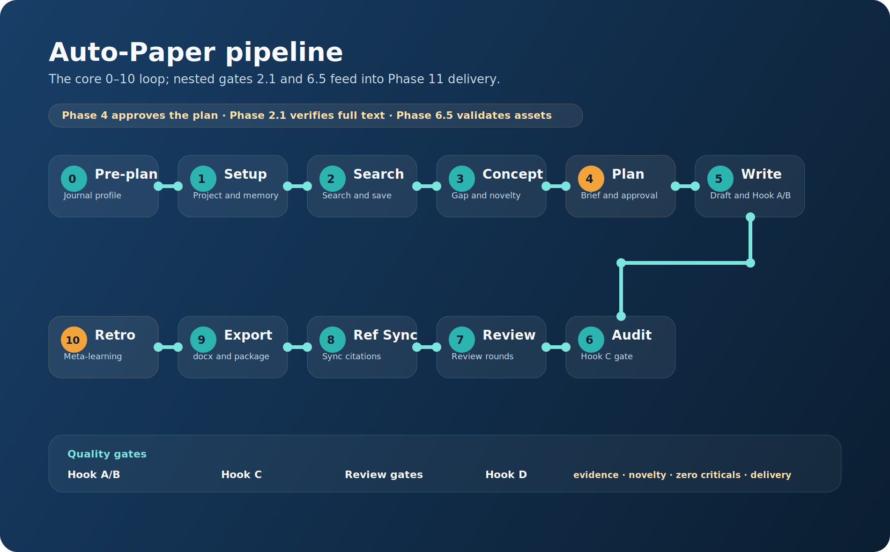

# Auto-Paper: Fully Autonomous Paper Writing Guide

> **完整的自動論文撰寫系統文件** — 從文獻搜尋到 Word 匯出的 11 階段 Pipeline

---

## 目錄

- [概觀](#概觀)
- [快速開始](#快速開始)
- [11-Phase Pipeline](#11-phase-pipeline)
  - [Phase 0: Pre-Planning](#phase-0-pre-planning)
  - [Phase 1: Project Setup](#phase-1-project-setup)
  - [Phase 2: Literature Search](#phase-2-literature-search)
  - [Phase 3: Concept Development](#phase-3-concept-development)
  - [Phase 4: Manuscript Planning](#phase-4-manuscript-planning)
  - [Phase 5: Section Writing](#phase-5-section-writing)
  - [Phase 6: Cross-Section Audit](#phase-6-cross-section-audit)
  - [Phase 7: Autonomous Review](#phase-7-autonomous-review)
  - [Phase 8: Reference Sync](#phase-8-reference-sync)
  - [Phase 9: Export](#phase-9-export)
  - [Phase 10: Retrospective](#phase-10-retrospective)
- [Hook 品質保證系統](#hook-品質保證系統)
  - [Hook A: post-write](#hook-a-post-write)
  - [Hook B: post-section](#hook-b-post-section)
  - [Hook C: post-manuscript](#hook-c-post-manuscript)
  - [Hook D: meta-learning](#hook-d-meta-learning)
- [manuscript-plan.yaml 規格](#manuscript-planyaml-規格)
- [journal-profile.yaml 規格](#journal-profileyaml-規格)
- [Autonomous Review 機制](#autonomous-review-機制)
- [Audit Trail 與 Checkpoint](#audit-trail-與-checkpoint)
- [跨 MCP 編排](#跨-mcp-編排)
- [自動決策邏輯](#自動決策邏輯)
- [自我證明：本系統寫出的論文](#自我證明本系統寫出的論文)

---

## 概觀

Auto-Paper 是 MedPaper Assistant 的全自動論文撰寫技能，具備以下核心特性：

- **11 階段 Pipeline**（Phase 0-11，含 `Phase 6.5`）：從期刊設定到 Word 匯出的完整流程
- **42 項自動品質檢查**（Hook A-D）：寫作過程中即時修正，不需人工介入
- **段落級 Section Brief**：`manuscript-plan.yaml` 控制每段的論點、引用、字數
- **結構化 Autonomous Review**：模擬 4 種審稿角色，產出 Review Report + Author Response
- **閉環自我改進**（Meta-Learning）：Hook D 根據統計調整閾值，系統會越來越好
- **Checkpoint 恢復**：任何階段中斷都可從斷點繼續



### 架構圖

```
Instructions (AGENTS.md)
    ↓
Skill (auto-paper SKILL.md)  ← 定義「何時」做什麼
    ↓
Writing (drafts/)             ← Skill 呼叫工具產出草稿
    ↓
Hooks (A-D audit)             ← 定義「品質」標準
    ↓ 回饋
Meta-Learning (Phase 10)      ← 更新 Skill / Hook / Instructions
```

### 觸發方式

在 Copilot Chat 中使用以下任一方式啟動：

| 方式     | 指令                                                        |
| -------- | ----------------------------------------------------------- |
| Prompt   | 在 Copilot Chat 輸入 `/mdpaper.write-paper`                 |
| 自然語言 | 「全自動寫論文」「autopilot」「一鍵寫論文」「幫我寫完整篇」 |

---

## 快速開始

**最簡流程**（5 步驟）：

1. **啟動**：在 Copilot Chat 輸入 `/mdpaper.write-paper`
2. **設定期刊**：提供目標期刊名稱（Agent 會自動產生 `journal-profile.yaml`）
3. **確認大綱**：Agent 搜尋文獻 → 發展概念 → 產出 `manuscript-plan.yaml` → 你確認
4. **等待寫作**：Agent 自動撰寫各 section，Hook A-D 即時修正品質
5. **匯出**：Agent 產出 Word 檔 + 必要投稿文件

> 💡 整個過程中 **唯一需要人工確認** 的是 Phase 4 的 `manuscript-plan.yaml` 大綱。其他階段全部自動執行。

---

## 11-Phase Pipeline

### Phase 0: Pre-Planning

**目的**：建立期刊約束，生成 `journal-profile.yaml`

| 項目 | 說明                                       |
| ---- | ------------------------------------------ |
| 輸入 | 期刊名稱 / submission guide PDF / 口頭描述 |
| 輸出 | `projects/{slug}/journal-profile.yaml`     |
| Gate | YAML 存在 + 用戶確認關鍵欄位               |

Agent 按優先順序取得資訊：

1. 用戶提供 submission guide → 自動解析（字數、圖表限制、引用格式等）
2. 用戶口頭說明 → 查詢內建期刊庫補全
3. 無明確期刊 → 使用 paper_type 預設值

`journal-profile.yaml` 驅動後續所有 Phase 的行為（字數限制、圖表上限、Hook 閾值等）。

### Phase 1: Project Setup

**技能**：`project-management`

建立專案結構，載入 journal-profile，確認 paper_type 一致。

### Phase 2: Literature Search

**技能**：`literature-review` + `parallel-search`  
**外部 MCP**：pubmed-search、zotero-keeper（選用）

1. 生成搜尋策略（MeSH + 同義詞）
2. 並行搜尋 3-5 組
3. 以 citation metrics 排序（Relative Citation Ratio）
4. 選前 15-20 篇 → `save_reference_mcp(pmid)` 儲存（MCP-to-MCP 驗證資料）
5. 可選：從 Zotero 匯入

**Gate**：≥ 10 篇文獻已儲存

### Phase 3: Concept Development

**技能**：`concept-development`  
**外部 MCP**：CGU（創意發想，當 novelty 不足時）

1. 分析文獻 → 識別 Gap
2. 撰寫 `concept.md`（含 🔒 NOVELTY STATEMENT + 🔒 KEY SELLING POINTS）
3. `validate_concept()` → 三輪獨立評分
4. 分數 < 75 → 自動修正 1 次 → 仍不足 → CGU `deep_think` / `spark_collision` → 再修正
5. 分數 < 60（兩次）→ **硬停止**，回報用戶

**Gate**：concept score ≥ 75 或用戶明確同意繼續

### Phase 4: Manuscript Planning

> **唯一需要人工確認的階段**

**產出**：`manuscript-plan.yaml`（段落級 Section Brief）

這是整個 Pipeline 的核心規劃文件，包含：

- **寫作順序**：依期刊 / paper type 決定（例：Methods → Results → Introduction → Discussion → Abstract）
- **段落級 Brief**：每段有 `topic`、`key_claims`、`must_cite`、`word_target`
- **🔒 保護段落**：Novelty Statement / Selling Points 標記 `protected: true`
- **Asset Plan**：圖表、統計檢定的生成計畫（含工具、參數、caption）
- **投稿清單**：依 journal-profile 列出需準備文件

Agent 呈現摘要 → 你確認或調整 → 存入 `projects/{slug}/manuscript-plan.yaml`

**Gate**：plan 已確認 + 圖表數量不超限

### Phase 5: Section Writing

**技能**：`draft-writing`  
**外部 MCP**：drawio（流程圖）、CGU（強化論點）

這是最複雜的 Phase，包含段落級寫作 + 即時品質檢查的 cascading loop：

```
FOR section IN writing_order:
  1. 準備：讀取 plan + 已完成 sections + 可用引用
  2. Asset 生成：依 asset_plan 產生圖表（Table 1、統計圖、流程圖等）
  3. 段落級寫作：依 manuscript-plan.yaml 的 brief 逐段撰寫
  4. Hook A（post-write）：字數 / 引用密度 / Anti-AI / Wikilink → 最多 3 rounds
  5. Hook B（post-section）：概念一致 / 🔒 保護 / 方法學 / Brief 合規 → 回溯修正
  6. 記錄 audit trail + 更新 checkpoint
```

### Phase 6: Cross-Section Audit

三階段審計：

1. **全稿掃描**：Hook C（C1-C8）檢查全稿一致性、數值合規、時間一致性
2. **分層回溯修正**（Cascading Fix）：CRITICAL issues → 回溯到對應 section 的 Hook A/B 修正 → 最多 3 rounds
3. **最終驗證**：確認 0 CRITICAL issues → 生成 quality-scorecard

**Gate**：0 critical issues

### Phase 7: Autonomous Review

**模擬同行審查**，產出結構化 Review Report + Author Response。

4 種審稿角色：

- **Methodology Expert**：研究設計、統計方法、可再現性
- **Domain Specialist**：文獻引用、領域 gap、臨床意義
- **Statistician**：統計假設、結果呈現、圖表有效性
- **Editor**：寫作品質、期刊風格、邏輯流

每輪產出：

- `review-report-{round}.md`（YAML front matter + 結構化 issues）
- `author-response-{round}.md`（逐條回應 + Completeness Check）
- 更新 quality-scorecard

**Loop 停止條件**：

- 總分 ≥ quality_threshold → ✅ PASS
- 達到 max_rounds 仍未達標 → 呈現問題 + 讓用戶決定
- 連續 2 輪分數無改善 → 詢問用戶

### Phase 8: Reference Sync

1. `sync_references()` → 生成 References section
2. 確認所有 `[[wikilinks]]` 已解析
3. 格式化引用（依 journal-profile.references.style）
4. 驗證引用數量 ≤ 上限

### Phase 9: Export

**技能**：`word-export`

1. 選擇 Word 模板（匹配期刊）
2. 匯出 Word 文件
3. 產生必要投稿文件（cover letter、author contributions 等）
4. 驗證投稿清單完成

### Phase 10: Retrospective

**技能**：meta-learning（Hook D1-D7）

閉環核心 — 系統從自身的執行經驗學習：

1. 回顧 Hook 觸發統計 + Review 輪次
2. 調整 Hook 閾值（±20%，CONSTITUTION §23）
3. 更新 SKILL.md Lessons Learned
4. 分析 journal-profile 設定合理性
5. D7: Review Retrospective — 分析 reviewer 效能，演化審稿指令

---

## Hook 品質保證系統

42 項自動檢查分為 4 層，在寫作過程中即時觸發：

| 層級       | 觸發時機                     | 檢查數 | 關注點                                     |
| ---------- | ---------------------------- | ------ | ------------------------------------------ |
| **Hook A** | 每次寫完（post-write）       | A1-A4  | 字數、引用密度、Anti-AI、Wikilink          |
| **Hook B** | section 完成（post-section） | B1-B7  | 概念一致、🔒 保護、方法學、Brief 合規      |
| **Hook C** | 全稿完成（post-manuscript）  | C1-C8  | 整體一致性、投稿清單、數量合規、時間一致性 |
| **Hook D** | Phase 10 回顧                | D1-D7  | Hook 效能、閾值調整、自我改進              |

### Hook A: post-write

每次寫完立即執行，最多 N rounds cascading：

| #   | 檢查               | 失敗行為                            |
| --- | ------------------ | ----------------------------------- |
| A1  | 字數在 target ±20% | `patch_draft` 精簡/擴充             |
| A2  | 引用密度達標       | `suggest_citations` + `patch_draft` |
| A3  | 無 Anti-AI 慣用語  | `patch_draft` 改寫                  |
| A4  | Wikilink 格式正確  | 自動修復                            |

**Anti-AI 禁止詞**：`In recent years`, `It is worth noting`, `plays a crucial role`, `has garnered significant attention` 等 → 替換為具體內容。

**引用密度標準**：Introduction ≥ 1/100 words, Discussion ≥ 1/150 words。

### Hook B: post-section

| #   | 檢查                            | 失敗行為                                       |
| --- | ------------------------------- | ---------------------------------------------- |
| B1  | 與 concept.md 一致              | 重寫不一致段落                                 |
| B2  | 🔒 NOVELTY 在 Intro 體現        | `patch_draft` 加入                             |
| B3  | 🔒 SELLING POINTS 在 Discussion | `patch_draft` 補充                             |
| B4  | 與已寫 sections 不矛盾          | 修正矛盾處                                     |
| B5  | 方法學可再現性                  | 依 paper type checklist 補細節                 |
| B6  | 寫作順序驗證                    | ⚠️ Advisory（不阻擋）                          |
| B7  | Section Brief 合規              | 逐段比對 manuscript-plan 的 claims + must_cite |

### Hook C: post-manuscript

| #   | 檢查                         | 失敗行為                                |
| --- | ---------------------------- | --------------------------------------- |
| C1  | 稿件一致性                   | 回溯到弱 section                        |
| C2  | 投稿清單                     | 定點修正                                |
| C3  | N 值跨 section 一致          | 以 Methods 為準統一                     |
| C4  | 縮寫首次定義                 | 補全稱定義                              |
| C5  | Wikilinks 可解析             | `save_reference_mcp` 補存               |
| C6  | 總字數合規                   | 精簡超長 section                        |
| C7  | 數量與交叉引用合規（5 子項） | 圖表超限、引用超限、orphan/phantom 偵測 |
| C8  | 時間一致性                   | 逆向掃描修正過時引用                    |

**C7 子項**：

- C7a：圖表總數 ≤ 上限
- C7b：引用總數合理
- C7c：字數 vs journal-profile 精確比對
- C7d：圖表交叉引用（orphan = 有圖沒引用, phantom = 有引用沒圖）
- C7e：Wikilink 引用一致性

**C8 時間一致性**：寫作順序（如 Methods → Results → Introduction）會造成先寫的 section 引用「尚未寫」的 section 狀態。C8 在全稿完成後逆向掃描，修正這些過時描述。

### Hook D: meta-learning

| #   | 功能                                                    |
| --- | ------------------------------------------------------- |
| D1  | 效能統計：觸發率/通過率/誤報率                          |
| D2  | 品質維度趨勢分析                                        |
| D3  | Hook 自我改進：自動微調閾值（±20%）                     |
| D4  | SKILL 改進建議                                          |
| D5  | Instruction 改進建議                                    |
| D6  | 審計軌跡記錄                                            |
| D7  | Review Retrospective：分析 reviewer 效能 + 演化審稿指令 |

---

## manuscript-plan.yaml 規格

Phase 4 產出的核心規劃文件：

```yaml
writing_order:
  - Methods
  - Results
  - Introduction
  - Discussion
  - Abstract

sections:
  Methods:
    word_budget: 1200
    paragraphs:
      - id: methods-p1
        function: "Study Design"
        topic: "研究設計與倫理"
        key_claims:
          - "回顧性世代研究設計"
          - "IRB 核准 #2024-XXX"
        must_cite: []
        word_target: 200
        checklist_items:
          - "研究設計描述"
          - "倫理聲明"
      - id: methods-p2
        function: "Participants"
        topic: "納入排除標準"
        key_claims:
          - "年齡 ≥ 18 + ICU > 24h"
        must_cite:
          - "[[greer2017_27345583]]"
        word_target: 250
        protected: false

  Introduction:
    word_budget: 800
    paragraphs:
      - id: intro-p3
        function: "Novelty Statement"
        topic: "本研究的創新點"
        key_claims:
          - "首個結合閉環品質保證 + meta-learning 的系統"
        must_cite: []
        word_target: 150
        protected: true # 🔒 不可刪除

asset_plan:
  - id: table-1
    type: table_one
    section: Results
    tool: generate_table_one
    tool_args:
      file: "data/baseline.csv"
      group_column: "group"
    caption: "Baseline characteristics of study participants"
    caption_requirements:
      - "包含 N 值"
      - "說明統計方法"
  - id: fig-1
    type: flow_diagram
    section: Methods
    tool: drawio
    caption: "Study flow diagram"

submission_checklist:
  - cover_letter
  - title_page
  - author_contributions

metadata:
  generated_at: "2025-01-15T10:30:00Z"
  based_on:
    concept: "concept.md"
    journal_profile: "journal-profile.yaml"
  changelog:
    - date: "2025-01-15"
      change: "Initial plan generated"
```

### Plan 修改規則

- Agent 可新增段落 / 修改 claims / 調字數 → 需寫入 `metadata.changelog`
- Agent **禁止**刪除 `protected: true` 段落
- 用戶自由修改，changelog 自動追蹤

---

## journal-profile.yaml 規格

Phase 0 產出的期刊約束文件，驅動所有後續 Phase：

| YAML 欄位                           | 影響                              |
| ----------------------------------- | --------------------------------- |
| `paper.type`                        | Phase 1 設定 / Phase 4 寫作順序   |
| `paper.sections`                    | Phase 4 大綱結構                  |
| `word_limits.*`                     | Hook A1 / C6 / C7c 字數檢查       |
| `assets.figures_max / tables_max`   | Phase 4 Asset Plan / C7a 數量檢查 |
| `references.max_references`         | Phase 2 文獻數 / Phase 8 引用上限 |
| `references.style`                  | Phase 8 引用格式                  |
| `reporting_guidelines.checklist`    | Hook B5 方法學 / C2 投稿清單      |
| `pipeline.hook_*_max_rounds`        | Hook A/B/C cascading 上限         |
| `pipeline.review_max_rounds`        | Phase 7 Review 輪數               |
| `pipeline.writing.anti_ai_*`        | Hook A3 嚴格度                    |
| `pipeline.writing.citation_density` | Hook A2 引用密度                  |

完整模板見：[templates/journal-profile.template.yaml](../templates/journal-profile.template.yaml)

---

## Autonomous Review 機制

Phase 7 的結構化 Review Loop 模擬同行審查：

### 流程

```
FOR round = 1 TO review_max_rounds:
  1. Review Report: 4 位 reviewer 各角色審查 → 產出結構化 issues (MAJOR/MINOR/OPTIONAL)
  2. Author Response: 逐條回應每個 issue (ACCEPT/ACCEPT_MODIFIED/DECLINE)
  3. Completeness Check: 確保所有 issue 都被回應（禁止忽略）
  4. 執行修正: ACCEPTED issues → patch_draft + re-run Hook A
  5. 品質重評: 更新 quality-scorecard → 比對 threshold
  → PASS → 結束 | 未達標 → 下一輪
```

### 品質維度（quality-scorecard）

| 維度         | 評分 (0-10)              | 權重 |
| ------------ | ------------------------ | ---- |
| 引用品質     | 充分、最新、高影響力     | 15%  |
| 方法學再現性 | 設計、統計、EQUATOR 合規 | 25%  |
| 文字品質     | 清晰、邏輯、無 AI 痕跡   | 20%  |
| 概念一致性   | NOVELTY + SELLING POINTS | 20%  |
| 格式合規     | 字數、圖表、引用數       | 10%  |
| 圖表品質     | 必要性、清晰度、caption  | 10%  |

---

## Audit Trail 與 Checkpoint

### 審計檔案

每次執行在 `projects/{slug}/.audit/` 產出：

| 檔案                     | 時機            | 內容                                          |
| ------------------------ | --------------- | --------------------------------------------- |
| `pipeline-run-{ts}.md`   | 每個 Phase 結束 | Phase 摘要 + Hook 統計 + Decision Log         |
| `checkpoint.json`        | 每個 Phase 結束 | 斷點恢復：last_completed_phase, phase_outputs |
| `search-strategy.md`     | Phase 2 後      | 搜尋策略 + 結果數量 + 篩選標準                |
| `reference-selection.md` | Phase 2 後      | 文獻選擇理由 + 排除理由                       |
| `concept-validation.md`  | Phase 3 後      | Novelty 分數 + 修正歷史                       |
| `quality-scorecard.md`   | Phase 6 後      | 6 維品質評分                                  |
| `hook-effectiveness.md`  | Phase 6 後      | Hook 觸發率/通過率/誤報率                     |
| `review-report-{N}.md`   | Phase 7 每輪    | 結構化 Review Report（YAML front matter）     |
| `author-response-{N}.md` | Phase 7 每輪    | 逐條 Author Response + Completeness Check     |

### Checkpoint 恢復

Pipeline 啟動時自動偵測 `checkpoint.json`，提供選項：

- 從 Phase N+1 繼續
- 從當前 section 繼續
- 重新開始（保留文獻和 concept）
- 完全重來

---

## 跨 MCP 編排

Pipeline 編排 5 個 MCP Server + 外部工具：

| Phase | 內部 MCP | 外部 MCP                | 說明                   |
| ----- | -------- | ----------------------- | ---------------------- |
| 0     | —        | fetch_webpage           | 解析 submission guide  |
| 1     | mdpaper  | —                       | 建立專案               |
| 2     | mdpaper  | pubmed-search, zotero   | 搜尋 + 儲存文獻        |
| 3     | mdpaper  | CGU                     | 概念發展 + 創新性提升  |
| 4     | mdpaper  | —                       | 產出 manuscript-plan   |
| 5     | mdpaper  | drawio, CGU, data tools | 寫作 + 圖表 + 論點強化 |
| 6     | mdpaper  | —                       | 全稿審計               |
| 7     | mdpaper  | CGU                     | Review + 論點補強      |
| 8     | mdpaper  | —                       | 引用同步               |
| 9     | mdpaper  | —                       | Word 匯出              |
| 10    | —        | —                       | Meta-learning          |

### 跨 MCP 資料傳遞

| 來源          | 目標       | 傳遞物   | 規則                                                        |
| ------------- | ---------- | -------- | ----------------------------------------------------------- |
| pubmed-search | mdpaper    | PMID     | `save_reference_mcp(pmid)` — 只傳 PMID，資料由 MCP 直接取得 |
| zotero-keeper | mdpaper    | PMID/DOI | 取 PMID → `save_reference_mcp()`                            |
| CGU           | concept.md | 文字建議 | Agent 整合到 `write_draft()`                                |
| drawio        | mdpaper    | XML      | `save_diagram(project, content)`                            |

---

## 自動決策邏輯

系統在大多數情況下自動決策，以下為關鍵決策規則：

### 自動繼續

| 情境                | 行為               |
| ------------------- | ------------------ |
| Hook A/B WARNING    | LOG → 下一步       |
| Hook C WARNING      | LOG → Phase 7      |
| Review MINOR issues | batch fix → 下一輪 |
| Asset fallback 成功 | 繼續               |
| Concept 65-74       | 自動修正 1 次      |

### 必須停下

| 情境                               | 行為               |
| ---------------------------------- | ------------------ |
| Concept < 60（兩次）               | 硬停止，回報用戶   |
| Phase 4 大綱                       | 必須用戶確認       |
| Phase 6 N 輪 cascading 仍 CRITICAL | 呈現問題讓用戶決定 |
| Review 連續 2 輪無分數改善         | 詢問用戶           |
| 需修改 AGENTS.md 核心原則          | 永遠需確認         |

---

## 自我證明：本系統寫出的論文

Auto-Paper 系統已自主完成一篇完整的學術論文作為自我參照式驗證：

> **MedPaper Assistant: A Self-Evolving, MCP-Based Framework for AI-Assisted Medical Paper Writing with Closed-Loop Quality Assurance**

- **專案**：`projects/self-evolving-ai-paper-writing-framework/`
- **全稿**：`drafts/manuscript.md`
- **匯出**：`exports/manuscript.docx` + `exports/arxiv/manuscript.pdf`（LaTeX）
- **審計軌跡**：`.audit/` 目錄包含完整 Pipeline 執行紀錄

此論文由系統的 autonomous pipeline 完全自主產出，全部 10 篇 PubMed 索引文獻透過 MCP-to-MCP 通訊達到 100% 驗證完整性，零引用幻覺。

---

## 相關文件

| 文件                                                                              | 說明                                           |
| --------------------------------------------------------------------------------- | ---------------------------------------------- |
| [SKILL.md](../.claude/skills/auto-paper/SKILL.md)                                 | 完整技術定義（Hook 詳細規格 + cascading 流程） |
| [multi-stage-review-architecture.md](design/multi-stage-review-architecture.md)   | 設計文件（含所有設計決策）                     |
| [journal-profile.template.yaml](../templates/journal-profile.template.yaml)       | journal-profile 模板                           |
| [paper-reviewer.agent.md](../.github/agents/paper-reviewer.agent.md)              | 唯讀 Reviewer Agent 模式                       |
| [mdpaper.write-paper.prompt.md](../.github/prompts/mdpaper.write-paper.prompt.md) | 觸發 Pipeline 的 Prompt                        |
| [mdpaper.audit.prompt.md](../.github/prompts/mdpaper.audit.prompt.md)             | 獨立審計 Prompt（Phase 6+7）                   |
