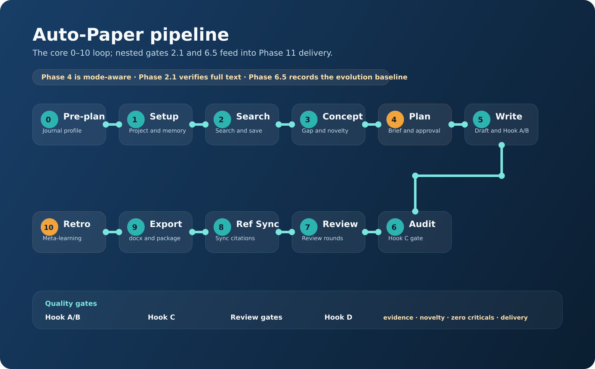

# Auto-Paper: Autonomous and Human-Guided Writing Guide

> **完整的自動論文撰寫系統文件** — 13 個主線 gate checkpoint + Phase 2.1 fulltext/source-material sub-gate

## 概觀

Auto-Paper 是 MedPaper Assistant 的可稽核學術寫作技能；它可在明確邊界內自主推進，也可讓研究者逐 gate 審閱：

- **13 個主線 gate checkpoint**（Phase 0-11 + `Phase 6.5`）：從素材登記到 final delivery 的可審計流程
- **Phase 2.1 sub-gate**：全文與用戶原始素材解析，透過 `phase=21` 獨立驗證，不計入主線 13 checkpoints
- **79 項品質檢查**（56 Code-Enforced / 23 Agent-Driven）：寫作過程即時回饋，必要時升級人工判斷
- **段落級 Section Brief**：`manuscript-plan.yaml` 控制每段的論點、引用、字數
- **結構化 Autonomous Review**：模擬 4 種審稿角色，產出 Review Report + Author Response
- **閉環自我改進**（Meta-Learning）：Hook D 根據統計調整閾值，系統會越來越好
- **Checkpoint 恢復**：任何階段中斷都可從斷點繼續



### 架構圖

```
Instructions (AGENTS.md)
    ↓
Skill (auto-paper SKILL.md)  ← 定義「何時」做什麼
    ↓
Writing (drafts/)             ← Skill 呼叫工具產出草稿
    ↓
Hooks (A-D audit)             ← 定義「品質」標準
    ↓ 回饋
Meta-Learning (Phase 10)      ← 更新 Skill / Hook / Instructions
```

### 觸發方式

在 Copilot Chat 中使用以下任一方式啟動：

| 方式     | 指令                                                        |
| -------- | ----------------------------------------------------------- |
| Prompt   | 在 Copilot Chat 輸入 `/mdpaper.write-paper`                 |
| 自然語言 | 「全自動寫論文」「autopilot」「一鍵寫論文」「幫我寫完整篇」 |

---

## 快速開始

**最簡流程**（5 步驟）：

1. **啟動**：在 Copilot Chat 輸入 `/mdpaper.write-paper`
2. **登記素材與設定期刊**：先執行 `project_action(action="source_materials")` 掃描用戶提供的 DOCX/XLSX/PDF/CSV，再提供目標期刊名稱（Agent 會自動產生 `journal-profile.yaml`）
3. **通過計畫 gate**：Agent 搜尋文獻 → 發展概念 → 產出 `manuscript-plan.yaml`；manual mode 由你確認，autopilot 留下自審與核准紀錄
4. **等待寫作**：Agent 撰寫各 section，先跑 A/B checks，再以 C/F、R1-R6 與 D1-D9 完成全稿、審稿和回顧
5. **匯出**：Agent 產出 Word 檔 + 必要投稿文件

> 💡 Manual mode 在 Phase 4 等待研究者核准；autopilot 可在 Phase 4 完成可稽核自審。高風險決策、連續退步、超出預算或用戶指定的 checkpoint 仍會升級人工介入。

---

## 13 Main Gate Checkpoints

### Phase 0: Pre-Planning

**目的**：先登記用戶原始素材，再建立期刊約束，生成 `source-materials.yaml` + `journal-profile.yaml`

| 項目 | 說明                                                                    |
| ---- | ----------------------------------------------------------------------- |
| 輸入 | workspace root 的 DOCX/XLSX/PDF/CSV 等原始素材 + 期刊資訊               |
| 輸出 | `projects/{slug}/.audit/source-materials.yaml` + `journal-profile.yaml` |
| Gate | source-material scan manifest 存在 + journal profile 存在               |

Agent 按優先順序取得資訊：

1. `project_action(action="source_materials")` 掃描用戶提供素材，若有 `pending_asset_aware` 則先交給 asset-aware ingestion。
2. 用戶提供 submission guide → 自動解析（字數、圖表限制、引用格式等）
3. 用戶口頭說明 → 查詢內建期刊庫補全
4. 無明確期刊 → 使用 paper_type 預設值

`journal-profile.yaml` 驅動後續所有 Phase 的行為（字數限制、圖表上限、Hook 閾值等）。
`source-materials.yaml` 驅動後續 concept、asset plan、Methods/Results 寫作，防止 agent 只讀摘要而漏掉正式資料表。

### Phase 1: Project Setup

**技能**：`project-management`

建立專案結構，載入 journal-profile，確認 paper_type 一致。

### Phase 2: Literature Search

**技能**：`literature-review` + `parallel-search`  
**外部 MCP**：pubmed-search、zotero-keeper（選用）

1. 生成搜尋策略（MeSH + 同義詞）
2. 並行搜尋 3-5 組
3. 依 question/claim coverage、研究設計、來源角色、可取得全文與時間範圍篩選；citation metrics（如 RCR）只作背景訊號，不作硬排序或排除門檻
4. 儲存足以覆蓋 evidence map 的候選文獻 → `save_reference_mcp(pmid)`（MCP-to-MCP verified metadata）
5. 可選：從 Zotero 匯入

**Code hard gate**：依 paper type 達到最低文獻數，而且每筆 reference 有穩定 identity 與誠實 trust provenance。搜尋策略與 selection artifacts 缺失只警告。PubMed Search MCP 0.6.3 提供 45 個搜尋/檢索工具。

### Phase 2.1: Fulltext & Source-Material Ingestion

**定位**：獨立 sub-gate（`phase=21`），位於 Phase 2 與 Phase 3 之間；不計入主線 13 個 checkpoint。

1. 對可取得全文的文獻執行 fulltext ingestion。
2. 對 Phase 0 標記為 `pending_asset_aware` 的 DOCX/XLSX/PDF/PPTX/CSV 原始素材執行 asset-aware ingestion。
3. 將 ingestion receipt 寫回 `.audit/source-materials.yaml` / fulltext status artifact。

**Code hard gate**：status file 非空；每筆 reference 都有可驗證的 ingestion evidence 或明確 fallback，且 source-bound analysis 完成；需要 asset-aware 的 primary source materials 皆有 receipt。

### Phase 3: Concept Development

**技能**：`concept-development`  
**外部 MCP**：CGU（創意發想，當 novelty 不足時）

1. 分析文獻 → 識別 Gap
2. 撰寫 `concept.md`（含 🔒 NOVELTY STATEMENT + 🔒 KEY SELLING POINTS）
3. `validate_concept()` → 三輪獨立評分
4. 分數 < 75 → 自動修正 1 次 → 仍不足 → CGU `deep_think` / `spark_collision` → 再修正
5. 分數 < 60（兩次）→ **硬停止**，回報用戶

**Gate**：concept score ≥ 75（`readiness=ready`），或可信 host/UI 依用戶明確決定簽發 `mdpaper.concept_review_override.v3` Ed25519 receipt。MCP/Agent 只能查詢或撤銷，不能把自己的輸入標成 `human` 來放行。

### Phase 4: Manuscript Planning

> **Mode-aware gate：manual 人工核准；autopilot 稽核自審**

**產出**：`manuscript-plan.yaml`（段落級 Section Brief）

這是整個 Pipeline 的核心規劃文件，包含：

- **寫作順序**：依期刊 / paper type 決定（例：Methods → Results → Introduction → Discussion → Abstract）
- **段落級 Brief**：每段有 `topic`、`key_claims`、`must_cite`、`word_target`
- **🔒 保護段落**：Novelty Statement / Selling Points 標記 `protected: true`
- **Asset Plan**：圖表、統計檢定的生成計畫（含工具、參數、caption）
- **投稿清單**：依 journal-profile 列出需準備文件

Manual mode：Agent 呈現摘要 → 你確認或調整。Autopilot：Agent 應以獨立 plan review 檢查 evidence coverage、預算、寫作順序與 asset plan，並留下自審紀錄。

**Code hard gate**：Phase 3 concept review 仍可採用，而且 `manuscript-plan.yaml` 或 legacy `drafts/manuscript-plan.md` 存在。approver、reason、coverage 與圖表上限目前是 workflow contract，Phase 4 validator 尚未逐欄重算；完整邊界見[Phase gate 契約](design/phase-gate-contract.md)。

### Phase 5: Section Writing

**技能**：`draft-writing`  
**外部 MCP**：drawio（流程圖）、CGU（強化論點）

這是最複雜的 Phase，包含段落級寫作 + 即時品質檢查的 cascading loop：

```
FOR section IN writing_order:
  1. 準備：讀取 plan + 已完成 sections + 可用引用
  2. Asset 生成：依 asset_plan 產生圖表（Table 1、統計圖、流程圖等）
  3. 段落級寫作：依 manuscript-plan.yaml 的 brief 逐段撰寫
  4. Hook A（post-write）：字數 / 引用密度 / 語體與作者責任訊號 / Wikilink → 最多 3 rounds
  5. Hook B（post-section）：概念一致 / 🔒 保護 / 方法學 / Brief 合規 → 回溯修正
  6. 記錄 audit trail + 更新 checkpoint
```

圖像或表格在插入前經 `review_asset_for_insertion` 建立 SHA-256/MIME、可選 C2PA 與版本鎖定的 removal-package receipt。`remove-ai-watermarks` 只以離線、逐 detector 的唯讀路徑檢查已知可見標記與公開 DWT-DCT signal，不呼叫 aggregate `identify` 或 removal API、不改原檔、不寫衍生檔；invalid provenance、hash 變更、影像尺寸不受 detector 支援或必要 detector 缺席都會阻擋，任何 signal／不確定結果仍需有紀錄的 reviewer 判斷。詳見 [MCP 2 與內容完整性](wiki/mcp2-content-integrity.md)。

**Code hard gate**：稿件與五個核心 sections 存在；必要的 data provenance 和 planned assets 可驗證；required assets 已登記、放置、可匯出且有 review receipt；所有必需 sections 有 recorded approval。

### Phase 6: Cross-Section Audit

三階段審計：

1. **全稿掃描**：Hook C（C1-C14）檢查全稿一致性、數值合規、時間一致性、claim-evidence 對齊
2. **分層回溯修正**（Cascading Fix）：CRITICAL issues → 回溯到對應 section 的 Hook A/B 修正 → 最多 3 rounds
3. **流程收斂目標**：處理 C/F CRITICAL findings → 生成 quality-scorecard；Phase 6 code gate 另驗稽核資料是否有效

**Code hard gate**：品質與 hook-effectiveness 報告存在、scorecard 至少四個有效維度、至少一個 hook 有真實事件；若有 data artifacts，也必須有 validation report。處理完 C/F critical findings 是 workflow contract；目前 Phase 6 validator 不會在 gate 內重跑全部 A/B/C checks，也沒有單獨解析「0 unresolved critical」。

### Phase 6.5: Evolution Gate

**目的**：建立 revision baseline，強制進入 Phase 7 review loop，避免 Hook A-C 全過時跳過審稿。

1. 建立 baseline snapshot。
2. 寫入 evolution log。
3. 生成/更新 quality-scorecard。

**Gate**：baseline snapshot + evolution-log entry + quality-scorecard 存在。

### Phase 7: Autonomous Review

**模擬同行審查**，產出結構化 Review Report + Author Response。

4 種審稿角色：

- **Methodology Expert**：研究設計、統計方法、可再現性
- **Domain Specialist**：文獻引用、領域 gap、臨床意義
- **Statistician**：統計假設、結果呈現、圖表有效性
- **Editor**：寫作品質、期刊風格、邏輯流

每輪產出：

- `review-report-{round}.md`（YAML front matter + 結構化 issues）
- `author-response-{round}.md`（逐條回應 + Completeness Check）
- 更新 quality-scorecard

**Loop 停止條件**：

- 總分 ≥ quality_threshold → ✅ PASS
- 達到 max_rounds 仍未達標 → gate 不會自動放行；呈現問題並讓用戶決定
- 連續 2 輪分數無改善 → gate 不會自動放行；詢問用戶
- Phase 7 的安全下限固定為 `min_rounds >= 2`、`quality_threshold >= 7.0`、`max_rounds <= 10`；設定或序列化狀態不能調低
- 人類若接受低於門檻的版本 → 可信 host/UI 簽發 `mdpaper.review_completion_override.v3` Ed25519 receipt，綁定 project、目前 manuscript 與 loop SHA-256；`pipeline_action(action="approve_review_completion", decision="status")` 只驗證 receipt，原分數與非 `quality_met` verdict 保持不變

**Code hard gate**：至少兩輪、state 可重算、每輪 artifacts/EQUATOR/hash chain 完整、R1–R6 對目前 artifacts 重跑通過、evolution events 相符、最後 hash 等於目前稿件，並以 `quality_met` 或有效的外部 acceptance receipt 結束。

### Phase 8: Reference Sync

1. `sync_references()` → 生成 References section
2. 確認所有 `[[wikilinks]]` 已解析
3. 格式化引用（依 journal-profile.references.style）
4. 驗證引用數量 ≤ 上限

**Code hard gate**：Phase 7 已完成、References section 存在、所有 citation wikilinks 都能解析。引用格式、分布與預算由 reference workflow、C-series 與 Phase 7 R6 處理，不是 Phase 8 validator 額外重算的 hard checks。

### Phase 9: Export

**技能**：`word-export`

1. 選擇 Word 模板（匹配期刊）
2. 匯出 Word 與 PDF 文件
3. 產生必要投稿文件（cover letter、author contributions 等）
4. 執行 `inspect_export(action="docx_smoke")` 檢查 DOCX zip/XML 結構、段落與可見文字
5. 驗證投稿清單完成

### Phase 10: Retrospective

**技能**：meta-learning（Hook D1-D9）

閉環核心 — 系統從自身的執行經驗學習：

1. 回顧 Hook 觸發統計 + Review 輪次
2. 調整 Hook 閾值（±20%，CONSTITUTION §23）
3. 更新 SKILL.md Lessons Learned
4. 分析 journal-profile 設定合理性
5. D7: Review Retrospective — 分析 reviewer 效能，演化審稿指令
6. D8: EQUATOR Retrospective — 回顧報告指引缺口
7. D9: Tool Telemetry — 回顧工具誤用與描述改善建議

**Code hard gate**：正確命名的 pipeline run 含 D7/D8；hook-effectiveness report 存在；meta-learning audit 的 v2 schema、source tool、D1–D9、counts/lists 與 evolution event 可以互相核對。Project Memory 缺失只警告。

### Phase 11: Final Delivery

**目的**：確認最終交付物完整；Git provenance 是可用時的加分資訊，不是阻擋所有 paper delivery 的必要條件。

1. 再次確認 DOCX/PDF 都存在且通過結構 smoke。
2. 確認 Phase 10 retrospective gate 仍通過。
3. 如在 git workspace 中，回報 clean status、commit 與 remote sync 等 provenance。

**Code hard gate**：有效 DOCX/PDF + 通過 Phase 10。Git provenance 只警告；目前 validator 不要求額外的 `pipeline-completed` 或 final-delivery marker。

---

## Hook 品質保證系統

79 項品質檢查包含 56 項 deterministic code checks 和 23 項需要語義判斷的 Agent checks。編號不是連續功能數量；例如 A3b、A3c、C7a 都是獨立 code checks。

| 發生時機            | 程式實際執行的 checks           | Agent／流程補充                    |
| ------------------- | ------------------------------- | ---------------------------------- |
| 寫完一段或 section  | A1–A7、A3b、A3c；B2、B8–B16     | B1、B3–B7 的概念／方法／Brief 判讀 |
| 全稿完成            | C2–C6、C7a、C7b、C7d、C9–C14、F | C1 全稿語義一致、C8 時間一致       |
| Phase 7 每輪 review | R1–R6                           | 四種 reviewer 與 EQUATOR 逐條判讀  |
| commit／一般維護    | P1、P2、P4–P7、G9               | P3、P8、G1–G8                      |
| Phase 10            | D1–D9 `MetaLearningEngine`      | 對建議是否採納的治理判斷           |

### Hook A: post-write

每次寫完立即執行，失敗時定點修正後重跑同一 check：

| #          | 程式檢查                                         | 常見修正                                     |
| ---------- | ------------------------------------------------ | -------------------------------------------- |
| A1         | section 字數與 profile 目標                      | 精簡贅文或補必要內容                         |
| A2         | 引用密度                                         | 補真正支持 claim 的 citation，或刪弱 claim   |
| A3/A3b/A3c | 空泛模板語、結構訊號、跨段語體一致與作者責任訊號 | 改成具體可驗證內容；不以規避 detector 為目標 |
| A4         | Wikilink 格式                                    | 修正括號與 citekey                           |
| A5         | 語言一致                                         | 統一成 project 指定語言                      |
| A6         | 段落重複                                         | 合併或刪除重複論述                           |
| A7         | paper-type-aware 文獻數量                        | 補可信 references；不足時不得硬寫            |

**語體完整性**：`In recent years`, `It is worth noting`, `plays a crucial role`, `has garnered significant attention` 等空泛模板語應替換成具體內容。這個 legacy A3 hook 不用來通過 AI authorship detector、不隱匿 AI 協助，也不能判定作者身份。

**引用密度標準**：Introduction ≥ 1/100 words, Discussion ≥ 1/150 words。

### Hook B: post-section

| 類型       | Checks    | 看什麼                                                             |
| ---------- | --------- | ------------------------------------------------------------------ |
| Code       | B2        | 🔒 protected content 未被未授權修改                                |
| Code       | B8–B10    | 數據與 claim 對齊、section 時態、段落品質                          |
| Code       | B11–B13   | Results 不偷渡解釋、Introduction 與 Discussion 結構                |
| Code       | B14–B16   | 倫理聲明、hedging 密度、效果量報告                                 |
| Agent 語義 | B1、B3–B7 | concept／selling points／跨節一致、方法學、寫作順序、Section Brief |

修正時優先回到 evidence、concept 或 Section Brief；不要只為了讓句子看起來通順而掩蓋資料矛盾。

### Hook C: post-manuscript

| 類型       | Checks        | 看什麼                                                        |
| ---------- | ------------- | ------------------------------------------------------------- |
| Code       | C2–C6         | 投稿清單、N 值、縮寫、可解析 wikilinks、總字數                |
| Code       | C7a、C7b、C7d | 圖表數量、asset-plan coverage、圖表交叉引用                   |
| Code       | C9–C11        | 補充材料交叉引用、全文狀態、引用分布                          |
| Code       | C12–C14       | 引用決策稽核、圖表品質、強 claim 與 evidence 對齊             |
| Agent 語義 | C1、C8        | 全稿概念一致與因寫作順序產生的時間／狀態矛盾                  |
| Code       | F             | data artifacts、provenance、data anchors 與 validation report |

常見修正包括統一 N 值與縮寫、補存可信 reference、移除 phantom cross-reference、補 asset review、重新驗證全文狀態，以及為強 claim 補證據或降低措辭強度。

### Review、commit 與一般維護 checks

- **R1–R6**：Phase 7 每輪重算 review 深度、author response 完整性、EQUATOR、修正追蹤、修後語體／作者責任訊號與引用預算。
- **P1/P2/P4–P7**：提交前重查引用、語體、字數、protected content、Memory 與 reference integrity。
- **G9**：回報 Git 狀態；G1–G8 的 README、CHANGELOG、ROADMAP、架構與文件同步仍屬 Agent-driven 維護責任。

### Hook D: meta-learning

| #   | 功能                                                    |
| --- | ------------------------------------------------------- |
| D1  | 效能統計：觸發率/通過率/誤報率                          |
| D2  | 品質維度趨勢分析                                        |
| D3  | Hook 自我改進：自動微調閾值（±20%）                     |
| D4  | SKILL 改進建議                                          |
| D5  | Instruction 改進建議                                    |
| D6  | 審計軌跡記錄                                            |
| D7  | Review Retrospective：分析 reviewer 效能 + 演化審稿指令 |
| D8  | EQUATOR Retrospective：分析 reporting checklist 效能    |
| D9  | Tool Telemetry：分析工具描述與 pending evolution 建議   |

---

## manuscript-plan.yaml 規格

Phase 4 產出的核心規劃文件：

```yaml
writing_order:
  - Methods
  - Results
  - Introduction
  - Discussion
  - Abstract

sections:
  Methods:
    word_budget: 1200
    paragraphs:
      - id: methods-p1
        function: "Study Design"
        topic: "研究設計與倫理"
        key_claims:
          - "回顧性世代研究設計"
          - "IRB 核准 #2024-XXX"
        must_cite: []
        word_target: 200
        checklist_items:
          - "研究設計描述"
          - "倫理聲明"
      - id: methods-p2
        function: "Participants"
        topic: "納入排除標準"
        key_claims:
          - "年齡 ≥ 18 + ICU > 24h"
        must_cite:
          - "[[greer2017_27345583]]"
        word_target: 250
        protected: false

  Introduction:
    word_budget: 800
    paragraphs:
      - id: intro-p3
        function: "Novelty Statement"
        topic: "本研究的創新點"
        key_claims:
          - "首個結合閉環品質保證 + meta-learning 的系統"
        must_cite: []
        word_target: 150
        protected: true # 🔒 不可刪除

asset_plan:
  - id: table-1
    type: table_one
    section: Results
    tool: generate_table_one
    tool_args:
      file: "data/baseline.csv"
      group_column: "group"
    caption: "Baseline characteristics of study participants"
    caption_requirements:
      - "包含 N 值"
      - "說明統計方法"
  - id: fig-1
    type: flow_diagram
    section: Methods
    tool: drawio
    caption: "Study flow diagram"

submission_checklist:
  - cover_letter
  - title_page
  - author_contributions

metadata:
  generated_at: "2025-01-15T10:30:00Z"
  based_on:
    concept: "concept.md"
    journal_profile: "journal-profile.yaml"
  changelog:
    - date: "2025-01-15"
      change: "Initial plan generated"
```

### Plan 修改規則

- Agent 可新增段落 / 修改 claims / 調字數 → 需寫入 `metadata.changelog`
- Agent **禁止**刪除 `protected: true` 段落
- 用戶自由修改，changelog 自動追蹤

---

## journal-profile.yaml 規格

Phase 0 產出的期刊約束文件，驅動所有後續 Phase：

| YAML 欄位                           | 影響                                    |
| ----------------------------------- | --------------------------------------- |
| `paper.type`                        | Phase 1 設定 / Phase 4 寫作順序         |
| `paper.sections`                    | Phase 4 大綱結構                        |
| `word_limits.*`                     | Hook A1 / C6 字數檢查                   |
| `assets.figures_max / tables_max`   | Phase 4 Asset Plan / C7a 數量檢查       |
| `references.max_references`         | Phase 7 R6 / Phase 8 reference workflow |
| `references.style`                  | Phase 8 reference workflow              |
| `pipeline.writing.citation_density` | Hook A2 引用密度                        |
| `reporting_guidelines.checklist`    | Hook B5 方法學 / C2 投稿清單            |
| `pipeline.hook_*_max_rounds`        | Hook A/B/C cascading 上限               |
| `pipeline.review_max_rounds`        | Phase 7 Review 輪數                     |
| `pipeline.writing.anti_ai_*`        | Legacy 欄位：Hook A3 語體訊號嚴格度     |

## source-materials.yaml 規格

Phase 0 產出的原始素材清單，驅動後續資料、圖表、Methods/Results 寫作：

| YAML 欄位                                 | 影響                                          |
| ----------------------------------------- | --------------------------------------------- |
| `summary.total_candidates`                | 是否已掃描 workspace 原始素材                 |
| `materials[].evidence_priority`           | Phase 3 concept / Phase 5 drafting 證據優先級 |
| `materials[].ingestion.status`            | 是否需先走 asset-aware                        |
| `agent_next_steps.asset_aware_file_paths` | agent 應交給 asset-aware 的具體檔案           |

`data-artifacts.yaml` 的 `data_anchors` 必須引用 ready/ingested source material、asset-aware doc、tracked data artifact，或可信 data file。若 anchor 來源是 `concept.md`、agent summary、inferred/estimated 值，或指向仍是 `pending_asset_aware` 的 DOCX/PDF，Hook F4 會以 CRITICAL 阻擋。

完整模板見：[templates/journal-profile.template.yaml](https://github.com/u9401066/med-paper-assistant/blob/master/templates/journal-profile.template.yaml)

---

## Autonomous Review 機制

Phase 7 的結構化 Review Loop 模擬同行審查：

### 流程

```
FOR round = 1 TO review_max_rounds:
  1. Review Report: 4 位 reviewer 各角色審查 → 產出結構化 issues (MAJOR/MINOR/OPTIONAL)
  2. Author Response: 逐條回應每個 issue (ACCEPT/ACCEPT_MODIFIED/DECLINE)
  3. Completeness Check: 確保所有 issue 都被回應（禁止忽略）
  4. 執行修正: ACCEPTED issues → patch_draft + re-run Hook A
  5. 品質重評: 更新 quality-scorecard → 比對 threshold
  → quality_met → 結束 | 未達標 → 下一輪或明確的人類 acceptance receipt
```

`max_rounds`、`stagnated` 與 `user_needed` 只代表 loop 終止／需要升級，不代表品質已達標。自主模式只有重算後的 `quality_met` 能通過 Phase 7；人類協作模式可在看過剩餘問題後，由 MCP 之外的可信 host/UI 簽發 v3 Ed25519 receipt（含 rationale、accepted risks、具名 reviewer、project、目前稿件與 loop hash），再用 `approve_review_completion` 的 `status` 動作重新驗證。私鑰不得放入 workspace 或 MCP 環境；host 只以 `MDPAPER_APPROVAL_ED25519_PUBLIC_KEYS` 提供可驗證的公開金鑰。

Host 設定格式為 `MDPAPER_APPROVAL_ED25519_PUBLIC_KEYS='{"trusted-host-2026":"<raw 32-byte Ed25519 public key 的 unpadded base64url>"}'`（最多 64 keys，僅由 host process 注入，不從 workspace `.env` 讀取）。Receipt 的 `signature` 必須恰含 `algorithm="Ed25519"`、`encoding="base64url"`、`key_id`、`value`；`value` 是 64-byte detached signature 的 unpadded base64url。簽署內容為 `mdpaper.external-approval.v3\0` 加上整份 receipt 移除 `signature.value` 後的嚴格 canonical JSON（UTF-8、key 排序、無空白、禁止 NaN）。Concept v3 綁 concept artifact + review SHA-256；Review v3 綁 audit-loop + final manuscript SHA-256。

### 品質維度（quality-scorecard）

| 維度         | 評分 (0-10)              | 權重 |
| ------------ | ------------------------ | ---- |
| 引用品質     | 相關、方法適切、可定位   | 15%  |
| 方法學再現性 | 設計、統計、EQUATOR 合規 | 25%  |
| 文字品質     | 清晰、邏輯、具體且可追溯 | 20%  |
| 概念一致性   | NOVELTY + SELLING POINTS | 20%  |
| 格式合規     | 字數、圖表、引用數       | 10%  |
| 圖表品質     | 必要性、清晰度、caption  | 10%  |

---

## Audit Trail 與 Checkpoint

### 審計檔案

每次執行在 `projects/{slug}/.audit/` 產出：

| 檔案                     | 時機            | 內容                                          |
| ------------------------ | --------------- | --------------------------------------------- |
| `pipeline-run-{ts}.md`   | 每個 Phase 結束 | Phase 摘要 + Hook 統計 + Decision Log         |
| `checkpoint.json`        | 每個 Phase 結束 | 斷點恢復：last_completed_phase, phase_outputs |
| `search-strategy.md`     | Phase 2 後      | 搜尋策略 + 結果數量 + 篩選標準                |
| `reference-selection.md` | Phase 2 後      | 文獻選擇理由 + 排除理由                       |
| `concept-validation.md`  | Phase 3 後      | Novelty 分數 + 修正歷史                       |
| `quality-scorecard.md`   | Phase 6 後      | 6 維品質評分                                  |
| `hook-effectiveness.md`  | Phase 6 後      | Hook 觸發率/通過率/誤報率                     |
| `review-report-{N}.md`   | Phase 7 每輪    | 結構化 Review Report（YAML front matter）     |
| `author-response-{N}.md` | Phase 7 每輪    | 逐條 Author Response + Completeness Check     |

### Checkpoint 恢復

Pipeline 啟動時自動偵測 `checkpoint.json`，提供選項：

- 從 Phase N+1 繼續
- 從當前 section 繼續
- 重新開始（保留文獻和 concept）
- 完全重來

---

## 跨 MCP 編排

Pipeline 編排 5 個 MCP Server + 外部工具：

| Phase | 內部 MCP | 外部 MCP                   | 說明                                 |
| ----- | -------- | -------------------------- | ------------------------------------ |
| 0     | mdpaper  | asset-aware, fetch_webpage | 掃描原始素材 + 解析 submission guide |
| 1     | mdpaper  | —                          | 建立專案                             |
| 2     | mdpaper  | pubmed-search, zotero      | 搜尋 + 儲存文獻                      |
| 2.1   | mdpaper  | asset-aware, pubmed-search | 文獻全文與素材解析                   |
| 3     | mdpaper  | CGU                        | 概念發展 + 創新性提升                |
| 4     | mdpaper  | —                          | 產出 manuscript-plan                 |
| 5     | mdpaper  | drawio, CGU, data tools    | 寫作 + 圖表 + 論點強化               |
| 6     | mdpaper  | —                          | 全稿審計                             |
| 7     | mdpaper  | CGU                        | Review + 論點補強                    |
| 8     | mdpaper  | —                          | 引用同步                             |
| 9     | mdpaper  | —                          | DOCX / PDF 匯出                      |
| 10    | mdpaper  | —                          | Retrospective + Meta-learning        |
| 11    | mdpaper  | —                          | Final delivery                       |

### 跨 MCP 資料傳遞

| 來源          | 目標       | 傳遞物                 | 規則                                                                   |
| ------------- | ---------- | ---------------------- | ---------------------------------------------------------------------- |
| pubmed-search | mdpaper    | PMID                   | `save_reference_mcp(pmid)` — 只傳 PMID，資料由 MCP 直接取得            |
| zotero-keeper | mdpaper    | PMID/DOI               | 取 PMID → `save_reference_mcp()`                                       |
| asset-aware   | mdpaper    | sections/tables/doc_id | Phase 0/2.1 解析 DOCX/XLSX/PDF 後回填 source-material/fulltext context |
| CGU           | concept.md | 文字建議               | Agent 整合到 `write_draft()`                                           |
| drawio        | mdpaper    | XML                    | `save_diagram(project, content)`                                       |

---

## 自動決策邏輯

系統在大多數情況下自動決策，以下為關鍵決策規則：

### 自動繼續

| 情境                | 行為               |
| ------------------- | ------------------ |
| Hook A/B WARNING    | LOG → 下一步       |
| Hook C WARNING      | LOG → Phase 7      |
| Review MINOR issues | batch fix → 下一輪 |
| Asset fallback 成功 | 繼續               |
| Concept 65-74       | 自動修正 1 次      |

### 必須停下

| 情境                               | 行為                                              |
| ---------------------------------- | ------------------------------------------------- |
| Concept < 60（兩次）               | 硬停止，回報用戶                                  |
| Phase 4 manual mode 大綱           | 必須用戶確認                                      |
| Phase 4 autopilot 缺少自審紀錄     | Workflow 暫停，補齊紀錄；不是 validator hard gate |
| Phase 6 N 輪 cascading 仍 CRITICAL | 呈現問題讓用戶決定                                |
| Review 連續 2 輪無分數改善         | 詢問用戶                                          |
| 需修改 AGENTS.md 核心原則          | 永遠需確認                                        |

---

## 示範專案（非獨立驗證）

Repo 內含一個由 Auto-Paper pipeline 產生的示範專案，可用來檢查 artifact 與 workflow wiring；它不是獨立 benchmark、臨床驗證或同行審查證據：

> **MedPaper Assistant: A Self-Evolving, MCP-Based Framework for AI-Assisted Medical Paper Writing with Closed-Loop Quality Assurance**

- **專案**：`projects/self-evolving-ai-paper-writing-framework/`
- **全稿**：`drafts/manuscript.md`
- **匯出**：`exports/manuscript.docx` + `exports/arxiv/manuscript.pdf`（LaTeX）
- **審計軌跡**：`.audit/` 目錄包含完整 Pipeline 執行紀錄

示範保留 10 篇 PubMed metadata 的 MCP-to-MCP receipt。這只能證明保存路徑與識別資料可追蹤，不能保證每個 claim 被全文支持；正式品質宣稱必須通過獨立 scorer 與 frozen fixtures，見 [Evaluation contract](harness/evaluation-contract.md)。

---

## 相關文件

| 文件                                                                                                                                       | 說明                                           |
| ------------------------------------------------------------------------------------------------------------------------------------------ | ---------------------------------------------- |
| [SKILL.md](https://github.com/u9401066/med-paper-assistant/blob/master/.claude/skills/auto-paper/SKILL.md)                                 | 完整技術定義（Hook 詳細規格 + cascading 流程） |
| [multi-stage-review-architecture.md](design/multi-stage-review-architecture.md)                                                            | 設計文件（含所有設計決策）                     |
| [journal-profile.template.yaml](https://github.com/u9401066/med-paper-assistant/blob/master/templates/journal-profile.template.yaml)       | journal-profile 模板                           |
| [paper-reviewer.agent.md](https://github.com/u9401066/med-paper-assistant/blob/master/.github/agents/paper-reviewer.agent.md)              | 唯讀 Reviewer Agent 模式                       |
| [mdpaper.write-paper.prompt.md](https://github.com/u9401066/med-paper-assistant/blob/master/.github/prompts/mdpaper.write-paper.prompt.md) | 觸發 Pipeline 的 Prompt                        |
| [mdpaper.audit.prompt.md](https://github.com/u9401066/med-paper-assistant/blob/master/.github/prompts/mdpaper.audit.prompt.md)             | 獨立審計 Prompt（Phase 6+7）                   |
| [evaluation-contract.md](harness/evaluation-contract.md)                                                                                   | solve→score、evidence locator 與 release gates |
