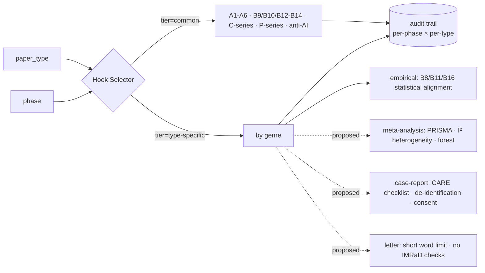

# Article-Type-Aware Quality Harness

> Status: **Phase 1 implemented** (statistical-hook gating) · Phase 2+ proposed (pending review)
> Related: CONSTITUTION §22 (auditable/decomposable), §25–26 (stepwise multi-round evolution)
> Owner: harness / writing-hooks
> Created during the adversarial-harness improvement track.

## 1. Problem

The quality harness did **not** differentiate by manuscript genre. The always-on
`WritingHooksEngine` batch runners (`run_post_write_hooks`, `run_post_section_hooks`,
`run_post_manuscript_hooks`) ran a **fixed hook set regardless of `paper_type`**. As a
result, hooks designed for IMRaD / empirical studies misfired on genres that have no
statistical Methods/Results section:

- **B8** (`check_data_claim_alignment`) — verifies statistical tests in Results are declared
  in Methods. Meaningless for a `letter`, narrative `review-article`, or `case-report`.
- **B11** (`check_results_interpretation`) — guards a Results section from premature
  interpretation. There is no Results section in non-empirical genres.
- **B16** (`check_effect_size_reporting`) — expects effect sizes for statistical results.

Meanwhile, genuine genre knowledge existed but was **decoupled and shallow**:

| Subsystem                        | Genre-aware?                                                    | Trigger                                    | Gap                                        |
| -------------------------------- | --------------------------------------------------------------- | ------------------------------------------ | ------------------------------------------ |
| `DomainConstraintEngine`         | ✅ 7 types, ~69 constraints                                     | Manual MCP tool `check_domain_constraints` | Siloed — not part of the automatic harness |
| `WritingHooksEngine` (79 checks) | ❌ mostly generic (only A7 references + journal-profile limits) | Automatic (`run_writing_hooks`)            | Fixed hook set, no `paper_type` gating     |

The multi-phase pipeline itself is sound — `pipeline_gate_validator` defines 14 phases with
per-phase gates and `checkpoint_manager` records per-phase audit. The problem is **within**
the per-phase harness, not the phase structure.

## 2. Taxonomy (single source: `shared.constants.PAPER_TYPES`)

`original-research`, `systematic-review`, `meta-analysis`, `case-report`,
`review-article`, `letter`, `other`.

**Empirical types** (formal statistical Methods + Results):
`original-research`, `systematic-review`, `meta-analysis`.

## 3. Design — Common + Type-Specific harness

A **Hook Applicability Matrix** is the single source of truth declaring, per hook, which
paper types it applies to. The batch runners consult it and **select** which hooks execute.

### Design principles

1. **Common tier is the default.** Any hook not explicitly gated applies to every type.
   This keeps the harness safe-by-default: a new hook is universal unless deliberately scoped.
2. **Backward compatible.** Default `paper_type` is `original-research` (a member of every
   set), so unconfigured projects keep the full hook set unchanged.
3. **Skip, don't drop (auditable).** A non-applicable hook is **not** omitted; the runner
   records a passing `HookResult` with `stats.applicable=False` and a reason. The hook key is
   preserved (no downstream/test breakage) and the per-type decision is auditable (§22).

## 4. Phase 1 — implemented in this slice

- New module `writing_hooks/_applicability.py`:
  - `ALL_PAPER_TYPES`, `EMPIRICAL_TYPES`, `DEFAULT_PAPER_TYPE`.
  - `_TYPE_SPECIFIC_APPLICABILITY = {B8, B11, B16 → EMPIRICAL_TYPES}`.
  - `applicable_types`, `is_applicable`, `is_type_specific`, `type_specific_hook_ids`,
    `skip_reason`, `not_applicable_result`.
- `WritingHooksEngine`:
  - `run_post_section_hooks` gates **B8/B11/B16** via `_run_gated(...)` using the current
    `paper_type` (from journal-profile, default `original-research`).
  - New read-only `hook_applicability(paper_type=None)` report for tooling/audit.
- Tests: `tests/test_hook_applicability.py` (matrix + runner gating + backward-compat).

**Behaviour change (only):** `letter` / `review-article` / `case-report` / `other` now skip
B8/B11/B16 (recorded as not-applicable) instead of producing false-positive failures.
Empirical types and the legacy default are unchanged.

## 5. Phase 2+ — proposed (pending review)

These require product/architecture decisions and are **not** implemented here:

1. **Refine common B-series per type.** Decide whether `B12` (intro funnel), `B13`
   (discussion structure findings/limitations/implications) should be scoped away from
   `letter` and narrative `review-article`.
2. **Add positive type-specific hooks** (reporting-guideline aware):
   - meta-analysis → PRISMA flow, I² heterogeneity reporting, forest-plot presence.
   - systematic-review → PRISMA flow, search-strategy completeness.
   - case-report → CARE checklist, de-identification, informed-consent statement.
3. **Couple `DomainConstraintEngine` into `run_writing_hooks`** so the ~69 type-specific
   constraints run automatically, not only via the manual `check_domain_constraints` tool.
4. **Per-phase × per-type audit surface.** Emit, per phase, the executed common +
   type-specific hook set (e.g. "Phase 5 Writing · meta-analysis · common[…] + specific[B8,
   PRISMA, I²]") so audits can pinpoint which phase/genre combination needs adjustment.

## 6. Notes

- `AGENTS.md` / `memory-bank/architect.md` previously described `DomainConstraintEngine` as
  "3 paper types, 26 constraints" — stale. It actually covers **7 paper types** with ~69
  constraints; corrected alongside this slice.
