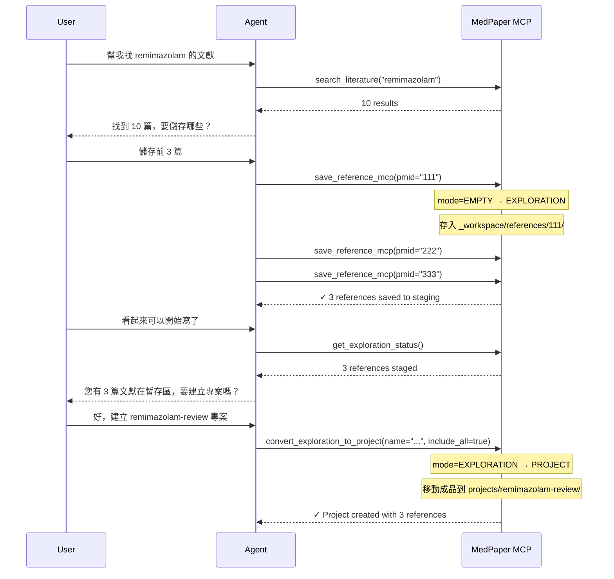
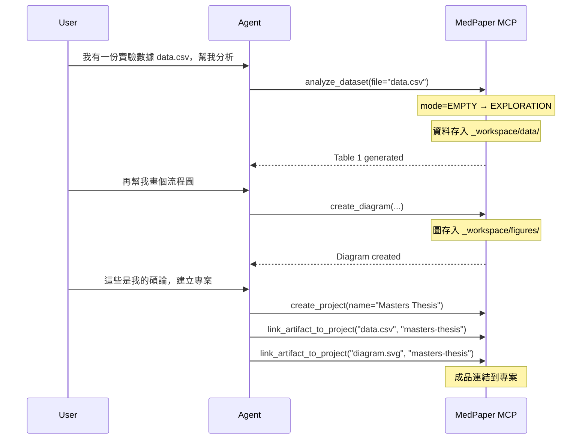

# Artifact-Centric Architecture Design

> **Status**: 📝 Draft (Pending Review)
> **Author**: MedPaper Team
> **Created**: 2025-01-22
> **Related**: [ROADMAP.md](../../ROADMAP.md), [ARCHITECTURE.md](../../ARCHITECTURE.md)

## 📋 Executive Summary

本文件描述 MedPaper 從「專案優先」(Project-First) 轉向「成品優先」(Artifact-Centric) 的架構重構設計。此變更旨在支援研究者的**非線性工作流程**，讓他們可以從任何起點開始工作，而不被迫先建立專案。

### 核心變革

| 面向 | 原架構 (Project-First) | 新架構 (Artifact-Centric) |
|------|----------------------|-------------------------|
| 起點 | 必須先建立專案 | 可從任何成品開始 |
| 儲存 | 成品必須屬於專案 | 成品先進 staging，後連結 |
| 狀態 | Binary (有/無專案) | State Machine (3 階段) |
| 彈性 | 線性流程 | 非線性、多入口 |

---

## 🎯 Problem Statement

### 現況問題

1. **強制線性流程**
   - 目前架構假設：建立專案 → 寫 concept → 搜尋文獻 → 撰寫
   - 實際研究者可能：先搜尋 → 找到好論文 → 才決定研究方向

2. **阻力過高**
   - 使用者只是想「先找找看」，卻被要求先建立專案
   - 導致使用者放棄或在專案外操作（遺失追蹤）

3. **成品孤兒化**
   - 搜尋結果、PDF、筆記散落在專案外
   - 難以事後整合進專案

### 目標

- **零阻力起步**：任何操作都不需要先建立專案
- **自動升級**：當累積足夠成品時，引導建立專案
- **完整追蹤**：所有成品都有來源記錄，可事後整理

---

## 🏗️ Architecture Design

### State Machine

```
┌─────────────┐     save_reference     ┌─────────────┐
│             │    search_literature   │             │
│    EMPTY    │ ─────────────────────► │ EXPLORATION │
│             │    import_pdf          │             │
└─────────────┘                        └──────┬──────┘
                                              │
                                              │ create_project
                                              │ (user decision)
                                              ▼
                                       ┌─────────────┐
                                       │             │
                                       │   PROJECT   │
                                       │             │
                                       └─────────────┘
```

**狀態說明**：

| 狀態 | 描述 | `.mdpaper-state.json` |
|------|------|----------------------|
| **EMPTY** | 無任何成品 | `mode: "empty"` |
| **EXPLORATION** | 有成品在 staging | `mode: "exploration"` |
| **PROJECT** | 有活躍專案 | `mode: "project", current_project: "xxx"` |

### 目錄結構

```
workspace/
├── _workspace/                    # 🆕 Artifact Staging Area
│   ├── .registry.json             # 成品註冊表
│   ├── references/                # 暫存的參考文獻
│   │   ├── 12345678/              # by PMID
│   │   │   ├── metadata.yaml
│   │   │   ├── content.md
│   │   │   └── fulltext.pdf
│   │   └── 87654321/
│   ├── pdfs/                      # 匯入的 PDF（未識別）
│   │   └── uploaded_paper.pdf
│   ├── notes/                     # 獨立筆記
│   │   └── research_ideas.md
│   ├── data/                      # 資料檔案
│   │   └── pilot_study.csv
│   └── figures/                   # 圖表
│       └── flow_diagram.svg
│
├── projects/                      # 正式專案（不變）
│   └── my-study/
│       ├── project.json
│       ├── concept.md
│       ├── references/            # 專案的參考文獻
│       └── drafts/
│
└── .mdpaper-state.json            # 全域狀態
```

### Registry Schema

```json
// _workspace/.registry.json
{
  "version": "1.0",
  "created_at": "2025-01-22T10:00:00Z",
  "updated_at": "2025-01-22T15:30:00Z",
  "artifacts": [
    {
      "id": "art_abc123",
      "type": "reference",
      "path": "references/12345678",
      "source": {
        "tool": "save_reference_mcp",
        "params": { "pmid": "12345678" },
        "timestamp": "2025-01-22T10:05:00Z"
      },
      "tags": ["remimazolam", "sedation"],
      "linked_projects": [],
      "notes": "Important for background section"
    },
    {
      "id": "art_def456",
      "type": "pdf",
      "path": "pdfs/uploaded_paper.pdf",
      "source": {
        "tool": "import_pdf",
        "params": { "file": "/path/to/file.pdf" },
        "timestamp": "2025-01-22T11:00:00Z"
      },
      "tags": [],
      "linked_projects": ["my-study"],
      "notes": null
    }
  ],
  "statistics": {
    "total": 2,
    "by_type": {
      "reference": 1,
      "pdf": 1
    },
    "unlinked": 1
  }
}
```

### Artifact Types

```python
from enum import Enum

class ArtifactType(str, Enum):
    """All supported artifact types in staging area."""

    # Literature
    REFERENCE = "reference"        # PubMed reference with metadata
    PDF = "pdf"                    # PDF file (unidentified)
    PDF_IDENTIFIED = "pdf_identified"  # PDF linked to PMID

    # Writing
    NOTE = "note"                  # Standalone note/memo
    DRAFT = "draft"                # Draft section
    CONCEPT = "concept"            # Research concept

    # Data & Analysis
    DATASET = "dataset"            # CSV, Excel, etc.
    ANALYSIS_RESULT = "analysis"   # Statistical output

    # Figures & Tables
    FIGURE = "figure"              # Image, diagram
    TABLE = "table"                # Generated table

    # External
    ZOTERO_IMPORT = "zotero"       # Imported from Zotero
    BIBTEX_IMPORT = "bibtex"       # Imported from BibTeX

    # Mixed
    COLLECTION = "collection"     # Group of related artifacts
```

---

## 🔧 New Tools Design

### Exploration Tools (6 個新工具)

| Tool | 功能 | 參數 |
|------|------|------|
| `start_exploration` | 啟動探索模式 | `topic?: str` |
| `get_exploration_status` | 查看 staging 狀態 | - |
| `list_staged_artifacts` | 列出暫存成品 | `type?: ArtifactType` |
| `tag_artifact` | 標記成品 | `artifact_id, tags[]` |
| `link_artifact_to_project` | 連結成品到專案 | `artifact_id, project_slug` |
| `convert_exploration_to_project` | 將探索轉為專案 | `name, slug, include_artifacts[]` |

### Modified Tools

| 原工具 | 變更 |
|--------|------|
| `save_reference_mcp` | 無專案時存入 `_workspace/references/` |
| `save_diagram` | 無專案時存入 `_workspace/figures/` |
| `analyze_dataset` | 結果存入 `_workspace/data/` |
| `write_draft` | 無專案時存入 `_workspace/notes/` |

### Tool Behavior Matrix

```
                    │ No Project (EXPLORATION)  │ Has Project (PROJECT)
────────────────────┼───────────────────────────┼─────────────────────────
save_reference_mcp  │ → _workspace/references/  │ → projects/{slug}/references/
save_diagram        │ → _workspace/figures/     │ → projects/{slug}/results/figures/
write_draft         │ → _workspace/notes/       │ → projects/{slug}/drafts/
analyze_dataset     │ → _workspace/data/        │ → projects/{slug}/data/
────────────────────┴───────────────────────────┴─────────────────────────
```

---

## 🔄 Workflow Examples

### Example 1: 從搜尋開始



### Example 2: 從既有資料開始



### Example 3: 混合模式（已有專案但想探索新方向）

```
User: 我有 remimazolam-review 專案，但想探索 AI 應用
Agent: 我可以在暫存區蒐集 AI 文獻，不影響現有專案

[搜尋並儲存到 _workspace/]

User: 發現 AI 可以整合進現有專案
Agent: 要將這些文獻連結到 remimazolam-review 嗎？

[link_artifact_to_project 連結成品]
```

---

## 📊 Design Decisions

### Decision 1: 成品能否屬於多個專案？

| 選項 | 說明 | 優點 | 缺點 |
|------|------|------|------|
| **A. Copy** | 複製成品到專案 | 簡單、獨立 | 佔用空間、不同步 |
| **B. Symlink** | 符號連結 | 節省空間 | 跨平台問題 |
| **C. Reference** ⭐ | 註冊表記錄多對多關係 | 彈性、可追蹤 | 複雜度較高 |

**選擇**: C. Reference
- 成品實體在 `_workspace/` 或第一個連結的專案
- Registry 記錄 `linked_projects[]` 陣列
- 匯出時複製到專案（copy-on-export）

### Decision 2: 何時強制建立專案？

| 選項 | 說明 |
|------|------|
| **A. Never** | 永遠不強制，使用者完全自由 |
| **B. Export** ⭐ | 匯出 Word/PDF 時才需要專案 |
| **C. Validate** | 驗證 concept 時需要專案 |

**選擇**: B. Export
- 探索階段完全自由
- 需要正式輸出時才建立專案
- 提供 "Quick Project" 一鍵轉換

### Decision 3: 向後相容性？

| 選項 | 說明 |
|------|------|
| **A. Keep Both** ⭐ | 舊專案保持不變，新功能並存 |
| **B. Migrate All** | 強制遷移所有專案 |
| **C. Gradual** | 漸進式遷移 |

**選擇**: A. Keep Both
- 現有 `projects/` 結構完全不變
- 新增 `_workspace/` 作為 staging
- 現有工具在有專案時行為不變

---

## 🗓️ Implementation Plan

### Phase 1: Foundation (Week 1-2)

1. **建立 Staging Infrastructure**
   - [ ] 建立 `_workspace/` 目錄結構
   - [ ] 實作 `ArtifactRegistry` 類別
   - [ ] 實作 registry CRUD 操作

2. **State Machine 升級**
   - [ ] 擴展 `WorkspaceStateManager` 支援 3 狀態
   - [ ] 實作狀態轉換邏輯

### Phase 2: Exploration Tools (Week 3-4)

3. **新工具開發**
   - [ ] `start_exploration`
   - [ ] `get_exploration_status`
   - [ ] `list_staged_artifacts`
   - [ ] `tag_artifact`
   - [ ] `link_artifact_to_project`
   - [ ] `convert_exploration_to_project`

4. **現有工具改造**
   - [ ] 修改 `save_reference_mcp` 支援無專案模式
   - [ ] 修改 `save_diagram` 支援無專案模式
   - [ ] 修改其他相關工具

### Phase 3: Integration (Week 5-6)

5. **Agent 指引更新**
   - [ ] 更新 skill files 支援新流程
   - [ ] 新增探索模式 prompt templates

6. **測試與文件**
   - [ ] 整合測試各種入口模式
   - [ ] 更新使用者文件

---

## 🔐 Security & Data Integrity

### Artifact Provenance

每個成品記錄完整來源：

```json
{
  "source": {
    "tool": "save_reference_mcp",
    "params": { "pmid": "12345678" },
    "timestamp": "2025-01-22T10:05:00Z",
    "agent_session": "session_abc123"
  },
  "modifications": [
    {
      "timestamp": "2025-01-22T11:00:00Z",
      "action": "tag_added",
      "details": { "tag": "important" }
    }
  ]
}
```

### Data Verification

- PMID 來源的參考文獻保持 `🔒 VERIFIED` 標記
- 使用者手動新增的內容標記 `✏️ USER`
- Agent 生成的內容標記 `🤖 AGENT`

---

## ❓ Open Questions

1. **Staging 清理策略**
   - 多久未使用的成品應該歸檔/刪除？
   - 是否需要「垃圾桶」機制？

2. **跨 Workspace 共享**
   - 是否支援多個 workspace 共享成品庫？
   - 如何處理團隊協作場景？

3. **離線支援**
   - 沒有網路時如何處理 PMID 驗證？
   - 是否需要本地 cache？

---

## 📎 Appendix

### A. Full Tool List After Implementation

```
Current Tools: 72
New Tools: 6
Modified Tools: 4
────────────────
Total: 78 tools
```

### B. State Transitions

| From | To | Trigger | Condition |
|------|----|---------|-----------|
| EMPTY | EXPLORATION | save_reference | no project |
| EMPTY | PROJECT | create_project | - |
| EXPLORATION | PROJECT | convert_exploration | user confirms |
| EXPLORATION | PROJECT | create_project | - |
| PROJECT | EXPLORATION | archive_project | current project archived |
| PROJECT | PROJECT | switch_project | - |

### C. Migration Notes

對於現有使用者：
1. 首次更新後，系統會建立 `_workspace/` 目錄
2. 現有專案不受影響
3. 新的 `save_reference_mcp` 會檢查是否有活躍專案
4. Agent 會主動詢問是否要將散落的文獻整理到 staging

---

## 📝 Changelog

| Date | Version | Changes |
|------|---------|---------|
| 2025-01-22 | 0.1 | Initial draft |
