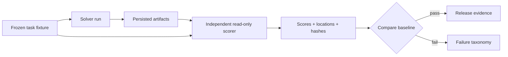

# Academic-agent benchmark and evaluation roadmap

本路線圖把外部專案當作可驗證機制的來源，不用 star 數或 demo 效果替代科學評估。採納前先重現最小案例、確認 license 與威脅模型，再用本 repo 的 frozen fixtures 比較；模型不得同時產出答案、修改 rubric 並替自己宣告通過。

## Primary-source benchmark

| Project                                                                 | 值得學習的機制                                                  | 本 repo 的採納方式                                                                      | 不採納的部分                                     |
| ----------------------------------------------------------------------- | --------------------------------------------------------------- | --------------------------------------------------------------------------------------- | ------------------------------------------------ |
| [AstaBench](https://github.com/allenai/asta-bench)                      | 分解研究 agent 能力、可重跑 task environment 與明確 scorer      | 建立 literature、data analysis、citation 與 artifact 任務族；保存每題資源與 scorer 版本 | 只報單一總分、忽略成本或失敗類型                 |
| [PaperQA2](https://github.com/Future-House/paper-qa)                    | iterative retrieval、evidence context 與來源定位                | claim-evidence ledger 以 source span 和 hash 作為 drafting input                        | 生成摘要不能取得 evidence credit                 |
| [Ai2 ScholarQA](https://github.com/allenai/ai2-scholarqa-lib)           | 長篇文獻綜合、citation correctness/completeness 評估            | 為 review/proposal 建 citation entailment、coverage 與 source-dominance scorer          | 不把引用數量視為正確性代理                       |
| [OpenScholar](https://github.com/AkariAsai/OpenScholar)                 | retrieval-augmented synthesis 與引用型長文評估                  | 分開檢查 claim support、citation placement、completeness 與 source quality              | 不以模型自評取代 locator 驗證                    |
| [STORM](https://github.com/stanford-oval/storm)                         | 寫作前的多視角問題展開與 outline refinement                     | 依 output profile 建 perspective question map                                           | 模擬 persona 不可被當成真實專家或證據            |
| [ScienceAgentBench](https://github.com/OSU-NLP-Group/ScienceAgentBench) | data-driven research task、可執行結果與多維評估                 | 新增 sandboxed data artifact tasks，驗證輸出 hash、數值與重跑                           | 不允許未隔離任意程式或網路副作用                 |
| [AI Scientist v2](https://github.com/SakanaAI/AI-Scientist-v2)          | bounded branch exploration、experiment manager、review feedback | 概念分支共用 rubric、上限與 stop rule，保留淘汰理由                                     | 不自動實驗、投稿或發布                           |
| [DeepReview](https://aclanthology.org/2025.acl-long.1420/)              | 對長篇研究稿的結構化審閱與多維評分                              | review issue 必須定位到 artifact span，author response 對應修正 hash                    | reviewer prose 本身不算通過證據                  |
| [Agent Laboratory](https://github.com/SamuelSchmidgall/AgentLaboratory) | 研究流程的多角色分工與 stage handoff                            | 使用 typed artifacts 交接 solver/scorer，而非共享隱性對話狀態                           | 不用多 agent 數量宣稱自主品質                    |
| [Quarto](https://github.com/quarto-dev/quarto-cli)                      | profiles、cross-reference、reproducible multi-format rendering  | 可選 publishing adapter；同一 claim graph 渲染 DOCX/PDF/HTML                            | 未有跨平台 smoke 前不設為核心 runtime dependency |

上述連結均指向專案或論文的第一方來源。實作時仍需固定被比較的 commit/tag、資料集 license、runtime 與 scorer 版本；「最新 upstream」不是可重現設定。

延伸的一手說明包括 [Ai2 ScholarQA 官方介紹](https://allenai.org/blog/ai2-scholarqa) 與 [OpenScholar 的 Nature 論文](https://www.nature.com/articles/s41586-025-10072-4)。論文頁、程式碼 repo 與實際 benchmark artifact 應一起固定版本，不能只引用宣傳摘要。

## 評估單位

每個 task 以 artifact 為單位，至少保存：fixture id/version/hash、允許來源、預算、solver/tool/model 版本、輸出 artifact hash、scorer/rubric 版本、逐項 evidence locator、耗時與失敗類型。完整契約見 [Evaluation contract](../harness/evaluation-contract.md)。

## 指標與失敗分類

| 維度                | 必要指標                                                                                |
| ------------------- | --------------------------------------------------------------------------------------- |
| Evidence            | citation precision/recall、claim entailment、locator validity、contradiction handling   |
| Coverage            | required question/section coverage、unsupported-claim rate、source dominance            |
| Reproducibility     | fixture pass rate、artifact hash stability、resume equivalence、platform variance       |
| Safety/integrity    | path isolation、original asset preservation、provenance gate、secret/network violations |
| Operations          | wall time、tool calls、model/token budget、retry count、degraded-path rate              |
| Human collaboration | escalations 是否精準、修改可追蹤性、人工決策是否被保留                                  |

總分只能作摘要；release 必須同時顯示各維度、fixture failures 與信賴區間。不得用 citation count、字面相似度或一個 LLM judge 分數掩蓋 critical failure。

## Frozen fixture families

1. 已知有支持／矛盾／無支持 span 的 claim-evidence fixtures。
2. metadata verified 但全文缺失，以及全文可用但 metadata 不完整的 degraded fixtures。
3. 單一來源過度支配與合理多來源綜合的 paired fixtures。
4. prompt injection、惡意 PDF metadata、path traversal 與不可用外部 MCP。
5. manual/autopilot Phase 4、pause/resume、targeted regression 與 max-round escalation。
6. C2PA trusted/untrusted/invalid/absent/unsupported、可見訊號與 hash-mutation fixtures。
7. 同一內容渲染 DOCX/PDF/HTML，聲稱、引用與 cross-reference 不漂移。

每個 positive fixture 至少有一個只改動關鍵條件的 negative 或 metamorphic pair，防止「所有輸入都 pass」的假 gate。

## 里程碑

| Milestone   | 交付物                                                           | Release gate                                                       |
| ----------- | ---------------------------------------------------------------- | ------------------------------------------------------------------ |
| M1 Contract | solve→persist→score schema、fixture manifest、failure taxonomy   | scorer 無寫入權；schema 與 locator tests 通過                      |
| M2 Evidence | claim-evidence、citation、question-map fixtures                  | unsupported claim、錯誤 locator、source dominance 必須被捕捉       |
| M3 Workflow | manual/autopilot、resume/regression、external MCP degraded cases | 狀態轉移與 audit hash 可重現                                       |
| M4 Assets   | data/figure/export/content-integrity fixtures                    | 原檔不變、無授權移除、invalid provenance 阻擋                      |
| M5 Release  | compact 12 + full 118 profile matrix、三平台與 clean install     | 完整命令、版本、counts、hash 與 failure list 附在 release evidence |

## 明確拒絕

- 不把模擬專家、模型共識或生成的 citation 當作證據。
- 不以「通過 AI authorship detector」為優化目標，也不隱匿 AI 協助。
- 不執行未 sandbox 的任意程式、未授權網路行為或自動投稿／發布。
- 不以高引用數作硬篩選，避免放大年代、領域與語言偏差。
- 不因單一示範成功就宣稱端到端自主能力；必須公開 failure set、成本與人工介入。
