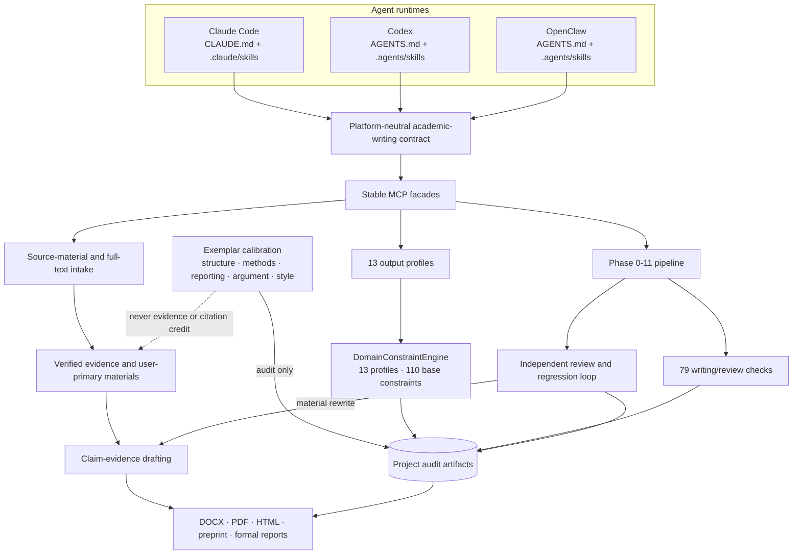
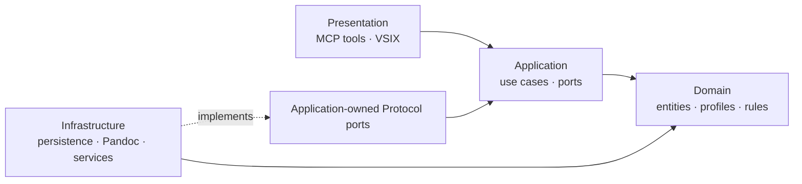

# Production academic-writing harness architecture

This design describes the provider-neutral production surface shared by Claude
Code, Codex, and OpenClaw. Runtime discovery differs, but scientific evidence,
output-profile constraints, phase gates, review, and audit artifacts do not.

## System flow

The dotted exemplar edge is a prohibition, not a data-flow path: a document
used for structural or stylistic calibration does not become scientific
evidence. If it is independently appraised as evidence, that is a separate
reference decision with its own provenance.

## Layer boundaries

Static tests reject Application imports from Infrastructure or Presentation,
and reject Domain imports from all outer layers. Infrastructure adapters are
constructed at the MCP boundary and injected through application-owned ports.

## Production verification

The release evidence combines complementary checks:

1. formatting, lint, type checking, Bandit, and high-confidence vulture scan;
2. deterministic unit, boundary, adversarial, lifecycle, and export tests;
3. a 118-tool greedy MCP smoke in an isolated workspace;
4. Linux, Windows, and macOS CI smoke;
5. VSIX lint, TypeScript, Vitest, bundle-drift, package, and install smoke;
6. tool/hook authority and documentation consistency checks;
7. audit, Memory Bank, changelog, and release provenance.

Expected domain failures are assertions of policy and remain distinguishable
from transport/runtime failures. The greedy runner fails the build only for
broken calls, while its fixtures deliberately exercise validation and
precondition behavior.
