# Platform-neutral academic-writing workflow

This document is the shared behavioral contract for Claude Code, Codex, and
OpenClaw. Platform-specific skills provide discovery; this file defines the
same scientific and editorial process for every runtime.

## 1. Select the output profile first

An output profile controls required sections, evidence expectations, review
rubrics, word limits, and export format. It must be selected before outlining.

| Output family                | Typical required structure                                                   | Primary quality gate                                     |
| ---------------------------- | ---------------------------------------------------------------------------- | -------------------------------------------------------- |
| Original research            | Title, abstract, Introduction, Methods, Results, Discussion                  | Study design and EQUATOR compliance                      |
| Review / systematic review   | Question, protocol, search, selection, synthesis, limitations                | Reproducible search and evidence appraisal               |
| Case report / brief report   | Case context, timeline, intervention, outcome, discussion                    | Consent, chronology, and CARE-style completeness         |
| Research proposal / grant    | Need, aims, hypotheses, methods, feasibility, milestones, budget/ethics      | Internal alignment and feasibility                       |
| Project closeout report      | Planned versus delivered work, methods, outputs, deviations, impact, lessons | Traceability to approved plan and deliverables           |
| Student paper / short thesis | Question, scoped review or method, analysis, discussion, reflection          | Appropriate depth, pedagogy, and source quality          |
| arXiv preprint               | Discipline-appropriate manuscript plus reproducibility and version metadata  | Self-contained claims, artifacts, and transparent status |
| Other formal academic output | Explicit user/journal/institution schema                                     | Validated custom profile before drafting                 |

Do not infer missing institutional or funder requirements. Record them as
unresolved constraints and obtain the relevant guide or user decision.

## 2. Evidence roles are not interchangeable

Every source receives exactly one primary role in the audit ledger:

- `claim_evidence`: may support a factual or scientific claim after relevance
  and quality appraisal.
- `method_authority`: supports a method, reporting rule, or measurement choice.
- `exemplar_structure`: demonstrates organization, section order, paragraph
  function, or information flow.
- `exemplar_style`: demonstrates measurable voice features such as sentence
  length range, hedging density, transition style, or table conventions.
- `user_primary_material`: data, protocol, analysis output, or approved plan
  supplied by the user.

An exemplar is never automatically claim evidence. If the same article is used
for both roles, each role needs its own reason and verification record.

## 3. Exemplar-aware writing protocol

Before using a sample paper, record the bounded use with
`project_action(action="exemplar_usage", ...)`. This creates or updates
`projects/{slug}/.audit/exemplar-usage.yaml` with:

- stable identifier and source path/URL;
- one or more allowed calibration roles and target sections;
- a concise transformative purpose and optional source SHA-256;
- immutable policy flags denying evidence eligibility, citation credit, and
  verbatim copying;
- independent-verification requirements for every claim and citation.

Allowed extraction includes section topology, rhetorical move sequence,
paragraph-length distribution, heading depth, reporting density, placement of
limitations, and abstract/table organization.

Never copy or lightly paraphrase distinctive wording, data, claims, citations,
figures, tables, or conclusions. Never fabricate a citation because it appears
in an exemplar. Draft from independently verified evidence, then compare the
result against the permitted structural/style features. Similarity checks and
source attribution remain mandatory.

## 4. Auditable phase sequence

```mermaid
flowchart LR
    A[0 Profile and source intake] --> B[1 Project setup]
    B --> C[2 Search and full text]
    C --> D[3 Appraisal and concept]
    D --> E[4 Outline and claim ledger]
    E --> F[5 Section writing]
    F --> G[6 Cross-section audit]
    G --> H[7 Independent review loop]
    H --> I[8 Reference sync]
    I --> J[9 Export and submission checks]
    J --> K[10 Retrospective and memory]
    K --> L[11 Final delivery]
    H -- material rewrite --> F
```

Each phase produces an artifact and a gate result. A later phase may regress to
an earlier phase when evidence, analysis, or review changes; the regression and
reason must be recorded.

## 5. Section-level drafting contract

Before drafting a section, create a section brief containing purpose, required
content, claims, evidence identifiers, user-primary data, forbidden
interpretations, tense/voice, target length, cross-references, and exemplar
features allowed for that section.

Draft in claim-evidence units. After every section:

1. verify numerical and factual claims against their source;
2. check citations, provenance, and trust layer;
3. run word-count, anti-AI-pattern, voice, language, overlap, and section-type
   checks;
4. review transitions and cross-section consistency;
5. approve or revise the section through the configured gate.

Results remain descriptive; interpretation belongs in Discussion or the
profile-equivalent section. Proposals distinguish planned work from completed
work. Closeout reports distinguish approved scope, actual delivery, deviations,
and evidence of impact. Preprints state review/version status without implying
peer-review acceptance.

## 6. Completion contract

Completion requires all applicable gates, resolvable citations, verified
reference metadata, satisfied output-profile constraints, reproducible export,
quality scorecard, decision/audit trail, and updated project Memory. Degraded
external tools, missing full text, unresolved user decisions, or failed gates
must remain visible in the final report.
