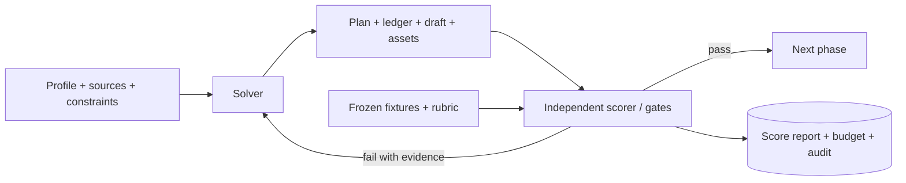

# Platform-neutral academic-writing workflow

This is the shared behavioral contract for Claude Code, Codex, OpenClaw, and
the packaged VS Code experience. Platform adapters provide discovery and tool
spelling; this document defines the same scientific, editorial, and audit
process for every runtime. It operationalizes `CONSTITUTION.md` and never
weakens its evidence, trust-layer, or protected-content boundaries.

## 1. Mission and autonomy boundary

MedPaper Assistant supports both bounded autonomous work and researcher-led
writing. They use the same artifacts and gates:

- an Agent may search, plan, draft, inspect, and propose revisions within the
  selected output profile;
- a researcher can pause, edit, approve, reject, or narrow the run at any
  checkpoint;
- deterministic gates remain observable in either mode;
- missing evidence, failed tools, and unresolved decisions remain visible;
- no mode authorizes fabricated data, citations, review, consent, authorship,
  or submission;
- a sub-threshold concept or review can advance only through a state-bound,
  Ed25519-signed receipt from a trusted host/UI. The MCP may verify or revoke
  it, but cannot sign it or treat a self-declared `human` field as authority.

Phase 4 is mode-aware. In manual mode the researcher approves the plan. In
autopilot mode the Agent may perform and record a bounded self-review, but a
high-risk decision, repeated regression, unresolved institutional rule, or an
explicit user preference escalates to a human checkpoint.

## 2. Select the output profile first

An output profile controls required sections, evidence expectations, review
rubrics, word limits, and export format. It must be selected before outlining.

| Output family                | Typical required structure                                                   | Primary quality gate                                     |
| ---------------------------- | ---------------------------------------------------------------------------- | -------------------------------------------------------- |
| Original research            | Title, abstract, Introduction, Methods, Results, Discussion                  | Study design and EQUATOR compliance                      |
| Review / systematic review   | Question, protocol, search, selection, synthesis, limitations                | Reproducible search and evidence appraisal               |
| Case report / brief report   | Case context, timeline, intervention, outcome, discussion                    | Consent, chronology, and CARE-style completeness         |
| Research proposal / grant    | Need, aims, hypotheses, methods, feasibility, milestones, budget/ethics      | Internal alignment and feasibility                       |
| Project closeout report      | Planned versus delivered work, methods, outputs, deviations, impact, lessons | Traceability to approved plan and deliverables           |
| Student paper / short thesis | Question, scoped review or method, analysis, discussion, reflection          | Appropriate depth, pedagogy, and source quality          |
| arXiv preprint               | Discipline-appropriate manuscript plus reproducibility and version metadata  | Self-contained claims, artifacts, and transparent status |
| Other formal academic output | Explicit user/journal/institution schema                                     | Validated custom profile before drafting                 |

Do not infer missing institutional, funder, course, or journal requirements.
Record them as unresolved constraints and obtain the guide or a user decision.

## 3. Separate solving from scoring

The writing loop has two roles even when one runtime executes both:


```mermaid
flowchart LR
    Inputs[Profile + sources + constraints] --> Solver[Solver]
    Solver --> Artifacts[Plan + ledger + draft + assets]
    Artifacts --> Scorer[Independent scorer / gates]
    Fixtures[Frozen fixtures + rubric] --> Scorer
    Scorer -->|pass| Next[Next phase]
    Scorer -->|fail with evidence| Solver
    Scorer --> Audit[(Score report + budget + audit)]
```

The solver can retrieve and revise. The scorer evaluates persisted artifacts
against a versioned rubric and must not silently repair the artifact it is
scoring. A fluent answer cannot receive evidence credit without resolvable
locators. Critical failures are reported separately and cannot be averaged
away by a high style score. The complete contract is in
[Evaluation contract](evaluation-contract.md).

## 4. Evidence roles are not interchangeable

Every source receives one primary role per use in the audit ledger:

- `claim_evidence`: may support a factual or scientific claim after relevance
  and quality appraisal;
- `method_authority`: supports a method, reporting rule, or measurement choice;
- `exemplar_structure`: demonstrates organization or rhetorical sequence;
- `exemplar_style`: demonstrates measurable voice or layout features;
- `user_primary_material`: data, protocol, analysis output, or approved plan
  supplied by the user.

An exemplar is never automatically claim evidence. If the same article is used
for two roles, each role needs a separate reason and verification record.

## 5. Claim-evidence ledger and locators

Build the ledger before prose. Every material claim should point to one or more
source spans with enough information to re-open and re-verify them:

```yaml
claim_id: C-INTRO-001
claim_text: "..."
claim_type: factual
contexts:
  - source_id: "PMID:12345678"
    source_revision_id: "sha256:..."
    span_id: "methods-p4-s2"
    locator_version: 1
    section: "Methods"
    page: 4
    line_start: 118
    line_end: 124
    char_start: 2201
    char_end: 2528
    text_sha256: "..."
    context_excerpt: "short bounded excerpt"
    relation: supports
    fulltext_status: verified
selected_contexts: ["methods-p4-s2"]
decision_reason: "Directly reports the prespecified method."
```

Use only locators the source adapter can justify. Page, line, byte, or character
offsets may be omitted when unavailable; they must never be fabricated. A
generated summary is navigation aid, not the source of truth.

## 6. Exemplar-aware writing protocol

Before using a sample paper, record the bounded use with
`project_action(action="exemplar_usage", ...)`. The audit entry includes a
stable identifier, allowed calibration roles, target sections, transformative
purpose, and optional source SHA-256. Policy flags deny evidence eligibility,
citation credit, and verbatim copying.

Allowed extraction includes section topology, rhetorical-move sequence,
paragraph-length distribution, heading depth, reporting density, limitations
placement, and abstract/table organization.

Never copy or lightly paraphrase distinctive wording, data, claims, citations,
figures, tables, or conclusions. Draft from independently verified evidence,
then compare only against the declared structure/style features.

## 7. Auditable phase sequence


```mermaid
flowchart LR
    A[0 Profile and source intake] --> B[1 Project setup]
    B --> C[2 Search]
    C --> C21[2.1 Full text and source receipts]
    C21 --> D[3 Appraisal and concept]
    D --> E[4 Plan and claim ledger]
    E --> F[5 Section writing and assets]
    F --> G[6 Cross-section audit]
    G --> G65[6.5 Evolution baseline]
    G65 --> H[7 Independent review loop]
    H --> I[8 Reference sync]
    I --> J[9 Export checks]
    J --> K[10 Retrospective and memory]
    K --> L[11 Final delivery]
    H -- material rewrite --> F
```

Each phase produces an artifact and a gate result. Phase 2.1 is a nested source
gate. Phase 6.5 creates the baseline/evolution record before review; it is not
the asset-generation phase. A later phase may regress to an earlier one when
evidence, analysis, or review changes, and the reason is recorded.

## 8. Section-level drafting contract

Before drafting a section, create a section brief containing purpose, required
content, claims, evidence identifiers, user-primary data, forbidden
interpretations, tense/voice, target length, cross-references, and permitted
exemplar features.

Draft in claim-evidence units. After every section:

1. verify numerical and factual claims against their source locators;
2. check citations, provenance, trust layer, and source-dominance warnings;
3. run word-count, voice, clarity, language, overlap, and section-type checks;
4. review transitions and cross-section consistency;
5. approve or revise the section through the configured gate.

Style checks improve readability and consistency. They must not be tuned to
pass an AI authorship detector, hide AI assistance, or evade a platform,
course, journal, or funder disclosure rule.

Results remain descriptive; interpretation belongs in Discussion or the
profile-equivalent section. Proposals distinguish planned from completed work.
Closeout reports distinguish approved scope, delivery, deviations, and impact.
Preprints state review/version status without implying peer-review acceptance.

## 9. Budgets and source dominance

Every run records retrieval/tool-call/time/token budgets when observable.
Budget exhaustion produces a degraded or blocked result, never invented
evidence. A single source dominating a section is a review signal rather than a
universal automatic rejection: the profile must define when independent
corroboration or a rationale is required. Landmark methods, standards, and
single-case primary materials may legitimately dominate if documented.

## 10. Asset and content integrity

Figures and tables are reviewed before insertion. The receipt records file
identity, observations, rationale, proposed caption, and—where supported—C2PA
provenance status. C2PA presence does not prove factual truth, and absence does
not prove that an asset is untrustworthy. A pinned `remove-ai-watermarks`
adapter adds an offline, per-detector read-only check for registered visible marks and
open DWT-DCT signals. `NOT_DETECTED` is never represented as `CLEAN`, and raster
uncertainty or a detected signal requires a documented reviewer conclusion.

The harness preserves the original bytes and blocks insertion if the reviewed
SHA-256 changes or a required PNG/JPEG/WebP package check cannot run. It calls no
removal API, strips no metadata, and writes no cleaned derivative. The reviewer
note is self-attested evidence, not cryptographic proof of identity or usage
rights. See [MCP 2 and content integrity](../wiki/mcp2-content-integrity.md).

## 11. Completion and release evidence

Completion requires all applicable gates, resolvable citations, verified
reference metadata, satisfied output-profile constraints, reproducible export,
quality scorecard, decision/audit trail, and updated project Memory. Release
claims require frozen fixtures and smoke evidence for both compact and full MCP
surfaces. Degraded external tools, missing full text, unresolved user decisions,
or failed gates remain visible in the final report.
