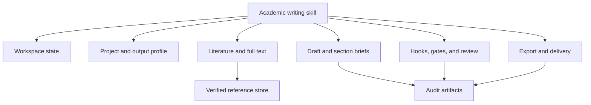

# Agent platform compatibility

The harness uses shared repository rules and a platform-neutral workflow while
respecting each runtime's native discovery paths.

| Runtime     | Durable project instructions            | Repo skill entry                           | Notes                                                  |
| ----------- | --------------------------------------- | ------------------------------------------ | ------------------------------------------------------ |
| Claude Code | `CLAUDE.md` plus `AGENTS.md` authority  | `.claude/skills/academic-writing-harness/` | Existing phase skills remain under `.claude/skills/`   |
| Codex       | `AGENTS.md`                             | `.agents/skills/academic-writing-harness/` | `.agents/skills` is the current repo-scoped Codex root |
| OpenClaw    | Workspace instructions plus `AGENTS.md` | `.agents/skills/academic-writing-harness/` | OpenClaw scans project-agent skills from the same root |

`.codex/skills` and `.cline/skills` may still exist as integration-generated or
legacy compatibility assets, but they are not the authority for the shared
academic workflow. New cross-agent capabilities should be added to
`.agents/skills` and adapted into `.claude/skills` only when Claude-specific
discovery is required.

## Capability mapping

The workflow depends on capabilities, not a provider-specific tool spelling:

An adapter may expose one facade or several fine-grained tools. It is compliant
only if state recovery, evidence provenance, hard gates, and export validation
remain observable.
