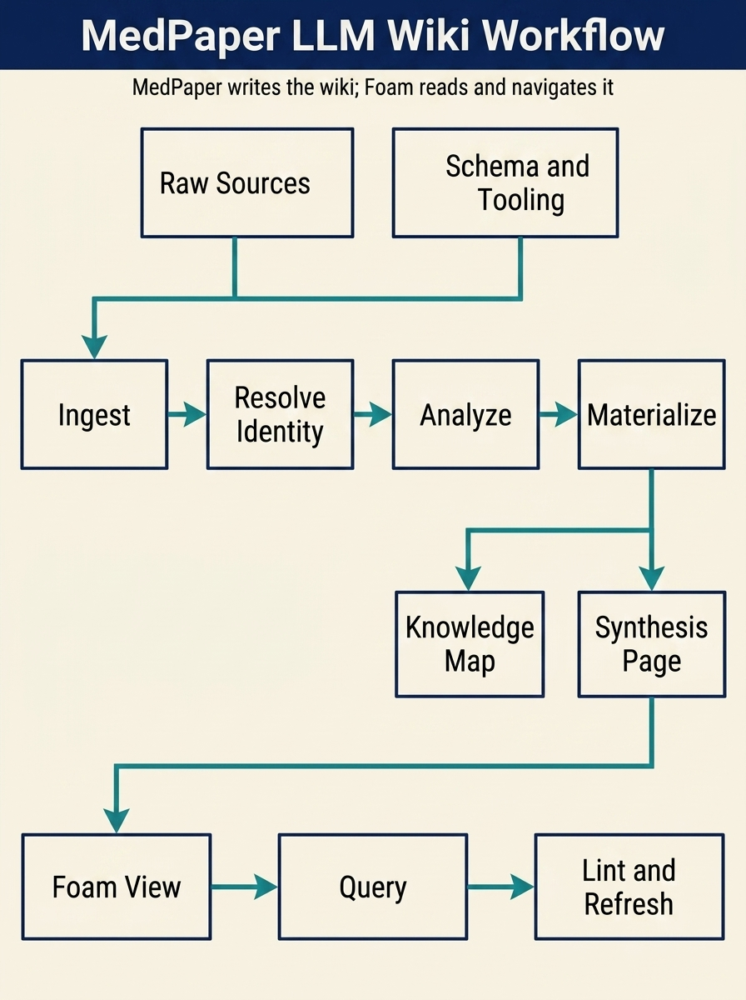

# Using The MedPaper LLM Wiki

This guide explains how to use the current MedPaper LLM wiki after the recent
Foam-aligned changes.

## What "LLM Wiki" Means Here

In this repository, an LLM wiki is not a chat transcript and not a pure
query-time RAG layer.

It is a persistent markdown knowledge layer that sits between raw sources and
your future questions:

- raw sources stay immutable
- MedPaper writes and updates the wiki pages
- Foam lets you browse, link, preview, query, and navigate the result

The conceptual reference for this pattern is documented in
`docs/reference/llm-wiki.md`.

## What Changed In This Version

The recent adjustments made the wiki more usable inside Foam:

- reference notes now carry standardized `type` and `tags`
- reference notes now expose stable block anchors such as `^key-findings`
  and `^evidence-methods`
- knowledge maps and synthesis pages now emit `foam-query` blocks
- knowledge maps and synthesis pages now embed note-to-note evidence blocks

## Before You Start

Recommended setup:

1. Install and enable Foam in the workspace.
2. In the VSIX version, set `mdpaper.toolSurface` to `full` if you want the
   orchestration tools directly available.
3. Work inside one MedPaper project at a time so Foam autocomplete and graph
   remain scoped to the active note set.

Relevant orchestration tools:

- `import_local_papers`
- `ingest_web_source`
- `ingest_markdown_source`
- `resolve_reference_identity`
- `save_reference_analysis`
- `build_knowledge_map`
- `build_synthesis_page`
- `materialize_agent_wiki`

## The Practical Operating Loop

### 1. Ingest A Source

Use one of these depending on where the source comes from:

- local file: `import_local_papers`
- markdown text or markdown file: `ingest_markdown_source`
- web snapshot already converted to markdown/text: `ingest_web_source`

Result:

- a canonical reference directory is created under `projects/{slug}/references/`
- a Foam-readable reference note is materialized
- source artifacts and metadata are persisted
- `notes/index.md` and `notes/log.md` are updated

### 2. Resolve Identity When Better Metadata Exists

If a local or extracted source later maps to a verified PMID or richer metadata,
run `resolve_reference_identity`.

Use this when:

- a local PDF becomes a verified PubMed record
- a web or markdown note should be promoted into a canonical reference
- you want stable aliases and one durable note identity

Result:

- the source note keeps its history and aliases
- canonical identifiers replace temporary local IDs
- artifacts and prior analysis are preserved

### 3. Save Analysis

Once a reference has been reviewed, save a structured summary with
`save_reference_analysis`.

This is what turns a note from simple storage into something the wiki can
reason over and reuse later.

Good analysis input should include:

- one short synthesis summary
- likely manuscript usage sections
- contradictions or uncertainty when present

### 4. Materialize The Wiki Layer

Use `materialize_agent_wiki` when you want the bundle in one pass.

That creates:

- a knowledge map page
- a synthesis page

You can also run `build_knowledge_map` and `build_synthesis_page` separately if
you want tighter control.

Resulting files typically land under:

- `projects/{slug}/notes/index.md`
- `projects/{slug}/notes/log.md`
- `projects/{slug}/notes/knowledge-maps/`
- `projects/{slug}/notes/synthesis-pages/`

## How To Read The Output In Foam

### Reference Notes

Each reference note now gives you:

- aliases for wikilink completion
- standardized `type` and `tags`
- a `Key Findings` block with a stable anchor
- section-level evidence blocks with anchors such as `^evidence-methods`

Examples:

- `[[citation_key]]`
- `[[citation_key#^key-findings]]`
- `![[citation_key#^key-findings]]`
- `![[citation_key#^evidence-methods]]`

### Knowledge Map Pages

Knowledge maps are now better than static summaries.

They contain:

- a scope section
- a live reference count query
- a live reference table query
- an embedded evidence section that pulls note content from the underlying
  reference pages

Use them when you want a topic overview and a navigable evidence surface.

### Synthesis Pages

Synthesis pages are where you turn references into a working position.

They now contain:

- the current synthesis text
- the evidence base list
- a live evidence table query
- embedded evidence snippets from the linked reference notes

Use them when you want a draftable, updateable interpretation rather than just
an inventory.

## A Minimal Example Workflow

Example sequence for one web article or markdown note:

1. ingest the source with `ingest_web_source` or `ingest_markdown_source`
2. if a better identifier exists, run `resolve_reference_identity`
3. save one structured analysis with `save_reference_analysis`
4. run `materialize_agent_wiki`
5. open the resulting knowledge map and synthesis page in Foam
6. query the wiki, then promote valuable answers back into markdown pages

## When To Create New Wiki Pages

Promote a chat result into the wiki when it becomes reusable knowledge.

Good candidates:

- a comparison that will be reused later
- a topic-level contradiction summary
- a synthesis that now represents your current position
- a decision record about why one evidence line was trusted over another

Bad candidates:

- one-off conversational filler
- low-confidence speculation not tied to persisted sources

## What The Human Still Owns

The LLM writes the wiki, but you still own:

- source selection
- review of important summaries
- what deserves canonical identity
- how contradictions should be resolved in your domain
- when a synthesis is strong enough to promote into manuscript work

## Current Limits

These are the main limits that still matter in day-to-day use:

- registered figure/table notes now expose summary, review, bbox, and matched
  source-fragment anchors, but not every underlying layout-level snippet is
  anchored yet
- imported reference notes now link out to materialized journal/author/topic
  context hubs, but those taxonomy notes are still intentionally lightweight
- asset graph notes currently summarize registered figures/tables, not every
  possible fragment-level evidence card
- managed graph views are exposed as MedPaper commands, but fully custom inline
  graph configs still rely on native Foam keybindings
- embedded evidence currently favors the key findings block and summary
  excerpts, not every possible evidence fragment

## Related References

- `docs/reference/llm-wiki.md`
- `docs/reference/foam.md`
- `memory-bank/kb-integration-blueprint.md`