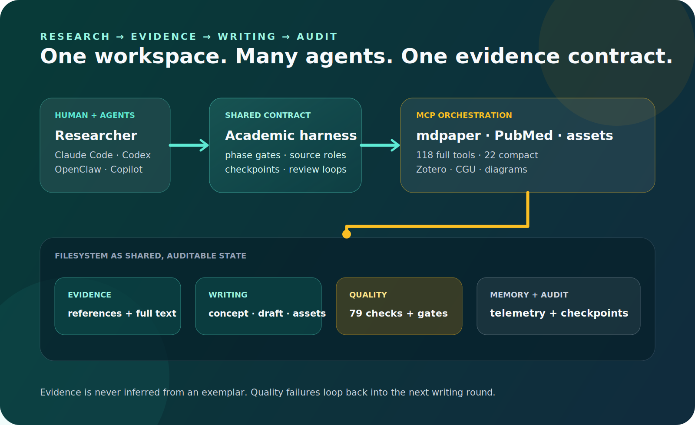
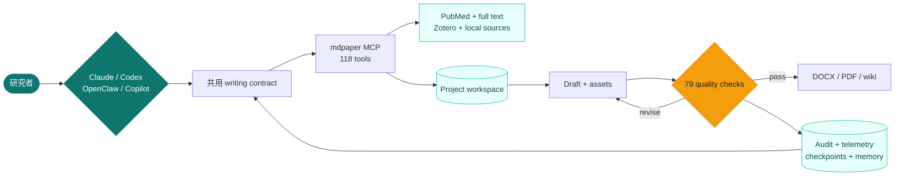
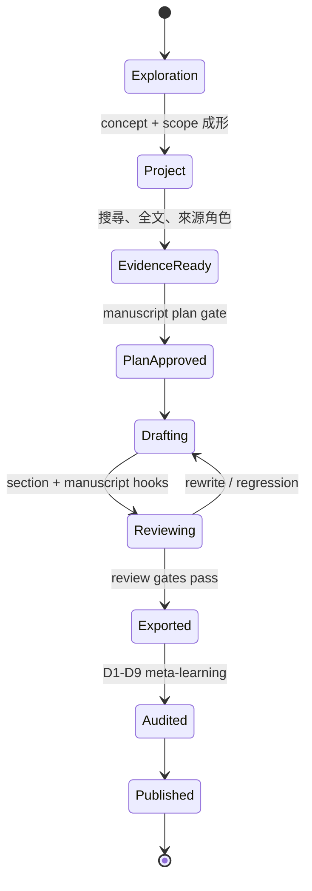
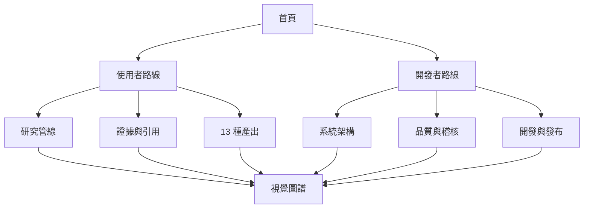

PRODUCTION ACADEMIC WRITING HARNESS

# 把學術寫作變成可重現的工程流程

MedPaper Assistant 讓 Claude Code、Codex、OpenClaw 與 VS Code Copilot 共用同一套研究契約：文獻必須可追溯、草稿必須經過 gate、每一輪修訂都留下 audit trail。

[五分鐘開始](wiki/quickstart.md){ .md-button .md-button--primary }
[探索完整架構](wiki/harness-architecture.md){ .md-button }

{ loading=lazy }

<strong>118</strong>Full MCP tools

<strong>13</strong>正式產出 profiles

<strong>79</strong>品質檢查

<strong>3</strong>演進治理層

## 一張圖理解整個 repo

系統不是「丟一個 prompt，拿一篇文章」。它把研究拆成可以暫停、回退、審閱與重現的 artifact pipeline；Agent 可以更換，但 evidence boundary 與品質 gate 不變。

## 依你的角色開始

### 我想寫論文

從研究概念、文獻、段落草稿一路走到 Word/PDF，了解每一個人工與自動 gate。

[研究管線總覽 →](wiki/research-pipeline.md)

### 我想理解架構

從 DDD、MCP facade、filesystem artifacts 到跨 Agent discovery，一次掌握系統邊界。

[Harness 架構 →](wiki/harness-architecture.md)

### 我想開發或維運

了解測試矩陣、bundle mirror、Pages、VSIX、PyPI 與 release gates。

[開發與發布 →](wiki/development-and-release.md)

## 從問題到可發布成品

每個箭頭都有對應的 MCP action、檔案產物與驗證證據。從 [Auto-Paper 指南](auto-paper-guide.md) 可查看完整 phase 契約；從 [品質與稽核](wiki/quality-and-audit.md) 可查看 gate 的實作位置。

## 這個 wiki 怎麼讀

左側導覽是主題式 wiki；右側目錄是單頁索引；頂部搜尋可同時檢索中英文術語。每一頁都盡量先給總覽圖，再連到實作細節與原始設計文件。

!!! info "目前穩定版本"

    `v0.9.0` 提供 13 種正式學術產出、110 個 base constraints、跨 Agent harness、exemplar audit、完整 MCP smoke 與可安裝 VSIX。版本與 artifact 請見 [GitHub Releases](https://github.com/u9401066/med-paper-assistant/releases)。
