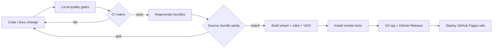
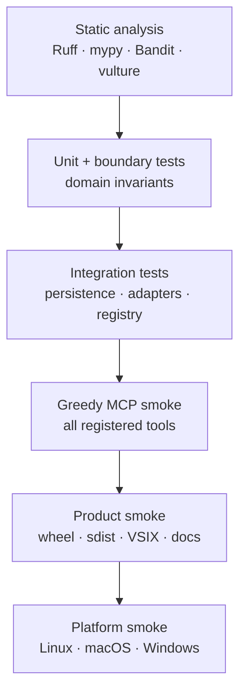
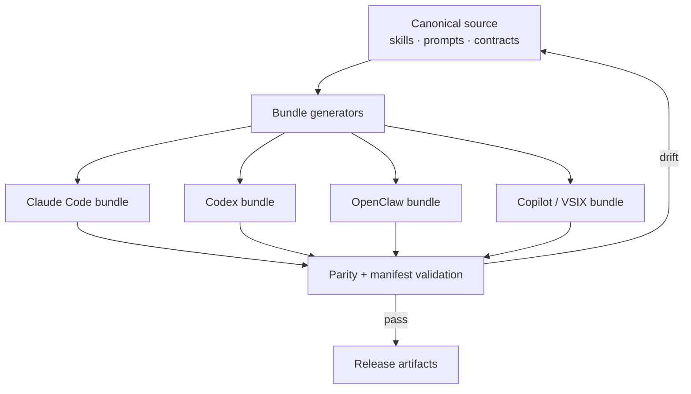
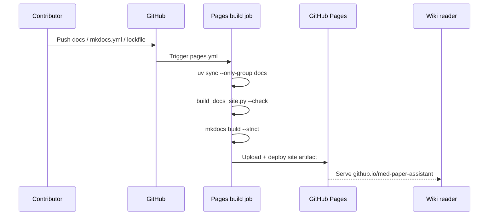
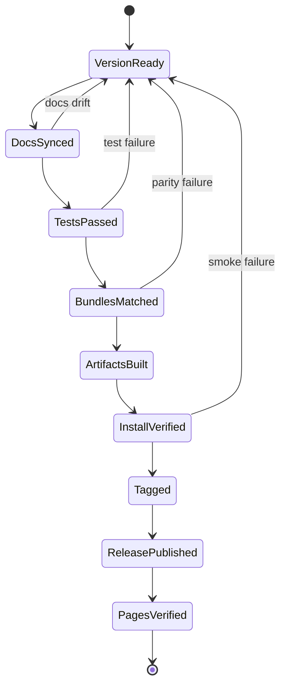

# 開發、測試與發布

MedPaper Assistant 的發布單位不只是 Python package。每次版本都要同時保證原始碼、跨 Agent bundles、VSIX、文件網站與可下載 artifacts 指向同一份契約。

## 從修改到發布



`development` 模式才允許修改 `src/`、`tests/`、`.github/` 與其他受保護路徑。操作前先確認 `.copilot-mode.json`，Python 指令一律透過 `uv` 與專案虛擬環境執行。

## 測試金字塔



| Gate                 | 驗證重點                              | 失敗代表什麼                |
| -------------------- | ------------------------------------- | --------------------------- |
| Ruff / mypy / Bandit | 風格、型別、安全基線                  | 原始碼品質或安全退化        |
| vulture allowlist    | 孤兒 function/class                   | 新增未接線 API 或過期程式碼 |
| pytest               | domain、application、adapter 行為     | 契約或邊界被破壞            |
| MCP greedy smoke     | registry 中每個 tool 可呼叫           | 對外 surface 不完整         |
| bundle parity        | `.claude`、`.agents`、`.codex` 等鏡像 | Agent 看到不同工作流程      |
| package install      | wheel、sdist、VSIX 可安裝             | 發布 artifact 不可用        |
| MkDocs strict build  | 導覽、連結、Markdown、Mermaid         | Wiki 內容或設定失效         |

常用本機檢查：

```bash
uv sync --frozen --all-groups
uv run ruff check .
uv run mypy src
uv run pytest
uv run python scripts/smoke_test_mcp_tools.py --all
uv run python scripts/build_docs_site.py --check
uv run mkdocs build --strict
```

實際 CI 指令以 `.github/workflows/` 為準；上列命令是最常用的對應入口。

## Bundle 是發布產物



Bundle 不應手動修補。權威來源先更新，再用 generator 重建鏡像；parity test 用來防止不同 Agent 得到不同 phase、tool 或 quality gate。

## GitHub Pages 發布



Pull request 只執行建置驗證；`master` push 才進入 deploy job。`mkdocs.yml` 是導覽與外觀的唯一設定入口，`docs/` 是內容來源，`site/` 是暫時建置輸出且不應提交。

本機預覽：

```bash
uv sync --only-group docs
uv run mkdocs serve
```

開啟終端顯示的本機 URL，即可驗證搜尋、深色模式、Mermaid、SVG 與響應式排版。

## Release gate



提交前依序同步 Memory Bank、README、CHANGELOG 與 ROADMAP。發布後仍要檢查 GitHub Release artifacts、Pages deployment 與公開 URL；workflow 綠燈不等於讀者端一定可用。

!!! success "v0.9.0 production baseline"

    目前基線包含 1523 個 Python tests、169 個 VSIX tests、118-tool greedy smoke、靜態分析、孤兒程式掃描、bundle parity、三平台 smoke 與 package install validation。後續版本不得在沒有決策紀錄的情況下降低 gate。
