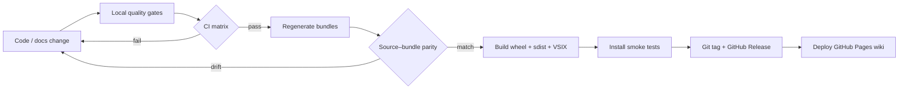
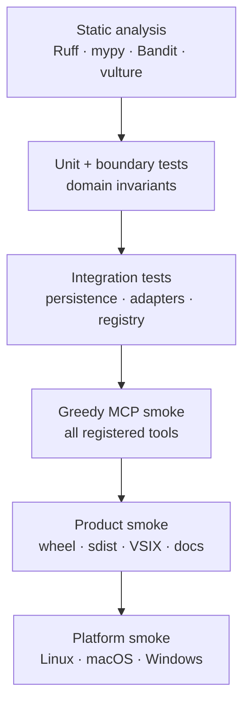
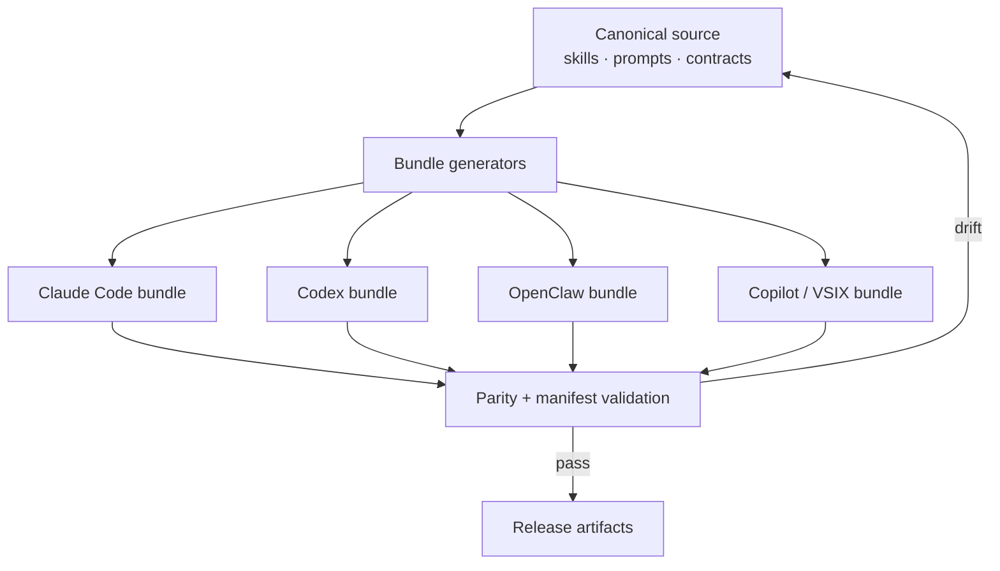
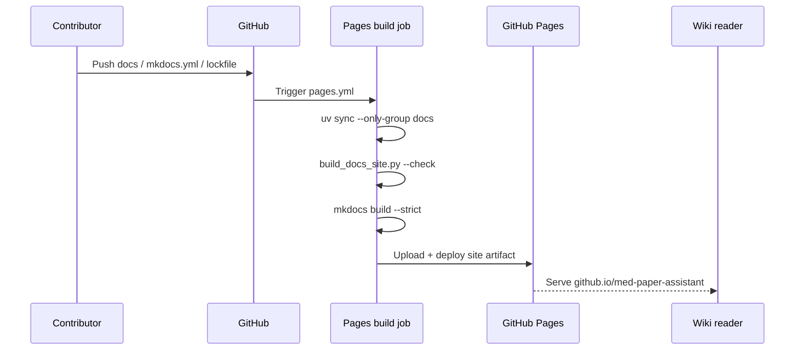
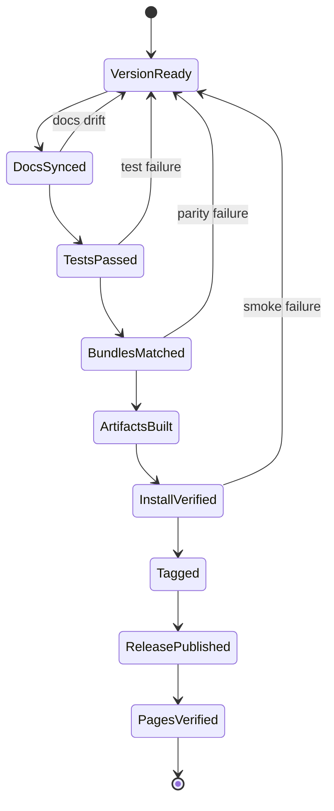

# 開發、測試與發布

MedPaper Assistant 的發布單位不只是 Python package。每次版本都要同時保證原始碼、跨 Agent bundles、VSIX、文件網站與可下載 artifacts 指向同一份契約。

## 從修改到發布


```mermaid
flowchart LR
    Change[Code / docs change] --> Local[Local quality gates]
    Local --> CI{CI matrix}
    CI -->|fail| Change
    CI -->|pass| Bundle[Regenerate bundles]
    Bundle --> Parity{Source–bundle parity}
    Parity -->|drift| Change
    Parity -->|match| Package[Build wheel + sdist + VSIX]
    Package --> Smoke[Install smoke tests]
    Smoke --> Release[Git tag + GitHub Release]
    Release --> Pages[Deploy GitHub Pages wiki]
```

`development` 模式才允許修改 `src/`、`tests/`、`.github/` 與其他受保護路徑。操作前先確認 `.copilot-mode.json`，Python 指令一律透過 `uv` 與專案虛擬環境執行。

## 測試金字塔


```mermaid
flowchart TB
    Static[Static analysis<br/>Ruff · mypy · Bandit · vulture]
    Unit[Unit + boundary tests<br/>domain invariants]
    Integration[Integration tests<br/>persistence · adapters · registry]
    Smoke[Greedy MCP smoke<br/>all registered tools]
    Product[Product smoke<br/>wheel · sdist · VSIX · docs]
    Platform[Platform smoke<br/>Linux · macOS · Windows]

    Static --> Unit --> Integration --> Smoke --> Product --> Platform
```

| Gate                 | 驗證重點                              | 失敗代表什麼                |
| -------------------- | ------------------------------------- | --------------------------- |
| Ruff / mypy / Bandit | 風格、型別、安全基線                  | 原始碼品質或安全退化        |
| vulture allowlist    | 孤兒 function/class                   | 新增未接線 API 或過期程式碼 |
| pytest               | domain、application、adapter 行為     | 契約或邊界被破壞            |
| MCP greedy smoke     | registry 中每個 tool 可呼叫           | 對外 surface 不完整         |
| bundle parity        | `.claude`、`.agents`、`.codex` 等鏡像 | Agent 看到不同工作流程      |
| package install      | wheel、sdist、VSIX 可安裝             | 發布 artifact 不可用        |
| MkDocs strict build  | 導覽、連結、Markdown、Mermaid         | Wiki 內容或設定失效         |

常用本機檢查：

```bash
uv sync --frozen --all-groups
uv run ruff check .
uv run mypy src
uv run pytest
uv run python scripts/check_tool_surface_authority.py
uv run python scripts/greedy_mcp_tool_smoke.py --surface compact
uv run python scripts/greedy_mcp_tool_smoke.py --surface full
uv run python scripts/build_docs_site.py --check
uv run mkdocs build --strict
```

實際 CI 指令以 `.github/workflows/` 為準；上列命令是最常用的對應入口。

## Bundle 是發布產物


```mermaid
flowchart TD
    Authority[Canonical source<br/>skills · prompts · contracts] --> Build[Bundle generators]
    Build --> Claude[Claude Code bundle]
    Build --> Codex[Codex bundle]
    Build --> OpenClaw[OpenClaw bundle]
    Build --> Copilot[Copilot / VSIX bundle]
    Claude & Codex & OpenClaw & Copilot --> Verify[Parity + manifest validation]
    Verify -->|drift| Authority
    Verify -->|pass| Artifacts[Release artifacts]
```

Bundle 不應手動修補。權威來源先更新，再用 generator 重建鏡像；parity test 用來防止不同 Agent 得到不同 phase、tool 或 quality gate。

## GitHub Pages 發布


```mermaid
sequenceDiagram
    participant Dev as Contributor
    participant GH as GitHub
    participant Build as Pages build job
    participant Pages as GitHub Pages
    participant Reader as Wiki reader

    Dev->>GH: Push docs / mkdocs.yml / lockfile
    GH->>Build: Trigger pages.yml
    Build->>Build: uv sync --only-group docs
    Build->>Build: build_docs_site.py --check
    Build->>Build: mkdocs build --strict
    Build->>Pages: Upload + deploy site artifact
    Pages-->>Reader: Serve github.io/med-paper-assistant
```

Pull request 只執行建置驗證；`master` push 才進入 deploy job。`mkdocs.yml` 是導覽與外觀的唯一設定入口，`docs/` 是內容來源，`site/` 是暫時建置輸出且不應提交。

本機預覽：

```bash
uv sync --only-group docs
uv run mkdocs serve
```

開啟終端顯示的本機 URL，即可驗證搜尋、深色模式、Mermaid、SVG 與響應式排版。

## Release gate


```mermaid
stateDiagram-v2
    [*] --> VersionReady
    VersionReady --> DocsSynced
    DocsSynced --> TestsPassed
    TestsPassed --> BundlesMatched
    BundlesMatched --> ArtifactsBuilt
    ArtifactsBuilt --> InstallVerified
    InstallVerified --> Tagged
    Tagged --> ReleasePublished
    ReleasePublished --> PagesVerified
    PagesVerified --> [*]

    DocsSynced --> VersionReady: docs drift
    TestsPassed --> VersionReady: test failure
    BundlesMatched --> VersionReady: parity failure
    InstallVerified --> VersionReady: smoke failure
```

提交前依序同步 Memory Bank、README、CHANGELOG 與 ROADMAP。發布後仍要檢查 GitHub Release artifacts、Pages deployment 與公開 URL；workflow 綠燈不等於讀者端一定可用。

!!! success "Release evidence，不是永恆數字"

    每次 release 都要重新附上 test/smoke counts、compact 12 與 full 118 結果、命令、runner/runtime 版本、fixture 版本、artifact hashes 與完整 failure/skip 列表。歷史 release 的數量不能代替本次執行證據；任何 gate 降級都要有 decision record。

## GitHub repository governance state

2026-08-17 已在確認 repository owner 與 default branch 後，透過 GitHub API 套用 description、topics 與 labels；既有 labels 保留，避免破壞現有 issue／PR。其餘高影響設定仍列為待決策，不由文件更新暗中變更。

| 項目                   | 建議狀態 | 可追蹤動作                                                                                                                                                                                                 |
| ---------------------- | -------- | ---------------------------------------------------------------------------------------------------------------------------------------------------------------------------------------------------------- |
| Repository description | 已套用   | `Auditable MCP + cross-agent harness for autonomous and human-guided academic writing—from verified evidence to reviewed DOCX/PDF.`                                                                        |
| Topics                 | 已套用   | 新增 `ai-agents`、`human-in-the-loop`、`research-automation`、`reproducible-research`、`research-software`；保留既有 topics，避免無審查的破壞性刪除                                                        |
| Labels                 | 已套用   | 新增 15 個 `type:*`、`area:*`、`status:*` 與 release/quality labels，包含 workflow 使用的 `evolution-health`、`skip-changelog`；既有 labels 保留                                                           |
| Default branch         | 已確認   | 維持 `master`；若未來遷移到 `main`，必須同一變更更新 CI、Pages、release、badges、`edit_uri` 與 branch protection，不能只改遠端名稱                                                                         |
| Ruleset                | 建議     | 要求 CI/Pages contract checks、review conversation resolution、禁止 force-push/deletion；視維護人數決定 required approvals                                                                                 |
| Security updates       | 建議     | 啟用 private vulnerability reporting、dependency graph 與 Dependabot security updates；提交 `.github/dependabot.yml` 前先定更新頻率與 submodule/Node/Python ownership                                      |
| Wiki duplication       | 建議     | 公開文件以 MkDocs Pages 為 canonical；停用內建 GitHub Wiki，或只產生清楚標示的 mirror，避免兩份手寫文件漂移                                                                                                |
| Releases               | 建議     | PyPI 維持 OIDC trusted publishing；VS Marketplace 發布後驗證公開版本與 VSIX hash。若 Marketplace 外部 policy 失敗，GitHub Release 必須顯示 job status、標成 degraded path，並指向附檔 VSIX，不得假裝已上架 |
| Community health       | 本變更   | 維護 `CITATION.cff`、`CODE_OF_CONDUCT.md`、`SECURITY.md`；後續加入 issue-form schema 與 support policy                                                                                                     |

遠端治理變更必須保留 before/after API output、rollback 方法與執行者；未取得明確授權時，文件 PR 不得偷偷改 description、topics、labels、ruleset 或 Pages 設定。本次同步依使用者明確要求執行，rollback 可用 `gh repo edit` 還原 description/topics，labels 則逐項更新或刪除。
