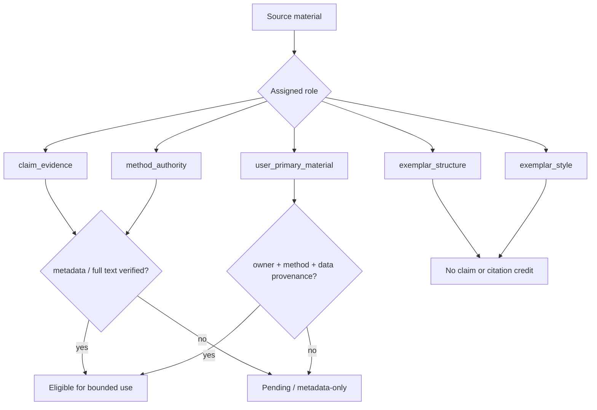
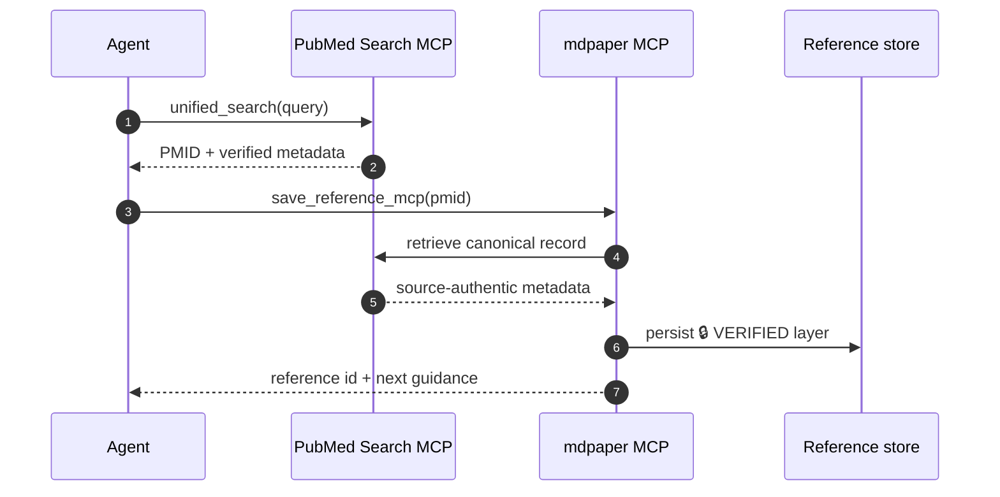
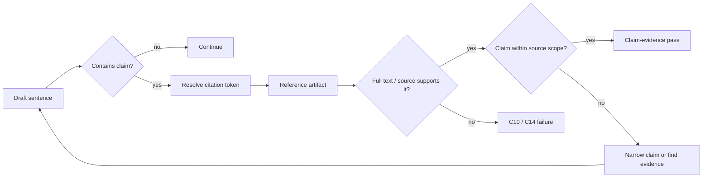
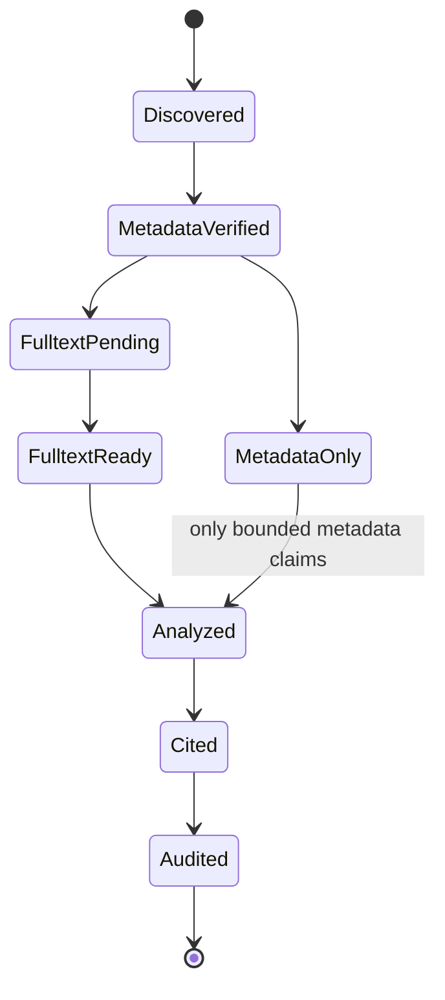

# 證據、引用與範文

系統把「內容看起來像論文」和「內容有可驗證證據」分開處理。每一個來源先取得角色，再決定它能不能支持 claim、method 或 citation。

{ loading=lazy }

## Source roles

| Role                    | 可做什麼                         | 不可做什麼                 |
| ----------------------- | -------------------------------- | -------------------------- |
| `claim_evidence`        | 支持可定位的學術 claim           | 超出原文範圍推論           |
| `method_authority`      | 支持方法選擇與 reporting         | 代替研究資料               |
| `exemplar_structure`    | 分析段落順序、篇幅、論證節奏     | 搬用獨特句子、資料、引用   |
| `exemplar_style`        | 校準可量測語氣與密度             | 逐字或輕度改寫仿寫         |
| `user_primary_material` | 在 provenance 清楚時支持研究結果 | 把未驗證資料包裝成公開文獻 |

## PubMed 保存路徑

若 API 不可用，可用 Agent-passed metadata fallback，但必須保留較低 trust 與 provenance；不得靜默升級成 verified。

## Claim–evidence 對齊

Citation presence 只證明「有一個 token」，不證明「引用真的支持句子」。C10 檢查全文狀態，C12 保存 citation decision，C14 檢查 claim–evidence alignment。

## Exemplar audit

使用範文前，透過 `project_action(action="exemplar_usage")` 記錄：

- stable source identity 與 optional SHA-256。
- 允許的 roles（structure、methodology、reporting、argument-map、style-calibration）。
- 目標 sections 與明確目的。
- 固定為 false 的 `evidence_eligible`、`citation_credit`、`verbatim_copy`。

紀錄位於 `.audit/exemplar-usage.yaml`，store 會拒絕 policy flags 被竄改，也會拒絕 `verbatim-copy`、`evidence-substitute`、`citation-substitute`、`fabricated-data` 等 prohibited roles。

## Citation life cycle

!!! danger "最重要的邊界"

    範文可以告訴你「一個好 Discussion 如何安排」，不能告訴你「研究結果是真的」。形式相似度永遠不會轉換成 evidence eligibility。
