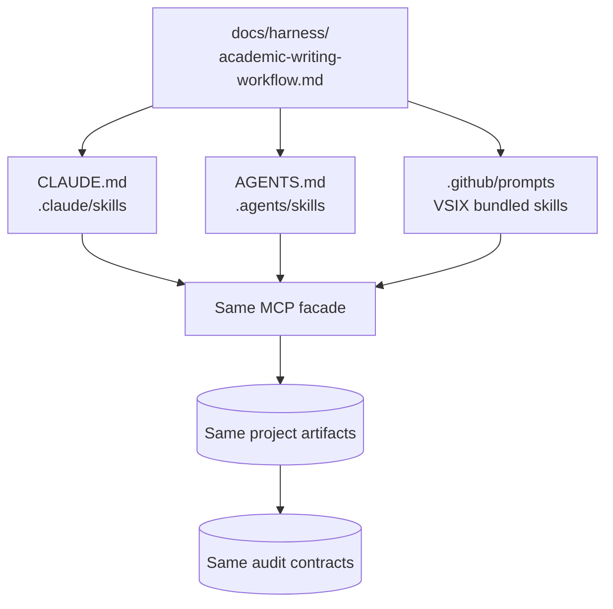
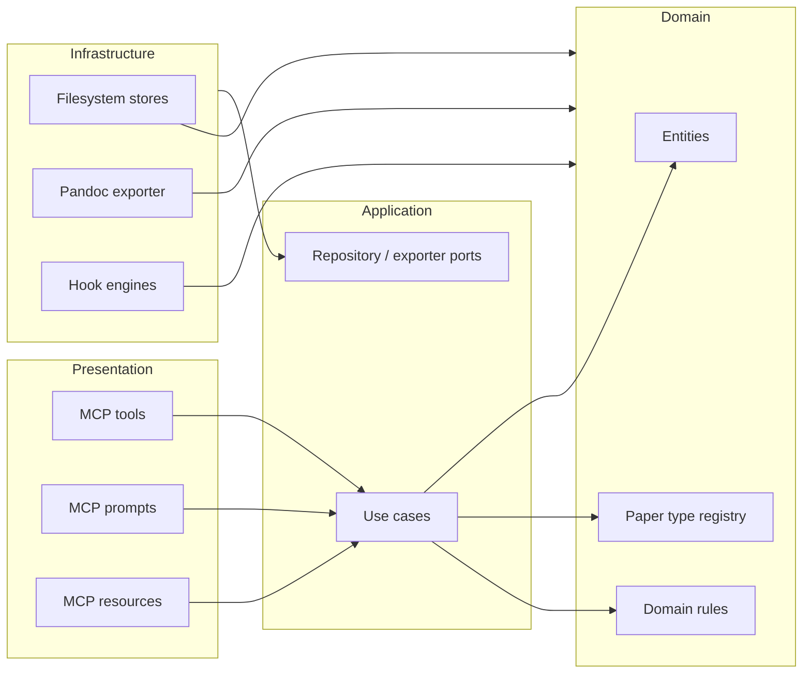
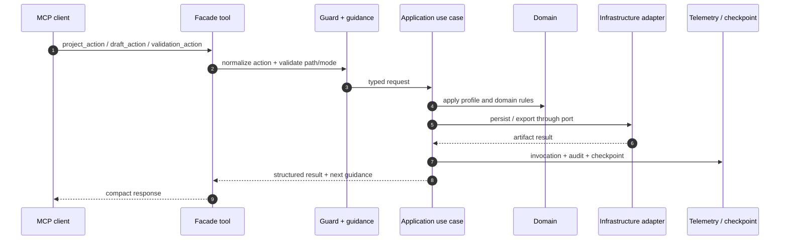
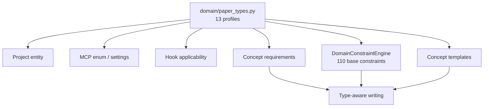

# Harness 架構

Harness 的核心不是某一個 Agent，而是跨平台都必須遵守的「寫作契約 + 工具邊界 + artifact state」。Claude Code、Codex、OpenClaw 與 Copilot 只是不同 presentation adapters。

{ loading=lazy }

## 跨 Agent discovery

Adapter 可以描述 client 特有的 discovery 或 command，但不能各自發明 evidence policy。共用契約位於 [Academic-writing workflow](../harness/academic-writing-workflow.md)。

## DDD 四層

### 依賴 invariant

- Presentation → Application → Domain。
- Infrastructure 實作 Application port，且可依賴 Domain。
- Application 不 import Infrastructure。
- Domain 不 import Application、Infrastructure、Interfaces。
- Composition root 負責把 adapter 注入 use case。

## 一次 tool call 經過什麼

Facade-first surface 減少 Agent 選錯工具；full tool surface 仍保留作為進階與相容入口。所有路徑都應經過相同 guard、telemetry 與 domain constraints。

## Canonical registry 如何傳播

Output profile 只能有一個 canonical authority。UI、hook 與 compatibility constants 都是投影，防止「選單有一種、驗證器又是另一種」的 drift。

## 共享 state 為什麼用檔案

Filesystem artifacts 讓不同 Agent 與不同對話可以接手，而且研究者能直接檢查：

- `concept.md`：研究問題、方法與 novelty 契約。
- `references/`：verified metadata 與 analysis notes。
- `drafts/`：可逐 section 審閱的 manuscript。
- `assets/`：圖表與資料產物。
- `.audit/`：hook、telemetry、exemplar、evolution evidence。
- `.memory/`：project-level focus、decisions、next action。

!!! info "深入設計"

    更精簡的 production diagram 與 dependency graph 見 [Production academic-writing harness](../design/production-academic-writing-harness.md)；artifact lifecycle 見 [Artifact-centric architecture](../design/artifact-centric-architecture.md)。
