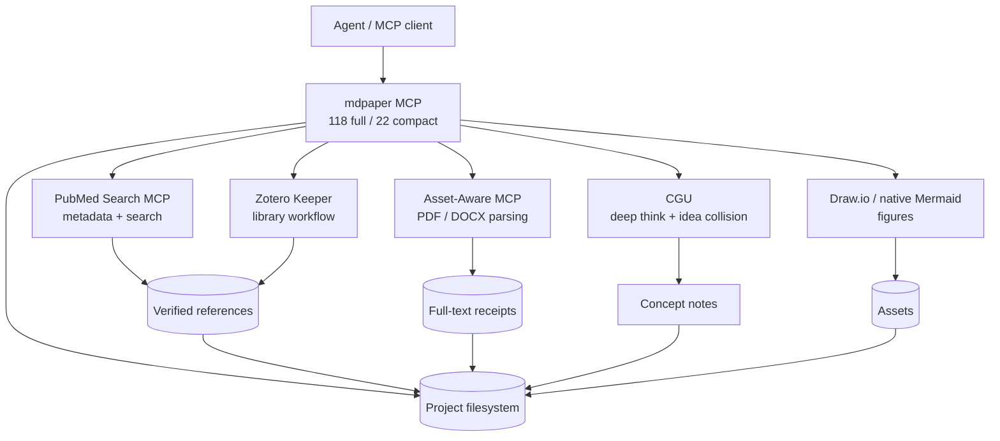
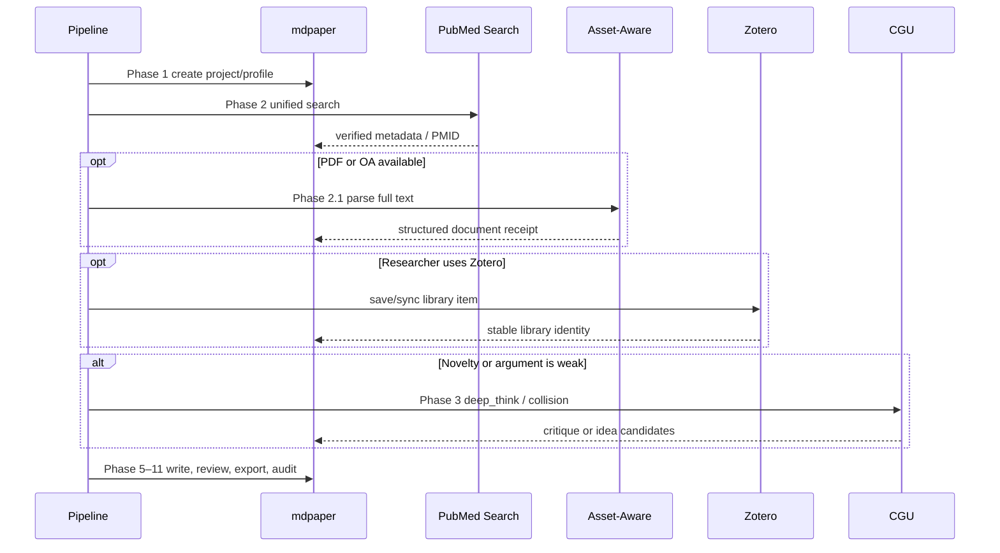
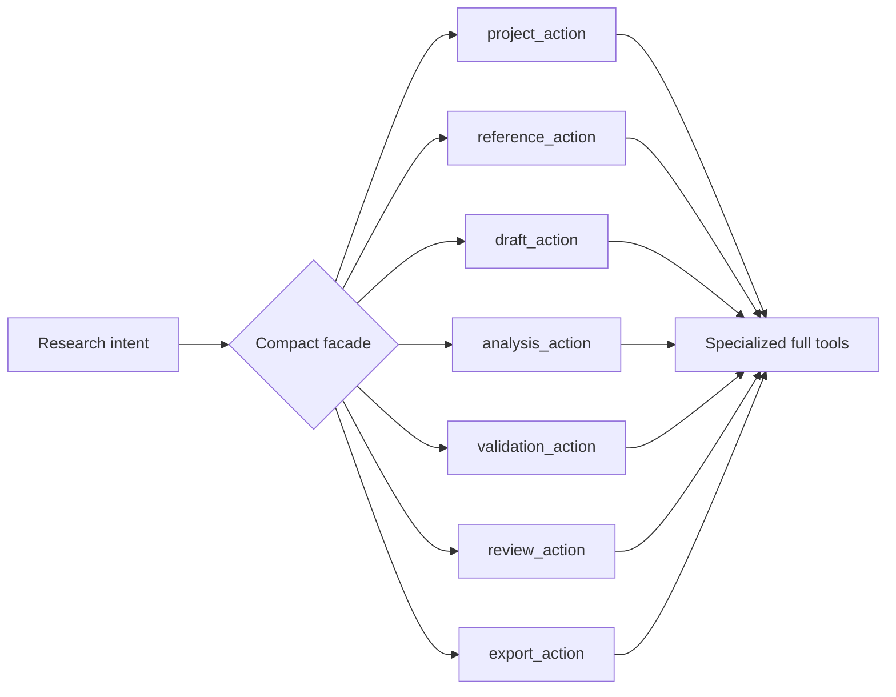
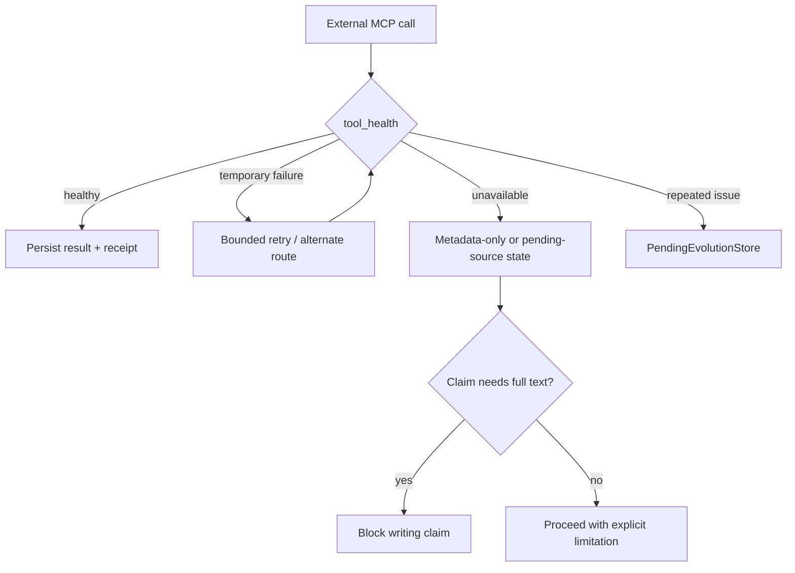

# MCP 生態系

mdpaper MCP 管理研究 project、寫作、驗證與 export；外部 MCP 提供文獻、全文、Zotero、創意碰撞與圖表能力。Pipeline 決定「何時呼叫」，各 MCP 決定「如何完成」。

## 生態系地圖

## Phase orchestration

### 優先規則

`save_reference_mcp(pmid)` 永遠優先，因為 metadata 直接來自 PubMed API，能保留 verified trust。只有 API 不可用時，才使用 Agent 傳遞的 `save_reference(article)` fallback，且 trust level 不得偽裝成 verified。

## Compact 與 full surface

Compact facade 是 Agent 的預設入口，不代表能力縮水。它把大量工具壓縮成 action + typed parameters，並回傳下一步 guidance；full tools 仍能被測試與直接呼叫。

## Failure 與 graceful degradation

外部工具失敗不是捏造資料的理由。系統應保留 pending state、限制可寫內容，並把重複健康問題寫入 evolution queue。

## 本機設定與可移植性

MCP client 設定通常位於 `.vscode/mcp.json` 或 client-specific configuration；JSONC parser 支援 URL、escaped strings、comments 與 trailing commas。Secrets 應使用環境變數，不應提交進 repo。

!!! warning "MCP-to-MCP trust"

    mdpaper 接到外部 MCP 結果後仍要保存 provenance。工具回傳「成功」不等於內容自動取得 evidence credit；來源角色與全文狀態仍由本 repo 的 domain rules 判定。
