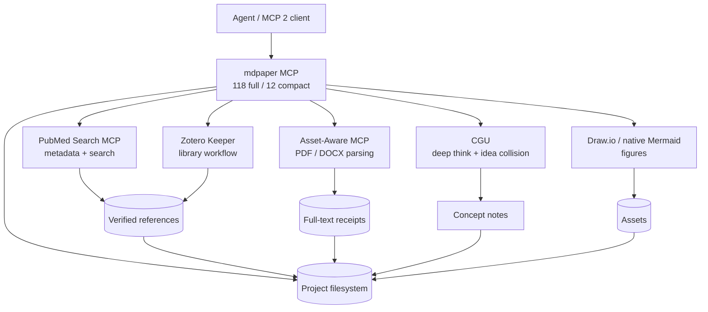
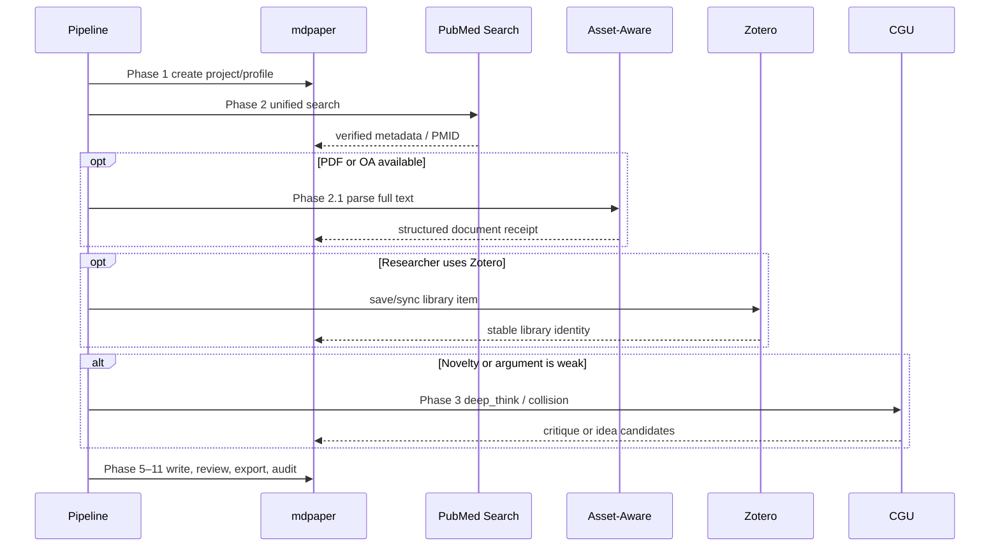
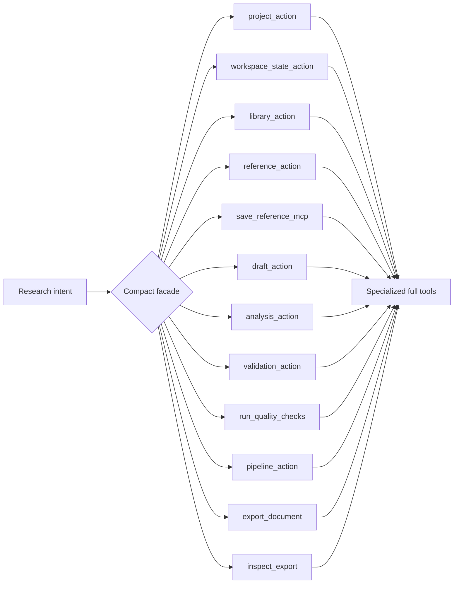
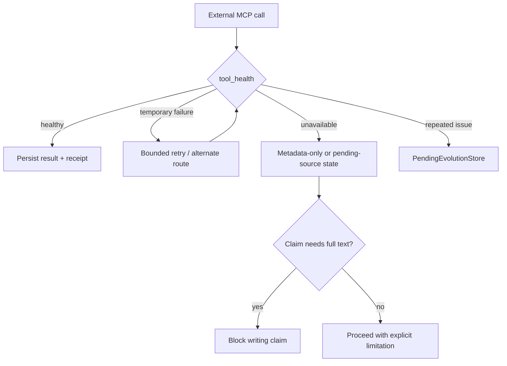

# MCP 生態系

mdpaper MCP 管理研究 project、寫作、驗證與 export；外部 MCP 提供文獻、全文、Zotero、創意碰撞與圖表能力。Pipeline 決定「何時呼叫」，各 MCP 決定「如何完成」。

## 生態系地圖

```mermaid
flowchart TB
    Agent[Agent / MCP 2 client] --> MDP[mdpaper MCP<br/>118 full / 12 compact]
    MDP --> PubMed[PubMed Search MCP<br/>metadata + search]
    MDP --> Asset[Asset-Aware MCP<br/>PDF / DOCX parsing]
    MDP --> Zotero[Zotero Keeper<br/>library workflow]
    MDP --> CGU[CGU<br/>deep think + idea collision]
    MDP --> Draw[Draw.io / native Mermaid<br/>figures]
    MDP --> Files[(Project filesystem)]

    PubMed --> Verified[(Verified references)]
    Asset --> Fulltext[(Full-text receipts)]
    Zotero --> Verified
    CGU --> Concept[Concept notes]
    Draw --> Assets[(Assets)]
    Verified & Fulltext & Concept & Assets --> Files
```

## Phase orchestration

```mermaid
sequenceDiagram
    participant P as Pipeline
    participant M as mdpaper
    participant S as PubMed Search
    participant A as Asset-Aware
    participant Z as Zotero
    participant C as CGU

    P->>M: Phase 1 create project/profile
    P->>S: Phase 2 unified search
    S-->>M: verified metadata / PMID
    opt PDF or OA available
      P->>A: Phase 2.1 parse full text
      A-->>M: structured document receipt
    end
    opt Researcher uses Zotero
      P->>Z: save/sync library item
      Z-->>M: stable library identity
    end
    alt Novelty or argument is weak
      P->>C: Phase 3 deep_think / collision
      C-->>M: critique or idea candidates
    end
    P->>M: Phase 5–11 write, review, export, audit
```

### 優先規則

`save_reference_mcp(pmid)` 永遠優先，因為 metadata 直接來自 PubMed API，能保留 verified trust。只有 API 不可用時，compact client 才使用 `reference_action(action="save_agent", article=...)`（full surface 對應 `save_reference(article)`），且 trust level 不得偽裝成 verified。

## Compact 與 full surface

```mermaid
flowchart LR
    Intent[Research intent] --> Compact{Compact facade}
    Compact --> Project[project_action]
    Compact --> Workspace[workspace_state_action]
    Compact --> Library[library_action]
    Compact --> Reference[reference_action]
    Compact --> VerifiedSave[save_reference_mcp]
    Compact --> Draft[draft_action]
    Compact --> Analysis[analysis_action]
    Compact --> Validation[validation_action]
    Compact --> Review[run_quality_checks]
    Compact --> Pipeline[pipeline_action]
    Compact --> Export[export_document]
    Compact --> Inspect[inspect_export]
    Project & Workspace & Library & Reference & VerifiedSave & Draft & Analysis & Validation & Review & Pipeline & Export & Inspect --> Full[Specialized full tools]
```

Compact facade 是 Agent 的預設入口，不代表能力縮水。它把大量工具壓縮成 action + typed parameters，並回傳下一步 guidance；full tools 仍能被測試與直接呼叫。文獻管理使用 `reference_action`，但 verified PubMed save 刻意保留直接的 `save_reference_mcp(pmid)`，避免 agent-passed metadata 被誤標成 verified。

本 repo 只支援 MCP SDK 2.x runtime，不保留 SDK 1.x fallback。compact 12 與 full 118 必須走同一組 domain rules、telemetry 與 release smoke；tools、prompts、resources、progress 與 elicitation 的詳細契約見 [MCP 2 與內容完整性](mcp2-content-integrity.md)。

## Failure 與 graceful degradation

```mermaid
flowchart TD
    Call[External MCP call] --> Health{tool_health}
    Health -->|healthy| Result[Persist result + receipt]
    Health -->|temporary failure| Retry[Bounded retry / alternate route]
    Health -->|unavailable| Degrade[Metadata-only or pending-source state]
    Degrade --> Block{Claim needs full text?}
    Block -->|yes| Pending[Block writing claim]
    Block -->|no| Limited[Proceed with explicit limitation]
    Retry --> Health
    Health -->|repeated issue| Evolution[PendingEvolutionStore]
```

外部工具失敗不是捏造資料的理由。系統應保留 pending state、限制可寫內容，並把重複健康問題寫入 evolution queue。

## 本機設定與可移植性

MCP client 設定通常位於 `.vscode/mcp.json` 或 client-specific configuration；JSONC parser 支援 URL、escaped strings、comments 與 trailing commas。Secrets 應使用環境變數，不應提交進 repo。

!!! warning "MCP-to-MCP trust"

    mdpaper 接到外部 MCP 結果後仍要保存 provenance。工具回傳「成功」不等於內容自動取得 evidence credit；來源角色與全文狀態仍由本 repo 的 domain rules 判定。對圖像與文件資產，內容完整性 receipt 保存 SHA-256、MIME、可用的 C2PA 驗證與人工審閱訊號，但不會移除浮水印。
