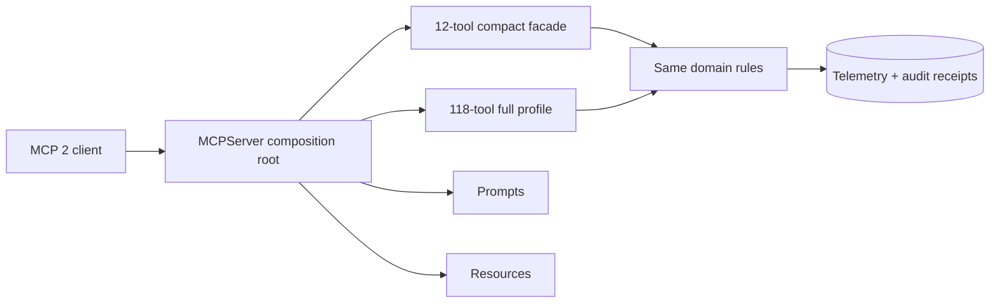
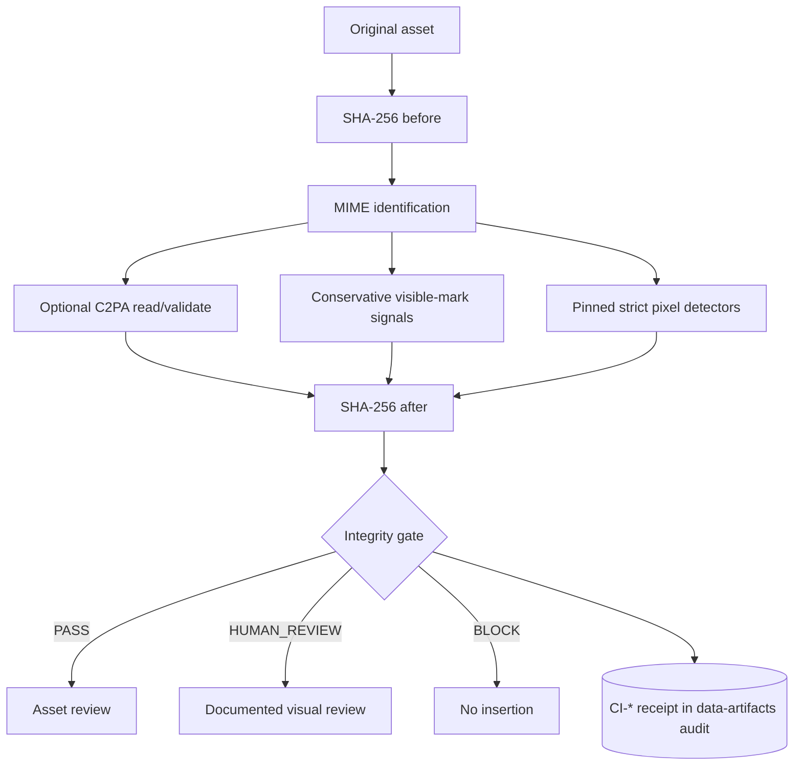

# MCP 2 與內容完整性

MedPaper Assistant 的 MCP runtime 以 SDK 2.x 為唯一支援基線。內容完整性檢查則用來保存原始資產、驗證可用的 provenance，並把不確定性升級為 reviewer 審閱。系統會使用版本鎖定的去浮水印套件做額外辨識，但不呼叫移除 API、不覆寫原件、不產生「洗乾淨」的衍生檔，也不規避平台政策。

## MCP 2 runtime contract



| 契約               | 本 repo 的規則                                                                        |
| ------------------ | ------------------------------------------------------------------------------------- |
| Runtime            | `mcp>=2,<3`；不保留 SDK 1.x fallback 或雙版本分支                                     |
| Server             | 由單一 composition root 建立並註冊 tools、prompts 與 resources                        |
| Default surface    | compact 12 tools，降低 agent 選錯工具與 schema 成本                                   |
| Diagnostic surface | full 118 tools，保留明確的相容與進階入口                                              |
| 長任務             | 透過 SDK 2 progress notification 回報，不以假成功掩蓋逾時                             |
| 互動               | 需要用戶決策時使用 elicitation；拒絕或缺少 client capability 時走可稽核 degraded path |

遷移完成的判準不是「server 可以啟動」而已。compact 與 full profile 都必須完成 initialize、list tools/prompts/resources、代表性讀取與寫入、progress、elicitation fallback、錯誤 mapping、取消與 shutdown smoke。禁止重新導入 legacy FastMCP v1 import 或 runtime probing 來讓舊版本靜默通過。

上游介面與遷移狀態以 [Model Context Protocol Python SDK](https://github.com/modelcontextprotocol/python-sdk) 和 [MCP 官方文件](https://modelcontextprotocol.io/) 為準；本頁描述的是 MedPaper Assistant 的版本與 release contract。

## Content-integrity inspection



檢查器使用標準函式庫計算 SHA-256，並以 magic bytes 覆核 PNG/JPEG/WebP 的副檔名 MIME；原檔在三個 adapter 執行前後的 hash 必須相同。可選的 `c2pa-python` adapter 只讀 manifest、關閉遠端 manifest fetching，且不簽署、不重寫資產。`remove-ai-watermarks[visible,detect]==0.36.0` 只呼叫套件的 registered-mark catalog 與公開 DWT-DCT decoder：每個已註冊可見 detector 都必須成功執行，DWT 必須回傳完整 48/136-bit decode，才能記錄陰性結果。它刻意不呼叫 aggregate `identify`，因為其共用 invisible flag 也可能進入可下載權重的 TrustMark 支線；因此本路徑不會走 C2PA reader、TrustMark、diffusion、GPU、模型下載、metadata stripping 或任何 output/removal API。一般 PyPI 安裝可選擇 `[provenance,watermark]` extras；Marketplace VSIX 固定安裝同版本的兩個 extras。PNG/JPEG/WebP 若 MIME 衝突、必要 capability 缺席、版本漂移、無法 decode、尺寸不足以完成兩種 DWT probe、超過 5,000 萬像素或任一 detector 執行失敗會 fail closed。

### 套件與 API 選擇

| 類別                         | 選擇                                           | API／理由                                                                                                 |
| ---------------------------- | ---------------------------------------------- | --------------------------------------------------------------------------------------------------------- |
| File identity                | Python stdlib `hashlib`、`mimetypes`           | streaming SHA-256、檢查前後重算、保存 MIME 與 bytes                                                       |
| C2PA provenance              | `c2pa-python==0.37.8`                          | 關閉 remote fetch 的 `Reader.try_create` + validation；未安裝即 `UNSUPPORTED`                             |
| Conservative signal          | 本地 filename/SVG heuristic                    | 僅提出 `UNCERTAIN`／`HUMAN_REVIEW`，不宣稱 clean                                                          |
| Removal-package check        | `remove-ai-watermarks[visible,detect]==0.36.0` | Apache-2.0、exact pin、逐一 strict visible + open DWT；不呼叫 aggregate identify/removal、不寫 derivative |
| Open invisible watermark     | 同一 package 的 torch-free DWT-DCT decoder     | 只涵蓋公開 scheme；陰性不能外推 SynthID、TrustMark 或未公開 vendor scheme                                 |
| Proprietary/model watermark  | 不設通用陰性結果                               | 需 scheme-specific oracle、授權 fixture 與校準；不下載 GPU 模型                                           |
| LLM text watermark/detection | 不作 release gate                              | detector 分數不能證明作者或研究誠信；以 disclosure、evidence、版本與人工責任取代                          |
| Removal/output               | 不暴露 MCP tool、不自動執行                    | 若未來合法製作衍生資產，必須另建 artifact/receipt，保存授權、原件、命令、hash、disclosure 與明確人工核准  |

`remove-ai-watermarks` 仍是單一維護者的 0.x Beta 套件。v0.36.0 的 wheel 與 sdist 由 PyPI Trusted Publishing 上傳，但供應鏈訊號不能取代本地行為驗證；因此它只存在於 optional extra，版本與 artifact hash 由 lock 精確固定，並以 capability、offline、mutation 與正負 fixture 做契約測試。這個依賴風險不能被「目前無已知 CVE」取代，升版時必須重新審查 API、artifact provenance 與 detector 行為。

Adapter 的 read-only 呼叫形狀如下；application 層只保存 bounded validation summary，不把完整 manifest 或憑證內容複製進 audit log：

```python
settings = c2pa.Settings.from_dict(
    {"verify": {"verify_after_reading": True, "remote_manifest_fetch": False}}
)
with c2pa.Context(settings) as context:
    reader = c2pa.Reader.try_create(path, context=context)
    if reader is not None:
        with reader:
            state = reader.get_validation_state()
            results = reader.get_validation_results()
            embedded = reader.is_embedded()
```

`Reader.try_create(...) is None` 對應 `ABSENT`，不是驗證成功或來源不可信。Adapter 例外必須映射成 bounded `UNSUPPORTED`／`ERROR`，不得把任意 parser 訊息或 sensitive metadata 直接回傳給 agent。

第二層 package call 也固定為逐 detector、read-only；任何一支 registered detector 或 DWT completion probe 拋錯，都回 `ERROR`，不會把 silent skip 當成陰性：

```python
image = image_io.imread(path)
for mark in watermark_registry.known_marks():
    detection = mark.detect(image, provenance=False)  # exception => ERROR

decoded = dwt_dct.decode_dwt_dct_lengths(image, (48, 136))
assert set(decoded) == {48, 136}
scheme = invisible_watermark.detect_invisible_watermark(path, image=image)
```

Receipt 只保留 bounded watermark 名稱、signal name、platform、confidence、package version 與 clash；不保存 output image。`NOT_DETECTED` 只代表此版本已知 detector 沒有命中，絕不改寫成 `CLEAN`。

### Provenance 狀態

| 狀態                      | 意義                                         | Gate                                |
| ------------------------- | -------------------------------------------- | ----------------------------------- |
| `PRESENT_VALID_TRUSTED`   | manifest 有效，且本機 trust store 可建立信任 | C2PA 本身不阻擋；圖像仍需可見檢查   |
| `PRESENT_VALID_UNTRUSTED` | manifest 有效，但本機未建立 signer trust     | C2PA 本身不阻擋；保留限制           |
| `PRESENT_INVALID`         | manifest 存在但密碼學驗證失敗                | `BLOCK`                             |
| `ABSENT`                  | 找不到 C2PA manifest                         | C2PA 本身不阻擋；不能推論來源       |
| `UNSUPPORTED`             | dependency 或格式不支援                      | C2PA 本身不阻擋；記錄 degraded path |
| `ERROR`                   | 檢查器發生未分類錯誤                         | `BLOCK`                             |

C2PA assertion 是來源與編輯歷程的可驗證聲明，不等於內容為真、研究設計有效或授權充分。反過來，沒有 C2PA 也不表示資產不可信。科學聲稱仍需 claim-evidence、授權與人工內容審閱。

### 可見與不可見水印

- 可見圖像先跑 filename/SVG 保守訊號，再由 pinned package 掃描已註冊版型。兩層都可能誤判或漏判；PNG/JPEG/WebP 即使 package 回 `NOT_DETECTED`，仍維持 `HUMAN_REVIEW`。
- 公開 DWT-DCT signal 由 `[detect]` extra 離線檢查；專有 SynthID、TrustMark 與其他 vendor scheme 不在通用陰性保證內。
- LLM 文字水印與 AI 文字偵測器不作為作者身份、研究誠信或可交付性的充分證據。文件品質由來源、方法、可重現性與人工責任確認。
- 套件雖有 removal 能力，本 adapter 沒有可到達的 removal/output 路徑。若授權允許未來製作衍生資產，必須另建 artifact 與 sidecar，保留原檔、授權依據、轉換命令、新 hash、disclosure 與人工核准。

### Receipt 與 gate

每次 `review_asset_for_insertion` 都建立 `CI-*` receipt，存入專案 `.audit/data-artifacts.yaml`：

```yaml
schema_version: "1.2"
asset_path: results/figures/consort.png
file:
  sha256: "..."
  sha256_after_inspection: "..."
  mime_type: image/png
  size_bytes: 12345
provenance:
  provider: c2pa-python
  status: ABSENT
visible_watermark:
  status: UNCERTAIN
  signals: []
removal_package_check:
  provider: remove-ai-watermarks
  provider_version: 0.36.0
  status: NOT_DETECTED
  inspection_mode: strict_registered_visible_open_dwt_v1
  checks_requested: [registered_visible, open_dwt_dct]
  checks_completed: [registered_visible, open_dwt_dct]
  watermarks: []
  automated_removal_performed: false
  derivative_written: false
gate_status: HUMAN_REVIEW
gate_reasons:
  - Visible-watermark screening is inconclusive for this image; documented human review is required.
original_preserved: true
automated_removal_performed: false
```

只要 C2PA 為 `PRESENT_INVALID`／`ERROR`、檢查前後 hash 不同、內容 MIME 與檔名衝突，或 PNG/JPEG/WebP 的 removal-package check 為 `UNSUPPORTED`／`ERROR`／版本不符／required checks 未完成，就禁止插入。Tracker 不只從 receipt enum 與 current bytes 重新計算 gate；每次插入/引用前還會對目前資產重新執行三個 read-only adapter，比對 provenance、可見標記 applicability、package status/completed checks 與 gate，避免本地 actor 把 `BLOCK` receipt 改寫成較弱狀態。`DETECTED` 或任何 raster 的 `UNCERTAIN` 都必須附上 `visible_watermark_review` 才能繼續。這段文字是 self-attested reviewer note，不能被描述為已驗證身分或授權；若權利狀態不明，仍不得使用資產。舊的 schema 1.0/1.1 receipt 會被視為 stale 並要求重新檢查。

## Release smoke matrix

| Fixture                                       | 預期結果                                                           |
| --------------------------------------------- | ------------------------------------------------------------------ |
| 無 manifest 的正常 PNG                        | C2PA `ABSENT` + package `NOT_DETECTED` + `HUMAN_REVIEW`；hash 不變 |
| 合成 Gemini visible mark                      | package `DETECTED`；離線；無 derivative；原件 hash 不變            |
| 公開 DWT-DCT positive                         | package signal present；不得外推專有 scheme                        |
| 有效且 trusted 的 C2PA asset                  | `PRESENT_VALID_TRUSTED`                                            |
| 有效但本機不信任 signer                       | `PRESENT_VALID_UNTRUSTED`                                          |
| 被竄改的 manifest/asset                       | `PRESENT_INVALID` 且 `BLOCK`                                       |
| 非支援格式                                    | package `UNSUPPORTED`，不得 crash                                  |
| PNG/JPEG/WebP 未安裝／版本漂移／package error | `BLOCK`，提示安裝 exact `[provenance,watermark]` extras            |
| filename/SVG 文字有 watermark signal          | `HUMAN_REVIEW`；未附 reviewer note 不可插入                        |
| 任一 inspector 改動 asset bytes               | hash mismatch 且 `BLOCK`                                           |
| forged schema/version/output/removal receipt  | tracker 拒絕，要求重新檢查                                         |

Fixtures 應固定 byte/hash、license 與預期狀態；測試輸出需保存 package/SDK 版本、命令與失敗項目。技術與政策來源包括 [C2PA 2.4 specification](https://spec.c2pa.org/specifications/specifications/2.4/specs/ContentCredentials.html)、[C2PA Python bindings](https://github.com/contentauth/c2pa-python)、[`remove-ai-watermarks` v0.36.0](https://pypi.org/project/remove-ai-watermarks/0.36.0/)、其[支援訊號](https://github.com/wiltodelta/remove-ai-watermarks/blob/v0.36.0/docs/supported-signals.md)、[已知限制](https://github.com/wiltodelta/remove-ai-watermarks/blob/v0.36.0/docs/known-limitations.md)與[法律／安全範圍](https://github.com/wiltodelta/remove-ai-watermarks/blob/v0.36.0/docs/legal-and-safety.md)。其 Apache-2.0 code、OpenCV headless、PyWavelets 與 C2PA transitive dependencies 由 `uv.lock` 固定；release 仍需跑 dependency/license audit。
