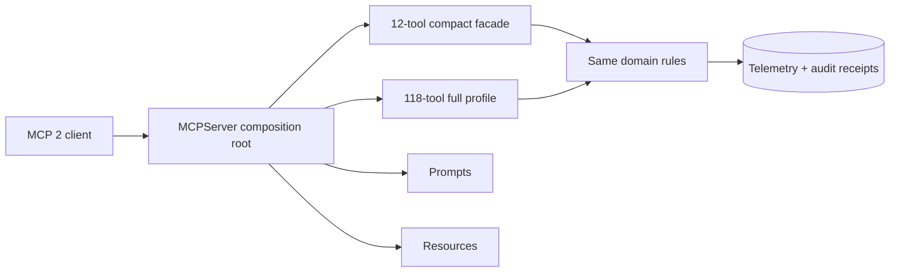
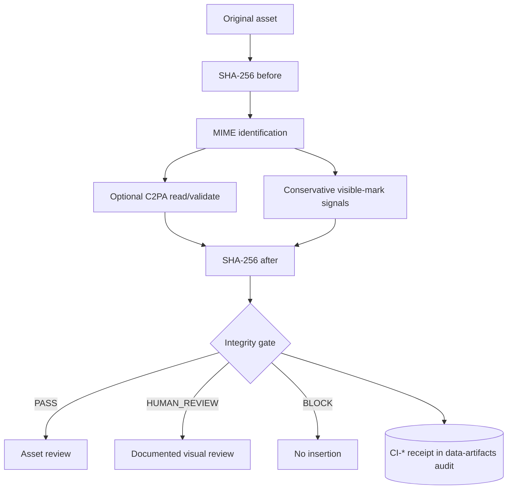

# MCP 2 與內容完整性

MedPaper Assistant 的 MCP runtime 以 SDK 2.x 為唯一支援基線。內容完整性檢查則用來保存原始資產、驗證可用的 provenance，並把不確定性升級為人工審閱；它不是去浮水印或規避平台政策的功能。

## MCP 2 runtime contract



| 契約               | 本 repo 的規則                                                                        |
| ------------------ | ------------------------------------------------------------------------------------- |
| Runtime            | `mcp>=2,<3`；不保留 SDK 1.x fallback 或雙版本分支                                     |
| Server             | 由單一 composition root 建立並註冊 tools、prompts 與 resources                        |
| Default surface    | compact 12 tools，降低 agent 選錯工具與 schema 成本                                   |
| Diagnostic surface | full 118 tools，保留明確的相容與進階入口                                              |
| 長任務             | 透過 SDK 2 progress notification 回報，不以假成功掩蓋逾時                             |
| 互動               | 需要用戶決策時使用 elicitation；拒絕或缺少 client capability 時走可稽核 degraded path |

遷移完成的判準不是「server 可以啟動」而已。compact 與 full profile 都必須完成 initialize、list tools/prompts/resources、代表性讀取與寫入、progress、elicitation fallback、錯誤 mapping、取消與 shutdown smoke。禁止重新導入 legacy FastMCP v1 import 或 runtime probing 來讓舊版本靜默通過。

上游介面與遷移狀態以 [Model Context Protocol Python SDK](https://github.com/modelcontextprotocol/python-sdk) 和 [MCP 官方文件](https://modelcontextprotocol.io/) 為準；本頁描述的是 MedPaper Assistant 的版本與 release contract。

## Content-integrity inspection



檢查器使用標準函式庫計算 SHA-256 與 MIME；原檔在檢查前後的 hash 必須相同。可選的 `c2pa-python` adapter 只讀 manifest、關閉遠端 manifest fetching，且不簽署、不重寫資產。未安裝 optional dependency 或格式不支援時回傳 `UNSUPPORTED`，不會假裝驗證成功。一般 PyPI 安裝可選擇 `[provenance]` extra；Marketplace VSIX 的 core runtime 固定安裝同版本的 `[provenance]` extra，因此 C2PA adapter 不會因 bundle contract 漂移而靜默缺席。

### 套件與 API 選擇

| 類別                         | 選擇                                          | API／理由                                                                                                  |
| ---------------------------- | --------------------------------------------- | ---------------------------------------------------------------------------------------------------------- |
| File identity                | Python stdlib `hashlib`、`mimetypes`          | core dependency；streaming SHA-256、檢查前後重算、保存 MIME 與 bytes                                       |
| C2PA provenance              | optional extra `c2pa-python`（import `c2pa`） | `Settings.from_dict` → `Context` → `Reader.try_create` → validation state/results；未安裝即 `UNSUPPORTED`  |
| Visible image watermark      | local conservative signal heuristic           | filename/SVG text 可提出訊號；所有無法證明陰性的 PNG/JPEG 仍要求 visual review，不新增未校準 detector       |
| Invisible/model watermark    | 暫不選通用套件                                | scheme-specific adapter 必須先有授權樣本、false-positive/negative fixtures、版本固定與 human-review policy |
| LLM text watermark/detection | 不作 release gate                             | detector 分數不能證明作者或研究誠信；以 disclosure、evidence、版本與人工責任取代                           |
| Removal                      | 明確拒絕                                      | 不新增 removal MCP tool；合法衍生轉換另建 artifact，保存原檔、授權、命令、hash 與核准                      |

Adapter 的 read-only 呼叫形狀如下；application 層只保存 bounded validation summary，不把完整 manifest 或憑證內容複製進 audit log：

```python
settings = c2pa.Settings.from_dict(
    {"verify": {"verify_after_reading": True, "remote_manifest_fetch": False}}
)
with c2pa.Context(settings) as context:
    reader = c2pa.Reader.try_create(path, context=context)
    if reader is not None:
        with reader:
            state = reader.get_validation_state()
            results = reader.get_validation_results()
            embedded = reader.is_embedded()
```

`Reader.try_create(...) is None` 對應 `ABSENT`，不是驗證成功或來源不可信。Adapter 例外必須映射成 bounded `UNSUPPORTED`／`ERROR`，不得把任意 parser 訊息或 sensitive metadata 直接回傳給 agent。

### Provenance 狀態

| 狀態                      | 意義                                         | Gate                       |
| ------------------------- | -------------------------------------------- | -------------------------- |
| `PRESENT_VALID_TRUSTED`   | manifest 有效，且本機 trust store 可建立信任 | C2PA 本身不阻擋；圖像仍需可見檢查 |
| `PRESENT_VALID_UNTRUSTED` | manifest 有效，但本機未建立 signer trust     | C2PA 本身不阻擋；保留限制       |
| `PRESENT_INVALID`         | manifest 存在但密碼學驗證失敗                | `BLOCK`                    |
| `ABSENT`                  | 找不到 C2PA manifest                         | C2PA 本身不阻擋；不能推論來源   |
| `UNSUPPORTED`             | dependency 或格式不支援                      | C2PA 本身不阻擋；記錄 degraded path |
| `ERROR`                   | 檢查器發生未分類錯誤                         | `BLOCK`                    |

C2PA assertion 是來源與編輯歷程的可驗證聲明，不等於內容為真、研究設計有效或授權充分。反過來，沒有 C2PA 也不表示資產不可信。科學聲稱仍需 claim-evidence、授權與人工內容審閱。

### 可見與不可見水印

- 可見圖像水印只做保守訊號篩選。結果只有 `UNCERTAIN` 或 `HUMAN_REVIEW`，永遠不宣稱「乾淨」；PNG/JPEG 的 `UNCERTAIN` 也會把 gate 提升為 `HUMAN_REVIEW`。
- 不可見圖像水印通常是 vendor/model-specific；沒有通用 detector 就回報 `UNSUPPORTED`，不得用單一模型的陰性結果概括所有 scheme。
- LLM 文字水印與 AI 文字偵測器不作為作者身份、研究誠信或可交付性的充分證據。文件品質由來源、方法、可重現性與人工責任確認。
- 系統不提供自動移除工具。若授權允許製作衍生資產，必須保留原檔、授權依據、轉換命令、新 hash 與人工核准，並把衍生檔視為新 artifact。

### Receipt 與 gate

每次 `review_asset_for_insertion` 都建立 `CI-*` receipt，存入專案 `.audit/data-artifacts.yaml`：

```yaml
schema_version: "1.0"
asset_path: results/figures/consort.png
file:
  sha256: "..."
  sha256_after_inspection: "..."
  mime_type: image/png
  size_bytes: 12345
provenance:
  provider: c2pa-python
  status: ABSENT
visible_watermark:
  status: UNCERTAIN
  signals: []
gate_status: HUMAN_REVIEW
gate_reasons:
  - Visible-watermark screening is inconclusive for this image; documented human review is required.
original_preserved: true
automated_removal_performed: false
```

只要 C2PA 為 `PRESENT_INVALID`／`ERROR`，或檢查前後 hash 不同，就禁止插入。任何 raster 的 `UNCERTAIN` 與明確可見水印訊號都必須附上 `visible_watermark_review` 才能繼續；`ABSENT` 與 `UNSUPPORTED` 會留在 receipt 中，雖不單獨構成拒絕，也不能繞過 raster 人工審閱。

## Release smoke matrix

| Fixture                              | 預期結果                                               |
| ------------------------------------ | ------------------------------------------------------ |
| 無 manifest 的正常 PNG               | `ABSENT`/`UNSUPPORTED` + `HUMAN_REVIEW`；hash 不變     |
| 有效且 trusted 的 C2PA asset         | `PRESENT_VALID_TRUSTED`                                |
| 有效但本機不信任 signer              | `PRESENT_VALID_UNTRUSTED`                              |
| 被竄改的 manifest/asset              | `PRESENT_INVALID` 且 `BLOCK`                           |
| 非支援格式                           | `UNSUPPORTED`，不得 crash                              |
| 未安裝 `c2pa-python`                 | `UNSUPPORTED`，核心安裝仍可用                          |
| 普通 PNG/JPEG 無明確 signal           | `UNCERTAIN` → `HUMAN_REVIEW`；未附人工記錄不可插入     |
| filename/SVG 文字有 watermark signal | `HUMAN_REVIEW`；未附人工記錄不可插入                   |
| 檢查器改動 asset bytes               | hash mismatch 且 `BLOCK`                               |

Fixtures 應固定 byte/hash、license 與預期狀態；測試輸出需保存 SDK 版本、命令與失敗項目。官方技術來源包括 [C2PA specifications](https://c2pa.org/specifications/specifications/2.2/specs/C2PA_Specification.html)、[Content Authenticity Initiative 的 C2PA Python bindings](https://github.com/contentauth/c2pa-python) 與 [C2PA explainer](https://c2pa.org/how-it-works/)。
