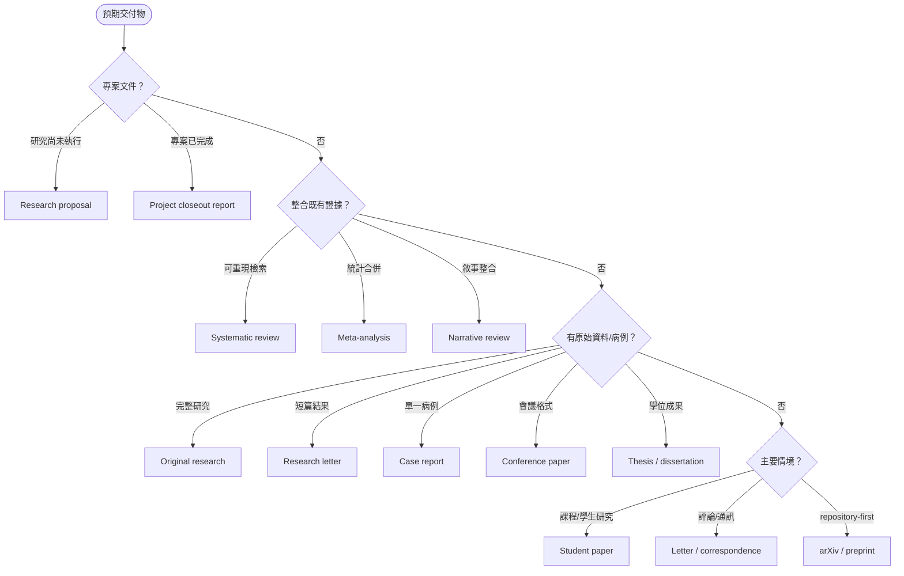
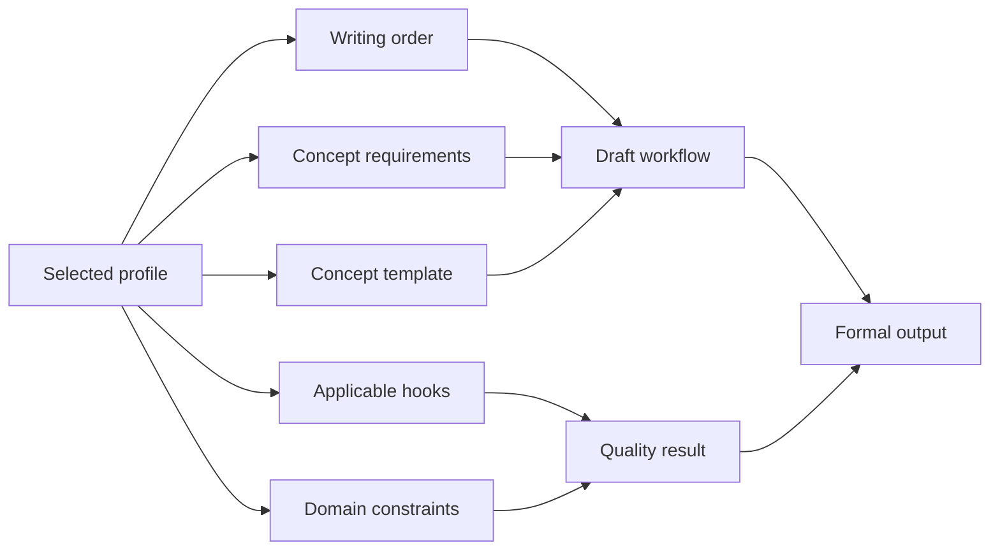
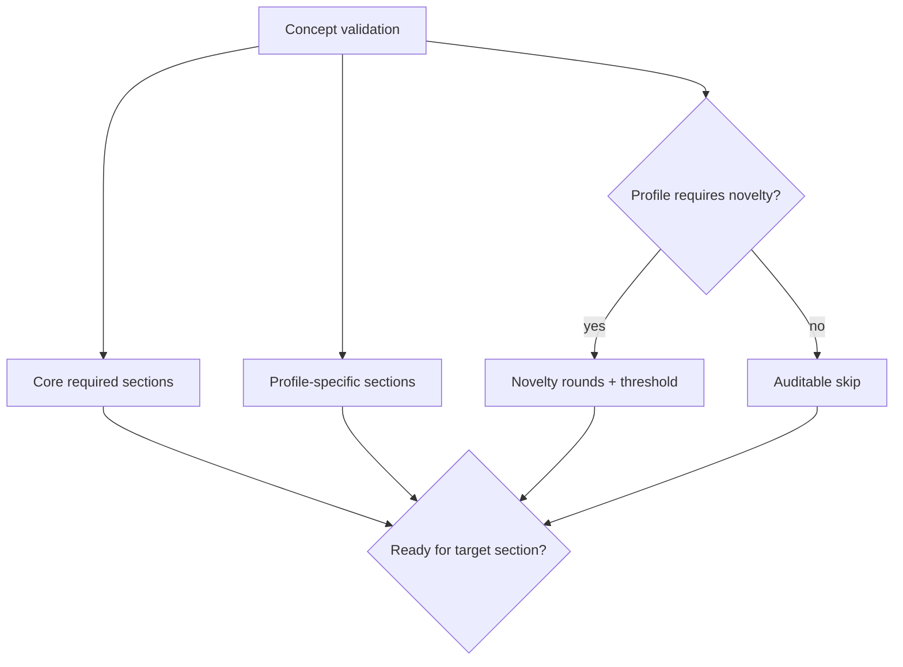

# 正式產出地圖

MedPaper Assistant 不把所有任務都塞進 IMRaD。Canonical registry 定義 13 種 output profiles，每一種有自己的 writing order、concept prerequisites、hook applicability 與 constraints。

{ loading=lazy }

## 選擇 profile

## 四個 family

| Family                   | Profiles                                            | 主要差異                                             |
| ------------------------ | --------------------------------------------------- | ---------------------------------------------------- |
| Empirical / clinical     | original、research letter、case、conference、thesis | Results 客觀性、效果量、N 值、方法時態               |
| Evidence synthesis       | systematic、meta-analysis、narrative                | search strategy、selection、heterogeneity、synthesis |
| Project documents        | proposal、closeout                                  | 未來式 objectives vs 已完成 deliverables/outcomes    |
| Educational / positional | student paper、correspondence、preprint             | audience、篇幅、repository metadata、scope           |

## Profile 如何驅動系統

例如 proposal 不應被迫提供已完成 Results；closeout 不應用 novelty 分數取代 deliverable accountability；conference 與 thesis 仍屬 empirical family，應執行資料與效果量 hooks。

## Concept gate 差異

Validation cache 包含 enabled validation flags，避免先做 structure-only 檢查後，完整驗證錯誤命中舊 cache。

## 13 profiles

1. Original research
2. Systematic review
3. Meta-analysis
4. Case report
5. Research letter
6. Narrative review
7. Letter / correspondence
8. Research proposal
9. Project closeout report
10. Student paper
11. Conference paper
12. Thesis / dissertation
13. arXiv / repository preprint

每一種 profile 的 section、必要內容與 integrity rules 詳見 [13 種產出規格](../harness/output-profiles.md)。

!!! note "不同格式，不同 gate；不是不同誠信標準"

    學生小論文篇幅可以較短，proposal 可以沒有 Results，但所有輸出仍不能捏造資料、誤用引用或把範文當成證據。
