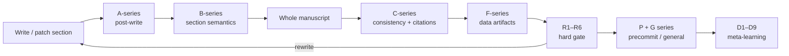
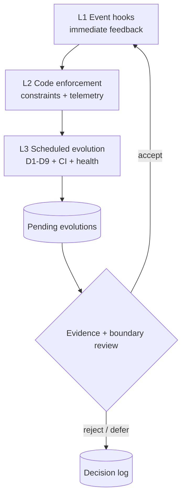
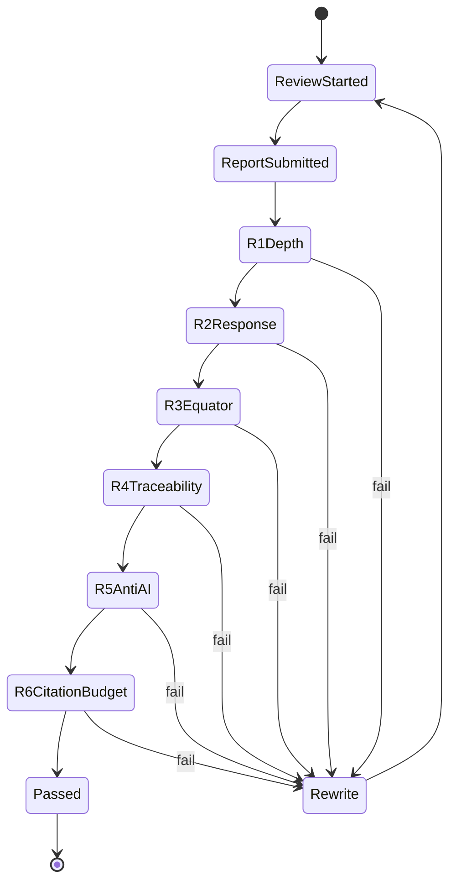
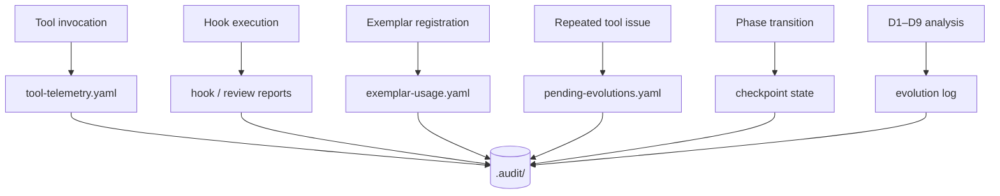

# 品質與稽核

品質不是最後才跑一次 spell check，而是分布在寫作、全稿、review、commit 與跨對話演進的控制系統。

{ loading=lazy }

## 79 checks 在哪裡發生

56 個 checks 由 deterministic code enforcement 執行；23 個高語義 checks 由 Agent 按 skill contract 執行。兩者都要留下可檢查結果。

## 三層演進

| 層                      | 作用                  | 典型 evidence                            |
| ----------------------- | --------------------- | ---------------------------------------- |
| L1 Event hooks          | 寫作當下發現問題      | hook id、severity、location              |
| L2 Code enforcement     | 保證 domain invariant | constraint result、checkpoint、telemetry |
| L3 Autonomous evolution | 跨輪次找系統性弱點    | D1–D9 analysis、CI、pending evolution    |

## Review hard gate

Phase 7 未通過時，Phase 8–11 不應被視為可交付。Review report、author response 與實際修正之間必須可追蹤。

## Audit artifacts

Audit 的價值不是檔案數量，而是能回答：哪個工具、基於哪個 artifact、在什麼 gate、做了什麼決定、下一輪如何改善。

## 失敗處理原則

1. 指出具體 hook/constraint，而不是只說「品質不好」。
2. 優先修正最上游 artifact，例如 concept 或 evidence gap。
3. 只回退受影響 sections，保留已通過內容。
4. 修正後重跑相同 gate，不能用不同較弱檢查替代。
5. 重複故障進入 PendingEvolutionStore，而不是每次人工忘記。

!!! success "品質基線"

    v0.9.0 的 release baseline 包含 1523 Python tests、169 VSIX tests、118-tool greedy smoke、Ruff、mypy、Bandit、vulture、bundle parity、三平台 smoke 與 package install validation。
