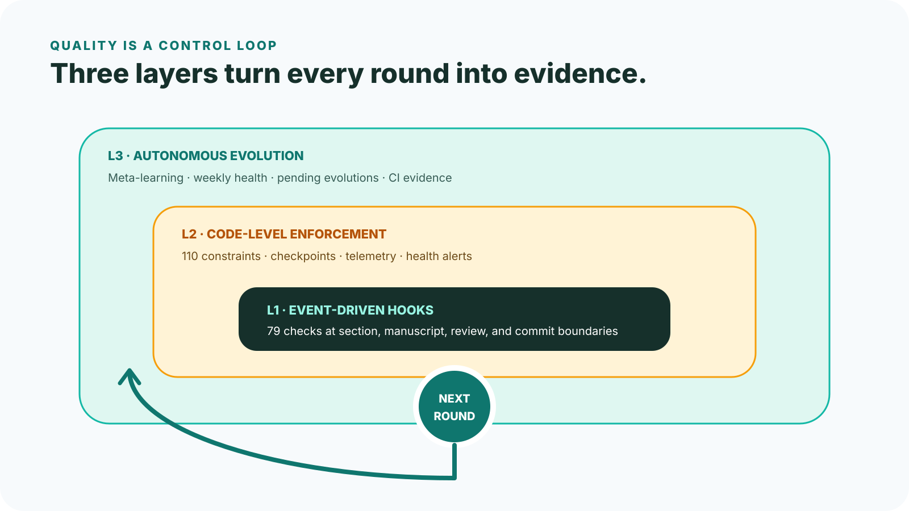
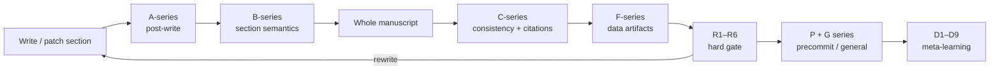
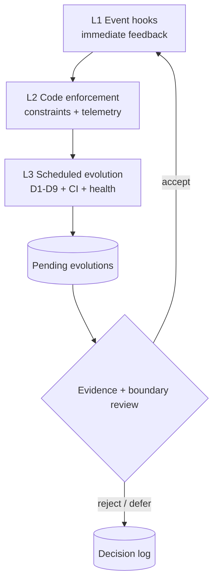
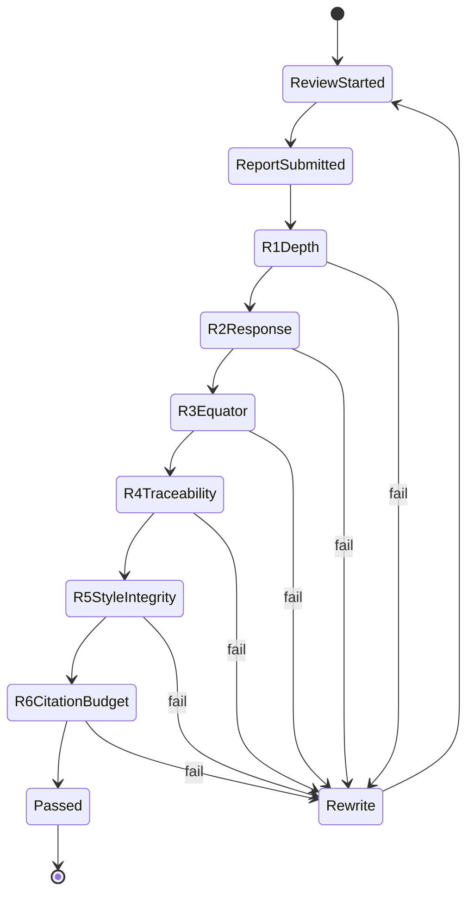
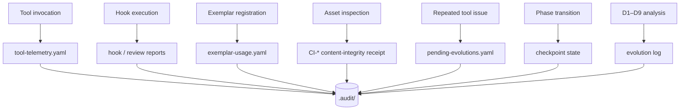

# 品質與稽核

品質不是最後才跑一次 spell check，而是分布在寫作、全稿、review、commit 與跨對話演進的控制系統。

如果你要查「每一個 Phase 到底擋什麼、失敗後怎麼修」，先看[每階段檢查與修正](research-pipeline.md)；技術權威見[Phase gate 設計與程式契約](../design/phase-gate-contract.md)。本頁說明的是跨 Phase 的品質層次。

{ loading=lazy }

## 79 checks 在哪裡發生

```mermaid
flowchart LR
    Write[Write / patch section] --> A[A-series<br/>post-write]
    A --> B[B-series<br/>section semantics]
    B --> Manuscript[Whole manuscript]
    Manuscript --> C[C-series<br/>consistency + citations]
    C --> Data[F-series<br/>data artifacts]
    Data --> Review[R1–R6<br/>hard gate]
    Review --> Commit[P + G series<br/>precommit / general]
    Commit --> Learn[D1–D9<br/>meta-learning]
    Review -->|rewrite| Write
```

56 個 checks 由 deterministic code enforcement 執行；23 個高語義 checks 由 Agent 按 skill contract 執行。兩者都要留下可檢查結果。

## 三層演進

```mermaid
flowchart TB
    Event[L1 Event hooks<br/>immediate feedback] --> Code[L2 Code enforcement<br/>constraints + telemetry]
    Code --> Evolution[L3 Scheduled evolution<br/>D1-D9 + CI + health]
    Evolution --> Pending[(Pending evolutions)]
    Pending --> Decision{Evidence + boundary review}
    Decision -->|accept| Event
    Decision -->|reject / defer| Log[(Decision log)]
```

| 層                      | 作用                  | 典型 evidence                            |
| ----------------------- | --------------------- | ---------------------------------------- |
| L1 Event hooks          | 寫作當下發現問題      | hook id、severity、location              |
| L2 Code enforcement     | 保證 domain invariant | constraint result、checkpoint、telemetry |
| L3 Autonomous evolution | 跨輪次找系統性弱點    | D1–D9 analysis、CI、pending evolution    |

## Review hard gate

```mermaid
stateDiagram-v2
    [*] --> ReviewStarted
    ReviewStarted --> ReportSubmitted
    ReportSubmitted --> R1Depth
    R1Depth --> R2Response
    R2Response --> R3Equator
    R3Equator --> R4Traceability
    R4Traceability --> R5StyleIntegrity
    R5StyleIntegrity --> R6CitationBudget
    R6CitationBudget --> Passed
    R1Depth --> Rewrite: fail
    R2Response --> Rewrite: fail
    R3Equator --> Rewrite: fail
    R4Traceability --> Rewrite: fail
    R5StyleIntegrity --> Rewrite: fail
    R6CitationBudget --> Rewrite: fail
    Rewrite --> ReviewStarted
    Passed --> [*]
```

Phase 7 未通過時，Phase 8–11 不應被視為可交付。Review report、author response 與實際修正之間必須可追蹤。

R5 保留既有 hook id，但語義是具體性、語體一致與作者責任訊號，不是 AI 作者判定，也不以規避 AI authorship detector 為目標。

## Solve 與 score 分離

Solver 可以搜尋、規劃、撰寫與修正，但不能替自己的 artifact 宣告 gate 通過。Scorer 只讀 persisted artifacts 與 frozen fixtures，逐項回傳 evidence locator、rubric version、分數與失敗原因；release evidence 必須包含完整失敗集合，而非只留總分。詳細 schema 見 [Evaluation contract](../harness/evaluation-contract.md)。

## Audit artifacts

```mermaid
flowchart TD
    Invocation[Tool invocation] --> Telemetry[tool-telemetry.yaml]
    Hook[Hook execution] --> Reports[hook / review reports]
    Exemplar[Exemplar registration] --> ExAudit[exemplar-usage.yaml]
    Asset[Asset inspection] --> Integrity[CI-* content-integrity receipt]
    Health[Repeated tool issue] --> Pending[pending-evolutions.yaml]
    Phase[Phase transition] --> Checkpoint[checkpoint state]
    Meta[D1–D9 analysis] --> Evolution[evolution log]
    Telemetry & Reports & ExAudit & Integrity & Pending & Checkpoint & Evolution --> Audit[(.audit/)]
```

Audit 的價值不是檔案數量，而是能回答：哪個工具、基於哪個 artifact、在什麼 gate、做了什麼決定、下一輪如何改善。

## 失敗處理原則

1. 指出具體 hook/constraint，而不是只說「品質不好」。
2. 優先修正最上游 artifact，例如 concept 或 evidence gap。
3. 只回退受影響 sections，保留已通過內容。
4. 修正後重跑相同 gate，不能用不同較弱檢查替代。
5. 重複故障進入 PendingEvolutionStore，而不是每次人工忘記。

!!! success "品質基線"

    每次 release 都必須重新記錄 Python/VSIX test counts、compact 12 與 full 118 smoke、Ruff、mypy、Bandit、vulture、bundle parity、三平台 smoke、package install validation、fixture 版本與 artifact hashes。歷史數量不得直接當成本次通過證據。
