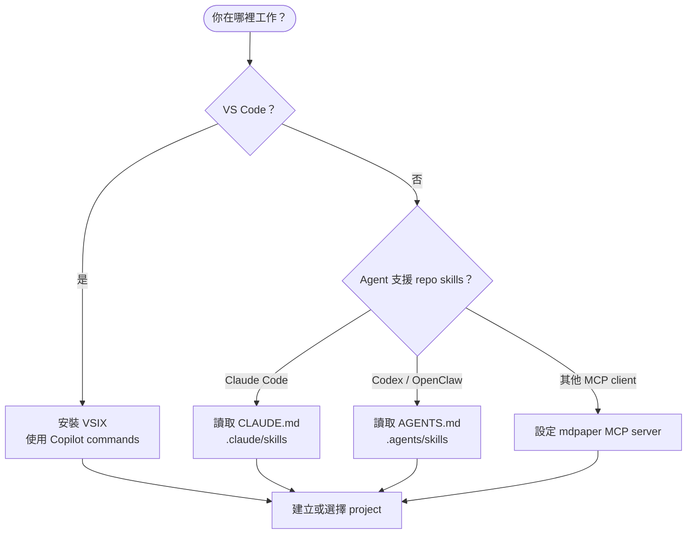
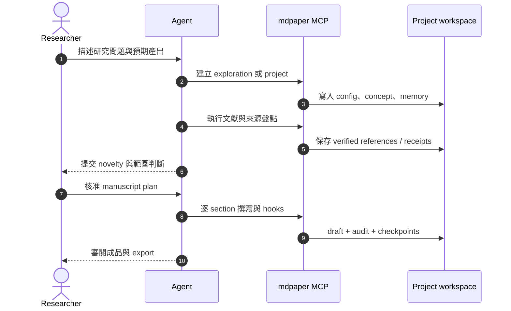
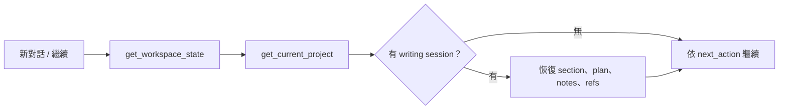

# 五分鐘開始

MedPaper Assistant 的安裝入口可以不同，但研究 workspace 與品質契約相同。先選 Agent surface，再建立 project；不要從直接改寫 `draft.md` 開始。

## 選擇你的入口



| Surface           | Discovery                        | 適合情境                |
| ----------------- | -------------------------------- | ----------------------- |
| VS Code extension | bundled agents、skills、commands | 完整圖形介面與安裝體驗  |
| Claude Code       | `CLAUDE.md` + `.claude/skills/`  | Claude 原生技能路由     |
| Codex / OpenClaw  | `AGENTS.md` + `.agents/skills/`  | 共用 repo-level harness |
| 通用 MCP client   | MCP server configuration         | 只需要工具 surface      |

## 開發安裝

=== "Linux / macOS"

    ```bash
    ./scripts/setup.sh
    uv run med-paper-assistant
    ```

=== "Windows PowerShell"

    ```powershell
    ./scripts/setup.ps1
    uv run med-paper-assistant
    ```

=== "只預覽文件"

    ```bash
    uv sync --only-group docs
    uv run --no-sync mkdocs serve
    ```

`uv` 是 dependency 與 lockfile 的唯一 Python 路徑；不要做 global `pip install`。

## 第一個研究 project



### 最小成功條件

- [ ] 已選定 output profile，而不是只寫「paper」。
- [ ] Claim evidence、method authority、exemplar、user material 已分角色。
- [ ] 文獻經過 verified metadata 或明確 fallback 標記。
- [ ] Concept validation 足以支援要寫的 section。
- [ ] Draft 透過 MCP writing route 更新，讓 hooks 與 checkpoint 生效。

## 常見下一句

你不需要記住 118 個工具名稱。用意圖描述即可：

- 「建立一個 systematic review project，先做範圍探索。」
- 「搜尋這個 PICO 的 PubMed 文獻，保存 verified metadata。」
- 「這三篇只當作結構範文，不可當證據。」
- 「先驗證能不能寫 Introduction，再開始 draft。」
- 「執行完整 review hooks，說明每個失敗項怎麼修。」

## 恢復既有工作



工作狀態存在 `.mdpaper-state.json`，長期 project memory 則在 `projects/{slug}/.memory/`。兩者用途不同，詳見 [Workspace 與記憶](workspace-and-memory.md)。

!!! warning "不要繞過 harness"

    直接用一般文字編輯工具改 draft，可能跳過 citation validation、protected content、checkpoint 與 writing hooks。正式寫作應使用 MCP draft actions。
