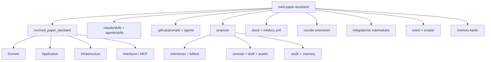
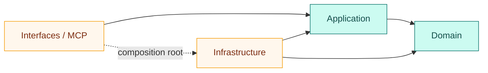
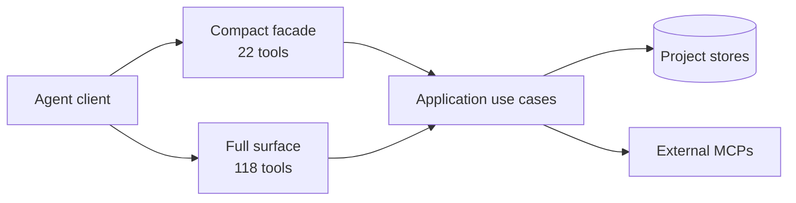

# Repo 導覽

這個 repository 同時是 Python MCP server、跨 Agent skill harness、VS Code extension、研究工作區範本與可稽核文件系統。理解它的最快方法，是先分清楚「執行程式」「研究資料」「Agent 指令」三種資產。

## 目錄地圖

| 區域                              | 主要責任                                | 修改時要問的問題                    |
| --------------------------------- | --------------------------------------- | ----------------------------------- |
| `src/med_paper_assistant/domain/` | entities、value objects、paper profiles | 這是純領域規則嗎？                  |
| `application/`                    | use cases 與 ports                      | 是否只依賴 Domain 或自身 Protocol？ |
| `infrastructure/`                 | filesystem、Pandoc、持久化 adapters     | 是否實作既有 port？                 |
| `interfaces/mcp/`                 | MCP tools、prompts、resources           | 是否保持 facade-first surface？     |
| `.claude/skills/`                 | Claude Code 原生研究技能                | 是否只做平台 adapter？              |
| `.agents/skills/`                 | Codex / OpenClaw 共用入口               | 是否指向同一個寫作契約？            |
| `projects/`                       | 研究者資料與 artifact                   | 是否可追溯、可 checkpoint？         |
| `vscode-extension/`               | 安裝、命令、bundled runtime             | source 與 bundle 是否同步？         |
| `docs/`                           | 使用者 wiki 與設計文件                  | 是否能由 Pages strict build？       |

## DDD 依賴方向

Application 不得反向 import Infrastructure；Domain 不得 import 任何外層。這不是文件建議，而是由 `tests/test_architecture_boundaries.py` 以 AST 測試固定的 invariant。

## 執行時表面

Compact surface 適合日常 Agent context；full surface 保留進階與相容工具。兩者共用相同 application/domain，不是兩套實作。

## 三種權威來源

1. **規則權威**：`CONSTITUTION.md`、bylaws 與 code-enforced constraints。
2. **執行權威**：Domain registry、application use cases、MCP facade 與 tests。
3. **研究權威**：PubMed verified metadata、全文、使用者原始資料；範文不屬於 evidence authority。

!!! tip "接下來"

    如果你是第一次使用，前往[五分鐘開始](quickstart.md)；如果你要修改程式，先讀[Harness 架構](harness-architecture.md)與[開發、測試與發布](development-and-release.md)。
