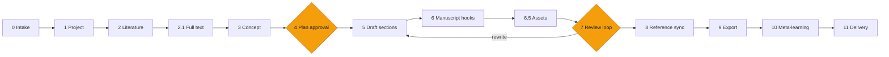
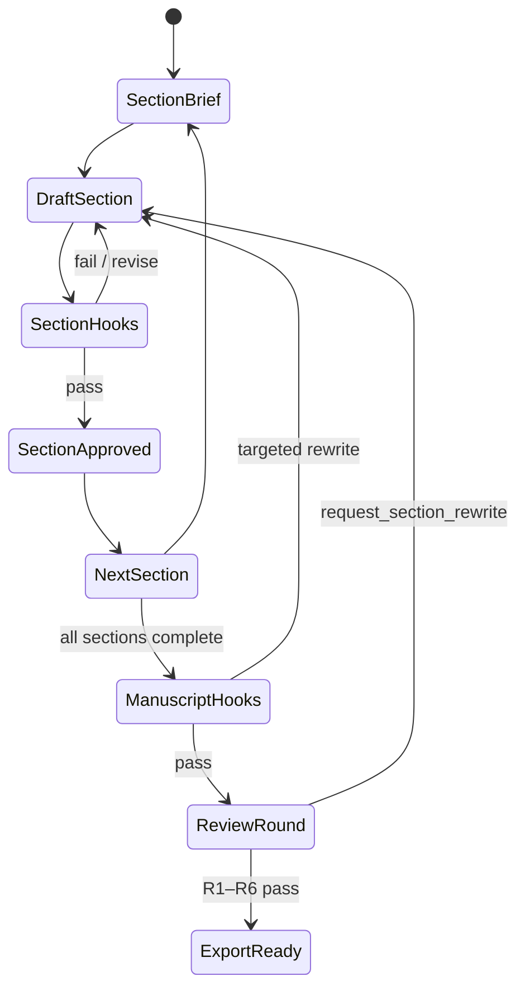
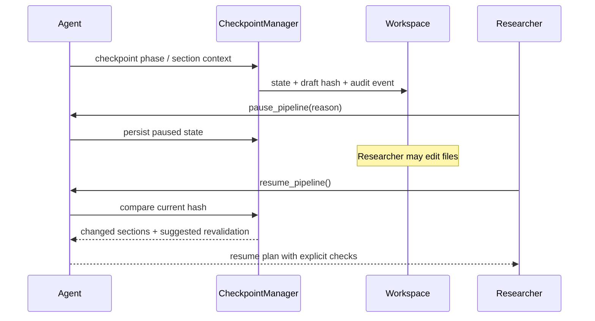

# 研究管線總覽

Pipeline 把「寫一篇論文」拆成可稽核的階段。每一階段都有輸入、輸出、gate 與可恢復狀態；Agent 可以自主推進，但不能假裝缺少的 evidence 已存在。

## Phase 地圖

Phase 0–11 加上 6.5 是主要 checkpoint surface；2.1 是文獻階段內的全文／來源材料 sub-gate。完整規格見 [Auto-Paper 指南](../auto-paper-guide.md)。

## 每階段產出什麼

| 階段               | 核心問題               | 主要 artifact                        | Gate 證據                                |
| ------------------ | ---------------------- | ------------------------------------ | ---------------------------------------- |
| 0 Intake           | 有哪些資料與限制？     | source inventory、ingestion receipts | 檔案存在且角色明確                       |
| 1 Project          | 寫什麼類型？           | config、concept skeleton             | profile 可解析                           |
| 2 / 2.1 Literature | 有哪些可用證據？       | references、fulltext status          | verified metadata、來源狀態              |
| 3 Concept          | 問題值得且可寫嗎？     | concept validation                   | required sections、novelty if applicable |
| 4 Plan             | 寫作順序與資產是什麼？ | manuscript plan                      | 人工核准                                 |
| 5 Draft            | 每節是否有足夠依據？   | section drafts                       | section approval + hooks                 |
| 6 / 6.5 Quality    | 全稿與圖表是否一致？   | hook reports、assets                 | C/F checks                               |
| 7 Review           | 批判性審閱是否閉環？   | review report、author response       | R1–R6 hard gate                          |
| 8 Reference sync   | 引用是否可解析？       | citation audit                       | wikilinks、budget、distribution          |
| 9 Export           | 成品是否真的有效？     | DOCX / PDF                           | header/trailer/token smoke               |
| 10 Learning        | 本輪學到什麼？         | D1–D9 analysis                       | provenance-matched audit                 |
| 11 Delivery        | 是否可交付？           | final checklist                      | 所有前置 gate 通過                       |

## 寫作與回退

回退不是失敗，而是 pipeline 的正式 transition。Phase 7 可以指定 sections 與 reason 回到 Phase 5；同一區域回退過多時，系統會要求研究者介入。

## 暫停、恢復與 checkpoint

## 自動化的邊界

Autopilot 可以自我審閱 section、執行 hooks、決定一次合理回退；但不能：

- 自動改寫 `CONSTITUTION` 原則。
- 把範文轉成 claim evidence。
- 在缺少全文或資料時捏造結果。
- 跳過 Phase 4 的 manuscript plan 人工核准。
- 在 Phase 7 review gate 未閉環時宣稱 final。

!!! note "管線是可重組的"

    你可以從任一已驗證 checkpoint 繼續，不必每次從 Phase 0 重跑。可拆解、可回退、可重組正是 artifact-centric architecture 的核心。
