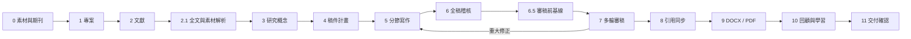
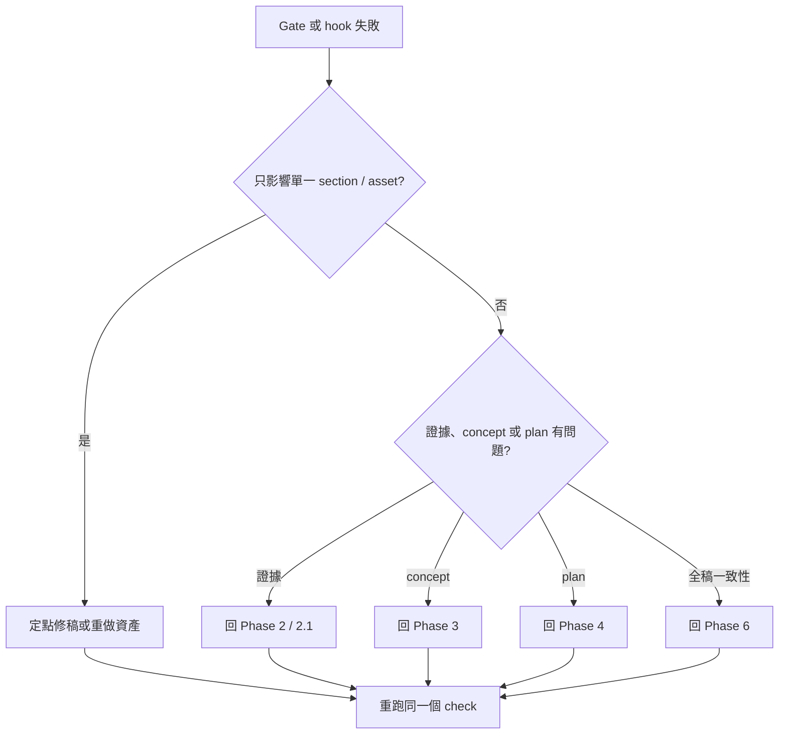

# 每階段檢查與修正

這條 pipeline 把「寫一篇論文」拆成可恢復的階段。每一階段都回答三個簡單問題：完成了什麼、系統怎麼確認、沒通過時要回去哪裡修。

!!! info "先分清楚三種訊息"

    - **真正擋關**：程式的 hard gate；沒通過就不能把下一階段當成完成。
    - **流程要求**：Agent 或研究者應做的審閱／校正，但該 Phase 的 validator 未必會全部重算。
    - **提醒**：建議處理，但不阻擋論文流程。

網站只把第一種稱為「程式強制」。技術上的 check ID、前置條件與目前尚未 code-enforced 的邊界，見[Phase gate：設計與程式契約](../design/phase-gate-contract.md)。

## 一張圖看懂流程

```mermaid
flowchart LR
    P0[0 素材與期刊] --> P1[1 專案]
    P1 --> P2[2 文獻]
    P2 --> P21[2.1 全文與素材解析]
    P21 --> P3[3 研究概念]
    P3 --> P4[4 稿件計畫]
    P4 --> P5[5 分節寫作]
    P5 --> P6[6 全稿稽核]
    P6 --> P65[6.5 審稿前基線]
    P65 --> P7[7 多輪審稿]
    P7 -->|重大修正| P5
    P7 --> P8[8 引用同步]
    P8 --> P9[9 DOCX / PDF]
    P9 --> P10[10 回顧與學習]
    P10 --> P11[11 交付確認]
```

Phase 0–11 加上 6.5 是 13 個主線 checkpoints；Phase 2.1 是文獻與來源材料的獨立 sub-gate。數字 `21`、`65` 是 MCP/code 使用的 phase 值，不代表有 65 個階段。

## 每個階段實際查什麼

<!-- phase-gate:0 -->

### 0 — 先盤點素材與投稿限制

**你會得到**：使用者素材清單與期刊規格。

- **真正擋關**：`source-materials.yaml` 和 `journal-profile.yaml` 都存在。
- **沒通過怎麼修**：重新掃描 workspace 的 DOCX、XLSX、PDF、PPTX、CSV；補上期刊字數、圖表、引用和投稿文件限制。
- **人要判斷**：素材角色是否正確、期刊資訊是否可靠。檔案存在不代表內容一定合理。

<!-- phase-gate:1 -->

### 1 — 建立能恢復的專案

**你會得到**：草稿、文獻、資料、結果、稽核和 Memory 目錄。

- **真正擋關**：六個必要目錄都存在；後續 Phase 2 起還要有 `project.json`。
- **沒通過怎麼修**：用專案建立／修復動作補齊結構，不要手動把檔案散放在 workspace root。

<!-- phase-gate:2 -->

### 2 — 建立可信的文獻集合

**你會得到**：達到文章類型最低需求的 references。

- **真正擋關**：數量達 paper-type 下限；每筆有穩定識別；VERIFIED provenance 沒有偽造或互相矛盾。
- **沒通過怎麼修**：補搜尋與篩選；PubMed 文獻優先用 `save_reference_mcp`；修復或遷移不完整的舊 metadata。
- **提醒**：搜尋策略與納入／排除紀錄缺失會警告，但不單獨擋關。

<!-- phase-gate:21 -->

### 2.1 — 確認「真的讀過」全文與原始素材

**你會得到**：每篇文獻的全文狀態、來源版本與分析紀錄，以及主要使用者素材的解析 receipt。

- **真正擋關**：每筆 reference 都有可信的全文 receipt 或明確的 fallback reason；分析綁定目前 source revision；主要 DOCX/XLSX/PDF 等不能仍等待 asset-aware。
- **沒通過怎麼修**：取得全文或誠實記錄不可取得原因；來源改版後重做分析；把主要原始素材先交給 asset-aware 並寫回 receipt。
- **提醒**：過半文獻只有 metadata 時會警告。這不等於可以根據摘要捏造全文結論。

<!-- phase-gate:3 -->

### 3 — 決定研究概念是否可寫

**你會得到**：`concept.md` 與結構化 concept review。

- **真正擋關**：概念稿含 NOVELTY、KEY SELLING POINTS；review artifact 結構完整；判定可進行，或有可信外部系統簽發且綁定目前內容的人工接受 receipt。
- **沒通過怎麼修**：補研究問題、必要 claims、證據義務和風險；修改後重跑 review。Agent 不能把自己的判斷偽裝成人工核准。
- **人要判斷**：是否接受低於門檻的風險，以及研究方向是否值得繼續。

<!-- phase-gate:4 -->

### 4 — 把想法變成可執行的稿件計畫

**你會得到**：`manuscript-plan.yaml`，描述各 section、段落目的、預計引用、字數與圖表。

- **真正擋關**：Phase 3 review 仍有效，而且 plan 檔存在；legacy Markdown plan 也可被接受。
- **流程要求**：manual mode 由研究者看過；autopilot 留下自審。兩者都應檢查 evidence coverage、寫作順序與預算。
- **沒通過怎麼修**：補建 plan；若內容不完整，先修 Section Brief 或 asset plan，不要直接開始長篇寫作。

!!! warning "目前的程式邊界"

    Phase 4 validator 目前只硬擋「可採用的 concept review + plan 檔存在」。approver、reason、evidence coverage 和圖表上限仍是流程要求，不能宣稱程式已逐欄重算。

<!-- phase-gate:5 -->

### 5 — 分節寫作、逐節校正

**你會得到**：完整稿件、圖表、資料 provenance、asset review receipts 與 section approvals。

- **真正擋關**：五個核心 sections 存在；圖表／統計 claim 有資料來源；必需圖表已登記、放入正確 section、可匯出且 caption 經 review；每節有 recorded approval。
- **寫作時檢查**：字數、引用密度、具體性、語體、語言、重複、文獻量；再檢查數據與 claim 對齊、時態、段落品質、Results 客觀性、Introduction/Discussion 結構、倫理、hedging 和效果量。
- **沒通過怎麼修**：只改失敗 section；補引用或弱化沒有證據的 claim；補 provenance；重做／重新審閱資產；修好後重跑同一 check。
- **人要判斷**：section approval 可以是 manual 或有紀錄的 autopilot review，不代表每次都由使用者親自按核准。

<!-- phase-gate:6 -->

### 6 — 從「每節看起來合理」提升到「全稿互相一致」

**你會得到**：quality scorecard、hook effectiveness 和 data-artifact validation report。

- **真正擋關**：兩份稽核報告存在；scorecard 至少四個有效維度；至少一個 hook 有真實事件；有資料產物時也有 validation report。
- **流程要求**：執行全稿 C/F checks，處理跨 section 的 N 值、縮寫、引用、字數、圖表、補充材料、claim-evidence 與資料來源問題。
- **沒通過怎麼修**：沿問題回到受影響 section 或 data artifact，修正後重跑原 check，不能換一個較弱的檢查來取得綠燈。

!!! warning "目前的程式邊界"

    Phase 6 hard gate 驗證稽核證據不是空殼，但不會在 gate 內重跑全部 A/B/C hooks，也沒有另外解析「0 unresolved critical」。網站不再把「0 critical」誤寫成目前已實作的 Phase 6 hard gate。

<!-- phase-gate:65 -->

### 6.5 — 固定審稿前的比較基線

**你會得到**：review 前的稿件／品質 baseline 與 evolution event。

- **真正擋關**：稿件、Phase 6 scorecard、evolution log 都存在，而且 log 內真的有 `baseline` event。
- **沒通過怎麼修**：對目前稿件重新建立基線；空的 log 檔不能過關。

<!-- phase-gate:7 -->

### 7 — 至少兩輪、能追溯的獨立審稿

**你會得到**：每輪 review report、author response、EQUATOR report／N/A、修稿 hash chain 與最後判定。

- **真正擋關**：review state 可重算；至少兩輪；每輪 artifacts 完整；R1–R6 重新驗證；evolution events 與 state 相符；最後 review hash 就是目前稿件；達到品質門檻，或有可信外部 acceptance receipt。
- **R1–R6 看什麼**：報告深度、逐條回應、EQUATOR、意見到修正的可追蹤性、修後語體／作者責任訊號、引用預算。
- **沒通過怎麼修**：逐條回應、修改稿件、重跑 hooks，再進下一輪；重大問題可指定 sections 回到 Phase 5。
- **人要判斷**：`max_rounds`、停滯或需要使用者都只是升級訊號，不是通過。低於門檻的接受必須由 MCP 之外的可信 host/UI 簽發 receipt。

<!-- phase-gate:8 -->

### 8 — 讓每一個引用都能找到真正的 reference

**你會得到**：References section 與可解析的 citation links。

- **真正擋關**：Phase 7 已完成；References section 存在；所有 citation wikilinks 都能對到已儲存 reference。
- **流程要求**：套用期刊格式、檢查分布與引用預算。
- **沒通過怎麼修**：補存 reference、修正 citekey、移除沒有根據的引用，再重新同步。

!!! note "不要把不同檢查混在一起"

    Phase 8 validator 本身硬擋的是 References section 與 wikilink resolvability。格式、分布、預算由 reference workflow、C-series 與 Phase 7 R6 處理。

<!-- phase-gate:9 -->

### 9 — 證明匯出的檔案真的能打開

**你會得到**：DOCX 和 PDF。

- **真正擋關**：Phase 6–8 前置條件仍有效；DOCX、PDF 都存在；DOCX zip/XML/可見文字與 PDF header/trailer smoke 通過。
- **沒通過怎麼修**：先修上游稿件或引用，再重新匯出。把空檔改成 `.docx`／`.pdf` 不會通過。

<!-- phase-gate:10 -->

### 10 — 留下這一輪真正學到的事

**你會得到**：pipeline retrospective、D1–D9 分析、hook effectiveness 與 evolution event。

- **真正擋關**：檔名與 headings 正確；meta-learning 由正式工具產生；schema、D1–D9、counts、lists 與 evolution event 可以互相核對。
- **沒通過怎麼修**：執行正式 meta-learning；補 D7/D8 retrospective。手寫一個只有統計數字的 YAML 不能代替分析。
- **提醒**：專案 Memory 未同步會警告。

<!-- phase-gate:11 -->

### 11 — 最後再確認一次可交付性

**你會得到**：已驗證的最終 DOCX/PDF，以及可選的 Git provenance 狀態。

- **真正擋關**：Phase 9 的 DOCX/PDF 再次通過 integrity smoke；Phase 10 仍通過。
- **提醒**：Git repo、clean tree、commit coverage 和 remote sync 都是 provenance 資訊，不阻擋只需要論文檔案的使用者。
- **沒通過怎麼修**：匯出問題回 Phase 9；回顧資料問題回 Phase 10。Git warning 只在你需要版本發布證據時處理。

!!! note "目前沒有額外 completion marker"

    Code 不要求另一個 `pipeline-completed` 或 final-delivery marker 檔案。網站以「有效 exports + 通過 Phase 10」描述目前真正的交付 gate。

## 系統怎麼選擇修正範圍

```mermaid
flowchart TD
    Fail[Gate 或 hook 失敗] --> Local{只影響單一 section / asset?}
    Local -->|是| Patch[定點修稿或重做資產]
    Local -->|否| Upstream{證據、concept 或 plan 有問題?}
    Upstream -->|證據| P2[回 Phase 2 / 2.1]
    Upstream -->|concept| P3[回 Phase 3]
    Upstream -->|plan| P4[回 Phase 4]
    Upstream -->|全稿一致性| P6[回 Phase 6]
    Patch --> Same[重跑同一個 check]
    P2 --> Same
    P3 --> Same
    P4 --> Same
    P6 --> Same
```

原則是「修最上游的原因、只重做受影響範圍、重跑同一個 gate」。回退是正式 transition，不是失敗。重複回退、品質停滯、低於門檻的人為接受或研究方向改變，才需要研究者介入。

## 暫停與恢復

Pipeline 會保存 phase、section、稿件 hash 與 audit state。恢復時若偵測到研究者曾手動修改檔案，系統應指出受影響的 sections 和建議重跑的 checks，而不是假定舊 gate 仍有效。

完整操作細節見 [Auto-Paper 指南](../auto-paper-guide.md)；Hook 與稽核層次見[品質與稽核](quality-and-audit.md)。
