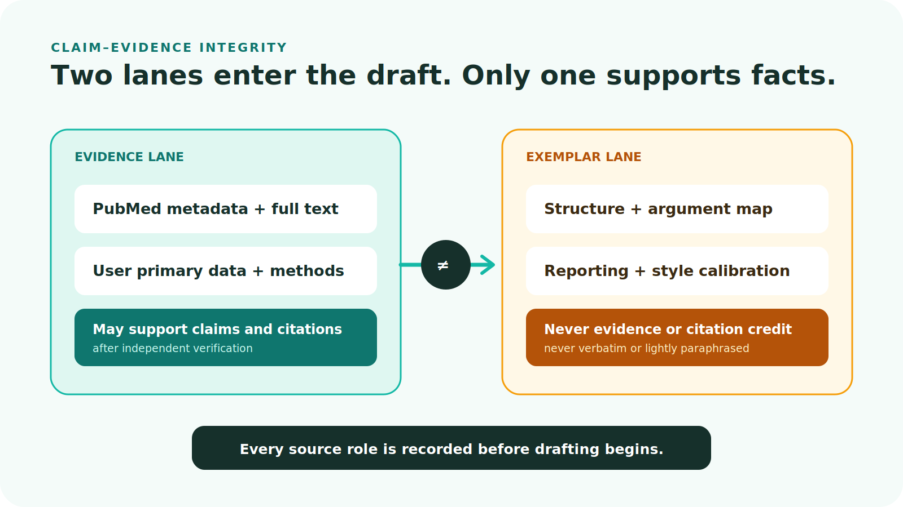
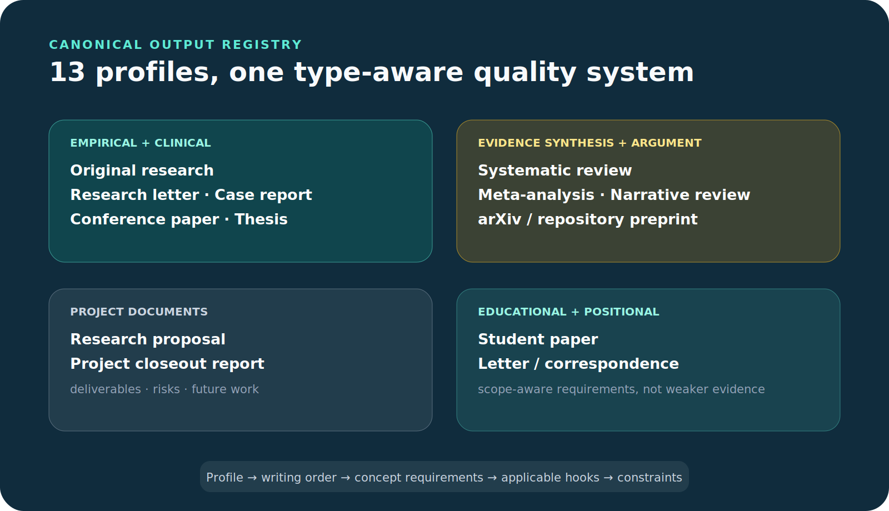
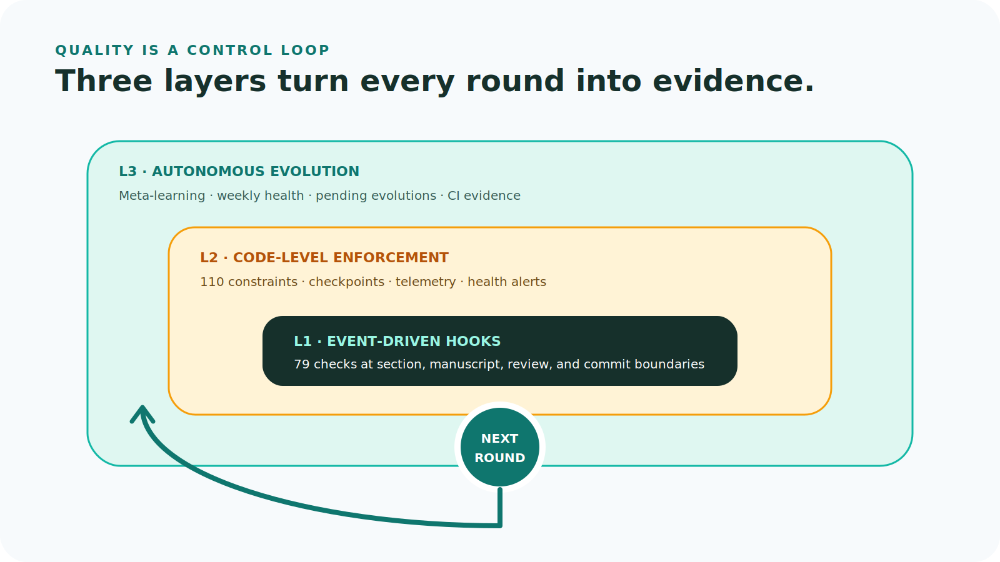
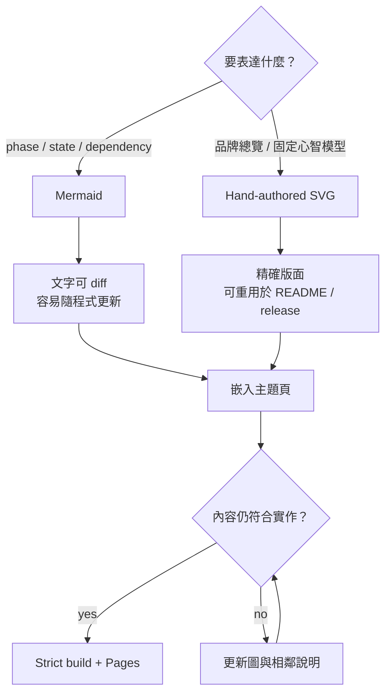

# 視覺圖譜

這一頁是整個 repo 的圖像索引。Mermaid 用來描述會隨程式演進的關係；SVG 用來建立穩定的心智模型與簡報級總覽。每張圖都連回對應的 Wiki 主題。

## 系統一覽

<figure markdown="span">
  { loading=lazy }
  <figcaption>Agent 可替換；共用契約、MCP 工具、filesystem artifacts 與 audit trail 才是系統核心。</figcaption>
</figure>

[閱讀 Harness 架構 →](harness-architecture.md)

## 產品與使用情境

<figure markdown="span">
  { loading=lazy }
  <figcaption>Search、Think、Write 是使用者面向；底層由跨 Agent harness 與共享 project state 支撐。</figcaption>
</figure>

[從五分鐘開始 →](quickstart.md)

## 系統與 DDD 邊界

<figure markdown="span">
  { loading=lazy }
  <figcaption>外層介面透過 application use cases 驅動 domain；infrastructure 只實作向內定義的 ports。</figcaption>
</figure>

[查看 Repo 導覽 →](repo-map.md)

## 研究管線

<figure markdown="span">
  { loading=lazy }
  <figcaption>0–10 是主要研究與學習迴圈；Phase 2.1 與 6.5 是巢狀 gate，Phase 11 在 audit 完成後交付。</figcaption>
</figure>

[閱讀研究管線 →](research-pipeline.md)

## 證據迴圈

<figure markdown="span">
  { loading=lazy }
  <figcaption>證據支撐 claim；範文只校準寫作慣例。兩者角色分離並各自留下 audit。</figcaption>
</figure>

[閱讀證據、引用與範文 →](evidence-and-citations.md)

## 正式產出地圖

<figure markdown="span">
  { loading=lazy }
  <figcaption>同一套 artifact pipeline 依 output profile 套用不同段落、字數、引用與品質限制。</figcaption>
</figure>

[探索 13 種正式產出 →](output-landscape.md)

## 品質演進層

<figure markdown="span">
  { loading=lazy }
  <figcaption>事件 Hook、程式約束與跨輪次演進共同構成可稽核的品質控制。</figcaption>
</figure>

[閱讀品質與稽核 →](quality-and-audit.md)

## 何時用 Mermaid，何時用 SVG

圖不是裝飾，而是架構文件。任何工具數、phase、依賴方向或品質 gate 改動，都要同步檢查對應 Mermaid、SVG、caption 與文字敘述。

!!! tip "可存取性規則"

    SVG 必須有 `<title>` 與 `<desc>`；Markdown 圖片必須有具體 alt text；顏色不能是唯一訊息載體；動畫要尊重 `prefers-reduced-motion`。
