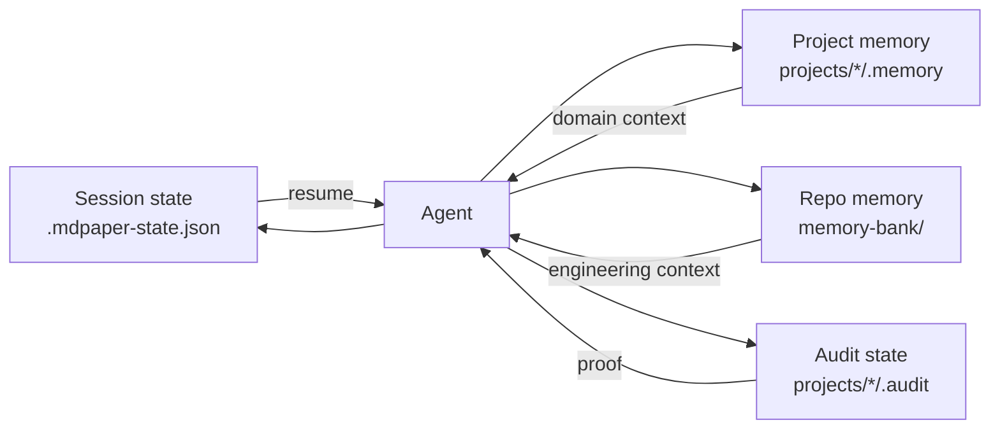
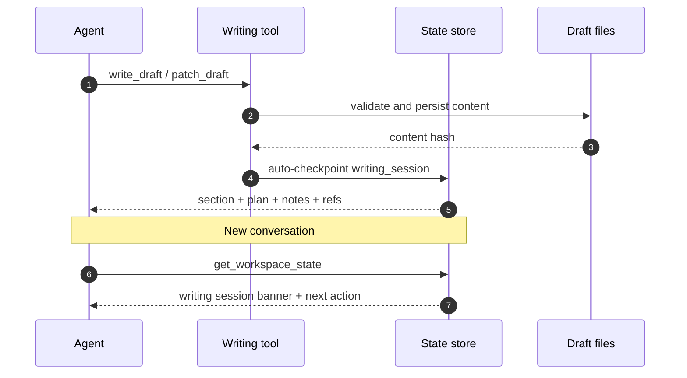
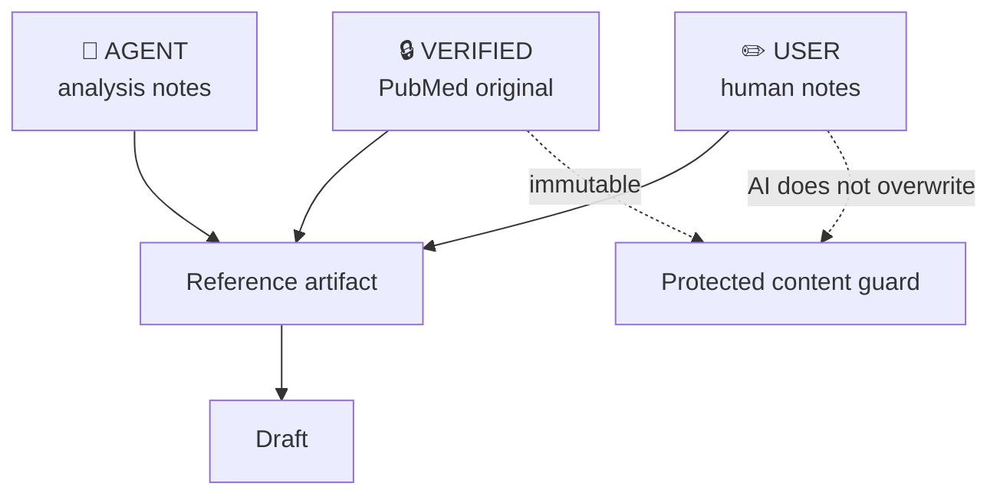

# Workspace 與記憶

Agent 的 context window 會結束，但研究 project 不應失憶。MedPaper Assistant 把短期 session state、project memory、repo memory 與 audit evidence 分層保存。

## Project 結構

```mermaid
flowchart TB
    Project[projects/{slug}/] --> Config[config.yaml]
    Project --> Concept[concept.md]
    Project --> Refs[references/]
    Project --> Full[fulltext / source receipts]
    Project --> Drafts[drafts/]
    Project --> Assets[assets/]
    Project --> Audit[.audit/]
    Project --> PMemory[.memory/]

    Refs --> Meta[verified metadata]
    Refs --> Notes[agent_notes / user notes]
    Drafts --> Sections[section files / manuscript]
    Audit --> Hooks[hook reports]
    Audit --> Telemetry[tool telemetry]
    Audit --> Exemplars[exemplar usage]
    PMemory --> Active[activeContext.md]
    PMemory --> Progress[progress.md]
```

實際 skeleton 會依 output profile 與 project 類型調整；`.audit/` 與 `.memory/` 的語義不變。

## 四種 state



| State          | 時間尺度     | 保存內容                               | 不應保存             |
| -------------- | ------------ | -------------------------------------- | -------------------- |
| Session        | 分鐘到跨對話 | doing、next action、writing section    | 長期設計決策全文     |
| Project memory | 研究生命週期 | focus、references、decisions、memo     | repo release 細節    |
| Repo memory    | 開發生命週期 | 架構、進度、決策、技術債               | 單一論文的敏感資料   |
| Audit          | 永久可追溯   | invocation、hooks、exemplar、evolution | 未標示來源的自由敘述 |

## 寫作 checkpoint



段落切換前可以保存更細的 `checkpoint_writing_context(section, plan, notes, refs)`；成功的 draft write/patch 會自動更新 writing session。

## Verified、Agent、User 三層內容



這三層不是視覺標籤而已。Agent 可以新增自己的分析，但不能改寫 verified metadata 或人類筆記來讓引用看起來更支持某個結論。

## Memory checkpoint 何時觸發

- 對話超過 10 輪。
- 修改超過 5 個檔案。
- 完成重要功能或研究 phase。
- 研究者要離開或明確要求存檔。
- 發現關鍵文獻、重大決策或需要下一輪處理的問題。

!!! tip "Memory 與 audit 的差別"

    Memory 回答「下一步怎麼接續」；audit 回答「為什麼相信這個結果」。兩者都重要，但不能互相替代。
